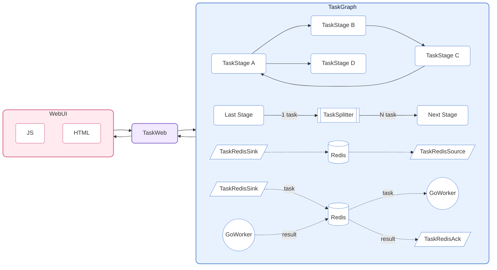
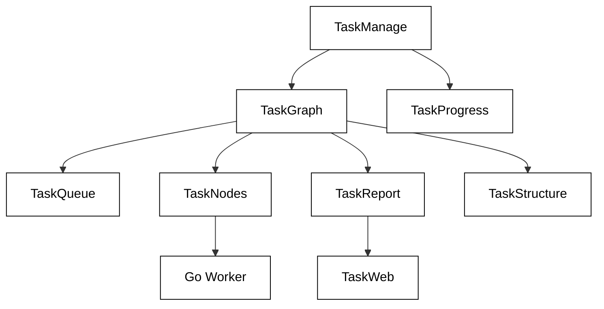

# CelestialFlow ——一个轻量级、可并行、基于图结构的 Python 任务调度框架

<p align="center">
  
</p>

<p align="center">
  <a href="https://pypi.org/project/celestialflow/"></a>
  <a href="https://pepy.tech/projects/celestialflow"></a>
  <a href="https://pypi.org/project/celestialflow/"></a>
  <a href="https://pypi.org/project/celestialflow/"></a>
</p>

<p align="center">
  
  
  
  
</p>

**CelestialFlow** 是一个轻量级但功能完全的任务流框架，适合需要 **复杂依赖关系**、**灵活执行模型**、**跨设备运行**与**实时可视化监控** 的中/大型 Python 任务系统。

- 相比 Airflow/Dagster 更轻、更快开始
- 相比 multiprocessing/threading 更结构化，可直接表达 loop / complete graph 等复杂依赖模式

框架的基本单元为 **TaskStage**（由 `TaskManager` 派生），每个 stage 内部绑定一个独立的执行函数，并支持四种运行模式：

* **线性（serial）**
* **多线程（thread）**
* **多进程（process）**
* **协程（async）**

每个 stage 均可独立运行，也可作为节点互相连接，形成具有上游与下游依赖关系的任务图（**TaskGraph**）。下游 stage 会自动接收上游执行完成的结果作为输入，从而形成明确的数据流。

在图级别上，每个 Stage 支持两种上下文模式：

* **线性执行（serial layout）**：当前节点执行完毕再启动下一节点（下游节点可提前接收任务但不会立即执行）。
* **并行执行（process layout）**：当前节点启动后立刻前去启动下一节点。

TaskGraph 能构建完整的 **有向图结构（Directed Graph）**，不仅支持传统的有向无环图（DAG），也能灵活表达 **树形（Tree）**、**环形（loop）** 乃至于 **完全图(Complete Graph)** 形式的任务依赖。

在此基础上，CelestialFlow 支持 Web 可视化监控，并可通过 Redis 实现跨进程、跨设备协作；同时引入基于 Go 的外部 worker（通过 Redis 通信），用于承载 CPU 密集型任务，弥补 Python 在该场景下的性能瓶颈。

## 项目结构（Project Structure）



## 快速开始（Quick Start）

安装 CelestialFlow:

```bash
pip install celestialflow
```

一个简单的可运行代码:

```python
from celestialflow import TaskManager, TaskGraph

def add(x, y): 
    return x + y

def square(x): 
    return x ** 2

if __name__ == "__main__":
    # 定义两个任务节点
    stage1 = TaskManager(add, execution_mode="thread", unpack_task_args=True)
    stage2 = TaskManager(square, execution_mode="thread")

    # 构建任务图结构
    stage1.set_graph_context([stage2], stage_mode="process", stage_name="Adder")
    stage2.set_graph_context([], stage_mode="process", stage_name="Squarer")
    graph = TaskGraph([stage1])

    # 初始化任务并启动
    graph.start_graph({stage1.get_tag(): [(1, 2), (3, 4), (5, 6)]})
```

注意不要在.ipynb中运行。

👉 想查看完整Quick Start，请见[Quick Start](https://github.com/Mr-xiaotian/CelestialFlow/blob/main/docs/quick_start.md)

## 深入阅读（Further Reading）

(以下文档完善中)

你可以继续运行更多的测试代码，这里记录了各个测试文件与其中的测试函数说明：

[📄tests/README.md](https://github.com/Mr-xiaotian/CelestialFlow/blob/main/tests/README.md)

若你想了解框架的整体结构与核心组件，下面的参考文档会对你有帮助：

- [🔧TaskManage/TaskStage概念](https://github.com/Mr-xiaotian/CelestialFlow/blob/main/docs/reference/task_manage.md)
- [🌐TaskGrapg概念](https://github.com/Mr-xiaotian/CelestialFlow/blob/main/docs/reference/task_graph.md)
- [📚Go Worker概念](https://github.com/Mr-xiaotian/CelestialFlow/blob/main/docs/reference/go_worker.md)

推荐阅读顺序:



以下三篇可以作为补充阅读:

- [TaskTools](https://github.com/Mr-xiaotian/CelestialFlow/blob/main/docs/reference/task_tools.md)
- [TaskTypes](https://github.com/Mr-xiaotian/CelestialFlow/blob/main/docs/reference/task_types.md)
- [TaskLogging](https://github.com/Mr-xiaotian/CelestialFlow/blob/main/docs/reference/task_logging.md)

如果你更喜欢通过完整案例理解框架的运行方式，可以参考这篇从零开始构建 TaskGraph 的教程：

[📘案例教程](https://github.com/Mr-xiaotian/CelestialFlow/blob/main/docs/tutorial.md)

## 环境要求（Requirements）

**CelestialFlow** 基于 Python 3.8+，并依赖以下核心组件。  
请确保你的环境能够正常安装这些依赖（`pip install celestialflow` 会自动安装）。

| 依赖包           | 说明 |
| ---------------- | ---- |
| **Python ≥ 3.8** | 运行环境，建议使用 3.10 及以上版本 |
| **tqdm**         | 控制台进度条显示，用于任务执行可视化 |
| **loguru**       | 高性能日志系统，支持多进程安全输出 |
| **fastapi**      | Web 服务接口框架（用于任务可视化与远程控制） |
| **uvicorn**      | FastAPI 的高性能 ASGI 服务器 |
| **requests**     | HTTP 客户端库，用于任务状态上报与远程调用 |
| **networkx**     | 任务图（TaskGraph）结构与依赖分析 |
| **redis**        | 可选组件，用于分布式任务通信（`TaskRedis*` 系列模块） |
| **jinja2**       | FastAPI 模板引擎，用于 Web 可视化界面渲染 |

## 文件结构（File Structure）

```
📁 CelestialFlow	(211MB 959KB 44B)
    📁 docs         	(25KB 307B)
        📁 reference	(20KB 299B)
            📝 go_worker.md     	(6KB 378B)
            📝 task_graph.md    	(4KB 989B)
            📝 task_logging.md  	(0B)
            📝 task_manage.md   	(7KB 131B)
            📝 task_nodes.md    	(1KB 737B)
            📝 task_progress.md 	(0B)
            📝 task_queue.md    	(0B)
            📝 task_report.md   	(0B)
            📝 task_structure.md	(112B)
            📝 task_tools.md    	(0B)
            📝 task_types.md    	(0B)
            📝 task_web.md      	(0B)
        📝 quick_start.md	(5KB 8B)
        📝 tutorial.md   	(0B)
    📁 experiments  	(15KB 111B)
        🐍 benchmark_datastructures.py	(6KB 52B)
        🐍 benchmark_hash.py          	(1KB 284B)
        🐍 benchmark_queue.py         	(5KB 504B)
        🐍 benchmark_tqdm.py          	(1KB 160B)
        🐍 experiment_tqdm.py         	(1KB 135B)
    📁 go_worker    	(6MB 968KB 38B)
        📁 worker	(5KB 746B)
            🌀 parser.go   	(394B)
            🌀 processor.go	(2KB 612B)
            🌀 types.go    	(299B)
            🌀 worker.go   	(2KB 465B)
        ❓ go.mod       	(292B)
        ❓ go.sum       	(1KB 68B)
        ❓ go_worker.exe	(6MB 960KB)
        🌀 main.go      	(980B)
    📁 img          	(4MB 700KB 695B)
        📷 logo(old).png  	(836KB 542B)
        📷 logo.png       	(122KB 747B)
        📷 web_display.png	(129KB 545B)
        🎞️ web_ui.gif     	(3MB 635KB 909B)
    📁 src          	(1MB 911KB 820B)
        📁 celestialflow         	(1MB 895KB 493B)
            📁 adapters   	(13KB 309B)
                📁 celestialtree	(13KB 153B)
                    📁 [1项排除的目录]	(6KB 655B)
                    🐍 client.py  	(5KB 263B)
                    🐍 tools.py   	(1KB 182B)
                    🐍 __init__.py	(77B)
                📁 [1项排除的目录]	(156B)
                🐍 __init__.py	(0B)
            📁 static     	(1MB 417KB 90B)
                📁 css	(31KB 410B)
                    🎨 base.css     	(6KB 155B)
                    🎨 dashboard.css	(7KB 277B)
                    🎨 errors.css   	(5KB 168B)
                    🎨 inject.css   	(12KB 834B)
                📁 js 	(33KB 606B)
                    📜 main.js          	(5KB 77B)
                    📜 task_errors.js   	(4KB 544B)
                    📜 task_injection.js	(8KB 491B)
                    📜 task_statuses.js 	(8KB 63B)
                    📜 task_structure.js	(4KB 667B)
                    📜 task_topology.js 	(1KB 371B)
                    📜 utils.js         	(1KB 441B)
                ❓ favicon.ico	(1MB 352KB 98B)
            📁 templates  	(13KB 150B)
                🌐 index.html	(13KB 150B)
            📁 [1项排除的目录]	(327KB 176B)
            🐍 task_graph.py    	(23KB 940B)
            🐍 task_logging.py  	(8KB 686B)
            🐍 task_manage.py   	(32KB 346B)
            🐍 task_nodes.py    	(10KB 275B)
            🐍 task_progress.py 	(1KB 477B)
            🐍 task_queue.py    	(8KB 315B)
            🐍 task_report.py   	(4KB 784B)
            🐍 task_stage.py    	(5KB 902B)
            🐍 task_structure.py	(6KB 93B)
            🐍 task_tools.py    	(14KB 160B)
            🐍 task_types.py    	(2KB 117B)
            🐍 task_web.py      	(5KB 703B)
            🐍 __init__.py      	(1KB 114B)
        📁 [1项排除的目录]	(16KB 327B)
    📁 tests        	(126KB 506B)
        📁 [1项排除的目录]	(90KB 156B)
        📝 README.md        	(6KB 324B)
        🐍 test_graph.py    	(5KB 449B)
        🐍 test_manage.py   	(3KB 90B)
        🐍 test_nodes.py    	(11KB 294B)
        🐍 test_structure.py	(10KB 217B)
    📁 [6项排除的目录]	(198MB 242KB 426B)
    ❓ .env          	(88B)
    ❓ .gitignore    	(272B)
    ❓ LICENSE       	(1KB 65B)
    ❓ Makefile      	(501B)
    ❓ pyproject.toml	(1KB 223B)
    ⚙️ pytest.ini    	(254B)
    📝 README.md     	(13KB 858B)
```

(该视图由我的另一个项目[CelestialVault](https://github.com/Mr-xiaotian/CelestialVault)中inst_file生成。)

## 更新日志（Change Log）

- 2021: 建立一个支持多线程与单线程处理函数的类
- 2023: 在GPT4帮助下添加多进程与携程运行模式 
- 5/9/2024: 将原有的处理类抽象为节点, 添加TaskChain类, 可以线性连接多个节点, 并设定节点在Chain中的运行模式, 支持serial和process两种, 后者Chain所有节点同时运行
- 12/12/2024-12/16/2024: 在原有链式结构基础上允许节点有复数下级节点, 实现Tree结构; 将原有TaskChain改名为TaskTree
- 3/16/2025: 支持Web端任务完成情况可视化
- 6/9/2025: 支持节点拥有复数上级节点, 脱离纯Tree结构, 为之后循环图做准备
- 6/11/2025: 自[CelestialVault](https://github.com/Mr-xiaotian/CelestialVault)项目instances.inst_task迁出
- 6/12/2025: 支持循环图, 下级节点可指向上级节点
- 6/13/2025: 支持loop结构, 即节点可指向自己
- 6/14/2025: 支持forest结构, 即可有多个根节点
- 6/16/2025: 多轮评测后, 当前框架已支持完整有向图结构, 将TaskTree改名为TaskGraph
- 3.0.1: 上线Pypi, 可喜可贺
- 3.0.4: 新增一个抽象结构TaskQueue, 用于表示节点的所有"入边"与"出边"; 恢复未消费任务的保存功能
- 3.0.5: 删除原有的TaskRedisTransfer节点, 并增添三种新的redis交互节点TaskRedisSink TaskRedisSource TaskRedisAck, 用于跨语言 跨进程 跨设备处理任务; 并在Web页面添加展示拓扑信息的卡片
- 3.0.6: 添加对[CelestialTree](https://github.com/Mr-xiaotian/CelestialTree)系统的支持, 现在可以追踪单个任务的流向
- 3.0.7: 将TaskStage从TaskManager中单独抽出来作为一个子类; 增加新节点TaskRouter, 可以将传入的任务选择的传给不同的下游节点, 而不是进行广播

## Star 历史趋势（Star History）

如果对项目感兴趣的话，欢迎star。如果有问题或者建议的话, 欢迎提交[Issues](https://github.com/Mr-xiaotian/CelestialFlow/issues)或者在[Discussion](https://github.com/Mr-xiaotian/CelestialFlow/discussions)中告诉我。

[](https://star-history.com/#Mr-xiaotian/CelestialFlow&Date)

## 许可（License）
This project is licensed under the MIT License - see the [LICENSE](LICENSE) file for details.

## 作者（Author）
Author: Mr-xiaotian 
Email: mingxiaomingtian@gmail.com  
Project Link: [https://github.com/Mr-xiaotian/CelestialFlow](https://github.com/Mr-xiaotian/CelestialFlow)