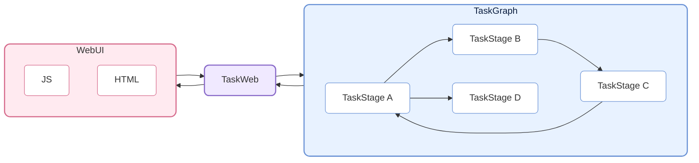

# CelestialFlow ——一个轻量级、可并行、基于图结构的 Python 任务调度框架

<p align="center">
  
</p>

<p align="center">
  <a href="https://pypi.org/project/celestialflow/"></a>
  <a href="https://pepy.tech/projects/celestialflow"></a>
  <a href="https://pypi.org/project/celestialflow/"></a>
  <a href="https://pypi.org/project/celestialflow/"></a>
</p>

<p align="center">
  
  
  
  
</p>

<p align="center">
  <a href="https://github.com/Mr-xiaotian/CelestialFlow/blob/main/docs/zh-CN/README.md">中文</a> | <a href="https://github.com/Mr-xiaotian/CelestialFlow/blob/main/docs/en/README.md">English</a> | <a href="https://github.com/Mr-xiaotian/CelestialFlow/blob/main/docs/ja/README.md">日本語</a>
</p>

**CelestialFlow** 是一个轻量级但功能完全的任务流框架，适合需要 **复杂依赖关系**、**灵活执行模型**、**跨设备运行**与**实时可视化监控** 的中/大型 Python 任务系统。

- 相比 Airflow/Dagster 更轻、更快开始
- 相比 multiprocessing/threading 更结构化，可直接表达 loop / complete graph 等复杂依赖模式

框架的基本单元为 **TaskExecutor**，可独立运行，并支持三种执行模式：

* **线性（serial）**
* **多线程（thread）**
* **协程（async）**

TaskExecutor 实现了对任务的结果缓存，任务去重，进度条显示，多执行模式比较等功能，单独使用也很好用。

但除去直接使用 TaskExecutor，更重要的是使用其子类**TaskStage**。TaskStage 可以互相连接，形成具有上游与下游依赖关系的任务图（**TaskGraph**）。下游 stage 会自动接收上游执行完成的结果作为输入，从而形成明确的数据流。

TaskStage 的任务执行模式同样包含三种，与TaskExecutor中一致。

在图级别上，每个 Stage 支持两种上下文模式：

* **线性执行（serial layout）**：当前节点执行完毕再启动下一节点（下游节点可提前接收任务但不会立即执行）。
* **线程执行（thread layout）**：当前节点在主进程的独立线程中启动，适合 I/O 密集型任务和不可 pickle 的函数（如 lambda）。

TaskGraph 能构建完整的 **有向图结构（Directed Graph）**，不仅支持传统的有向无环图（DAG），也能灵活表达 **树形（Tree）**、**环形（loop）** 乃至于 **完全图（Complete Graph）** 形式的任务依赖。

在执行与调度之外，CelestialFlow 进一步引入 **CelestialTree（简称: ctree） 事件追踪系统**，为每一个任务及其衍生行为（成功、失败、重试、拆分、路由等）记录明确的因果关系。借助 ctree，可以从任意一个初始任务出发，完整还原其在 TaskGraph 中的传播路径与执行轨迹，使任务系统可以进行完整的**追溯、分析、解释**。

在此基础上，CelestialFlow 支持 Web 可视化监控，并提供基于 Redis 的 demo 与 Go Worker 外部协作示例，用于展示按需构建跨进程、跨设备任务协作的方式。

## 项目结构（Project Structure）


```mermaid
flowchart LR

    %% ===== TaskGraph =====
    subgraph TG[TaskGraph]
        direction LR

        S1[TaskStage A]
        S2[TaskStage B]
        S3[TaskStage C]
        S4[TaskStage D]

        S1 --> S2 --> S3 --> S1
        S1 --> S4

    end

    %% 美化 TaskGraph 外框
    style TG fill:#e8f2ff,stroke:#6b93d6,stroke-width:2px,color:#0b1e3f,rx:10px,ry:10px

    %% 统一美化格式
    classDef blueNode fill:#ffffff,stroke:#6b93d6,rx:6px,ry:6px;

    %% 美化 TaskStages
    class S1,S2,S3,S4 blueNode;

    %% ===== WebUI =====
    subgraph W[WebUI]
        JS
        HTML
    end

    style W fill:#ffeaf0,stroke:#d66b8c,stroke-width:2px,rx:10px,ry:10px
    style JS fill:#ffffff,stroke:#d66b8c,rx:5px,ry:5px
    style HTML fill:#ffffff,stroke:#d66b8c,rx:5px,ry:5px

    R[TaskWeb]
    style R fill:#f0e9ff,stroke:#8a6bc9,stroke-width:2px,rx:8px,ry:8px

    %% ===== Links =====
    TG --> R 
    R --> TG 
    R --> W
    W --> R

```

## 快速开始（Quick Start）

安装 CelestialFlow:

```bash
# 推荐使用 `uv` 管理依赖与环境
uv pip install celestialflow

# 不过也可以直接使用 `pip`
pip install celestialflow
```

如果你只使用 CelestialFlow 的核心调度、Web、持久化与 demo/test 之外的常规功能，上面的安装已经足够。

如果你还需要启用 CelestialTree 事件追踪能力，则需要**额外安装** `celestialtree`：

```bash
# 对已发布包使用者
uv pip install celestialtree

# 如果你是 clone 仓库后的开发者/贡献者
uv sync --group dev
```

一个简单的可运行代码:

```python
from celestialflow import TaskStage, TaskGraph

def add(x, y): 
    return x + y

def square(x): 
    return x ** 2

if __name__ == "__main__":
    # 定义两个任务节点
    stage1 = TaskStage(name="Adder", func=add, stage_mode="thread", execution_mode="thread", unpack_task_args=True)
    stage2 = TaskStage(name="Squarer", func=square, stage_mode="thread", execution_mode="thread")

    # 构建任务图结构
    graph = TaskGraph()
    graph.set_stages(stages=[stage1, stage2])
    graph.connect([stage1], [stage2])

    # 初始化任务并启动
    graph.start_graph({stage1.get_name(): [(1, 2), (3, 4), (5, 6)]})
```

注意不要在.ipynb中运行。

👉 想查看完整Quick Start，请见[Quick Start](https://github.com/Mr-xiaotian/CelestialFlow/blob/main/docs/zh-CN/quick_start.md)

## 深入阅读（Further Reading）

若你想了解框架的整体结构与核心组件，下面的参考文档会对你有帮助：

- [stage/core_executor.md](https://github.com/Mr-xiaotian/CelestialFlow/blob/main/docs/zh-CN/src/stage/core_executor.md)
- [stage/core_stage.md](https://github.com/Mr-xiaotian/CelestialFlow/blob/main/docs/zh-CN/src/stage/core_stage.md)
- [graph/core_graph.md](https://github.com/Mr-xiaotian/CelestialFlow/blob/main/docs/zh-CN/src/graph/core_graph.md)
- [observability/core_progress.md](https://github.com/Mr-xiaotian/CelestialFlow/blob/main/docs/zh-CN/src/observability/core_progress.md)
- [runtime/core_metrics.md](https://github.com/Mr-xiaotian/CelestialFlow/blob/main/docs/zh-CN/src/runtime/core_metrics.md)
- [runtime/core_queue.md](https://github.com/Mr-xiaotian/CelestialFlow/blob/main/docs/zh-CN/src/runtime/core_queue.md)
- [stage/core_stages.md](https://github.com/Mr-xiaotian/CelestialFlow/blob/main/docs/zh-CN/src/stage/core_stages.md)
- [observability/core_report.md](https://github.com/Mr-xiaotian/CelestialFlow/blob/main/docs/zh-CN/src/observability/core_report.md)
- [graph/core_structure.md](https://github.com/Mr-xiaotian/CelestialFlow/blob/main/docs/zh-CN/src/graph/core_structure.md)
- [web/core_server.md](https://github.com/Mr-xiaotian/CelestialFlow/blob/main/docs/zh-CN/src/web/core_server.md)
- [other/go_worker.md](https://github.com/Mr-xiaotian/CelestialFlow/blob/main/docs/zh-CN/other/go_worker.md)

推荐阅读顺序:


```mermaid
flowchart TD
    classDef core fill:#e6efff,stroke:#3b82f6,color:#1e3a8a;
    classDef runtime fill:#e9f8ef,stroke:#22c55e,color:#14532d;
    classDef structure fill:#fff6e6,stroke:#f59e0b,color:#78350f;
    classDef execution fill:#f3e8ff,stroke:#a855f7,color:#581c87;
    classDef web fill:#ffeaea,stroke:#ef4444,color:#7f1d1d;

    TM[TaskExecutor.md] --> TS[TaskStage.md] --> TG[TaskGraph.md]
    TM --> TP[TaskProgress.md]
    TM --> TME[TaskMetrics.md]

    TG --> TQ[TaskQueue.md]
    TG --> TN[TaskStages.md]
    TG --> TR[TaskReport.md]
    TG --> TSR[TaskStructure.md]

    TR --> TW[TaskWeb.md]
    TN --> GW[Go Worker.md]

    class TM,TS,TG core;
    class TP,TME runtime;
    class TSR structure;
    class TQ,TN,GW execution;
    class TR,TW web;
```

以下三篇可以作为补充阅读:

- [runtime/util_hash.md](https://github.com/Mr-xiaotian/CelestialFlow/blob/main/docs/zh-CN/src/runtime/util_hash.md)
- [runtime/util_types.md](https://github.com/Mr-xiaotian/CelestialFlow/blob/main/docs/zh-CN/src/runtime/util_types.md)
- [runtime/util_errors.md](https://github.com/Mr-xiaotian/CelestialFlow/blob/main/docs/zh-CN/src/runtime/util_errors.md)
- [persistence/core_fallback.md](https://github.com/Mr-xiaotian/CelestialFlow/blob/main/docs/zh-CN/src/persistence/core_fallback.md)
- [persistence/core_log.md](https://github.com/Mr-xiaotian/CelestialFlow/blob/main/docs/zh-CN/src/persistence/core_log.md)

如果你更喜欢通过完整案例理解框架的运行方式，可以参考这篇利用 TaskGraph 从零开始构建项目的教程：

[📘案例教程](https://github.com/Mr-xiaotian/CelestialFlow/blob/main/docs/zh-CN/tutorial.md)

如果你对3.0.7版本加入的ctree_client与其功能感兴趣, 可以看看这一篇:

[📚CelestialTreeClient](https://github.com/Mr-xiaotian/CelestialFlow/blob/main/docs/zh-CN/other/ctree_client.md)

你可以继续运行更多的演示代码，这里记录了各个演示文件与其中的演示函数说明：

[🎮demo/ 总览](https://github.com/Mr-xiaotian/CelestialFlow/blob/main/docs/zh-CN/demo/README.md)

如果你想运行测试代码，可以先查看如下文档内容：

[🧪tests/ 总览](https://github.com/Mr-xiaotian/CelestialFlow/blob/main/docs/zh-CN/tests/README.md)

如果你想查看 bench 内容，这些数据也是框架中部分设计取舍的依据：

[⚡bench/ 总览](https://github.com/Mr-xiaotian/CelestialFlow/blob/main/docs/zh-CN/bench/README.md)

## 环境要求（Requirements）

**CelestialFlow** 基于 Python 3.12+，默认运行时依赖以下核心组件。
其中 `celestialtree` 不再属于默认运行时依赖，而是额外安装的可选组件。

| 依赖包           | 说明 |
| ----------------- | ---- |
| **Python ≥ 3.12**  | 运行环境，建议使用 3.12 及以上版本 |
| **fastapi**       | Web 服务接口框架（用于任务可视化与远程控制） |
| **uvicorn**       | FastAPI 的高性能 ASGI 服务器 |
| **requests**      | HTTP 客户端库，用于任务状态上报与远程调用 |
| **jinja2**        | FastAPI 模板引擎，用于 Web 可视化界面渲染 |
| **tqdm**          | 可选组件，进度条显示，用于任务执行可视化 |

如需运行 `demo/demo_redis.py` 或 Go Worker 示例，请额外安装 `redis` 并准备 Redis 服务；这部分不属于默认运行时依赖。

如需运行依赖 CelestialTree 的 demo / bench / 追踪查询，请额外安装 `celestialtree`，或直接在源码仓库中执行 `uv sync --group dev`。

## 文件结构（File Structure）

<p align="center">
  
  <br/>
  <em>celestial-flow 3.2.5</em>
</p>

(该视图由我的另一个项目[CelestialVault](https://github.com/Mr-xiaotian/CelestialVault)中inst_file.FileTree.print_tree()生成。转换为图片则借助[Carbon](https://carbon.now.sh)。)

## 版本日志（Version Log）
- 3.2.5
  - feat:
    - 在 `Spout` 和 `Inlet` 中 添加 `counter`, 对 `queue` 中未消费任务的数量进行记录
      - 在上版本大幅修改 `fallback` 机制后, `FallbackSpout` 中很有可能出现任务堆积, 进而导致误判
    - 在web端错误日志页面对当前显示的错误数量可能与node_status中的error数量不一致的情况进行说明
    - 在web端仪表盘页面添加错误分类的饼图
  - refactor:
    - 移除对 `networkx` 的依赖, 添加 `util_graph`, 实现所有图论分析
    - `TaskExecutor` 中将 `enable_duplicate_check` 默认改为 `False`
      - 在duplicate机制中一直有一个内存持续增长点: `processed_set`, 这导致 `enable_duplicate_check` 在大规模的任务下会导致很大的内存压力
    - 分离server端的 `push_task` 和 `push_termination`
  - fix:
    - 修复 `UnconsumedError` 在 `drain_task_queue` 中被计算两次的问题
  - chore:
    - `img/` 中添加全新的 `web_display.png` 图片
    - 完善几个skill, 现在对主agent与子agent的prompt进行分离

更多过往日志可看:

[change_log.md](https://github.com/Mr-xiaotian/CelestialFlow/blob/main/docs/zh-CN/change_log.md)

## Star 历史趋势（Star History）

如果对项目感兴趣的话，欢迎star。如果有问题或者建议的话, 欢迎提交[Issues](https://github.com/Mr-xiaotian/CelestialFlow/issues)或者在[Discussion](https://github.com/Mr-xiaotian/CelestialFlow/discussions)中告诉我。


## 许可（License）
This project is licensed under the MIT License - see the [LICENSE](https://github.com/Mr-xiaotian/CelestialFlow/blob/main/LICENSE) file for details.

## 作者（Author）
Author: Mr-xiaotian
Email: mingxiaomingtian@gmail.com
Project Link: [https://github.com/Mr-xiaotian/CelestialFlow](https://github.com/Mr-xiaotian/CelestialFlow)
