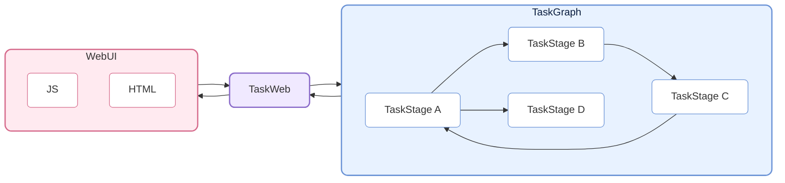
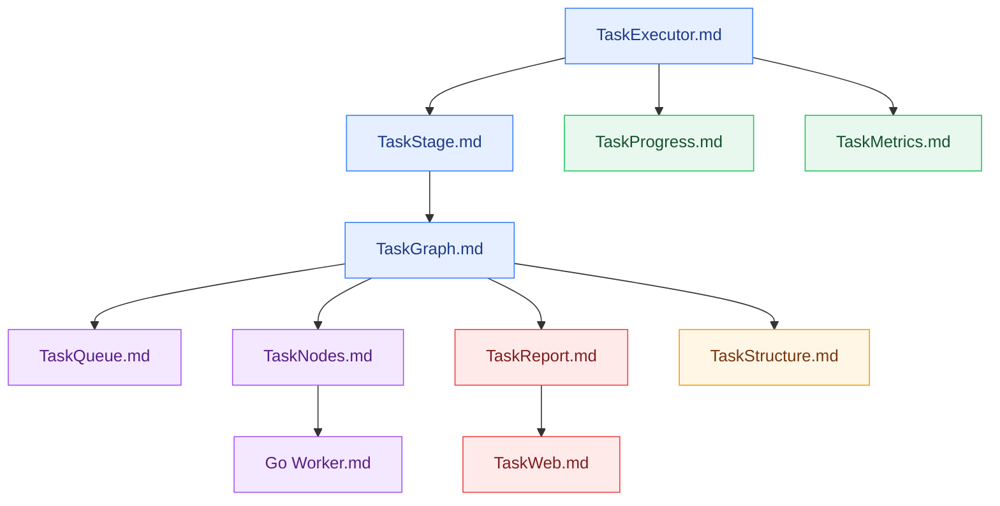

# CelestialFlow ——一个轻量级、可并行、基于图结构的 Python 任务调度框架

<p align="center">
  
</p>

<p align="center">
  <a href="https://pypi.org/project/celestialflow/"></a>
  <a href="https://pepy.tech/projects/celestialflow"></a>
  <a href="https://pypi.org/project/celestialflow/"></a>
  <a href="https://pypi.org/project/celestialflow/"></a>
</p>

<p align="center">
  
  
  
  
</p>

**CelestialFlow** 是一个轻量级但功能完全的任务流框架，适合需要 **复杂依赖关系**、**灵活执行模型**、**跨设备运行**与**实时可视化监控** 的中/大型 Python 任务系统。

- 相比 Airflow/Dagster 更轻、更快开始
- 相比 multiprocessing/threading 更结构化，可直接表达 loop / complete graph 等复杂依赖模式

框架的基本单元为 **TaskExecutor**，可独立运行，并支持四种执行模式：

* **线性（serial）**
* **多线程（thread）**
* **多进程（process）**
* **协程（async）**

TaskExecutor 实现了对任务的结果缓存，任务去重，进度条显示，多执行模式比较等功能，单独使用也很好用。

但除去直接使用 TaskExecutor，更重要的是使用其子类**TaskStage**。TaskStage 可以互相连接，形成具有上游与下游依赖关系的任务图（**TaskGraph**）。下游 stage 会自动接收上游执行完成的结果作为输入，从而形成明确的数据流。

TaskStage 的任务执行模式只有两种：

* **线性（serial）**
* **多线程（thread）**

在图级别上，每个 Stage 支持两种上下文模式：

* **线性执行（serial layout）**：当前节点执行完毕再启动下一节点（下游节点可提前接收任务但不会立即执行）。
* **并行执行（process layout）**：当前节点启动后立刻前去启动下一节点。

TaskGraph 能构建完整的 **有向图结构（Directed Graph）**，不仅支持传统的有向无环图（DAG），也能灵活表达 **树形（Tree）**、**环形（loop）** 乃至于 **完全图（Complete Graph）** 形式的任务依赖。

在执行与调度之外，CelestialFlow 进一步引入 **CelestialTree（简称: ctree） 事件追踪系统**，为每一个任务及其衍生行为（成功、失败、重试、拆分、路由等）记录明确的因果关系。借助 ctree，可以从任意一个初始任务出发，完整还原其在 TaskGraph 中的传播路径与执行轨迹，使任务系统可以进行完整的**追溯、分析、解释**。

在此基础上，CelestialFlow 支持 Web 可视化监控，并可通过 Redis 实现跨进程、跨设备协作；同时引入基于 Go 的外部 worker（通过 Redis 通信），用于承载 CPU 密集型任务，弥补 Python 在该场景下的性能瓶颈。

## 项目结构（Project Structure）


```mermaid
flowchart LR

    %% ===== TaskGraph =====
    subgraph TG[TaskGraph]
        direction LR

        S1[TaskStage A]
        S2[TaskStage B]
        S3[TaskStage C]
        S4[TaskStage D]

        S1 --> S2 --> S3 --> S1
        S1 --> S4

    end

    %% 美化 TaskGraph 外框
    style TG fill:#e8f2ff,stroke:#6b93d6,stroke-width:2px,color:#0b1e3f,rx:10px,ry:10px

    %% 统一美化格式
    classDef blueNode fill:#ffffff,stroke:#6b93d6,rx:6px,ry:6px;

    %% 美化 TaskStages
    class S1,S2,S3,S4 blueNode;

    %% ===== WebUI =====
    subgraph W[WebUI]
        JS
        HTML
    end

    style W fill:#ffeaf0,stroke:#d66b8c,stroke-width:2px,rx:10px,ry:10px
    style JS fill:#ffffff,stroke:#d66b8c,rx:5px,ry:5px
    style HTML fill:#ffffff,stroke:#d66b8c,rx:5px,ry:5px

    R[TaskWeb]
    style R fill:#f0e9ff,stroke:#8a6bc9,stroke-width:2px,rx:8px,ry:8px

    %% ===== Links =====
    TG --> R 
    R --> TG 
    R --> W
    W --> R

```

## 快速开始（Quick Start）

安装 CelestialFlow:

```bash
# 推荐使用 `uv` 管理依赖与环境
uv pip install celestialflow

# 不过也可以直接使用 `pip`
uv pip install celestialflow
```

一个简单的可运行代码:

```python
from celestialflow import TaskStage, TaskGraph

def add(x, y): 
    return x + y

def square(x): 
    return x ** 2

if __name__ == "__main__":
    # 定义两个任务节点
    stage1 = TaskStage(add, execution_mode="thread", unpack_task_args=True)
    stage2 = TaskStage(square, execution_mode="thread")

    # 构建任务图结构
    stage1.set_graph_context([stage2], stage_mode="process", stage_name="Adder")
    stage2.set_graph_context([], stage_mode="process", stage_name="Squarer")
    graph = TaskGraph([stage1])

    # 初始化任务并启动
    graph.start_graph({stage1.get_tag(): [(1, 2), (3, 4), (5, 6)]})
```

注意不要在.ipynb中运行。

👉 想查看完整Quick Start，请见[Quick Start](https://github.com/Mr-xiaotian/CelestialFlow/blob/main/docs/quick_start.md)

## 深入阅读（Further Reading）

(以下文档完善中)

你可以继续运行更多的测试代码，这里记录了各个测试文件与其中的测试函数说明：

[📄tests/README.md](https://github.com/Mr-xiaotian/CelestialFlow/blob/main/tests/README.md)

若你想了解框架的整体结构与核心组件，下面的参考文档会对你有帮助：

- [TaskExecutor.md](https://github.com/Mr-xiaotian/CelestialFlow/blob/main/docs/reference/task_executor.md)
- [TaskStage.md](https://github.com/Mr-xiaotian/CelestialFlow/blob/main/docs/reference/task_stage.md)
- [TaskGraph.md](https://github.com/Mr-xiaotian/CelestialFlow/blob/main/docs/reference/task_graph.md)
- [TaskProgress.md](https://github.com/Mr-xiaotian/CelestialFlow/blob/main/docs/reference/task_progress.md)
- [TaskMetrics.md](https://github.com/Mr-xiaotian/CelestialFlow/blob/main/docs/reference/task_metrics.md)
- [TaskQueue.md](https://github.com/Mr-xiaotian/CelestialFlow/blob/main/docs/reference/task_queue.md)
- [TaskNodes.md](https://github.com/Mr-xiaotian/CelestialFlow/blob/main/docs/reference/task_nodes.md)
- [TaskReport.md](https://github.com/Mr-xiaotian/CelestialFlow/blob/main/docs/reference/task_report.md)
- [TaskStructure.md](https://github.com/Mr-xiaotian/CelestialFlow/blob/main/docs/reference/task_structure.md)
- [TaskWeb.md](https://github.com/Mr-xiaotian/CelestialFlow/blob/main/docs/reference/task_web.md)
- [Go Worker.md](https://github.com/Mr-xiaotian/CelestialFlow/blob/main/docs/reference/go_worker.md)

推荐阅读顺序:


```mermaid
flowchart TD
    classDef core fill:#e6efff,stroke:#3b82f6,color:#1e3a8a;
    classDef runtime fill:#e9f8ef,stroke:#22c55e,color:#14532d;
    classDef structure fill:#fff6e6,stroke:#f59e0b,color:#78350f;
    classDef execution fill:#f3e8ff,stroke:#a855f7,color:#581c87;
    classDef web fill:#ffeaea,stroke:#ef4444,color:#7f1d1d;

    TM[TaskExecutor.md] --> TS[TaskStage.md] --> TG[TaskGraph.md]
    TM --> TP[TaskProgress.md]
    TM --> TME[TaskMetrics.md]

    TG --> TQ[TaskQueue.md]
    TG --> TN[TaskNodes.md]
    TG --> TR[TaskReport.md]
    TG --> TSR[TaskStructure.md]

    TR --> TW[TaskWeb.md]
    TN --> GW[Go Worker.md]

    class TM,TS,TG core;
    class TP,TME runtime;
    class TSR structure;
    class TQ,TN,GW execution;
    class TR,TW web;
```

以下三篇可以作为补充阅读:

- [TaskTools.md](https://github.com/Mr-xiaotian/CelestialFlow/blob/main/docs/reference/task_tools.md)
- [TaskTypes.md](https://github.com/Mr-xiaotian/CelestialFlow/blob/main/docs/reference/task_types.md)
- [TaskLogging.md](https://github.com/Mr-xiaotian/CelestialFlow/blob/main/docs/reference/task_logging.md)
- [TaskErrors.md](https://github.com/Mr-xiaotian/CelestialFlow/blob/main/docs/reference/task_errors.md)

如果你更喜欢通过完整案例理解框架的运行方式，可以参考这篇从零开始构建 TaskGraph 的教程：

[📘案例教程](https://github.com/Mr-xiaotian/CelestialFlow/blob/main/docs/tutorial.md)

如果你对3.0.7版本加入的ctree_client与其功能感兴趣, 可以看看这一篇:

[📚CelestialTreeClient](https://github.com/Mr-xiaotian/CelestialFlow/blob/main/docs/reference/ctree_client.md)

## 环境要求（Requirements）

**CelestialFlow** 基于 Python 3.8+，并依赖以下核心组件。  
请确保你的环境能够正常安装这些依赖（`pip install celestialflow` 会自动安装）。

| 依赖包           | 说明 |
| ----------------- | ---- |
| **Python ≥ 3.8**  | 运行环境，建议使用 3.10 及以上版本 |
| **tqdm**          | 控制台进度条显示，用于任务执行可视化 |
| **loguru**        | 高性能日志系统，支持多进程安全输出 |
| **fastapi**       | Web 服务接口框架（用于任务可视化与远程控制） |
| **uvicorn**       | FastAPI 的高性能 ASGI 服务器 |
| **requests**      | HTTP 客户端库，用于任务状态上报与远程调用 |
| **networkx**      | 任务图（TaskGraph）结构与依赖分析 |
| **jinja2**        | FastAPI 模板引擎，用于 Web 可视化界面渲染 |
| **redis**         | 可选组件，用于分布式任务通信（`TaskRedis*` 系列模块） |
| **celestialtree** | 可选组件，用于任务状态上报与远程调用（`ctree_client`） |

## 文件结构（File Structure）

<p align="center">
  
  <br/>
  <em>celestial-flow 3.1.1</em>
</p>

(该视图由我的另一个项目[CelestialVault](https://github.com/Mr-xiaotian/CelestialVault)中inst_file.FileTree.print_tree()生成。转换为图片则借助[Carbon](https://carbon.now.sh)。)

## 更新日志（Change Log）

- 2021: 建立一个支持多线程与单线程处理函数的类
- 2023: 在GPT4帮助下添加多进程与携程运行模式 
- 5/9/2024: 将原有的处理类抽象为节点, 添加TaskChain类, 可以线性连接多个节点, 并设定节点在Chain中的运行模式, 支持serial和process两种, 后者Chain所有节点同时运行
- 12/12/2024-12/16/2024: 在原有链式结构基础上允许节点有复数下级节点, 实现Tree结构; 将原有TaskChain改名为TaskTree
- 3/16/2025: 支持Web端任务完成情况可视化
- 6/9/2025: 支持节点拥有复数上级节点, 脱离纯Tree结构, 为之后循环图做准备
- 6/11/2025: 自[CelestialVault](https://github.com/Mr-xiaotian/CelestialVault)项目instances.inst_task迁出
- 6/12/2025: 支持循环图, 下级节点可指向上级节点
- 6/13/2025: 支持loop结构, 即节点可指向自己
- 6/14/2025: 支持forest结构, 即可有多个根节点
- 6/16/2025: 多轮评测后, 当前框架已支持完整有向图结构, 将TaskTree改名为TaskGraph
- 3.0.1: 上线Pypi, 可喜可贺
- 3.0.4: 新增一个抽象结构TaskQueue, 用于表示节点的所有"入边"与"出边"; 恢复未消费任务的保存功能
- 3.0.5: 删除原有的TaskRedisTransfer节点, 并增添三种新的redis交互节点TaskRedisSink TaskRedisSource TaskRedisAck, 用于跨语言 跨进程 跨设备处理任务; 并在Web页面添加展示拓扑信息的卡片
- 3.0.6: 添加对[CelestialTree](https://github.com/Mr-xiaotian/CelestialTree)系统的支持, 现在可以追踪单个任务的流向
- 3.0.7: 将TaskStage从TaskExecutor中单独抽出来作为一个子类; 增加新节点TaskRouter, 可以将传入的任务选择的传给不同的下游节点, 而不是进行广播
- 3.0.8: 在ctree逻辑上将"任务重试"事件后的"任务成功/失败/重试"事件视为因果关系, 而非之前的并行关系; 重构错误搜集部分逻辑; 修复大量3.0.6与3.07版本引入的bug; 优化部分log表现
- 3.0.9: 
  - 更新前端mermaid显示中部分节点图标; 
  - 对ctree_client进行匹配CelestialTree的大量修改; 
  - 将ctree_client移出为单独的project; 
  - 在前端中添加error_id的显示, 为之后显示provenance_tree做准备; 
  - 增加大量warning与error, 用于提醒不规范设置; 
  - 优化前后端中错误数据的传输方式, 在大量错误数据时减少内存消耗; 
  - 优化TaskLogger中log队列的准入机制; 
  - 修改部分Bug;
- 3.1.0:
  - 新增:
    - 优化web端仪表盘页面的"总体状态摘要"卡片, 新增"总重复任务"与"总剩余市场", 后者由节点间拓扑关系计算而成, 后续还需要优化;
  - 修复:
    - 3.0.9版本下当web端与celestialflow运行端不同时, error数据无法传递的问题;
    - 修复NullTaskReporter使用问题;
- 3.1.1:
  - 新增:
    - [Important] CelestialTree中引入grpc, 这大大减少了emit操作的耗时;
    - [Important] 为TerminationSignal添加id, 并可以像task一样通过CelestialTree进行跟踪;
    - 优化task_graph与task_executor的log分级, 现在默认为"SUCCESS"级;
    - 将go_worker部分分离为单独project: [celestialflow-goworker]https://github.com/Mr-xiaotian/celestialflow-goworker
    - 在readme中使用svg图片来展示文件夹结构;
    - 优化全局剩余时间的计算;
    - 优化部分代码结构;
  - 修复:
    - 修复节点剩余时间在小于1s时显示0的问题(这很影响判断);
    - 在task_graph中使用"staged"模式时会报错的问题;

## Star 历史趋势（Star History）

如果对项目感兴趣的话，欢迎star。如果有问题或者建议的话, 欢迎提交[Issues](https://github.com/Mr-xiaotian/CelestialFlow/issues)或者在[Discussion](https://github.com/Mr-xiaotian/CelestialFlow/discussions)中告诉我。

[](https://star-history.com/#Mr-xiaotian/CelestialFlow&Date)

## 许可（License）
This project is licensed under the MIT License - see the [LICENSE](LICENSE) file for details.

## 作者（Author）
Author: Mr-xiaotian
Email: mingxiaomingtian@gmail.com
Project Link: [https://github.com/Mr-xiaotian/CelestialFlow](https://github.com/Mr-xiaotian/CelestialFlow)
