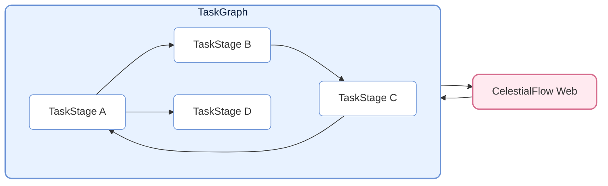
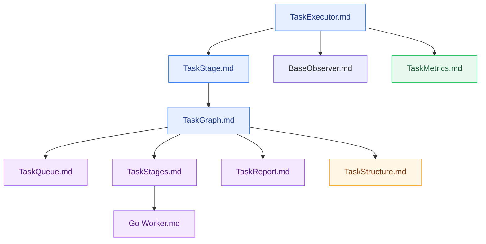

# CelestialFlow ——一个轻量级、可并行、基于图结构的 Python 任务调度框架

<p align="center">
  
</p>

<p align="center">
  <a href="https://pypi.org/project/celestialflow/"></a>
  <a href="https://pepy.tech/projects/celestialflow"></a>
  <a href="https://pypi.org/project/celestialflow/"></a>
  <a href="https://pypi.org/project/celestialflow/"></a>
</p>

<p align="center">
  
  
  
</p>

<p align="center">
  <a href="https://github.com/Mr-xiaotian/CelestialFlow/blob/main/README.md">中文</a> | <a href="https://github.com/Mr-xiaotian/CelestialFlow/blob/main/docs/en/README.md">English</a> | <a href="https://github.com/Mr-xiaotian/CelestialFlow/blob/main/docs/ja/README.md">日本語</a>
</p>

**CelestialFlow** 是一个轻量级但功能完全的任务流框架，适合需要 **复杂依赖关系**、**灵活执行模型**、**跨设备运行** 与 **可观测执行链路** 的中/大型 Python 任务系统。

- 相比 Airflow/Dagster 更轻、更快开始
- 相比 multiprocessing/threading 更结构化，可直接表达 loop / complete graph 等复杂依赖模式

框架的基本单元为 **TaskExecutor**，可独立运行，并支持三种执行模式：

* **线性（serial）**
* **多线程（thread）**
* **协程（async）**

TaskExecutor 实现了对任务的结果缓存，任务去重，进度条显示，多执行模式比较等功能，单独使用也很好用。

但除去直接使用 TaskExecutor，更重要的是使用其子类**TaskStage**。TaskStage 可以互相连接，形成具有上游与下游依赖关系的任务图（**TaskGraph**）。下游 stage 会自动接收上游执行完成的结果作为输入，从而形成明确的数据流。

TaskStage 的任务执行模式同样包含三种，与TaskExecutor中一致。

在图级别上，每个 Stage 支持两种上下文模式：

* **线性执行（serial layout）**：当前节点执行完毕再启动下一节点（下游节点可提前接收任务但不会立即执行）。
* **线程执行（thread layout）**：当前节点在主进程的独立线程中启动，适合 I/O 密集型任务和不可 pickle 的函数（如 lambda）。

TaskGraph 能构建完整的 **有向图结构（Directed Graph）**，不仅支持传统的有向无环图（DAG），也能灵活表达 **树形（Tree）**、**环形（loop）** 乃至于 **完全图（Complete Graph）** 形式的任务依赖。

在执行与调度之外，CelestialFlow 进一步引入 **CelestialTree（简称: ctree） 事件追踪系统**，为每一个任务及其衍生行为（成功、失败、重试、拆分、路由等）记录明确的因果关系。借助 ctree，可以从任意一个初始任务出发，完整还原其在 TaskGraph 中的传播路径与执行轨迹，使任务系统可以进行完整的**追溯、分析、解释**。

在此基础上，CelestialFlow 提供事件追踪、状态上报、持久化回放，并提供基于 Redis 的 demo 与 Go Worker 外部协作示例，用于展示按需构建跨进程、跨设备任务协作的方式。

## 项目结构（Project Structure）


```mermaid
flowchart LR

    %% ===== TaskGraph =====
    subgraph TG[TaskGraph]
        direction LR

        S1[TaskStage A]
        S2[TaskStage B]
        S3[TaskStage C]
        S4[TaskStage D]

        S1 --> S2 --> S3 --> S1
        S1 --> S4

    end

    %% 美化 TaskGraph 外框
    style TG fill:#e8f2ff,stroke:#6b93d6,stroke-width:2px,color:#0b1e3f,rx:10px,ry:10px

    %% 统一美化格式
    classDef blueNode fill:#ffffff,stroke:#6b93d6,rx:6px,ry:6px;

    %% 美化 TaskStages
    class S1,S2,S3,S4 blueNode;

    %% ===== Links =====
    TG --> CFB[CelestialFlow Web]
    CFB --> TG 

    style CFB fill:#ffeaf0,stroke:#d66b8c,stroke-width:2px,rx:10px,ry:10px

```

## 快速开始（Quick Start）

安装 CelestialFlow:

```bash
# 推荐使用 `uv` 管理依赖与环境
uv pip install celestialflow

# 不过也可以直接使用 `pip`
pip install celestialflow
```

如果你只使用 CelestialFlow 的核心调度、可观测性与持久化能力，上面的安装已经足够。

如果你还需要启用 CelestialTree 事件追踪能力，则需要**额外安装** `celestialtree`：

```bash
# 对已发布包使用者
uv pip install celestialtree

# 如果你是 clone 仓库后的开发者/贡献者
uv sync --group dev
```

一个简单的可运行代码:

```python
from celestialflow import TaskStage, TaskGraph


def add(x, y):
    return x + y


def square(x):
    return x**2


if __name__ == "__main__":
    # 定义两个任务节点
    stage1 = TaskStage(
        name="Adder",
        func=add,
        stage_mode="thread",
        execution_mode="thread",
        unpack_task_args=True,
    )
    stage2 = TaskStage(
        name="Squarer", func=square, stage_mode="thread", execution_mode="thread"
    )

    # 构建任务图结构
    graph = TaskGraph(name="DemoGraph")
    graph.set_stages(stages=[stage1, stage2])
    graph.connect([stage1], [stage2])

    # 初始化任务并启动
    graph.start_graph({stage1.get_name(): [(1, 2), (3, 4), (5, 6)]})
```

注意不要在.ipynb中运行。

👉 想查看完整Quick Start，请见[Quick Start](https://github.com/Mr-xiaotian/CelestialFlow/blob/main/docs/zh-CN/quick_start.md)

## 深入阅读（Further Reading）

若你想了解框架的整体结构与核心组件，下面的参考文档会对你有帮助：

- [TaskExecutor.md](https://github.com/Mr-xiaotian/CelestialFlow/blob/main/docs/zh-CN/src/stage/core_executor.md)
- [TaskStage.md](https://github.com/Mr-xiaotian/CelestialFlow/blob/main/docs/zh-CN/src/stage/core_stage.md)
- [TaskGraph.md](https://github.com/Mr-xiaotian/CelestialFlow/blob/main/docs/zh-CN/src/graph/core_graph.md)
- [TaskMetrics.md](https://github.com/Mr-xiaotian/CelestialFlow/blob/main/docs/zh-CN/src/runtime/core_metrics.md)
- [TaskQueue.md](https://github.com/Mr-xiaotian/CelestialFlow/blob/main/docs/zh-CN/src/runtime/core_queue.md)
- [TaskStages.md](https://github.com/Mr-xiaotian/CelestialFlow/blob/main/docs/zh-CN/src/stage/core_stages.md)
- [TaskReport.md](https://github.com/Mr-xiaotian/CelestialFlow/blob/main/docs/zh-CN/src/observability/core_report.md)
- [TaskStructure.md](https://github.com/Mr-xiaotian/CelestialFlow/blob/main/docs/zh-CN/src/graph/core_structure.md)
- [BaseObserver.md](https://github.com/Mr-xiaotian/CelestialFlow/blob/main/docs/zh-CN/src/observability/core_observer.md)
- [Go Worker.md](https://github.com/Mr-xiaotian/CelestialFlow/blob/main/docs/zh-CN/other/go_worker.md)

推荐阅读顺序:


```mermaid
flowchart TD
    classDef core fill:#e6efff,stroke:#3b82f6,color:#1e3a8a;
    classDef runtime fill:#e9f8ef,stroke:#22c55e,color:#14532d;
    classDef structure fill:#fff6e6,stroke:#f59e0b,color:#78350f;
    classDef execution fill:#f3e8ff,stroke:#a855f7,color:#581c87;

    TM[TaskExecutor.md] --> TS[TaskStage.md] --> TG[TaskGraph.md]
    TM --> OB[BaseObserver.md]
    TM --> TME[TaskMetrics.md]

    TG --> TQ[TaskQueue.md]
    TG --> TN[TaskStages.md]
    TG --> TR[TaskReport.md]
    TG --> TSR[TaskStructure.md]

    TN --> GW[Go Worker.md]

    class TM,TS,TG core;
    class TP,TME runtime;
    class TSR structure;
    class TQ,TN,GW execution;
    class TR execution;
```

以下五篇可以作为补充阅读:

- [UtilHash.md](https://github.com/Mr-xiaotian/CelestialFlow/blob/main/docs/zh-CN/src/runtime/util_hash.md)
- [UtilTypes.md](https://github.com/Mr-xiaotian/CelestialFlow/blob/main/docs/zh-CN/src/runtime/util_types.md)
- [UtilErrors.md](https://github.com/Mr-xiaotian/CelestialFlow/blob/main/docs/zh-CN/src/runtime/util_errors.md)
- [Fallback.md](https://github.com/Mr-xiaotian/CelestialFlow/blob/main/docs/zh-CN/src/persistence/core_fallback.md)
- [Log.md](https://github.com/Mr-xiaotian/CelestialFlow/blob/main/docs/zh-CN/src/persistence/core_log.md)

如果你更喜欢通过完整案例理解框架的运行方式，可以参考这篇利用 TaskGraph 从零开始构建项目的教程：

[📘案例教程](https://github.com/Mr-xiaotian/CelestialFlow/blob/main/docs/zh-CN/tutorial.md)

如果你对3.0.7版本加入的ctree_client与其功能感兴趣, 可以看看这一篇:

[📚CelestialTreeClient](https://github.com/Mr-xiaotian/CelestialFlow/blob/main/docs/zh-CN/other/ctree_client.md)

你可以继续运行更多的演示代码，这里记录了各个演示文件与其中的演示函数说明：

[🎮demo/ 总览](https://github.com/Mr-xiaotian/CelestialFlow/blob/main/docs/zh-CN/demo/README.md)

如果你想运行测试代码，可以先查看如下文档内容：

[🧪tests/ 总览](https://github.com/Mr-xiaotian/CelestialFlow/blob/main/docs/zh-CN/tests/README.md)

如果你想查看 bench 内容，这些数据也是框架中部分设计取舍的依据：

[⚡bench/ 总览](https://github.com/Mr-xiaotian/CelestialFlow/blob/main/docs/zh-CN/bench/README.md)

## 环境要求（Requirements）

**CelestialFlow** 基于 Python 3.12+，默认运行时依赖以下核心组件。
其中 `celestialtree` 不再属于默认运行时依赖，而是额外安装的可选组件。

| 依赖包           | 说明 |
| ----------------- | ---- |
| **Python ≥ 3.12**  | 运行环境，建议使用 3.12 及以上版本 |
| **requests**      | HTTP 客户端库，用于任务状态上报与远程调用 |
| **tqdm**          | 可选组件，进度条显示，用于任务执行可视化 |

- 如需运行 `demo/demo_redis.py` 或 Go Worker 示例，请额外安装 `redis` 并准备 Redis 服务；这部分不属于默认运行时依赖。

- 如需运行依赖 CelestialTree 的 demo / bench / 追踪查询，请额外安装 `celestialtree`，或直接在源码仓库中执行 `uv sync --group dev`。

- 如需使用可视化的Web服务, 请额外安装 `celestialflow-web` 并运行 `celestialflow-web --host 0.0.0.0 --port 5000`。

## 文件结构（File Structure）

```
📁 CelestialFlow	(587MB 684KB 313B)
    📁 bench           	(296KB 842B)
        📁 [1项排除的目录]                  	(194KB 222B)
        🐍 bench_datastructures.py          	(6KB 690B)
        🐍 bench_execution_mode.py          	(2KB 831B)
        🐍 bench_futures_memory.py          	(2KB 269B)
        🐍 bench_gil_vs_nogil.py            	(10KB 7B)
        🐍 bench_graph_mode.py              	(7KB 450B)
        🐍 bench_hash.py                    	(7KB 67B)
        🐍 bench_hash_container.py          	(3KB 1009B)
        🐍 bench_hash_memory.py             	(3KB 642B)
        🐍 bench_http_grpc.py               	(2KB 608B)
        🐍 bench_ipc_queue.py               	(7KB 104B)
        🐍 bench_lock_overhead.py           	(9KB 421B)
        🐍 bench_mpqueue_vs_shared_memory.py	(13KB 127B)
        🐍 bench_observer.py                	(7KB 860B)
        🐍 bench_persistence_spout.py       	(4KB 279B)
        🐍 bench_queue.py                   	(5KB 857B)
        🐍 bench_requests.py                	(6KB 813B)
        🐍 bench_tqdm.py                    	(1KB 235B)
        🐍 bench_utils.py                   	(543B)
    📁 demo            	(147KB 87B)
        📁 [1项排除的目录]  	(100KB 9B)
        🐍 demo_executor.py 	(1KB 495B)
        🐍 demo_funnel.py   	(2KB 289B)
        🐍 demo_graph.py    	(3KB 565B)
        🐍 demo_network.py  	(3KB 879B)
        🐍 demo_observer.py 	(4KB 270B)
        🐍 demo_redis.py    	(9KB 144B)
        🐍 demo_stages.py   	(4KB 336B)
        🐍 demo_structure.py	(12KB 24B)
        🐍 demo_utils.py    	(6KB 148B)
    📁 dist            	(147KB 48B)
        ❓ .gitignore                          	(1B)
        ❓ celestialflow-3.2.7-py3-none-any.whl	(79KB 235B)
        📦 celestialflow-3.2.7.tar.gz          	(67KB 836B)
    📁 docs            	(1MB 722KB 21B)
        📁 en[已折叠]   	(568KB 991B)
        📁 ja[已折叠]   	(642KB 383B)
        📁 zh-CN[已折叠]	(534KB 695B)
    📁 experiments     	(2KB 1015B)
        🐍 experiment_networkx.py	(1KB 878B)
        🐍 experiment_tqdm.py    	(1KB 137B)
    📁 img             	(5MB 871KB 242B)
        📷 file_structure.svg  	(4MB 918KB 1000B)
        📷 logo(old).png       	(836KB 542B)
        📷 logo.png            	(122KB 747B)
        📷 scc_condensation.svg	(17KB 1B)
    📁 src             	(1MB 858KB 89B)
        📁 celestialflow[已折叠]         	(1MB 839KB 629B)
        📁 celestialflow.egg-info[已折叠]	(18KB 484B)
    📁 tests           	(4MB 167KB 552B)
        📁 benchmark[已折叠]    	(38KB 197B)
        📁 funnel[已折叠]       	(96KB 363B)
        📁 graph[已折叠]        	(721KB 564B)
        📁 observability[已折叠]	(189KB 236B)
        📁 persistence[已折叠]  	(388KB 426B)
        📁 runtime[已折叠]      	(1MB 295KB 529B)
        📁 stage[已折叠]        	(382KB 155B)
        📁 utils[已折叠]        	(639KB 527B)
        📁 [1项排除的目录]      	(487KB 589B)
        🐍 conftest.py          	(1KB 38B)
        🐍 __init__.py          	(0B)
    📁 [12项排除的目录]	(573MB 420KB 160B)
    ❓ .env            	(468B)
    ❓ .gitignore      	(1KB 314B)
    📝 AGENTS.md       	(1KB 173B)
    ❓ LICENSE         	(1KB 65B)
    ❓ Makefile        	(155B)
    ⚙️ pyproject.toml  	(2KB 668B)
    📝 README.md       	(19KB 24B)
    🔒 uv.lock         	(97KB 510B)
```
<p align="center">
  <em>celestial-flow 3.2.8</em>
</p>

(该视图由我的另一个项目[CelestialVault](https://github.com/Mr-xiaotian/CelestialVault)中inst_file.FileTree.print_tree()生成。转换为图片则借助[Carbon](https://carbon.now.sh)。)

## 版本日志（Version Log）
- 3.2.8
  - feat:
    - [IMPORTANT] 添加 `TaskGraph.run_async`, 现在可以直接进行图级别的异步
      - 根据 `bench_graph_mode.py` 最新测试, 在I/O密集型任务中, `serial`+`async`（6.05s），比 `serial`+`serial`（69.04s）快 **11.4x**
    - 在 `core_structure` 中添加报错校验
    - 不再允许设置 `execution_mode=async` 时调用 `TashExecutor.start`(如今的`TashExecutor.run`), 只能调用 `TashExecutor.run_async`
    - 另外调用 `TashExecutor.run_async` 时也会进行模式检查, 不是 `execution_mode=async` 就会抛出异常
    - 在 `BaseObserver` 中添加 `observer_error`, 用于处理 `BaseObserver.on_*` 函数的报错
    - 在 `TaskGraph._finish_start_graph` `TaskExecutor._finish_start` 中对所有执行步骤进行 `try-except`, 以使收尾步骤尽量全部完成
    - 添加 `core_scope`, 用于独立控制 `funnel` 的生命周期, 并用于 `TaskGraph.run/run_async` `TaskExecutor.run/run_async`
  - refactor:
    - [IMPORTANT] 原 `TaskGraph.start_graph/start_graph_async` `TaskExecutor.start/start_async` 已被重命名为 `TaskGraph.run/run_async` `TaskExecutor.run/run_async`
      - 破坏性更新
      - 其底层缘由是为了合并 `TaskStage.start_stage/start_stage_async` 与 `TaskExecutor.start/start_async` 而做出的一系列重构之一
      - 现在的 `TaskGraph.start/start_async` `TaskExecutor.start/start_async` 不再接受任务, 而是专注于处理现有任务列表中的任务
    - [IMPORTANT] 将funnel从 `TaskGraph` `TaskExecutor` 中的显性调用与显性传递, 改为所有使用端均从独立文件中import
      - 一来是因为原先的传递链太丑了, 二来是为了简化 `TaskExecutor.start/start_async` 逻辑, 为其与 `TaskStage.start_stage/start_stage_async` 的合并做准备
    - 移动部分文件以解决部分模块级的循环引用问题
      - 原先并非文件级循环引用, 在使用上并无问题
    - 修改 `TaskDispatch.dispatch_thread` 中处理已完成future的逻辑, 避免cpu浪费
    - 删除 `util_errors` 中一些不必要的错误类
    - 将 `TaskGraph._finalize_stages` 进行拆分, 删除不必要的机制, 将剩余机制移至其他方法
    - 修改 `TaskGraph.set_reporter` 的逻辑, 使其与 `set_ctree` 保持一致
    - 将 `TaskOutQueue` 中的 `queue_list|target_name|_name_to_idx` 改为 `_queues`, 并删除 `put_channel`
      - 我有些困惑为什么最初我没有这么做
    - 在 `TaskExecutor` 中合并 `_get_task_repr` and `_get_result_repr`
      - 这两个方法原先差异巨大, 但后来经过多次其他部分的重构, 现在逻辑已经一致
    - 将 `TaskStage` 中的 `_status` 交给 `TaskMetrics` 维护
      - 依旧是为了合并 `TaskExecutor.start/start_async` 与 `TaskStage.start_stage/start_stage_async`
    - 移除 `TaskGraph` 中的 `put_stage_queue`
      - 任务输入完全使用 `TaskExecutor` 中的 `put_task` `put_signal` 方法
  - fix:
    - 在 `TaskDispatch.worker/worker_async` 中添加错误捕捉, 捕捉为 `CRITICAL` 级错误
      - 避免 `worker` 级出错导致计数错误, 永远无法退出
    - 在 `spout` 与 `reporter` 的 `stop` 操作中添加对于线程没有成功 `join` 的报错
    - 修复 `TaskGraph.restore_db` 与 `TaskExecutor.restore_db` 中开启 `filter_by_error_type=Ture` 时跳过 `status=pending` 任务记录的问题
    - 修复 `TaskGraph` 中部分 `get_*` 方法依赖 `_build_analysis` 的产物, 但 `_build_analysis` 未执行导致的问题
    - 修复 `TaskMetrics` 中 `get_counts` 与 `is_tasks_finished` 中可能导致死锁的问题
    - 修复 `TaskReporter` 中 `stop` 里进行的最后一次 `_refresh_all` 没有错误捕捉, 导致后续收尾未完成的问题

更多过往日志可看:

[change_log.md](https://github.com/Mr-xiaotian/CelestialFlow/blob/main/docs/zh-CN/change_log.md)

## Star 历史趋势（Star History）

如果对项目感兴趣的话，欢迎star。如果有问题或者建议的话, 欢迎提交[Issues](https://github.com/Mr-xiaotian/CelestialFlow/issues)或者在[Discussion](https://github.com/Mr-xiaotian/CelestialFlow/discussions)中告诉我。


## 许可（License）
This project is licensed under the MIT License - see the [LICENSE](https://github.com/Mr-xiaotian/CelestialFlow/blob/main/LICENSE) file for details.

## 作者（Author）
Author: Mr-xiaotian
Email: mingxiaomingtian@gmail.com
Project Link: [https://github.com/Mr-xiaotian/CelestialFlow](https://github.com/Mr-xiaotian/CelestialFlow)
