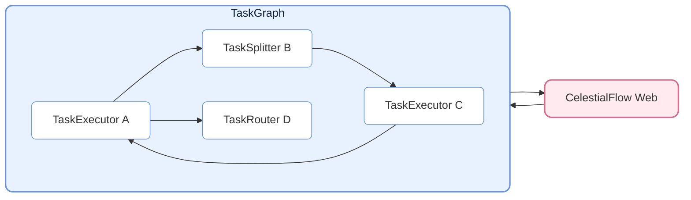
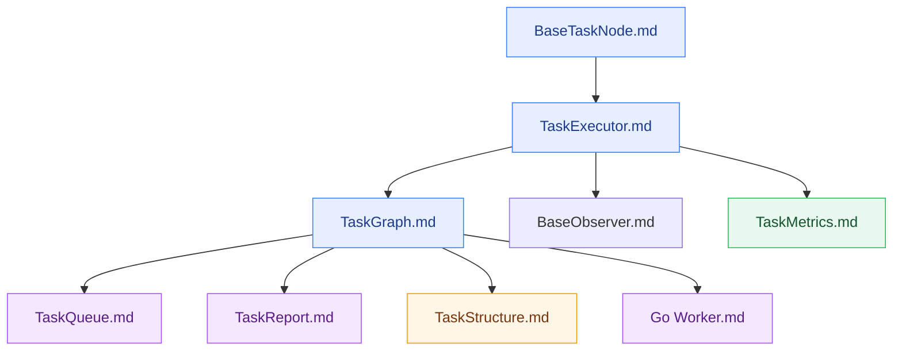

# CelestialFlow ——一个轻量级、可并行、基于图结构的 Python 任务调度框架

> 📅 最后更新日期: 2026/09/24

<p align="center">
  
</p>

<p align="center">
  <a href="https://pypi.org/project/celestialflow/"></a>
  <a href="https://pepy.tech/projects/celestialflow"></a>
  <a href="https://pypi.org/project/celestialflow/"></a>
  <a href="https://pypi.org/project/celestialflow/"></a>
</p>

<p align="center">
  
  
  
</p>

<p align="center">
  <a href="https://github.com/Mr-xiaotian/CelestialFlow/blob/main/README.md">中文</a> | <a href="https://github.com/Mr-xiaotian/CelestialFlow/blob/main/docs/en/README.md">English</a> | <a href="https://github.com/Mr-xiaotian/CelestialFlow/blob/main/docs/ja/README.md">日本語</a>
</p>

**CelestialFlow** 是一个轻量级但功能完全的任务流框架，适合需要 **复杂依赖关系**、**灵活执行模型**、**跨设备运行** 与 **可观测执行链路** 的中/大型 Python 任务系统。

- 相比 Airflow/Dagster 更轻、更快开始
- 相比 multiprocessing/threading 更结构化，可直接表达 loop / complete graph 等复杂依赖模式

框架的基本单元为 **任务节点**（统一继承自内部基类 `BaseTaskNode`），目前对外暴露三种具体节点实现，可独立运行，也可互相连接成图：

* **TaskExecutor** — 通用任务执行器
* **TaskSplitter** — 将一个输入拆分为多个子任务
* **TaskRouter** — 根据条件将任务路由到不同下游

三种节点都支持以下执行模式：

* **线性（serial）**
* **多线程（thread）**
* **协程（async）**

`TaskExecutor` 实现了对任务的结果缓存、任务去重、进度条显示、多执行模式比较等功能，单独使用也很好用。

节点之间通过 **TaskGraph** 互相连接，形成具有上游与下游依赖关系的任务图。下游节点会自动接收上游执行完成的结果作为输入，从而形成明确的数据流。TaskGraph 同时提供 `TaskChain` / `TaskCross` / `TaskGrid` / `TaskLoop` / `TaskWheel` / `TaskComplete` 等预置拓扑结构，方便快速搭建常见依赖模式。

在图级别上，通过 `graph_mode` 统一控制图中所有节点的运行方式：

* **线性（serial layout）**：当前节点执行完毕再启动下一节点（下游节点可提前接收任务但不会立即执行）。
* **多线程（thread layout）**：当前节点在主进程的独立线程中启动，适合 I/O 密集型任务和不可 pickle 的函数（如 lambda）。
* **协程（async layout）**：当前节点以协程方式启动，适合 I/O 密集型异步任务。

`graph_mode` × `execution_mode` 共可组合出 9 种执行模式，覆盖绝大多数场景。

TaskGraph 能构建完整的 **有向图结构（Directed Graph）**，不仅支持传统的有向无环图（DAG），也能灵活表达 **树形（Tree）**、**环形（loop）** 乃至于 **完全图（Complete Graph）** 形式的任务依赖。

在执行与调度之外，CelestialFlow 进一步引入 **CelestialTree（简称: ctree）事件追踪系统**，为每一个任务及其衍生行为（成功、失败、重试、拆分、路由等）记录明确的因果关系。借助 ctree，可以从任意一个初始任务出发，完整还原其在 TaskGraph 中的传播路径与执行轨迹，使任务系统可以进行完整的**追溯、分析、解释**。自 3.2.4 起，`ctree` 默认使用本地超简化实现，不强制依赖 `celestialtree` 外部包；如需 gRPC 远程追踪能力，可再额外安装。

在此基础上，CelestialFlow 提供事件追踪、状态上报、持久化回放等功能。Web 可视化界面由独立项目 [celestialflow-web](https://github.com/Mr-xiaotian/celestialflow-web) 提供，二者通过 HTTP 协议协作。

## 项目结构（Project Structure）


```mermaid
flowchart LR

    %% ===== TaskGraph =====
    subgraph TG[TaskGraph]
        direction LR

        S1[TaskExecutor A]
        S2[TaskSplitter B]
        S3[TaskExecutor C]
        S4[TaskRouter D]

        S1 --> S2 --> S3 --> S1
        S1 --> S4

    end

    %% 美化 TaskGraph 外框
    style TG fill:#e8f2ff,stroke:#6b93d6,stroke-width:2px,color:#0b1e3f,rx:10px,ry:10px

    %% 统一美化格式
    classDef blueNode fill:#ffffff,stroke:#6b93d6,rx:6px,ry:6px;

    %% 美化 TaskNodes
    class S1,S2,S3,S4 blueNode;

    %% ===== Links =====
    TG --> CFB[CelestialFlow Web]
    CFB --> TG

    style CFB fill:#ffeaf0,stroke:#d66b8c,stroke-width:2px,rx:10px,ry:10px

```

## 快速开始（Quick Start）

安装 CelestialFlow:

```bash
# 推荐使用 `uv` 管理依赖与环境
uv pip install celestialflow

# 不过也可以直接使用 `pip`
pip install celestialflow
```

如果你只使用 CelestialFlow 的核心调度、可观测性与持久化能力，上面的安装已经足够。

如果你还需要启用 CelestialTree 事件追踪能力，则需要**额外安装** `celestialtree`：

```bash
# 对已发布包使用者
uv pip install celestialtree

# 如果你是 clone 仓库后的开发者/贡献者
uv sync --group dev
```

一个简单的可运行代码:

```python
from celestialflow import TaskExecutor, TaskGraph


def add(x, y):
    return x + y


def square(x):
    return x**2


if __name__ == "__main__":
    # 定义两个任务节点
    executor_1 = TaskExecutor(
        name="Adder",
        func=add,
        execution_mode="thread",
        max_workers=4,
    )
    executor_2 = TaskExecutor(
        name="Squarer",
        func=square,
        execution_mode="thread",
        max_workers=4,
    )

    # 构建任务图结构
    graph = TaskGraph(name="DemoGraph", graph_mode="thread")
    graph.set_nodes(nodes=[executor_1, executor_2])
    graph.connect([executor_1], [executor_2])

    # 初始化任务并启动
    graph.run({"Adder": [(1, 2), (3, 4), (5, 6)]})
```

注意不要在.ipynb中运行。

👉 想查看完整Quick Start，请见[Quick Start](https://github.com/Mr-xiaotian/CelestialFlow/blob/main/docs/zh-CN/quick_start.md)

## 深入阅读（Further Reading）

若你想了解框架的整体结构与核心组件，下面的参考文档会对你有帮助：

- [BaseTaskNode.md](https://github.com/Mr-xiaotian/CelestialFlow/blob/main/docs/zh-CN/src/node/core_node.md)
- [TaskExecutor.md](https://github.com/Mr-xiaotian/CelestialFlow/blob/main/docs/zh-CN/src/node/core_nodes.md)
- [TaskGraph.md](https://github.com/Mr-xiaotian/CelestialFlow/blob/main/docs/zh-CN/src/graph/core_graph.md)
- [TaskMetrics.md](https://github.com/Mr-xiaotian/CelestialFlow/blob/main/docs/zh-CN/src/runtime/core_metrics.md)
- [TaskQueue.md](https://github.com/Mr-xiaotian/CelestialFlow/blob/main/docs/zh-CN/src/runtime/core_queue.md)
- [TaskReport.md](https://github.com/Mr-xiaotian/CelestialFlow/blob/main/docs/zh-CN/src/observability/core_report.md)
- [TaskStructure.md](https://github.com/Mr-xiaotian/CelestialFlow/blob/main/docs/zh-CN/src/graph/core_structure.md)
- [BaseObserver.md](https://github.com/Mr-xiaotian/CelestialFlow/blob/main/docs/zh-CN/src/observability/core_observer.md)
- [Go Worker.md](https://github.com/Mr-xiaotian/CelestialFlow/blob/main/docs/zh-CN/other/go_worker.md)

推荐阅读顺序:


```mermaid
flowchart TD
    classDef core fill:#e6efff,stroke:#3b82f6,color:#1e3a8a;
    classDef runtime fill:#e9f8ef,stroke:#22c55e,color:#14532d;
    classDef structure fill:#fff6e6,stroke:#f59e0b,color:#78350f;
    classDef execution fill:#f3e8ff,stroke:#a855f7,color:#581c87;

    BTN[BaseTaskNode.md] --> TE[TaskExecutor.md] --> TG[TaskGraph.md]
    TE --> OB[BaseObserver.md]
    TE --> TME[TaskMetrics.md]

    TG --> TQ[TaskQueue.md]
    TG --> TR[TaskReport.md]
    TG --> TSR[TaskStructure.md]

    TG --> GW[Go Worker.md]

    class BTN,TE,TG core;
    class TME runtime;
    class TSR structure;
    class TQ,GW execution;
    class TR execution;
```

以下五篇可以作为补充阅读:

- [UtilHash.md](https://github.com/Mr-xiaotian/CelestialFlow/blob/main/docs/zh-CN/src/runtime/util_hash.md)
- [UtilTypes.md](https://github.com/Mr-xiaotian/CelestialFlow/blob/main/docs/zh-CN/src/runtime/util_types.md)
- [UtilErrors.md](https://github.com/Mr-xiaotian/CelestialFlow/blob/main/docs/zh-CN/src/runtime/util_errors.md)
- [Lifecycle.md](https://github.com/Mr-xiaotian/CelestialFlow/blob/main/docs/zh-CN/src/persistence/core_lifecycle.md)
- [Log.md](https://github.com/Mr-xiaotian/CelestialFlow/blob/main/docs/zh-CN/src/persistence/core_log.md)

如果你更喜欢通过完整案例理解框架的运行方式，可以参考这篇利用 TaskGraph 从零开始构建项目的教程：

[📘案例教程](https://github.com/Mr-xiaotian/CelestialFlow/blob/main/docs/zh-CN/tutorial.md)

如果你对3.0.7版本加入的ctree_client与其功能感兴趣, 可以看看这一篇:

[📚CelestialTreeClient](https://github.com/Mr-xiaotian/CelestialFlow/blob/main/docs/zh-CN/other/ctree_client.md)

你可以继续运行更多的演示代码，这里记录了各个演示文件与其中的演示函数说明：

[🎮demo/ 总览](https://github.com/Mr-xiaotian/CelestialFlow/blob/main/docs/zh-CN/demo/README.md)

如果你想运行测试代码，可以先查看如下文档内容：

[🧪tests/ 总览](https://github.com/Mr-xiaotian/CelestialFlow/blob/main/docs/zh-CN/tests/README.md)

如果你想查看 bench 内容，这些数据也是框架中部分设计取舍的依据：

[⚡bench/ 总览](https://github.com/Mr-xiaotian/CelestialFlow/blob/main/docs/zh-CN/bench/README.md)

## 环境要求（Requirements）

**CelestialFlow** 基于 Python 3.12+，默认运行时仅依赖极简的核心组件。

| 依赖包           | 说明 |
| ----------------- | ---- |
| **Python ≥ 3.12**  | 运行环境，建议使用 3.12 及以上版本 |
| **requests**      | HTTP 客户端库，用于任务状态上报与远程调用 |

- `tqdm` 已不再是默认运行时依赖（自 3.2.7 起移除）。如需在 demo 中体验 `TaskProgress` 进度条，可自行 `uv pip install tqdm`。
- `celestialtree` 也**不再是必需依赖**（自 3.2.4 起）：事件追踪默认使用本地超简化实现，可零外部依赖运行。如需 gRPC 远程追踪能力，请额外安装 `celestialtree`，或在源码仓库中执行 `uv sync --group dev`。
- 旧版 demo / bench 中的 Redis 节点已在 3.2.4 移除，本项目运行时不再依赖 Redis。

- 如需使用可视化的 Web 服务，请前往独立项目 [celestialflow-web](https://github.com/Mr-xiaotian/celestialflow-web) 安装并运行 `celestialflow-web --host 0.0.0.0 --port 5000`。

## 文件结构（File Structure）

```
📁 CelestialFlow	(539MB 107KB 283B)
    📁 bench           	(316KB 409B)
        📁 [1项排除的目录]                  	(193KB 163B)
        🐍 bench_datastructures.py          	(6KB 690B)
        🐍 bench_execution_mode.py          	(2KB 707B)
        🐍 bench_funnel_vs_lock.py          	(21KB 888B)
        🐍 bench_futures_memory.py          	(2KB 269B)
        🐍 bench_gil_vs_nogil.py            	(10KB 552B)
        🐍 bench_graph_mode.py              	(6KB 614B)
        🐍 bench_hash.py                    	(7KB 67B)
        🐍 bench_hash_container.py          	(3KB 1009B)
        🐍 bench_hash_memory.py             	(3KB 655B)
        🐍 bench_http_grpc.py               	(2KB 530B)
        🐍 bench_ipc_queue.py               	(7KB 104B)
        🐍 bench_lock_overhead.py           	(9KB 421B)
        🐍 bench_mpqueue_vs_shared_memory.py	(13KB 127B)
        🐍 bench_observer.py                	(7KB 58B)
        🐍 bench_persist_spout.py           	(4KB 323B)
        🐍 bench_queue.py                   	(5KB 857B)
        🐍 bench_requests.py                	(6KB 813B)
        🐍 bench_tqdm.py                    	(1KB 235B)
        🐍 bench_utils.py                   	(543B)
    📁 demo            	(604KB 612B)
        📁 [3项排除的目录]   	(548KB 510B)
        🐍 demo_executor.py  	(1KB 557B)
        🐍 demo_funnel.py    	(2KB 289B)
        🐍 demo_graph.py     	(2KB 975B)
        🐍 demo_network.py   	(3KB 756B)
        🐍 demo_nodes.py     	(3KB 915B)
        🐍 demo_observer.py  	(2KB 1004B)
        🐍 demo_redis.py     	(8KB 595B)
        🐍 demo_skip_dedup.py	(6KB 286B)
        🐍 demo_structure.py 	(8KB 448B)
        🐍 demo_utils.py     	(6KB 263B)
        🐍 demo_web.py       	(9KB 158B)
    📁 docs            	(2MB 40KB 774B)
        📁 en[已折叠]   	(689KB 413B)
        📁 ja[已折叠]   	(788KB 343B)
        📁 zh-CN[已折叠]	(611KB 18B)
    📁 experiments     	(3KB 21B)
        🐍 experiment_networkx.py	(1KB 908B)
        🐍 experiment_tqdm.py    	(1KB 137B)
    📁 img             	(5MB 871KB 242B)
        📷 file_structure.svg  	(4MB 918KB 1000B)
        📷 logo(old).png       	(836KB 542B)
        📷 logo.png            	(122KB 747B)
        📷 scc_condensation.svg	(17KB 1B)
    📁 src             	(1MB 670KB 974B)
        📁 celestialflow[已折叠]	(1MB 651KB 430B)
        📁 [1项排除的目录]      	(19KB 544B)
    📁 tests           	(3MB 34KB 484B)
        📁 assembly[已折叠]   	(38KB 341B)
        📁 benchmark[已折叠]  	(41KB 377B)
        📁 funnel[已折叠]     	(96KB 339B)
        📁 graph[已折叠]      	(801KB 83B)
        📁 node[已折叠]       	(512KB 601B)
        📁 observer[已折叠]   	(121KB 111B)
        📁 persist[已折叠]    	(207KB 907B)
        📁 persistence[已折叠]	(381KB 89B)
        📁 reporter[已折叠]   	(171KB 861B)
        📁 runtime[已折叠]    	(189KB 873B)
        📁 ticker[已折叠]     	(54KB 761B)
        📁 [1项排除的目录]    	(488KB 592B)
        🐍 conftest.py        	(1KB 693B)
    📁 [13项排除的目录]	(525MB 488KB 753B)
    ❓ .env            	(468B)
    ❓ .gitignore      	(1KB 315B)
    📝 AGENTS.md       	(1KB 1003B)
    ❓ LICENSE         	(1KB 65B)
    ❓ Makefile        	(149B)
    ⚙️ pyproject.toml  	(2KB 858B)
    📝 README.md       	(16KB 619B)
    🔒 uv.lock         	(124KB 729B)
```
<p align="center">
  <em>celestial-flow 3.3.2</em>
</p>

(该视图由我的另一个项目[CelestialVault](https://github.com/Mr-xiaotian/CelestialVault)中inst_file.FileTree.print_tree()生成。转换为图片则借助[Carbon](https://carbon.now.sh)。)

## 版本日志（Version Log）
- 3.3.2
  - feat:
    - [IMPORTANT] 大幅扩充 `observer` 机制, 添加更多钩子
      - 添加 `ObserverHub` 进行管理, 其本身也是 `observer`
    - [IMPORTANT] 添加 `ticker` 机制, 以周期性的时间为驱动
      - 作为纯事件驱动的 `observer` 的补充
    - 由于 `reprter` 机制的完全重构, 其开启与使用方法也有所变化
      - 改为在 `.pyproject` 中进行设置
  - refactor:
    - [IMPORTANT] 将 `log` / `lifecycle` 归并入新的 `observer` 体系
      - 结构更加简洁高效
    - [IMPORTANT] 将 `reporter` 拆为 完全分离的 `push` 与 `pull`
      - 前者由 `PushInlet` 进行事件化收集 `error` `meta` 数据, 并由 `PushSnapshotHandler` 周期化收集状态信息
      - 后者由 `InjectionHandler` 周期化从服务端收集注入任务与注入终止符
    - 将 `metric` 机制归入 `observer` 体系

更多过往日志可看:

[change_log.md](https://github.com/Mr-xiaotian/CelestialFlow/blob/main/docs/zh-CN/change_log.md)

## Star 历史趋势（Star History）

如果对项目感兴趣的话，欢迎star。如果有问题或者建议的话, 欢迎提交[Issues](https://github.com/Mr-xiaotian/CelestialFlow/issues)或者在[Discussion](https://github.com/Mr-xiaotian/CelestialFlow/discussions)中告诉我。


## 许可（License）
This project is licensed under the MIT License - see the [LICENSE](https://github.com/Mr-xiaotian/CelestialFlow/blob/main/LICENSE) file for details.

## 作者（Author）
Author: Mr-xiaotian
Email: mingxiaomingtian@gmail.com
Project Link: [https://github.com/Mr-xiaotian/CelestialFlow](https://github.com/Mr-xiaotian/CelestialFlow)
