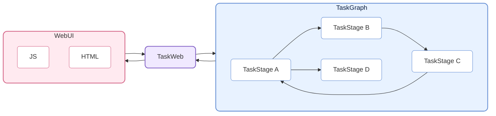
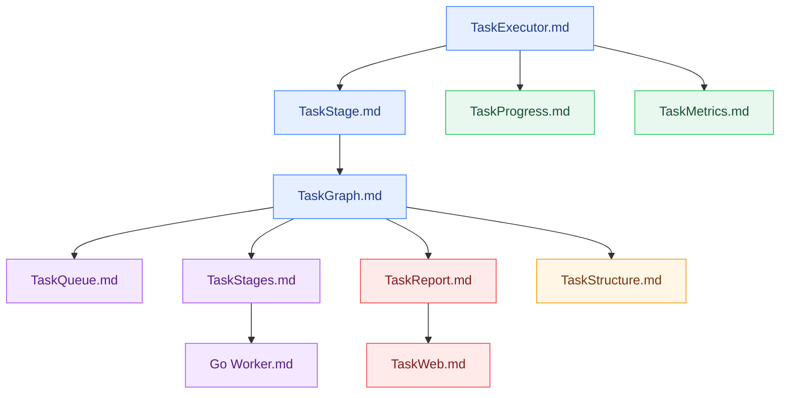

# CelestialFlow — A Lightweight, Parallelizable, Graph-Based Python Task Scheduling Framework

> 📅 Last Updated: 2026/05/15

<p align="center">
  
</p>

<p align="center">
  <a href="https://pypi.org/project/celestialflow/"></a>
  <a href="https://pepy.tech/projects/celestialflow"></a>
  <a href="https://pypi.org/project/celestialflow/"></a>
  <a href="https://pypi.org/project/celestialflow/"></a>
</p>

<p align="center">
  
  
  
  
</p>

<p align="center">
  <a href="README.md">中文</a> | <a href="docs/en/README.md">English</a> | <a href="docs/ja/README.md">日本語</a>
</p>

**CelestialFlow** is a lightweight yet fully-featured task flow framework, suitable for medium/large-scale Python task systems that require **complex dependency relationships**, **flexible execution models**, **cross-device execution**, and **real-time visual monitoring**.

- Lighter and faster to start than Airflow/Dagster
- More structured than multiprocessing/threading, with direct support for complex dependency patterns like loops and complete graphs

The basic unit of the framework is **TaskExecutor**, which can run independently and supports three execution modes:

* **Serial (serial)**
* **Multi-threaded (thread)**
* **Coroutine (async)**

TaskExecutor implements result caching, task deduplication, progress bar display, multi-execution mode comparison, and other features — it is quite useful on its own.

Beyond using TaskExecutor directly, the more important usage is through its subclass **TaskStage**. TaskStages can be connected to each other, forming a task graph (**TaskGraph**) with upstream and downstream dependencies. Downstream stages automatically receive the completed results from upstream stages as input, creating a clear data flow.

TaskStage's task execution modes are the same three as in TaskExecutor.

At the graph level, each Stage supports three context modes:

* **Serial execution (serial layout)**: The current node completes execution before starting the next node (downstream nodes may receive tasks early but won't execute immediately).
* **Thread execution (thread layout)**: The current node starts in an independent thread within the main process, suitable for I/O-intensive tasks and non-picklable functions (e.g., lambdas).
* **Parallel execution (process layout)**: The current node starts and immediately proceeds to start the next node.

TaskGraph can build a complete **Directed Graph structure**, supporting not only traditional Directed Acyclic Graphs (DAG), but also flexibly expressing **Tree**, **Loop**, and even **Complete Graph** forms of task dependencies.

Beyond execution and scheduling, CelestialFlow further introduces the **CelestialTree (abbreviated: ctree) event tracking system**, which records explicit causal relationships for every task and its derived behaviors (success, failure, retry, split, route, etc.). With ctree, you can start from any initial task and fully reconstruct its propagation path and execution trace within the TaskGraph, enabling complete **traceability, analysis, and explanation** of the task system.

On this foundation, CelestialFlow supports Web visual monitoring and can achieve cross-process, cross-device collaboration through Redis; it also introduces Go-based external workers (communicating via Redis) to handle CPU-intensive tasks, compensating for Python's performance bottleneck in such scenarios.

## Project Structure



## Quick Start

Install CelestialFlow:

```bash
# Recommended: use `uv` to manage dependencies and environments
uv pip install celestialflow

# You can also use `pip` directly
pip install celestialflow
```

A simple runnable example:

```python
from celestialflow import TaskStage, TaskGraph

def add(x, y): 
    return x + y

def square(x): 
    return x ** 2

if __name__ == "__main__":
    # Define two task nodes
    stage1 = TaskStage(name="Adder", func=add, execution_mode="thread", unpack_task_args=True, stage_mode="process")
    stage2 = TaskStage(name="Squarer"func=square, execution_mode="thread", stage_mode="process")

    # Build the task graph structure
    graph = TaskGraph()
    graph.set_stages(stages=[stage1, stage2])
    graph.connect([stage1], [stage2])

    # Initialize tasks and start
    graph.start_graph({stage1.get_tag(): [(1, 2), (3, 4), (5, 6)]})
```

Note: Do not run this in a .ipynb notebook.

👉 For the full Quick Start guide, see [Quick Start](https://github.com/Mr-xiaotian/CelestialFlow/blob/main/docs/en/quick_start.md)

## Further Reading

If you want to understand the overall structure and core components of the framework, the following reference documents will be helpful:

- [stage/core_executor.md](https://github.com/Mr-xiaotian/CelestialFlow/blob/main/docs/zh-CN/src/stage/core_executor.md)
- [stage/core_stage.md](https://github.com/Mr-xiaotian/CelestialFlow/blob/main/docs/zh-CN/src/stage/core_stage.md)
- [graph/core_graph.md](https://github.com/Mr-xiaotian/CelestialFlow/blob/main/docs/zh-CN/src/graph/core_graph.md)
- [observability/core_progress.md](https://github.com/Mr-xiaotian/CelestialFlow/blob/main/docs/zh-CN/src/observability/core_progress.md)
- [runtime/core_metrics.md](https://github.com/Mr-xiaotian/CelestialFlow/blob/main/docs/zh-CN/src/runtime/core_metrics.md)
- [runtime/core_queue.md](https://github.com/Mr-xiaotian/CelestialFlow/blob/main/docs/zh-CN/src/runtime/core_queue.md)
- [stage/core_stages.md](https://github.com/Mr-xiaotian/CelestialFlow/blob/main/docs/zh-CN/src/stage/core_stages.md)
- [observability/core_report.md](https://github.com/Mr-xiaotian/CelestialFlow/blob/main/docs/zh-CN/src/observability/core_report.md)
- [graph/core_structure.md](https://github.com/Mr-xiaotian/CelestialFlow/blob/main/docs/zh-CN/src/graph/core_structure.md)
- [web/core_server.md](https://github.com/Mr-xiaotian/CelestialFlow/blob/main/docs/zh-CN/src/web/core_server.md)
- [other/go_worker.md](https://github.com/Mr-xiaotian/CelestialFlow/blob/main/docs/zh-CN/other/go_worker.md)

Recommended reading order:



The following articles can serve as supplementary reading:

- [runtime/util_queue.md](https://github.com/Mr-xiaotian/CelestialFlow/blob/main/docs/zh-CN/src/runtime/util_queue.md)
- [runtime/util_types.md](https://github.com/Mr-xiaotian/CelestialFlow/blob/main/docs/zh-CN/src/runtime/util_types.md)
- [runtime/util_errors.md](https://github.com/Mr-xiaotian/CelestialFlow/blob/main/docs/zh-CN/src/runtime/util_errors.md)
- [persistence/core_fail.md](https://github.com/Mr-xiaotian/CelestialFlow/blob/main/docs/zh-CN/src/persistence/core_fail.md)
- [persistence/core_log.md](https://github.com/Mr-xiaotian/CelestialFlow/blob/main/docs/zh-CN/src/persistence/core_log.md)

If you prefer to understand how the framework works through a complete example, you can refer to this tutorial that builds a project from scratch using TaskGraph:

[📘 Tutorial](https://github.com/Mr-xiaotian/CelestialFlow/blob/main/docs/en/tutorial.md)

If you're interested in the ctree_client introduced in version 3.0.7 and its features, check out this article:

[📚 CelestialTreeClient](https://github.com/Mr-xiaotian/CelestialFlow/blob/main/docs/en/other/ctree_client.md)

You can run more demo code. Here is a record of each demo file and its demo functions:

[🎮 demo/](https://github.com/Mr-xiaotian/CelestialFlow/blob/main/docs/zh-CN/demo/)

If you want to run test code, please review the following documentation first:

[🧪 tests/](https://github.com/Mr-xiaotian/CelestialFlow/blob/main/docs/zh-CN/tests/)

If you want to view benchmark content, the data here served as the basis for some design decisions in the framework:

[⚡ bench/](https://github.com/Mr-xiaotian/CelestialFlow/blob/main/docs/zh-CN/bench/)

## Requirements

**CelestialFlow** is based on Python 3.10+ and depends on the following core components.  
Please ensure your environment can properly install these dependencies (`pip install celestialflow` will install them automatically).

| Dependency        | Description |
| ----------------- | ---- |
| **Python ≥ 3.10**  | Runtime environment, version 3.10 or above recommended |
| **fastapi**       | Web service interface framework (for task visualization and remote control) |
| **uvicorn**       | High-performance ASGI server for FastAPI |
| **requests**      | HTTP client library for task status reporting and remote calls |
| **networkx**      | Task graph (TaskGraph) structure and dependency analysis |
| **jinja2**        | FastAPI template engine for Web visualization interface rendering |
| **tqdm**          | Optional component, progress bar display for task execution visualization |
| **redis**         | Optional component, for distributed task communication (`TaskRedis*` series modules) |
| **celestialtree** | Optional component, for task status reporting and remote calls (`ctree_client`) |

## File Structure

<p align="center">
  
  <br/>
  <em>celestial-flow 3.2.0</em>
</p>

(This view was generated by `inst_file.FileTree.print_tree()` from my other project [CelestialVault](https://github.com/Mr-xiaotian/CelestialVault). The image conversion was done using [Carbon](https://carbon.now.sh).)

## Version Log
- 3.2.0
  - feat:
    - [Important] Completely deprecated `stage_mode="process"`, removed all multiprocessing dependencies (MPValue, MPQueue, multiprocessing.Process);
      - bench_graph_mode data shows that process mode is slower than thread mode in all scenarios, and introduces significant serialization overhead and pickle limitations;
    - [Important] Removed the manually specified `root_stages` parameter from set_stages, replaced by a set of `source_stages` computed via SCC condensation graph
      - Brushed up on quite a bit of graph theory
      - Currently only supports setting refresh interval and history length; more settings can be added later
    - Changed the default log level for graph/stage/executor from `SUCCESS` to `INFO`, meaning only start/stop messages and errors are shown by default
    - Added a configuration button on the web page
  - refactor:
    - Due to removing `process` from stage_mode, parts of the framework designed to accommodate `process` have been deleted or refactored  
      - For example, all MPValue and MPQueue changed to int and Queue
      - No strict bench testing has been done yet, but it should bring some performance improvement
    - Refactored the NetworkX graph construction process; now built directly through nodes and outgoing edges, no longer relying on recursion
    - Compute bytes-type hash in the retry detection mechanism instead of the original string type
      - According to bench_hash_memory, saves approximately 23% memory
    - Moved delta data from node status to be computed by JS on the web side, reducing unnecessary communication data
  - fix:
    - Removed error catching in InQueue.get, which would cause panic-level errors to be missed

For more past logs, see:

[change_log.md](https://github.com/Mr-xiaotian/CelestialFlow/blob/main/docs/en/change_log.md)

## Star History

If you're interested in the project, feel free to star it. If you have questions or suggestions, feel free to submit [Issues](https://github.com/Mr-xiaotian/CelestialFlow/issues) or let me know in [Discussion](https://github.com/Mr-xiaotian/CelestialFlow/discussions).


## License
This project is licensed under the MIT License - see the [LICENSE](LICENSE) file for details.

## Author
Author: Mr-xiaotian
Email: mingxiaomingtian@gmail.com
Project Link: [https://github.com/Mr-xiaotian/CelestialFlow](https://github.com/Mr-xiaotian/CelestialFlow)
