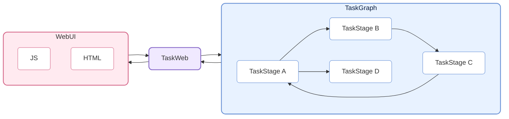
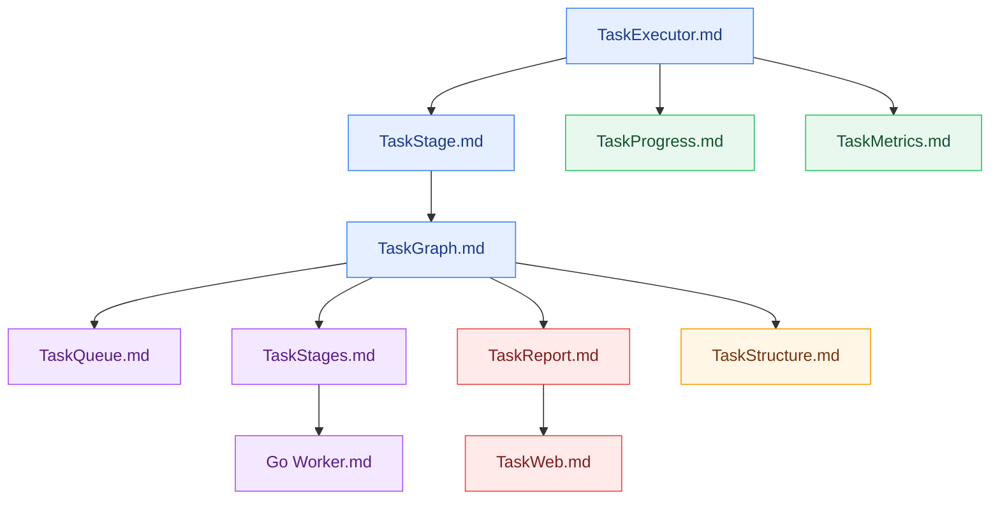

# CelestialFlow — A Lightweight, Parallel, Graph-Based Python Task Scheduling Framework

<p align="center">
  
</p>

<p align="center">
  <a href="https://pypi.org/project/celestialflow/"></a>
  <a href="https://pepy.tech/projects/celestialflow"></a>
  <a href="https://pypi.org/project/celestialflow/"></a>
  <a href="https://pypi.org/project/celestialflow/"></a>
</p>

<p align="center">
  
  
  
  
</p>

<p align="center">
  <a href="https://github.com/Mr-xiaotian/CelestialFlow/blob/main/docs/zh-CN/README.md">中文</a> | <a href="https://github.com/Mr-xiaotian/CelestialFlow/blob/main/docs/en/README.md">English</a> | <a href="https://github.com/Mr-xiaotian/CelestialFlow/blob/main/docs/ja/README.md">日本語</a>
</p>

**CelestialFlow** is a lightweight yet feature-complete task flow framework suitable for medium/large Python task systems requiring **complex dependency relationships**, **flexible execution models**, **cross-device operation**, and **real-time visualization monitoring**.

- Compared to Airflow/Dagster, it is lighter and faster to get started
- Compared to multiprocessing/threading, it is more structured and can directly express complex dependency patterns such as loops and complete graphs

The fundamental unit of the framework is the **TaskExecutor**, which can run independently and supports three execution modes:

* **Linear (serial)**
* **Multi-threaded (thread)**
* **Coroutine (async)**

TaskExecutor implements result caching, task deduplication, progress bar display, multi-execution-mode comparison, and other features, making it quite useful even as a standalone tool.

However, beyond using TaskExecutor directly, the more important usage is through its subclass **TaskStage**. TaskStage nodes can be interconnected to form a task graph (**TaskGraph**) with upstream and downstream dependency relationships. Downstream stages automatically receive the results of upstream execution as input, forming a clear data flow.

TaskStage supports the same three task execution modes as TaskExecutor.

At the graph level, each Stage supports two context modes:

* **Linear execution (serial layout)**: The current node finishes execution before the next node starts (downstream nodes can receive tasks early but will not execute immediately).
* **Thread execution (thread layout)**: The current node starts in an independent thread within the main process, suitable for I/O-intensive tasks and unpicklable functions (such as lambda).

TaskGraph can build complete **directed graph structures**, supporting not only traditional Directed Acyclic Graphs (DAG) but also flexibly expressing **tree**, **loop**, and even **complete graph** forms of task dependencies.

Beyond execution and scheduling, CelestialFlow further introduces the **CelestialTree (abbreviated: ctree) event tracing system**, which records clear causal relationships for every task and its derived behaviors (success, failure, retry, split, route, etc.). With ctree, starting from any initial task, you can fully reconstruct its propagation path and execution trace within the TaskGraph, enabling complete **tracing, analysis, and explanation** of the task system.

On this foundation, CelestialFlow supports Web-based visualization monitoring and can achieve cross-process, cross-device collaboration through Redis. It also introduces a Go-based external worker (communicating via Redis) to handle CPU-intensive tasks, bridging Python's performance bottleneck in such scenarios.

## Project Structure



## Quick Start

Install CelestialFlow:

```bash
# Recommended: use `uv` for dependency and environment management
uv pip install celestialflow

# Or directly use `pip`
pip install celestialflow
```

A simple runnable example:

```python
from celestialflow import TaskStage, TaskGraph

def add(x, y): 
    return x + y

def square(x): 
    return x ** 2

if __name__ == "__main__":
    # Define two task nodes
    stage1 = TaskStage(name="Adder", func=add, stage_mode="thread", execution_mode="thread", unpack_task_args=True)
    stage2 = TaskStage(name="Squarer", func=square, stage_mode="thread", execution_mode="thread")

    # Build the task graph structure
    graph = TaskGraph()
    graph.set_stages(stages=[stage1, stage2])
    graph.connect([stage1], [stage2])

    # Initialize tasks and start
    graph.start_graph({stage1.get_name(): [(1, 2), (3, 4), (5, 6)]})
```

Note: Do not run this in .ipynb files.

👉 For the complete Quick Start, see [Quick Start](https://github.com/Mr-xiaotian/CelestialFlow/blob/main/docs/zh-CN/quick_start.md)

## Further Reading

If you want to understand the overall structure and core components of the framework, the following reference documents will help:

- [stage/core_executor.md](https://github.com/Mr-xiaotian/CelestialFlow/blob/main/docs/zh-CN/src/stage/core_executor.md)
- [stage/core_stage.md](https://github.com/Mr-xiaotian/CelestialFlow/blob/main/docs/zh-CN/src/stage/core_stage.md)
- [graph/core_graph.md](https://github.com/Mr-xiaotian/CelestialFlow/blob/main/docs/zh-CN/src/graph/core_graph.md)
- [observability/core_progress.md](https://github.com/Mr-xiaotian/CelestialFlow/blob/main/docs/zh-CN/src/observability/core_progress.md)
- [runtime/core_metrics.md](https://github.com/Mr-xiaotian/CelestialFlow/blob/main/docs/zh-CN/src/runtime/core_metrics.md)
- [runtime/core_queue.md](https://github.com/Mr-xiaotian/CelestialFlow/blob/main/docs/zh-CN/src/runtime/core_queue.md)
- [stage/core_stages.md](https://github.com/Mr-xiaotian/CelestialFlow/blob/main/docs/zh-CN/src/stage/core_stages.md)
- [observability/core_report.md](https://github.com/Mr-xiaotian/CelestialFlow/blob/main/docs/zh-CN/src/observability/core_report.md)
- [graph/core_structure.md](https://github.com/Mr-xiaotian/CelestialFlow/blob/main/docs/zh-CN/src/graph/core_structure.md)
- [web/core_server.md](https://github.com/Mr-xiaotian/CelestialFlow/blob/main/docs/zh-CN/src/web/core_server.md)
- [other/go_worker.md](https://github.com/Mr-xiaotian/CelestialFlow/blob/main/docs/zh-CN/other/go_worker.md)

Recommended reading order:



The following can serve as supplementary reading:

- [runtime/util_hash.md](https://github.com/Mr-xiaotian/CelestialFlow/blob/main/docs/zh-CN/src/runtime/util_hash.md)
- [runtime/util_types.md](https://github.com/Mr-xiaotian/CelestialFlow/blob/main/docs/zh-CN/src/runtime/util_types.md)
- [runtime/util_errors.md](https://github.com/Mr-xiaotian/CelestialFlow/blob/main/docs/zh-CN/src/runtime/util_errors.md)
- [persistence/core_fail.md](https://github.com/Mr-xiaotian/CelestialFlow/blob/main/docs/zh-CN/src/persistence/core_fail.md)
- [persistence/core_log.md](https://github.com/Mr-xiaotian/CelestialFlow/blob/main/docs/zh-CN/src/persistence/core_log.md)

If you prefer understanding the framework's operation through a complete case study, refer to this tutorial on building a project from scratch using TaskGraph:

[📘Case Tutorial](https://github.com/Mr-xiaotian/CelestialFlow/blob/main/docs/zh-CN/tutorial.md)

If you're interested in the ctree_client and its features introduced in version 3.0.7, check out:

[📚CelestialTreeClient](https://github.com/Mr-xiaotian/CelestialFlow/blob/main/docs/zh-CN/other/ctree_client.md)

You can continue running more demo code. Here are the demo files and their function descriptions:

[🎮demo/](https://github.com/Mr-xiaotian/CelestialFlow/tree/main/docs/zh-CN/demo)

If you want to run the test code, first review the following documentation:

[🧪tests/](https://github.com/Mr-xiaotian/CelestialFlow/tree/main/docs/zh-CN/tests)

If you want to check the bench content, the data here serves as the basis for some design decisions in the framework:

[⚡bench/](https://github.com/Mr-xiaotian/CelestialFlow/tree/main/docs/zh-CN/bench)

## Requirements

**CelestialFlow** is based on Python 3.12+ and depends on the following core components.
Please ensure your environment can properly install these dependencies (`pip install celestialflow` will install them automatically).

| Dependency | Description |
| ----------------- | ---- |
| **Python ≥ 3.12**  | Runtime environment; 3.12 or above recommended |
| **fastapi**       | Web service interface framework (for task visualization and remote control) |
| **uvicorn**       | High-performance ASGI server for FastAPI |
| **requests**      | HTTP client library, used for task status reporting and remote calls |
| **networkx**      | Task graph (TaskGraph) structure and dependency analysis |
| **jinja2**        | FastAPI template engine, used for Web visualization interface rendering |
| **tqdm**          | Optional component, progress bar display for task execution visualization |
| **redis**         | Optional component, used for distributed task communication (`TaskRedis*` series modules) |
| **celestialtree** | Optional component, used for task status reporting and remote calls (`ctree_client`) |

## File Structure

<p align="center">
  
  <br/>
  <em>celestial-flow 3.2.2</em>
</p>

(This view was generated by `inst_file.FileTree.print_tree()` from my other project [CelestialVault](https://github.com/Mr-xiaotian/CelestialVault). Converted to an image with the help of [Carbon](https://carbon.now.sh).)

## Version Log
- 3.2.2
  - feat:
    - Added data locks in `core_server` to prevent error states caused by concurrent access
    - Optimized the frontend settings panel display, now only showing global settings and current-page-related settings
    - Added "Auto Update" option in global settings and "Sort Method" in the error log page to the settings panel
  - refactor:
    - Removed `summary` from frontend-backend communication; the overall expected completion time of nodes is now delivered separately via each node's `status`, with the frontend calculating the overall expected completion time
    - Modified the content of `structure_graph` (formerly `structure_json`), now more concise, avoiding information redundancy and facilitating future extensions
  - fix:
    - Fixed the issue where metric selection in the metrics line chart was not working
    - Modified the execution order of `_refresh_all` in `report.stop` to avoid conflicts with thread refreshes
    - Added defensive check for unterminated threads in `graph._finalize_nodes`
    - Fixed the issue where `start_time` in `stage` was called by `report` before being defined
    - Fixed the issue in `TaskRedisTransport._transport` where `id()` was used to calculate task_id
    - Fixed the panic issue caused by some tasks being unhashable
  - chore:
    - Removed all `type: ignore` comments
      - Looks much cleaner
    - Annotated `start_*` functions as single-call functions in their doc-strings

For more historical logs, see:

[change_log.md](https://github.com/Mr-xiaotian/CelestialFlow/blob/main/docs/zh-CN/change_log.md )

## Star History

If you're interested in the project, a star is welcome. If you have questions or suggestions, feel free to submit [Issues](https://github.com/Mr-xiaotian/CelestialFlow/issues) or let me know in [Discussion](https://github.com/Mr-xiaotian/CelestialFlow/discussions).


## License
This project is licensed under the MIT License - see the [LICENSE](LICENSE) file for details.

## Author
Author: Mr-xiaotian
Email: mingxiaomingtian@gmail.com
Project Link: [https://github.com/Mr-xiaotian/CelestialFlow](https://github.com/Mr-xiaotian/CelestialFlow)
