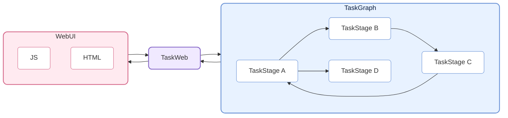
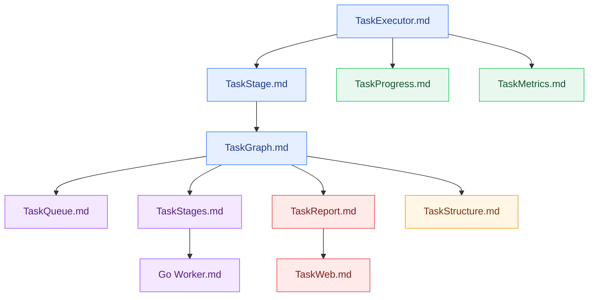

# CelestialFlow — A Lightweight, Parallelizable, Graph-Based Python Task Scheduling Framework

> 📅 Last updated: 2026/04/22

<p align="center">
  
</p>

<p align="center">
  <a href="https://pypi.org/project/celestialflow/"></a>
  <a href="https://pepy.tech/projects/celestialflow"></a>
  <a href="https://pypi.org/project/celestialflow/"></a>
  <a href="https://pypi.org/project/celestialflow/"></a>
</p>

<p align="center">
  
  
  
  
</p>

<p align="center">
  <a href="../../README.md">中文</a> | <a href="README.md">English</a> | <a href="../ja/README.md">日本語</a>
</p>

**CelestialFlow** is a lightweight yet fully-featured task flow framework, designed for medium/large-scale Python task systems that require **complex dependency relationships**, **flexible execution models**, **cross-device execution**, and **real-time visual monitoring**.

- Lighter and faster to get started than Airflow/Dagster
- More structured than raw multiprocessing/threading, with native support for loops, complete graphs, and other complex dependency patterns

The basic unit of the framework is **TaskExecutor**, which can run independently and supports three execution modes:

* **Serial (serial)**
* **Multithreaded (thread)**
* **Coroutine (async)**

TaskExecutor provides result caching, task deduplication, progress bar display, and multi-execution-mode comparison — useful even as a standalone component.

Beyond using TaskExecutor directly, the more important use case is its subclass **TaskStage**. TaskStages can be connected to form a task graph (**TaskGraph**) with upstream and downstream dependencies. Downstream stages automatically receive completed results from upstream stages as input, forming a clear data flow.

TaskStage supports two task execution modes:

* **Serial (serial)**
* **Multithreaded (thread)**

At the graph level, each Stage supports three context modes:

* **Serial layout**: The current node finishes before the next one starts (downstream nodes may receive tasks early but won't execute immediately).
* **Thread layout**: The current node starts in a separate thread within the main process, suitable for I/O-intensive tasks and non-pickleable functions (e.g., lambdas).
* **Process layout**: The current node starts and immediately proceeds to launch the next node.

TaskGraph can build full **Directed Graph** structures, supporting not only traditional DAGs but also **tree**, **loop**, and even **complete graph** dependency patterns.

Beyond execution and scheduling, CelestialFlow introduces the **CelestialTree (ctree) event tracking system**, which records clear causal relationships for every task and its derived behaviors (success, failure, retry, split, route, etc.). With ctree, you can trace the complete propagation path and execution trajectory of any initial task through the TaskGraph, enabling full **traceability, analysis, and explainability**.

On top of this, CelestialFlow supports web-based visual monitoring and cross-process/cross-device collaboration via Redis. It also integrates Go-based external workers (communicating via Redis) for CPU-intensive tasks, compensating for Python's performance limitations in such scenarios.

## Project Structure



## Quick Start

Install CelestialFlow:

```bash
# Recommended: use `uv` for dependency and environment management
uv pip install celestialflow

# Or use `pip` directly
pip install celestialflow
```

A simple runnable example:

```python
from celestialflow import TaskStage, TaskGraph

def add(x, y): 
    return x + y

def square(x): 
    return x ** 2

if __name__ == "__main__":
    # Define two task nodes
    stage1 = TaskStage(add, execution_mode="thread", unpack_task_args=True)
    stage2 = TaskStage(square, execution_mode="thread")

    # Build the task graph
    stage1 = TaskStage(add, execution_mode="thread", unpack_task_args=True, stage_mode="process", name="Adder")
    stage2 = TaskStage(square, execution_mode="thread", stage_mode="process", name="Squarer")

    graph = TaskGraph()
    graph.set_stages(root_stages=[stage1], stages=[stage2])
    graph.connect([stage1], [stage2])

    # Initialize tasks and start
    graph.start_graph({stage1.get_tag(): [(1, 2), (3, 4), (5, 6)]})
```

Note: Do not run in .ipynb notebooks.

👉 For the full Quick Start guide, see [Quick Start](https://github.com/Mr-xiaotian/CelestialFlow/blob/main/docs/en/quick_start.md)

## Further Reading

If you want to understand the overall architecture and core components, the following reference documents will help:

- [stage/core_executor.md](https://github.com/Mr-xiaotian/CelestialFlow/blob/main/docs/en/src/stage/core_executor.md)
- [stage/core_stage.md](https://github.com/Mr-xiaotian/CelestialFlow/blob/main/docs/en/src/stage/core_stage.md)
- [graph/core_graph.md](https://github.com/Mr-xiaotian/CelestialFlow/blob/main/docs/en/src/graph/core_graph.md)
- [observability/core_progress.md](https://github.com/Mr-xiaotian/CelestialFlow/blob/main/docs/en/src/observability/core_progress.md)
- [runtime/core_metrics.md](https://github.com/Mr-xiaotian/CelestialFlow/blob/main/docs/en/src/runtime/core_metrics.md)
- [runtime/core_queue.md](https://github.com/Mr-xiaotian/CelestialFlow/blob/main/docs/en/src/runtime/core_queue.md)
- [stage/core_stages.md](https://github.com/Mr-xiaotian/CelestialFlow/blob/main/docs/en/src/stage/core_stages.md)
- [observability/core_report.md](https://github.com/Mr-xiaotian/CelestialFlow/blob/main/docs/en/src/observability/core_report.md)
- [graph/core_structure.md](https://github.com/Mr-xiaotian/CelestialFlow/blob/main/docs/en/src/graph/core_structure.md)
- [web/core_server.md](https://github.com/Mr-xiaotian/CelestialFlow/blob/main/docs/en/src/web/core_server.md)
- [other/go_worker.md](https://github.com/Mr-xiaotian/CelestialFlow/blob/main/docs/en/other/go_worker.md)

Recommended reading order:



The following can serve as supplementary reading:

- [runtime/util_queue.md](https://github.com/Mr-xiaotian/CelestialFlow/blob/main/docs/en/src/runtime/util_queue.md)
- [runtime/util_types.md](https://github.com/Mr-xiaotian/CelestialFlow/blob/main/docs/en/src/runtime/util_types.md)
- [runtime/util_errors.md](https://github.com/Mr-xiaotian/CelestialFlow/blob/main/docs/en/src/runtime/util_errors.md)
- [persistence/core_fail.md](https://github.com/Mr-xiaotian/CelestialFlow/blob/main/docs/en/src/persistence/core_fail.md)
- [persistence/core_log.md](https://github.com/Mr-xiaotian/CelestialFlow/blob/main/docs/en/src/persistence/core_log.md)

If you prefer learning through complete examples, check out this tutorial on building a project from scratch with TaskGraph:

[📘 Tutorial](https://github.com/Mr-xiaotian/CelestialFlow/blob/main/docs/en/tutorial.md)

If you're interested in the ctree_client introduced in version 3.0.7 and its features:

[📚 CelestialTreeClient](https://github.com/Mr-xiaotian/CelestialFlow/blob/main/docs/en/other/ctree_client.md)

You can run more demo code — here are the demo files and their function descriptions:

[🎮 demo/](https://github.com/Mr-xiaotian/CelestialFlow/blob/main/docs/en/demo/)

If you want to run test code, check out the following documentation first:

[🧪 tests/](https://github.com/Mr-xiaotian/CelestialFlow/blob/main/docs/en/tests/)

If you want to view benchmark results — this data serves as the basis for some design decisions in the framework:

[⚡ bench/](https://github.com/Mr-xiaotian/CelestialFlow/blob/main/docs/en/bench/)

## Requirements

**CelestialFlow** is based on Python 3.10+ and depends on the following core components.  
Make sure your environment can install these dependencies (`pip install celestialflow` will install them automatically).

| Dependency         | Description |
| ------------------ | ----------- |
| **Python ≥ 3.10**  | Runtime environment, version 3.10 or higher recommended |
| **tqdm**           | Console progress bar for task execution visualization |
| **fastapi**        | Web service framework (for task visualization and remote control) |
| **uvicorn**        | High-performance ASGI server for FastAPI |
| **requests**       | HTTP client library for task status reporting and remote calls |
| **networkx**       | Task graph (TaskGraph) structure and dependency analysis |
| **jinja2**         | FastAPI template engine for web visualization rendering |
| **redis**          | Optional, for distributed task communication (`TaskRedis*` modules) |
| **celestialtree**  | Optional, for task status reporting and remote calls (`ctree_client`) |

## File Structure

<p align="center">
  
  <br/>
  <em>celestial-flow 3.1.8</em>
</p>

(This view is generated by `inst_file.FileTree.print_tree()` from my other project [CelestialVault](https://github.com/Mr-xiaotian/CelestialVault). Image conversion is done via [Carbon](https://carbon.now.sh).)

## Version Log
- 3.1.8
  - feat:
    - [Important] Added "thread" mode for stage_mode, suitable for I/O-intensive tasks and non-pickleable functions;
    - Added pytest-asyncio support, async tests now run properly;
    - Added docs/bench and docs/demo documentation with benchmark results;
    - Added test files under tests/, replacing the old tests/README.md;
  - refactor:
    - [Important] Made connect a built-in method, added set_stages, and register root_stage there;
    - [Important] Added StageRuntime, separating stage runtime logic;
    - Replaced next_stages and prev_stages with in_edges and out_edges;
    - Removed stage.set_stage_context, replaced with graph.connect;
    - Renamed run_in_* to dispatch_*;
    - Removed termination_signal reput mechanism in TaskDispatch;
    - Split collect_runtime_snapshot into _snapshot_one_stage and _calc_graph_remain;
    - Added get_binding_counter, replacing isinstance checks in prev_bindings;
    - Added _prepare_task_envelopes, compressing _put_task_queues logic;
    - Renamed successed to succeeded; changed type_ to CTreeEvent in ctree.emit;
  - fix:
    - Fixed find_unpickleable false positive for bound methods;
    - Fixed stage duplicate detection error;
    - Fixed retry tasks not being deduplicated;
  - chore:
    - Renamed all test_ function names to demo_ in demo/;
    - Reorganized docs structure, renamed reference to src, moved some docs to zh-CN/;

For more historical logs:

[change_log.md](https://github.com/Mr-xiaotian/CelestialFlow/blob/main/docs/en/change_log.md)

## Star History

If you find this project interesting, feel free to star it. If you have questions or suggestions, please submit an [Issue](https://github.com/Mr-xiaotian/CelestialFlow/issues) or let me know in [Discussions](https://github.com/Mr-xiaotian/CelestialFlow/discussions).


## License
This project is licensed under the MIT License - see the [LICENSE](../../LICENSE) file for details.

## Author
Author: Mr-xiaotian
Email: mingxiaomingtian@gmail.com
Project Link: [https://github.com/Mr-xiaotian/CelestialFlow](https://github.com/Mr-xiaotian/CelestialFlow)
