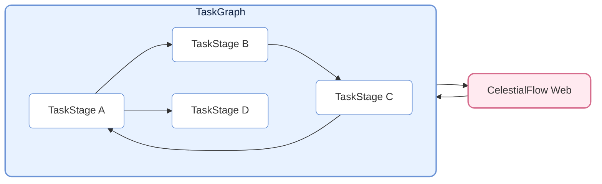
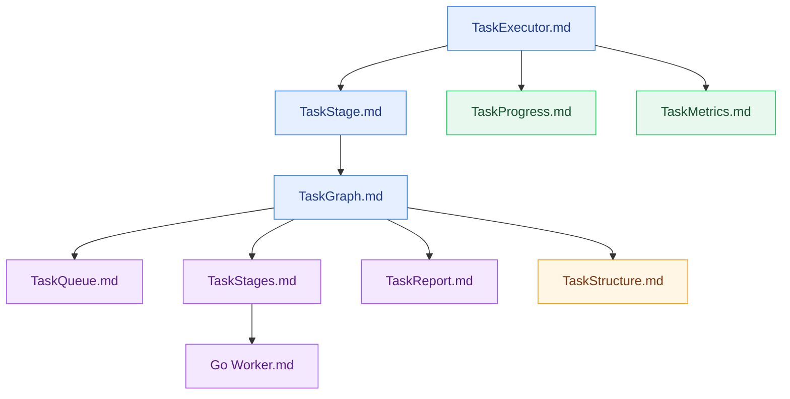

# CelestialFlow — A Lightweight, Parallel, Graph-Based Python Task Scheduling Framework

<p align="center">
  
</p>

<p align="center">
  <a href="https://pypi.org/project/celestialflow/"></a>
  <a href="https://pepy.tech/projects/celestialflow"></a>
  <a href="https://pypi.org/project/celestialflow/"></a>
  <a href="https://pypi.org/project/celestialflow/"></a>
</p>

<p align="center">
  
  
  
</p>

<p align="center">
  <a href="https://github.com/Mr-xiaotian/CelestialFlow/blob/main/README.md">中文</a> | <a href="https://github.com/Mr-xiaotian/CelestialFlow/blob/main/docs/en/README.md">English</a> | <a href="https://github.com/Mr-xiaotian/CelestialFlow/blob/main/docs/ja/README.md">日本語</a>
</p>

**CelestialFlow** is a lightweight yet fully-featured task flow framework, suitable for medium-to-large Python task systems that require **complex dependencies**, **flexible execution models**, **cross-device execution**, and **observable execution traces**.

- Lighter and quicker to start than Airflow/Dagster
- More structured than multiprocessing/threading, capable of directly expressing complex dependency patterns such as loops and complete graphs

The basic unit of the framework is the **TaskExecutor**, which can run independently and supports three execution modes:

* **Serial**
* **Multi-threaded (thread)**
* **Coroutine (async)**

TaskExecutor implements result caching, task deduplication, progress bar display, multi-mode execution comparison, and more — it works well even when used standalone.

Beyond directly using TaskExecutor, the more important abstraction is its subclass **TaskStage**. TaskStage instances can be connected to each other, forming a task graph (**TaskGraph**) with upstream and downstream dependencies. A downstream stage automatically receives the completed results from its upstream stage as input, creating a clear data flow.

TaskStage supports the same three execution modes as TaskExecutor.

At the graph level, each Stage supports two context modes:

* **Serial execution (serial layout)**: The current node finishes before the next node starts (downstream nodes may receive tasks early but will not execute immediately).
* **Threaded execution (thread layout)**: The current node runs in an independent thread within the main process, suitable for I/O-intensive tasks and functions that cannot be pickled (such as lambda).

TaskGraph can construct a full **directed graph structure**, supporting not only traditional directed acyclic graphs (DAG), but also flexibly expressing **tree**, **loop**, and even **complete graph** task dependencies.

Beyond execution and scheduling, CelestialFlow further introduces the **CelestialTree (ctree) event tracing system**, which records explicit causal relationships for each task and its derivative behaviors (success, failure, retry, split, routing, etc.). With ctree, you can start from any initial task and fully reconstruct its propagation path and execution trace within the TaskGraph, enabling complete **tracing, analysis, and interpretation** of the task system.

On this foundation, CelestialFlow provides event tracing, status reporting, persistent replay, and a Redis-based demo along with a Go Worker external collaboration example, demonstrating how to build cross-process, cross-device task collaboration on demand.

## 项目结构（Project Structure）



## 快速开始（Quick Start）

Install CelestialFlow:

```bash
# It is recommended to use `uv` for dependency and environment management
uv pip install celestialflow

# However, you can also use `pip` directly
pip install celestialflow
```

If you only need CelestialFlow's core scheduling, observability, and persistence capabilities, the above installation is sufficient.

If you also need to enable CelestialTree event tracing, you must **additionally install** `celestialtree`:

```bash
# For published package users
uv pip install celestialtree

# If you are a developer/contributor after cloning the repository
uv sync --group dev
```

A simple runnable example:

```python
from celestialflow import TaskStage, TaskGraph

def add(x, y): 
    return x + y

def square(x): 
    return x ** 2

if __name__ == "__main__":
    # Define two task nodes
    stage1 = TaskStage(name="Adder", func=add, stage_mode="thread", execution_mode="thread", unpack_task_args=True)
    stage2 = TaskStage(name="Squarer", func=square, stage_mode="thread", execution_mode="thread")

    # Build the task graph structure
    graph = TaskGraph(name="DemoGraph")
    graph.set_stages(stages=[stage1, stage2])
    graph.connect([stage1], [stage2])

    # Initialize tasks and start
    graph.start_graph({stage1.get_name(): [(1, 2), (3, 4), (5, 6)]})
```

Note: Do not run in a `.ipynb` file.

👉 To see the full Quick Start, please refer to [Quick Start](https://github.com/Mr-xiaotian/CelestialFlow/blob/main/docs/zh-CN/quick_start.md)

## 深入阅读（Further Reading）

If you want to understand the overall architecture and core components of the framework, the following reference documents will help:

- [TaskExecutor.md](https://github.com/Mr-xiaotian/CelestialFlow/blob/main/docs/zh-CN/src/stage/core_executor.md)
- [TaskStage.md](https://github.com/Mr-xiaotian/CelestialFlow/blob/main/docs/zh-CN/src/stage/core_stage.md)
- [TaskGraph.md](https://github.com/Mr-xiaotian/CelestialFlow/blob/main/docs/zh-CN/src/graph/core_graph.md)
- [TaskProgress.md](https://github.com/Mr-xiaotian/CelestialFlow/blob/main/docs/zh-CN/src/observability/core_progress.md)
- [TaskMetrics.md](https://github.com/Mr-xiaotian/CelestialFlow/blob/main/docs/zh-CN/src/runtime/core_metrics.md)
- [TaskQueue.md](https://github.com/Mr-xiaotian/CelestialFlow/blob/main/docs/zh-CN/src/runtime/core_queue.md)
- [TaskStages.md](https://github.com/Mr-xiaotian/CelestialFlow/blob/main/docs/zh-CN/src/stage/core_stages.md)
- [TaskReport.md](https://github.com/Mr-xiaotian/CelestialFlow/blob/main/docs/zh-CN/src/observability/core_report.md)
- [TaskStructure.md](https://github.com/Mr-xiaotian/CelestialFlow/blob/main/docs/zh-CN/src/graph/core_structure.md)
- [Go Worker.md](https://github.com/Mr-xiaotian/CelestialFlow/blob/main/docs/zh-CN/other/go_worker.md)

Recommended reading order:



The following five can serve as supplementary reading:

- [UtilHash.md](https://github.com/Mr-xiaotian/CelestialFlow/blob/main/docs/zh-CN/src/runtime/util_hash.md)
- [UtilTypes.md](https://github.com/Mr-xiaotian/CelestialFlow/blob/main/docs/zh-CN/src/runtime/util_types.md)
- [UtilErrors.md](https://github.com/Mr-xiaotian/CelestialFlow/blob/main/docs/zh-CN/src/runtime/util_errors.md)
- [Fallback.md](https://github.com/Mr-xiaotian/CelestialFlow/blob/main/docs/zh-CN/src/persistence/core_fallback.md)
- [Log.md](https://github.com/Mr-xiaotian/CelestialFlow/blob/main/docs/zh-CN/src/persistence/core_log.md)

If you prefer to understand the framework's operation through a complete case study, refer to this tutorial on building a project from scratch with TaskGraph:

[📘 Case Tutorial](https://github.com/Mr-xiaotian/CelestialFlow/blob/main/docs/zh-CN/tutorial.md)

If you're interested in the `ctree_client` and its functionality added in version 3.0.7, take a look at this article:

[📚 CelestialTreeClient](https://github.com/Mr-xiaotian/CelestialFlow/blob/main/docs/zh-CN/other/ctree_client.md)

You can continue running more demo code. Here is a record of each demo file and descriptions of the demo functions within:

[🎮 demo/ Overview](https://github.com/Mr-xiaotian/CelestialFlow/blob/main/docs/zh-CN/demo/README.md)

If you want to run test code, you can first review the following documentation:

[🧪 tests/ Overview](https://github.com/Mr-xiaotian/CelestialFlow/blob/main/docs/zh-CN/tests/README.md)

If you want to view bench content, this data also serves as the basis for some of the framework's design decisions:

[⚡ bench/ Overview](https://github.com/Mr-xiaotian/CelestialFlow/blob/main/docs/zh-CN/bench/README.md)

## 环境要求（Requirements）

**CelestialFlow** is based on Python 3.12+. The default runtime depends on the following core components.
Note that `celestialtree` is no longer a default runtime dependency; it is an optional component installed separately.

| Dependency        | Description |
| ----------------- | ----------- |
| **Python ≥ 3.12** | Runtime environment; version 3.12 or above is recommended |
| **requests**      | HTTP client library, used for task status reporting and remote calls |
| **tqdm**          | Optional component; progress bar display for task execution visualization |

- To run `demo/demo_redis.py` or the Go Worker example, please additionally install `redis` and prepare a Redis service; this is not part of the default runtime dependencies.

- To run demos / benches / trace queries that depend on CelestialTree, please additionally install `celestialtree`, or execute `uv sync --group dev` directly in the source repository.

- To use the visual web service, please additionally install `celestialflow-web` and run `celestialflow-web --host 0.0.0.0 --port 5000`.

## 文件结构（File Structure）

<p align="center">
  
  <br/>
  <em>celestial-flow 3.2.6</em>
</p>

(This view was generated by `inst_file.FileTree.print_tree()` from my other project [CelestialVault](https://github.com/Mr-xiaotian/CelestialVault). Conversion to an image was done with [Carbon](https://carbon.now.sh).)

## 版本日志（Version Log）
- 3.2.6
  - feat:
    - Added methods in `graph` and `stage` to directly read a db file and retry/continue tasks
      - Respectively: `start_graph_db` and `start_db`
  - refactor:
    - **[IMPORTANT]** Moved the web component to a separate project [celestialflow-web](https://github.com/Mr-xiaotian/celestialflow-web)
      - A decision long considered; the current web-side code diverges significantly from the overall project style and is no longer suitable to remain merged together
      - This of course means the `celestialflow-web` command is no longer valid in the current project; it requires a separate installation via `pip install celestialflow-web`
  - chore:
    - Fully updated documentation and translated it into two additional languages: en/ja
    - Removed `README.md` under docs/zh-CN; now the Chinese readme is kept only as this one in the root directory

For more past logs, see:

[change_log.md](https://github.com/Mr-xiaotian/CelestialFlow/blob/main/docs/zh-CN/change_log.md)

## Star 历史趋势（Star History）

If you are interested in the project, a star is welcome. If you have questions or suggestions, feel free to submit [Issues](https://github.com/Mr-xiaotian/CelestialFlow/issues) or let me know in [Discussions](https://github.com/Mr-xiaotian/CelestialFlow/discussions).


## 许可（License）
This project is licensed under the MIT License - see the [LICENSE](https://github.com/Mr-xiaotian/CelestialFlow/blob/main/LICENSE) file for details.

## 作者（Author）
Author: Mr-xiaotian
Email: mingxiaomingtian@gmail.com
Project Link: [https://github.com/Mr-xiaotian/CelestialFlow](https://github.com/Mr-xiaotian/CelestialFlow)
