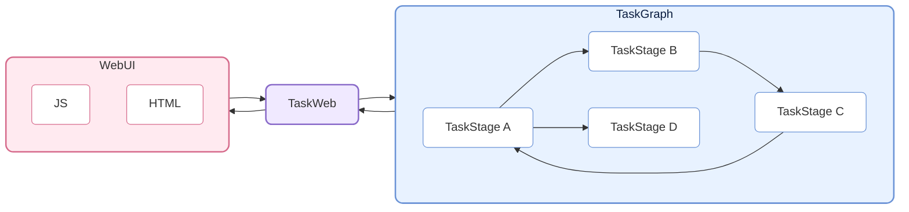
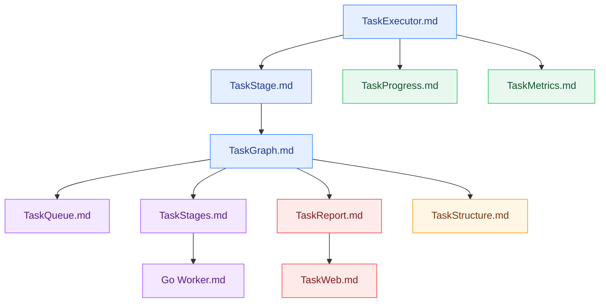

# CelestialFlow — A Lightweight, Parallel, Graph-Based Python Task Scheduling Framework

<p align="center">
  
</p>

<p align="center">
  <a href="https://pypi.org/project/celestialflow/"></a>
  <a href="https://pepy.tech/projects/celestialflow"></a>
  <a href="https://pypi.org/project/celestialflow/"></a>
  <a href="https://pypi.org/project/celestialflow/"></a>
</p>

<p align="center">
  
  
  
  
</p>

<p align="center">
  <a href="https://github.com/Mr-xiaotian/CelestialFlow/blob/main/docs/zh-CN/README.md">中文</a> | <a href="https://github.com/Mr-xiaotian/CelestialFlow/blob/main/docs/en/README.md">English</a> | <a href="https://github.com/Mr-xiaotian/CelestialFlow/blob/main/docs/ja/README.md">日本語</a>
</p>

**CelestialFlow** is a lightweight yet fully-featured task flow framework, suitable for medium/large Python task systems that require **complex dependency relationships**, **flexible execution models**, **cross-device operation**, and **real-time visualization monitoring**.

- Lighter and faster to get started than Airflow/Dagster
- More structured than multiprocessing/threading; can directly express complex dependency patterns such as loops and complete graphs

The basic unit of the framework is the **TaskExecutor**, which can run independently and supports three execution modes:

* **Linear (serial)**
* **Multi-threaded (thread)**
* **Coroutine (async)**

TaskExecutor implements result caching, task deduplication, progress bar display, multi-execution-mode comparison, and other features, making it quite useful even when used standalone.

However, beyond using TaskExecutor directly, the more important usage is through its subclass **TaskStage**. TaskStage nodes can be interconnected to form a task graph (**TaskGraph**) with upstream and downstream dependency relationships. Downstream stages automatically receive the results of upstream execution as input, forming a clear data flow.

TaskStage also supports the same three task execution modes as TaskExecutor.

At the graph level, each Stage supports two context modes:

* **Linear execution (serial layout)**: The current node finishes execution before the next node starts (downstream nodes can receive tasks early but will not execute immediately).
* **Thread execution (thread layout)**: The current node starts in an independent thread within the main process, suitable for I/O-intensive tasks and unpicklable functions (such as lambda).

TaskGraph can build complete **directed graph structures**, supporting not only traditional Directed Acyclic Graphs (DAG) but also flexibly expressing **tree**, **loop**, and even **complete graph** forms of task dependencies.

Beyond execution and scheduling, CelestialFlow further introduces the **CelestialTree (abbreviated: ctree) event tracing system**, which records clear causal relationships for every task and its derived behaviors (success, failure, retry, split, route, etc.). With ctree, starting from any initial task, you can fully reconstruct its propagation path and execution trace within the TaskGraph, enabling complete **tracing, analysis, and explanation** of the task system.

On this foundation, CelestialFlow supports Web-based visualization monitoring and provides Redis-based demos and Go Worker external collaboration examples to demonstrate how to build cross-process, cross-device task collaboration on demand.

## Project Structure



## Quick Start

Install CelestialFlow:

```bash
# Recommended: use `uv` for dependency and environment management
uv pip install celestialflow

# Or directly use `pip`
pip install celestialflow
```

If you only use CelestialFlow's core scheduling, Web, persistence, and regular features outside of demo/test, the above installation is sufficient.

If you also need to enable CelestialTree event tracing, you need to **additionally install** `celestialtree`:

```bash
# For published package users
uv pip install celestialtree

# If you are a developer/contributor after cloning the repository
uv sync --group dev
```

A simple runnable example:

```python
from celestialflow import TaskStage, TaskGraph

def add(x, y): 
    return x + y

def square(x): 
    return x ** 2

if __name__ == "__main__":
    # Define two task nodes
    stage1 = TaskStage(name="Adder", func=add, stage_mode="thread", execution_mode="thread", unpack_task_args=True)
    stage2 = TaskStage(name="Squarer", func=square, stage_mode="thread", execution_mode="thread")

    # Build the task graph structure
    graph = TaskGraph()
    graph.set_stages(stages=[stage1, stage2])
    graph.connect([stage1], [stage2])

    # Initialize tasks and start
    graph.start_graph({stage1.get_name(): [(1, 2), (3, 4), (5, 6)]})
```

Note: Do not run this in .ipynb files.

👉 For the complete Quick Start, see [Quick Start](https://github.com/Mr-xiaotian/CelestialFlow/blob/main/docs/zh-CN/quick_start.md)

## Further Reading

If you want to understand the overall structure and core components of the framework, the following reference documents will help:

- [stage/core_executor.md](https://github.com/Mr-xiaotian/CelestialFlow/blob/main/docs/zh-CN/src/stage/core_executor.md)
- [stage/core_stage.md](https://github.com/Mr-xiaotian/CelestialFlow/blob/main/docs/zh-CN/src/stage/core_stage.md)
- [graph/core_graph.md](https://github.com/Mr-xiaotian/CelestialFlow/blob/main/docs/zh-CN/src/graph/core_graph.md)
- [observability/core_progress.md](https://github.com/Mr-xiaotian/CelestialFlow/blob/main/docs/zh-CN/src/observability/core_progress.md)
- [runtime/core_metrics.md](https://github.com/Mr-xiaotian/CelestialFlow/blob/main/docs/zh-CN/src/runtime/core_metrics.md)
- [runtime/core_queue.md](https://github.com/Mr-xiaotian/CelestialFlow/blob/main/docs/zh-CN/src/runtime/core_queue.md)
- [stage/core_stages.md](https://github.com/Mr-xiaotian/CelestialFlow/blob/main/docs/zh-CN/src/stage/core_stages.md)
- [observability/core_report.md](https://github.com/Mr-xiaotian/CelestialFlow/blob/main/docs/zh-CN/src/observability/core_report.md)
- [graph/core_structure.md](https://github.com/Mr-xiaotian/CelestialFlow/blob/main/docs/zh-CN/src/graph/core_structure.md)
- [web/core_server.md](https://github.com/Mr-xiaotian/CelestialFlow/blob/main/docs/zh-CN/src/web/core_server.md)
- [other/go_worker.md](https://github.com/Mr-xiaotian/CelestialFlow/blob/main/docs/zh-CN/other/go_worker.md)

Recommended reading order:



The following can serve as supplementary reading:

- [runtime/util_hash.md](https://github.com/Mr-xiaotian/CelestialFlow/blob/main/docs/zh-CN/src/runtime/util_hash.md)
- [runtime/util_types.md](https://github.com/Mr-xiaotian/CelestialFlow/blob/main/docs/zh-CN/src/runtime/util_types.md)
- [runtime/util_errors.md](https://github.com/Mr-xiaotian/CelestialFlow/blob/main/docs/zh-CN/src/runtime/util_errors.md)
- [persistence/core_fallback.md](https://github.com/Mr-xiaotian/CelestialFlow/blob/main/docs/zh-CN/src/persistence/core_fallback.md)
- [persistence/core_log.md](https://github.com/Mr-xiaotian/CelestialFlow/blob/main/docs/zh-CN/src/persistence/core_log.md)

If you prefer understanding the framework's operation through a complete case study, refer to this tutorial on building a project from scratch using TaskGraph:

[📘 Case Tutorial](https://github.com/Mr-xiaotian/CelestialFlow/blob/main/docs/zh-CN/tutorial.md)

If you're interested in the `ctree_client` and its features introduced in version 3.0.7, check out:

[📚 CelestialTreeClient](https://github.com/Mr-xiaotian/CelestialFlow/blob/main/docs/zh-CN/other/ctree_client.md)

You can continue running more demo code. Here is a record of each demo file and the demo functions it contains:

[🎮 demo/ Overview](https://github.com/Mr-xiaotian/CelestialFlow/blob/main/docs/zh-CN/demo/README.md)

If you want to run the test code, first review the following documentation:

[🧪 tests/ Overview](https://github.com/Mr-xiaotian/CelestialFlow/blob/main/docs/zh-CN/tests/README.md)

If you want to check the bench content, this data is also the basis for some design decisions in the framework:

[⚡ bench/ Overview](https://github.com/Mr-xiaotian/CelestialFlow/blob/main/docs/zh-CN/bench/README.md)

## Requirements

**CelestialFlow** is based on Python 3.12+ and depends on the following core components at runtime.
`celestialtree` is no longer a default runtime dependency, but an optional component installed additionally.

| Dependency | Description |
| ----------------- | ---- |
| **Python ≥ 3.12**  | Runtime environment; 3.12 or above recommended |
| **fastapi**       | Web service interface framework (for task visualization and remote control) |
| **uvicorn**       | High-performance ASGI server for FastAPI |
| **requests**      | HTTP client library, used for task status reporting and remote calls |
| **jinja2**        | FastAPI template engine, used for Web visualization interface rendering |
| **tqdm**          | Optional component, progress bar display for task execution visualization |

To run `demo/demo_redis.py` or the Go Worker example, please additionally install `redis` and prepare a Redis service; this is not part of the default runtime dependency.

To run demos/benches/tracing queries that depend on CelestialTree, please additionally install `celestialtree`, or directly execute `uv sync --group dev` in the source repository.

## File Structure

<p align="center">
  
  <br/>
  <em>celestial-flow 3.2.4</em>
</p>

(This view was generated by `inst_file.FileTree.print_tree()` from my other project [CelestialVault](https://github.com/Mr-xiaotian/CelestialVault). Converted to an image with the help of [Carbon](https://carbon.now.sh).)

## Version Log
- 3.2.4
  - feat:
    - **[IMPORTANT]** Merged the original `fail_funnel` and `success_funnel` mechanisms into `fallback`, using `sqlite` for storage
      - The original JSONL-based failure persistence mechanism was very convenient for storage, but reading required loading everything into memory each time for retrieval, which was troublesome. I considered using a database service like `redis`, but didn't want to start another third-party service. Then I accidentally discovered that `sqlite` perfectly meets all my requirements
      - Long live Richard!
      - As for the original `success_funnel` mechanism, it was a half-finished product: only usable in `executor`, not in `stage`, and stored entirely in memory. So I took this opportunity to refactor it as well, merging it into `fallback_funnel`
      - Now `fallback_funnel` inserts/updates/deletes corresponding records in sqlite when tasks are `injected/duplicated/retried/failed/succeeded`
      - By default, records are deleted when tasks succeed, but if the `persist_result` option in `executor` is enabled, the record is kept and the `status` field is updated to `success`
    - **[IMPORTANT]** Removed the three redis nodes from `stages` and added demo files explaining how to build related nodes yourself
      - Compared to `TaskSplitter` and `TaskRouter`, these three nodes were dispensable and introduced an extra `redis` dependency
    - **[IMPORTANT]** `celestialtree` is no longer a dependency library. The current event declaration mechanism is based on a set of proto interfaces and uses a local ultra-simplified implementation by default
      - This was also to avoid too many library dependencies. The `celestialtree` library includes dependencies on `grpcio` and `protobuf`, and their support for Python free-threading is not very good. With them present, `celestialflow` could not run under the free-threading version — which I very much look forward to
      - According to `bench_gil_vs_nogil`, under the free-threading version, `executor` gets a 5.25x improvement on CPU-intensive tasks, while `graph` gets a 7.55x improvement on CPU-intensive tasks. Very encouraging
    - Added "Global Waiting Queue" to the frontend "Node Metrics Trend" card
    - Added `start_graph_db` method to `graph`, which accepts a fallback database path and performs `start_graph` based on the failure data inside; added `start_db` method to `executor`, which accepts a fallback database path and performs `start` based on the failure data inside
      - Very convenient
  - refactor:
    - **[IMPORTANT]** Changed server-side error data storage from native Python lists to a temporary sqlite database
      - Under the hammer effect, I want to try more sqlite usage
    - Added a `graph_id` based on `name` and `time.time()` to each `graph` as a uniqueness identifier
    - Rewrote reporter and server-side interaction logic
      - Now each refresh round starts with state alignment. Through `graph_id`, both sides determine whether their data comes from the same `graph` object; if so, structure/analysis data does not need to be pushed repeatedly
      - During state alignment, if both sides have the same graph, the server returns the largest `event_id` value it holds among error data. After strict verification, `event_id` strictly increases in the database
      - Merged reporter's original `push_error_meta` and `push_error_content`; now each refresh only sends newly added error data, and new data is filtered based on the maximum `event_id` returned by the server and the maximum `event_id` in the local database
    - Bound more responsibilities to `graph.connect` and `graph_set_stage`
      - Now synchronization of nodes and `graph` on `ctree` and `reporter` is completed in `graph_set_stage`
      - And binding of upstream/downstream `task_queue` and `result_queue`, as well as binding of `counter`, are all completed in `graph.connect`
    - Removed irrelevant data from `TaskEnvelope`, keeping only `task`, `hash`, and `id`
      - The `source` field should not have been added; it never played a role
      - The `prev` field served the original `success_funnel` and is no longer needed
    - `TaskMetrics` now fixedly uses `Lock` to qualify all `counter`s, regardless of `executor`'s `execution_mode`
      - This fixed pattern sacrifices some performance but makes the code more stable
      - According to `bench_lock_overhead`, this makes `counter` about 3.2x slower, but considering all `counter` updates are based on `int` types and already fast, this is acceptable
    - Removed an existing `task.success` declaration in `process_task_success`; now a `task.input` declaration is made before `result_envelope` enters `result_queue`
      - To ensure the `event_id` in the fallback sqlite is globally unified
    - `executor.get_fail_pairs` (formerly `executor.get_error_pairs`) returns `tuple[T, PersistedError]`
      - `PersistedError` consists of the recorded `error_type` and `error_message`
    - Rewrote `TaskRouter` node; now a `router` function must be passed to specify the routing direction of tasks
    - Removed some useless methods
      - Such as `TaskGraph.get_stage_input_trace`
  - fix:
    - The structure graph on the frontend dashboard page no longer displays blank when switching tabs
      - This was a very old bug; I don't know why I didn't fix it sooner
  - chore:
    - Added more demos
    - Added more benchmarks
    - Added `Agents.md` file
      - I'm tired of endlessly emphasizing things to AI

For more historical logs, see:

[change_log.md](https://github.com/Mr-xiaotian/CelestialFlow/blob/main/docs/zh-CN/change_log.md)

## Star History

If you're interested in the project, a star is welcome. If you have questions or suggestions, feel free to submit [Issues](https://github.com/Mr-xiaotian/CelestialFlow/issues) or let me know in [Discussion](https://github.com/Mr-xiaotian/CelestialFlow/discussions).


## License
This project is licensed under the MIT License - see the [LICENSE](https://github.com/Mr-xiaotian/CelestialFlow/blob/main/LICENSE) file for details.

## Author
Author: Mr-xiaotian
Email: mingxiaomingtian@gmail.com
Project Link: [https://github.com/Mr-xiaotian/CelestialFlow](https://github.com/Mr-xiaotian/CelestialFlow)
