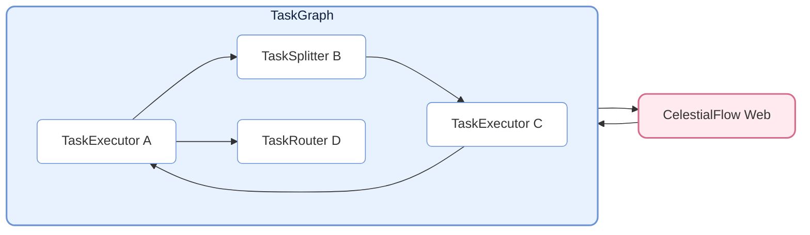
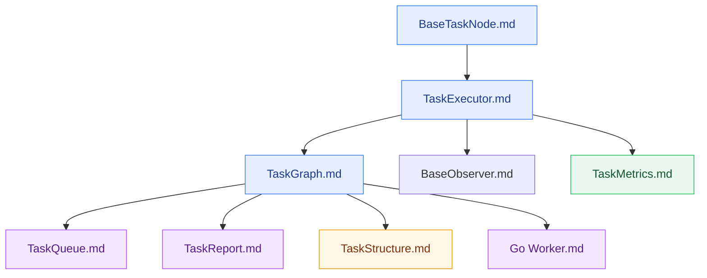

# CelestialFlow — A Lightweight, Parallel, Graph-Based Python Task Scheduling Framework

<p align="center">
  
</p>

<p align="center">
  <a href="https://pypi.org/project/celestialflow/"></a>
  <a href="https://pepy.tech/projects/celestialflow"></a>
  <a href="https://pypi.org/project/celestialflow/"></a>
  <a href="https://pypi.org/project/celestialflow/"></a>
</p>

<p align="center">
  
  
  
</p>

<p align="center">
  <a href="https://github.com/Mr-xiaotian/CelestialFlow/blob/main/README.md">中文</a> | <a href="https://github.com/Mr-xiaotian/CelestialFlow/blob/main/docs/en/README.md">English</a> | <a href="https://github.com/Mr-xiaotian/CelestialFlow/blob/main/docs/ja/README.md">日本語</a>
</p>

**CelestialFlow** is a lightweight yet fully-featured task flow framework, suitable for medium-to-large Python task systems that require **complex dependencies**, **flexible execution models**, **cross-device execution**, and **observable execution traces**.

- Lighter and quicker to start than Airflow/Dagster
- More structured than multiprocessing/threading, capable of directly expressing complex dependency patterns such as loops and complete graphs

The basic unit of the framework is the **task node** (all uniformly inheriting from the internal base class `BaseTaskNode`). Three concrete node implementations are currently exposed; they can run independently or be connected to each other into a graph:

* **TaskExecutor** — General-purpose task executor
* **TaskSplitter** — Splits one input into multiple sub-tasks
* **TaskRouter** — Routes tasks to different downstreams based on conditions

All three node types support the following execution modes:

* **Serial**
* **Multi-threaded (thread)**
* **Coroutine (async)**

`TaskExecutor` implements result caching, task deduplication, progress bar display, multi-mode execution comparison, and more — it works well even when used standalone.

Nodes are connected to each other through **TaskGraph**, forming a task graph with upstream and downstream dependencies. A downstream node automatically receives the completed results from its upstream as input, creating a clear data flow. TaskGraph also provides preset topology structures such as `TaskChain` / `TaskCross` / `TaskGrid` / `TaskLoop` / `TaskWheel` / `TaskComplete` to quickly build common dependency patterns.

At the graph level, `graph_mode` uniformly controls how all nodes in the graph run:

* **Serial layout**: The current node finishes before the next node starts (downstream nodes may receive tasks early but will not execute immediately).
* **Thread layout**: The current node runs in an independent thread within the main process, suitable for I/O-intensive tasks and functions that cannot be pickled (such as lambda).
* **Async layout**: The current node runs as a coroutine, suitable for I/O-intensive asynchronous tasks.

`graph_mode` × `execution_mode` can be combined into 9 execution modes, covering the vast majority of scenarios.

TaskGraph can construct a full **Directed Graph** structure, supporting not only traditional Directed Acyclic Graphs (DAG), but also flexibly expressing **Tree**, **loop**, and even **Complete Graph** task dependencies.

Beyond execution and scheduling, CelestialFlow further introduces the **CelestialTree (ctree) event tracing system**, which records explicit causal relationships for each task and its derivative behaviors (success, failure, retry, split, routing, etc.). With ctree, you can start from any initial task and fully reconstruct its propagation path and execution trace within the TaskGraph, enabling complete **tracing, analysis, and interpretation** of the task system. Since 3.2.4, `ctree` uses a local ultra-simplified implementation by default and does not require the `celestialtree` external package; if gRPC remote tracing capability is needed, it can be additionally installed.

On this foundation, CelestialFlow provides event tracing, status reporting, persistent replay, and other features. The Web visualization interface is provided by the separate project [celestialflow-web](https://github.com/Mr-xiaotian/celestialflow-web), and the two collaborate via the HTTP protocol.

## Project Structure


```mermaid
flowchart LR

    %% ===== TaskGraph =====
    subgraph TG[TaskGraph]
        direction LR

        S1[TaskExecutor A]
        S2[TaskSplitter B]
        S3[TaskExecutor C]
        S4[TaskRouter D]

        S1 --> S2 --> S3 --> S1
        S1 --> S4

    end

    %% Style TaskGraph outer frame
    style TG fill:#e8f2ff,stroke:#6b93d6,stroke-width:2px,color:#0b1e3f,rx:10px,ry:10px

    %% Unified styling format
    classDef blueNode fill:#ffffff,stroke:#6b93d6,rx:6px,ry:6px;

    %% Style TaskNodes
    class S1,S2,S3,S4 blueNode;

    %% ===== Links =====
    TG --> CFB[CelestialFlow Web]
    CFB --> TG

    style CFB fill:#ffeaf0,stroke:#d66b8c,stroke-width:2px,rx:10px,ry:10px

```

## Quick Start

Install CelestialFlow:

```bash
# It is recommended to use `uv` for dependency and environment management
uv pip install celestialflow

# However, you can also use `pip` directly
pip install celestialflow
```

If you only need CelestialFlow's core scheduling, observability, and persistence capabilities, the above installation is sufficient.

If you also need to enable CelestialTree event tracing, you must **additionally install** `celestialtree`:

```bash
# For published package users
uv pip install celestialtree

# If you are a developer/contributor after cloning the repository
uv sync --group dev
```

A simple runnable example:

```python
from celestialflow import TaskExecutor, TaskGraph


def add(x, y):
    return x + y


def square(x):
    return x**2


if __name__ == "__main__":
    # Define two task nodes
    executor_1 = TaskExecutor(
        name="Adder",
        func=add,
        execution_mode="thread",
        max_workers=4,
    )
    executor_2 = TaskExecutor(
        name="Squarer",
        func=square,
        execution_mode="thread",
        max_workers=4,
    )

    # Build the task graph structure
    graph = TaskGraph(name="DemoGraph", graph_mode="thread")
    graph.set_nodes(nodes=[executor_1, executor_2])
    graph.connect([executor_1], [executor_2])

    # Initialize tasks and start
    graph.run({"Adder": [(1, 2), (3, 4), (5, 6)]})
```

Note: Do not run in a `.ipynb` file.

👉 To see the full Quick Start, please refer to [Quick Start](https://github.com/Mr-xiaotian/CelestialFlow/blob/main/docs/zh-CN/quick_start.md)

## Further Reading

If you want to understand the overall architecture and core components of the framework, the following reference documents will help:

- [BaseTaskNode.md](https://github.com/Mr-xiaotian/CelestialFlow/blob/main/docs/zh-CN/src/node/core_node.md)
- [TaskExecutor.md](https://github.com/Mr-xiaotian/CelestialFlow/blob/main/docs/zh-CN/src/node/core_nodes.md)
- [TaskGraph.md](https://github.com/Mr-xiaotian/CelestialFlow/blob/main/docs/zh-CN/src/graph/core_graph.md)
- [TaskMetrics.md](https://github.com/Mr-xiaotian/CelestialFlow/blob/main/docs/zh-CN/src/runtime/core_metrics.md)
- [TaskQueue.md](https://github.com/Mr-xiaotian/CelestialFlow/blob/main/docs/zh-CN/src/runtime/core_queue.md)
- [TaskReport.md](https://github.com/Mr-xiaotian/CelestialFlow/blob/main/docs/zh-CN/src/observability/core_report.md)
- [TaskStructure.md](https://github.com/Mr-xiaotian/CelestialFlow/blob/main/docs/zh-CN/src/graph/core_structure.md)
- [BaseObserver.md](https://github.com/Mr-xiaotian/CelestialFlow/blob/main/docs/zh-CN/src/observability/core_observer.md)
- [Go Worker.md](https://github.com/Mr-xiaotian/CelestialFlow/blob/main/docs/zh-CN/other/go_worker.md)

Recommended reading order:


```mermaid
flowchart TD
    classDef core fill:#e6efff,stroke:#3b82f6,color:#1e3a8a;
    classDef runtime fill:#e9f8ef,stroke:#22c55e,color:#14532d;
    classDef structure fill:#fff6e6,stroke:#f59e0b,color:#78350f;
    classDef execution fill:#f3e8ff,stroke:#a855f7,color:#581c87;

    BTN[BaseTaskNode.md] --> TE[TaskExecutor.md] --> TG[TaskGraph.md]
    TE --> OB[BaseObserver.md]
    TE --> TME[TaskMetrics.md]

    TG --> TQ[TaskQueue.md]
    TG --> TR[TaskReport.md]
    TG --> TSR[TaskStructure.md]

    TG --> GW[Go Worker.md]

    class BTN,TE,TG core;
    class TME runtime;
    class TSR structure;
    class TQ,GW execution;
    class TR execution;
```

The following five can serve as supplementary reading:

- [UtilHash.md](https://github.com/Mr-xiaotian/CelestialFlow/blob/main/docs/zh-CN/src/runtime/util_hash.md)
- [UtilTypes.md](https://github.com/Mr-xiaotian/CelestialFlow/blob/main/docs/zh-CN/src/runtime/util_types.md)
- [UtilErrors.md](https://github.com/Mr-xiaotian/CelestialFlow/blob/main/docs/zh-CN/src/runtime/util_errors.md)
- [Lifecycle.md](https://github.com/Mr-xiaotian/CelestialFlow/blob/main/docs/zh-CN/src/persistence/core_lifecycle.md)
- [Log.md](https://github.com/Mr-xiaotian/CelestialFlow/blob/main/docs/zh-CN/src/persistence/core_log.md)

If you prefer to understand the framework's operation through a complete case study, refer to this tutorial on building a project from scratch with TaskGraph:

[📘 Case Tutorial](https://github.com/Mr-xiaotian/CelestialFlow/blob/main/docs/zh-CN/tutorial.md)

If you're interested in the `ctree_client` and its functionality added in version 3.0.7, take a look at this article:

[📚 CelestialTreeClient](https://github.com/Mr-xiaotian/CelestialFlow/blob/main/docs/zh-CN/other/ctree_client.md)

You can continue running more demo code. Here is a record of each demo file and descriptions of the demo functions within:

[🎮 demo/ Overview](https://github.com/Mr-xiaotian/CelestialFlow/blob/main/docs/zh-CN/demo/README.md)

If you want to run test code, you can first review the following documentation:

[🧪 tests/ Overview](https://github.com/Mr-xiaotian/CelestialFlow/blob/main/docs/zh-CN/tests/README.md)

If you want to view bench content, this data also serves as the basis for some of the framework's design decisions:

[⚡ bench/ Overview](https://github.com/Mr-xiaotian/CelestialFlow/blob/main/docs/zh-CN/bench/README.md)

## Requirements

**CelestialFlow** is based on Python 3.12+. The default runtime depends only on the most minimal core components.

| Dependency        | Description |
| ----------------- | ----------- |
| **Python ≥ 3.12** | Runtime environment; version 3.12 or above is recommended |
| **requests**      | HTTP client library, used for task status reporting and remote calls |

- `tqdm` is no longer a default runtime dependency (removed since 3.2.7). If you need to experience the `TaskProgress` progress bar in demos, you can `uv pip install tqdm` yourself.
- `celestialtree` is also **no longer a required dependency** (since 3.2.4): event tracing uses a local ultra-simplified implementation by default and can run with zero external dependencies. If gRPC remote tracing capability is needed, please additionally install `celestialtree`, or run `uv sync --group dev` in the source repository.
- The Redis nodes from old demo / bench have been removed in 3.2.4; the runtime of this project no longer depends on Redis.

- To use the visual web service, please go to the separate project [celestialflow-web](https://github.com/Mr-xiaotian/celestialflow-web) and install and run `celestialflow-web --host 0.0.0.0 --port 5000`.

## File Structure

```
📁 CelestialFlow	(664MB 611KB 462B)
    📁 bench           	(296KB 101B)
        📁 [1 excluded directory]                  (194KB 222B)
        🐍 bench_datastructures.py          	(6KB 690B)
        🐍 bench_execution_mode.py          	(2KB 707B)
        🐍 bench_futures_memory.py          	(2KB 269B)
        🐍 bench_gil_vs_nogil.py            	(10KB 101B)
        🐍 bench_graph_mode.py              	(6KB 774B)
        🐍 bench_hash.py                    	(7KB 67B)
        🐍 bench_hash_container.py          	(3KB 1009B)
        🐍 bench_hash_memory.py             	(3KB 642B)
        🐍 bench_http_grpc.py               	(2KB 536B)
        🐍 bench_ipc_queue.py               	(7KB 104B)
        🐍 bench_lock_overhead.py           	(9KB 421B)
        🐍 bench_mpqueue_vs_shared_memory.py	(13KB 127B)
        🐍 bench_observer.py                	(7KB 860B)
        🐍 bench_persistence_spout.py       	(4KB 340B)
        🐍 bench_queue.py                   	(5KB 857B)
        🐍 bench_requests.py                	(6KB 813B)
        🐍 bench_tqdm.py                    	(1KB 235B)
        🐍 bench_utils.py                   	(543B)
    📁 demo            	(146KB 197B)
        📁 [1 excluded directory]  	(100KB 9B)
        🐍 demo_executor.py 	(1KB 495B)
        🐍 demo_funnel.py   	(2KB 289B)
        🐍 demo_graph.py    	(3KB 222B)
        🐍 demo_network.py  	(3KB 756B)
        🐍 demo_nodes.py    	(4KB 212B)
        🐍 demo_observer.py 	(4KB 270B)
        🐍 demo_redis.py    	(9KB 131B)
        🐍 demo_structure.py	(11KB 737B)
        🐍 demo_utils.py    	(6KB 148B)
    📁 docs            	(1MB 914KB 89B)
        📁 en[collapsed]   	(632KB 604B)
        📁 ja[collapsed]   	(718KB 778B)
        📁 zh-CN[collapsed]	(586KB 755B)
    📁 experiments     	(3KB 21B)
        🐍 experiment_networkx.py	(1KB 908B)
        🐍 experiment_tqdm.py    	(1KB 137B)
    📁 img             	(5MB 871KB 242B)
        📷 file_structure.svg  	(4MB 918KB 1000B)
        📷 logo(old).png       	(836KB 542B)
        📷 logo.png            	(122KB 747B)
        📷 scc_condensation.svg	(17KB 1B)
    📁 src             	(1MB 822KB 642B)
        📁 celestialflow[collapsed]         	(1MB 822KB 642B)
    📁 tests           	(4MB 290KB 989B)
        📁 benchmark[collapsed]    	(45KB 270B)
        📁 funnel[collapsed]       	(96KB 339B)
        📁 graph[collapsed]        	(768KB 424B)
        📁 node[collapsed]         	(451KB 840B)
        📁 observability[collapsed]	(188KB 1001B)
        📁 persistence[collapsed]  	(393KB 151B)
        📁 runtime[collapsed]      	(1MB 290KB 858B)
        📁 [1 excluded directory]      	(487KB 637B)
        🐍 conftest.py          	(1KB 38B)
    📁 [12 excluded directories]	(650MB 21KB 212B)
    ❓ .env            	(468B)
    ❓ .gitignore      	(1KB 315B)
    📝 AGENTS.md       	(1KB 434B)
    ❓ LICENSE         	(1KB 65B)
    ❓ Makefile        	(149B)
    ⚙️ pyproject.toml  	(2KB 668B)
    📝 README.md       	(17KB 298B)
    🔒 uv.lock         	(120KB 752B)
```
<p align="center">
  <em>celestial-flow 3.3.0</em>
</p>

(This view was generated by `inst_file.FileTree.print_tree()` from my other project [CelestialVault](https://github.com/Mr-xiaotian/CelestialVault). Conversion to an image was done with [Carbon](https://carbon.now.sh).)

## Version Log

- 3.3.0
  - feat:
    - The `func_name` parameter is now completely removed from `TaskExecutor`
      - With `executor_name` expressing the node, this layer of exposure is unnecessary
      - This is also to be consistent with the state of `CelestialGraw`
    - When sending status to `reporter`, include the graph's `class_name` information
    - Removed the `from_edges` method in `OrderGraph`
  - refactor:
    - [IMPORTANT] Refactored the original `executor/stage` structure
      - Originally a three-layer structure of `executor -> stage -> splitter/router`, which was overly complex
      - Now the `stage` layer is removed, and `BaseTaskNode` is added as the only node recognized by the graph, while `executor` is treated as a node of the same level as `splitter/router`
      - The current structure is `BaseTaskNode -> executor/splitter/router`
    - Refactored the implementation of `render_structure_list` (formerly `format_structure_list_from_graph`)
      - Now uses breadth-first instead of the original recursion
      - At the same time, the input parameters directly use a list of node names in the form of `list[str]`, which means information like `func_name` and `execution_mode` is no longer displayed
    - Modified the previously strange way of calling `collect_runtime_snapshot`
      - Now the reporter will directly call `collect_runtime_snapshot` in `_push_status`
    - Removed `get_summary` in `TaskExecutor`; this layer of wrapping is actually redundant
      - At the same time, all `event_client.emit` no longer carries `summary` information
    - Removed the `_node` parameter in `OrderGraph`
      - Previously this parameter provided: all node names; node insertion order
      - Now the former is provided by `_out`, while the latter is no longer valued
    - Renamed `task_in` in `LifecycleInlet` to `task_input` to be consistent with the log side
  - fix:
    - Fixed the issue where worker crashes were ignored when `execution_mode = async`
    - Fixed the ambiguous meaning of `retry_times` in task retry logs; now uses `fail_times`
    - Fixed the issue where return values were not handled in reporter's `_push_*` methods
    - Fixed the issue in `TaskReporter._pull_injection` where the wrong `put_task` was performed on the pulled task list

For more past logs, see:

[change_log.md](https://github.com/Mr-xiaotian/CelestialFlow/blob/main/docs/zh-CN/change_log.md)

## Star History

If you are interested in the project, a star is welcome. If you have questions or suggestions, feel free to submit [Issues](https://github.com/Mr-xiaotian/CelestialFlow/issues) or let me know in [Discussions](https://github.com/Mr-xiaotian/CelestialFlow/discussions).


## License
This project is licensed under the MIT License - see the [LICENSE](https://github.com/Mr-xiaotian/CelestialFlow/blob/main/LICENSE) file for details.

## Author
Author: Mr-xiaotian
Email: mingxiaomingtian@gmail.com
Project Link: [https://github.com/Mr-xiaotian/CelestialFlow](https://github.com/Mr-xiaotian/CelestialFlow)
