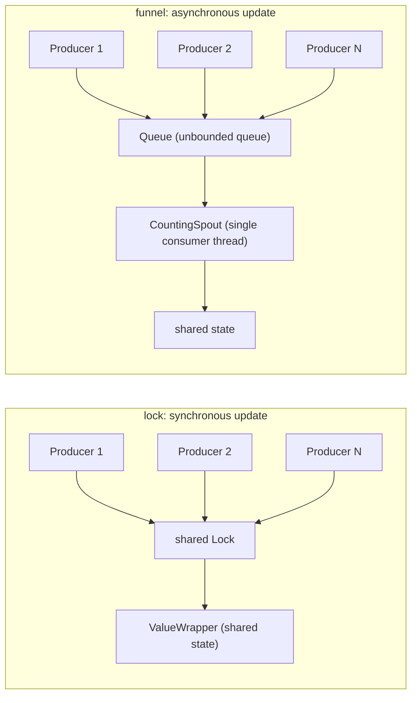

# bench/bench_funnel_vs_lock.py

> 📅 Last Updated: 2026/09/24

## Objective

Compare two mechanisms for letting multiple producer threads safely update the same shared state:

- **Funnel**: producers only push records into a queue, and a single `BaseSpout` background thread consumes them serially, i.e. updating state without synchronization.
- **Locking (`ValueWrapper`)**: producers hold a shared `Lock` and update state directly, i.e. synchronous updates.

The script runs both mechanisms under the **same workload** (same number of producers, same total record count, same per-record processing cost), answering the following questions:

1. How large is the difference in sender-side cost (how long producers have to wait)?
2. How large is the end-to-end throughput difference?
3. What is the price of making it asynchronous (backlog / memory)?
4. How much does read pressure interfere with each one's write path?

> ⚠️ **Conclusion up front**: The funnel is not a throughput optimization. The end-to-end throughput ceiling is determined by the consumer side, and both do the same amount of serial work;
> the funnel's real benefit is **reducing sender-side waiting** and **naturally obtaining an ordered single-writer stream**, at the cost of **queue backlog with no backpressure constraint**.

## Test Content

### Scenarios

| Scenario | Synchronization Method | Description |
|------|---------|------|
| `lock` | `ValueWrapper` + shared `Lock` | Producers hold the lock to update; writes are synchronously visible. Corresponds to the usage in `TaskMetrics` where counters share the same lock |
| `nolock` | `ValueWrapper`, no lock | A baseline deliberately without locking, used to quantify the cost of the lock itself rather than to demonstrate correctness (see "Potential Issues" below) |
| `sharded` | One lock-free `ValueWrapper` per producer | Aggregated at the end. No cross-thread contention at all, but only applicable to aggregatable workloads and cannot express a shared record stream |
| `funnel` | `BaseInlet` + `BaseSpout` | Producers call `emit` to enqueue; `CountingSpout` consumes serially on a single thread and updates state |

In the `funnel` scenario, records have the form `(producer_id, seq)`, and `CountingSpout` verifies on consumption whether `seq` is strictly consecutive within the same producer, so `order_violations` is an empirical verification of the funnel's "ordered single-writer stream" guarantee.
`lock` / `nolock` / `sharded` do not model a record stream, so that dimension is `n/a`: locking only guarantees the atomicity of a single update, and obtaining a cross-producer FIFO order requires additional design (e.g. sharding + merging).

### Measurement Dimensions

| Metric | Meaning |
|------|------|
| `submit` | Producer-side time, i.e. the wall-clock time to "submit all records", reflecting sender-side cost |
| `drain` | After producers finish submitting, the time for the consumer side to process the remaining records, reflecting the cost of asynchronous backlog |
| `total` | End-to-end time, `submit + drain` (the two are identical for `lock`-type scenarios) |
| `peak_pending` | Peak queue backlog, i.e. the funnel's memory cost; always `0` for scenarios without a queue |
| `order_violations` | Number of sequence disorder events within a single producer; shows `n/a` for scenarios that do not model a record stream |
| `reader_ops` | Number of reads completed during the write phase by the reader threads specified by `--readers` |

### Data Flow of the Two Mechanisms



Key difference: on the `lock` path, the user workload (serialization, writing files, writing SQLite, etc.) and the critical section happen consecutively within the same thread, and producers must wait;
the `funnel` path moves this workload as a whole to the consumer thread, so producers bear only one enqueue cost, but the queue keeps growing whenever upstream is faster than downstream.

## Key Configuration

| Parameter | Default | Description |
|------|-------|------|
| `--items` | `400000` | Total records / update count per round |
| `--producers` | `4` | Number of producer threads |
| `--readers` | `0` | Number of reader threads; in `lock` scenarios they poll `ValueWrapper.get()`, in `funnel` scenarios they poll `get_pending_count()` |
| `--work-iters` | `0` | Simulated processing cost per record (number of pure-CPU transformation iterations); `0` means no simulation |
| `--repeats` | `3` | Number of repetition rounds per scenario |
| `--scenarios` | `lock,nolock,sharded,funnel` | Comma-separated; only run the selected scenarios |

Constants in the script:

- `PENDING_SAMPLE_INTERVAL = 0.0005`: interval (seconds) for sampling queue backlog. Limited by platform timer precision, `peak_pending` is a **lower bound** on the true peak.
- Workload function `apply_work(seed, iters)`: applies the transformation `((acc * 33) ^ (i + seed)) & 0x7FFF_FFFF` to `seed` `iters` times. In `lock` scenarios it runs on the producer thread, while in `funnel` scenarios it runs on the consumer thread — this is exactly where the difference between the two mechanisms comes from.

Argument validation is performed by `validate_args()` (`--items >= 0`, `--producers >= 1`, `--readers >= 0`, `--work-iters >= 0`, `--repeats >= 1`); invalid values cause an error and exit before the configuration header is printed.

The script inserts the project's `src/` directory into `sys.path`, so it can be run directly without installing the package.

## Potential Issues

1. **`nolock` cannot be used to demonstrate "lock-free computes wrong"**: On interpreters with the GIL enabled, the race window of `counter.value += 1` (a few bytecodes) is far smaller than the thread-switch granularity; on this machine, 2 million updates still did not lose a count. This scenario can only serve as a "performance upper bound without synchronization"; updates are only truly lost under free-threaded builds.
2. **`peak_pending` is a lower bound**: Sampling at a 0.5ms interval may miss short-lived backlog peaks.
3. **End-to-end throughput is determined by the consumer side**: `funnel` concentrates processing on a single consumer thread, and the serial workload is the same as the work done inside the critical section of `lock`, so one should not expect `total` to be clearly better.
4. **`--readers` causes heavy interference**: All reader threads spin contending for the same lock on the write path (the `ValueWrapper` lock in `lock` scenarios, the `PendingCounter` lock in `funnel` scenarios). Both designs pay a price for reads, and the funnel's enqueue path is slowed down just as much.
5. **`--work-iters` is a GIL-bound pure-CPU load**: With the GIL enabled on this machine, throughput at both ends is close; conclusions may differ under free-threaded builds.
6. **`sharded` is not a general solution**: It has no shared record stream and is only applicable to aggregatable workloads; it is included here to provide a "contention-free" reference point.
7. **`drain` is noise in scenarios without a queue**: The `drain` of `lock` / `nolock` / `sharded` should be treated as `0`; the observed `0.0000s ~ 0.0008s` comes from reader thread teardown.
8. **Small-sample bias**: When the record count is too small, the fixed costs of thread startup and `spout` start/stop take up a noticeably larger share.

## Benchmark Results (Measured)

> 🟢 The timing/throughput in the tables of this section are all historical measured data and cannot be verified from source code; manual confirmation is required.

All three sets of results come from the same Windows machine, local `.venv`, Python 3.14.3, **GIL enabled**, producers `4`.

### 2026/09/14 - Pure handoff overhead (`--items 400000 --work-iters 0 --repeats 2`)

There is no user workload to move away, so what is examined is the pure "handoff cost".

| Scenario | `submit` Mean | `drain` Mean | `total` Mean | End-to-End Throughput | Correctness | `peak_pending` | `order_violations` |
|------|--------------|-------------|-------------|-----------|--------|---------------|-------------------|
| `lock` | 0.0608s | 0.0000s | 0.0608s | 6,589,743 items/s | 2/2 | 0 | n/a |
| `nolock` | 0.0520s | 0.0000s | 0.0521s | 7,685,825 items/s | 2/2 | 0 | n/a |
| `sharded` | 0.0533s | 0.0000s | 0.0533s | 7,508,702 items/s | 2/2 | 0 | n/a |
| `funnel` | 0.4590s | 0.1782s | 0.6372s | 627,859 items/s | 2/2 | 266,001 | 0 |

**Conclusions for this round**:

- The cost of locking itself is limited: `lock` throughput drops about **14%** relative to `nolock`, and `sharded` is basically on par with `nolock`, indicating that this shared lock is not the bottleneck for pure counting.
- `funnel` is about **10x** slower in this scenario: with no time-consuming workload to move away, inter-thread handoff is pure overhead, and `submit` is actually 7.5 times that of `lock`.
- `funnel`'s `peak_pending` reaches `266,001 / 400,000`: producer throughput exceeds that of the consumer, and nearly two-thirds of the records stay in the queue — the direct memory cost of the no-backpressure design.
- All four scenarios count correctly, and `funnel`'s `order_violations` is `0`.

### 2026/09/14 - With per-record processing cost (`--items 30000 --work-iters 200 --repeats 2`)

Adds a CPU processing cost to each record, simulating the case where "the workload can be moved to the consumer side".

| Scenario | `submit` Mean | `drain` Mean | `total` Mean | End-to-End Throughput | Correctness | `peak_pending` | `order_violations` |
|------|--------------|-------------|-------------|-----------|--------|---------------|-------------------|
| `lock` | 0.4992s | 0.0000s | 0.4992s | 60,106 items/s | 2/2 | 0 | n/a |
| `nolock` | 0.5012s | 0.0000s | 0.5012s | 59,852 items/s | 2/2 | 0 | n/a |
| `sharded` | 0.5092s | 0.0000s | 0.5092s | 58,931 items/s | 2/2 | 0 | n/a |
| `funnel` | 0.1450s | 0.4092s | 0.5543s | 54,126 items/s | 2/2 | 23,247 | 0 |

**Conclusions for this round**:

- Once processing cost becomes dominant, locking and not locking are almost indistinguishable (`lock` 0.4992s vs `nolock` 0.5012s): the critical section accounts for only a tiny part of the per-record time.
- The sender-side gap is significantly amplified: `funnel`'s `submit` is `0.1450s`, which is **1/3.4** of `lock`, i.e. producer waiting time drops greatly.
- But end-to-end is instead slightly slower (`0.5543s` vs `0.4992s`, about **11%**), because under the GIL the CPU workload cannot truly parallelize; processing is merely moved from the producer thread to the consumer thread.
- Backlog reaches `23,247 / 30,000`: **the benefit of asynchrony (low send latency) and its cost (high memory usage) appear simultaneously in this round**.

### 2026/09/14 - Injecting read pressure (`--items 300000 --readers 2 --repeats 1`)

Starts an additional 2 reader threads that continuously poll the shared state during the write phase.

| Scenario | `submit` Mean | `drain` Mean | `total` Mean | End-to-End Throughput | Correctness | `peak_pending` | `reader_ops` |
|------|--------------|-------------|-------------|-----------|--------|---------------|-------------|
| `lock` | 0.4052s | 0.0008s | 0.4060s | 738,935 items/s | 1/1 | 0 | 2,333,379 |
| `nolock` | 0.4033s | 0.0003s | 0.4035s | 743,437 items/s | 1/1 | 0 | 2,726,586 |
| `funnel` | 1.2632s | 0.1186s | 1.3818s | 217,114 items/s | 1/1 | 210,553 | 5,547,967 |

**Conclusions for this round**:

- The cost of reader threads spinning on the same lock is enormous: `lock` write throughput drops from 6,589,743 items/s in the first round to 738,935 items/s, **about an 8.9x drop**.
- `funnel`'s enqueue path is slowed down just as much (`submit` `1.2632s`): `PendingCounter`'s lock is right on the enqueue path, and the read-side cost cannot be isolated by asynchrony.
- Conversely, the read side is "more worthwhile": within the same duration, the `funnel` scenario completed 5,547,967 reads (`lock` did 2,333,379), because once its write path is slowed down, reader threads get more scheduling opportunities.
- The conclusion is that **reads are not free**: regardless of the mechanism, read pressure directly harms the write path; only the location of the harm differs.

### Overall Reference

- **Do not treat the funnel as a throughput optimization**: The end-to-end ceiling depends on the consumer side, and both do the same amount of serial work.
- **The funnel's value is on the sender side**: reducing `submit`, absorbing burst traffic, and providing an ordered single-writer stream bound to a single consumer (`order_violations` is always 0).
- **The funnel's cost is backlog**: measured `peak_pending` can approach the full record count; the current `Queue` is unbounded with no backpressure.
- **The cost of locking itself is not high**: in a GIL environment, the lock overhead for a shared `int` counter is about 14%; what really amplifies the cost is read contention, not the lock itself.

## How to Run

```bash
python bench/bench_funnel_vs_lock.py
```

Run with `uv`:

```bash
uv run python bench/bench_funnel_vs_lock.py
```

If the project is not installed as an importable package, you can also use the local virtual environment interpreter directly:

```bash
.\.venv\Scripts\python.exe bench/bench_funnel_vs_lock.py
```

## Parameter Tuning

### Compare only the funnel and locking

```bash
python bench/bench_funnel_vs_lock.py --scenarios lock,funnel
```

### Scale up record count and producer count

```bash
python bench/bench_funnel_vs_lock.py --items 800000 --producers 8
```

### Simulate a movable user workload

```bash
python bench/bench_funnel_vs_lock.py --work-iters 200 --scenarios lock,funnel
```

### Inject read pressure

```bash
python bench/bench_funnel_vs_lock.py --readers 2 --scenarios lock,funnel
```

### Increase repetition rounds to observe stability

```bash
python bench/bench_funnel_vs_lock.py --repeats 5
```

## Dependencies

- Python standard library: `argparse`, `statistics`, `sys`, `threading`, `time`, `dataclasses`, `pathlib`
- `celestialflow.funnel` from project source (`BaseInlet`, `BaseSpout`)
- `celestialflow.runtime.util_types` from project source (`ValueWrapper`, `NoOpContext`)
