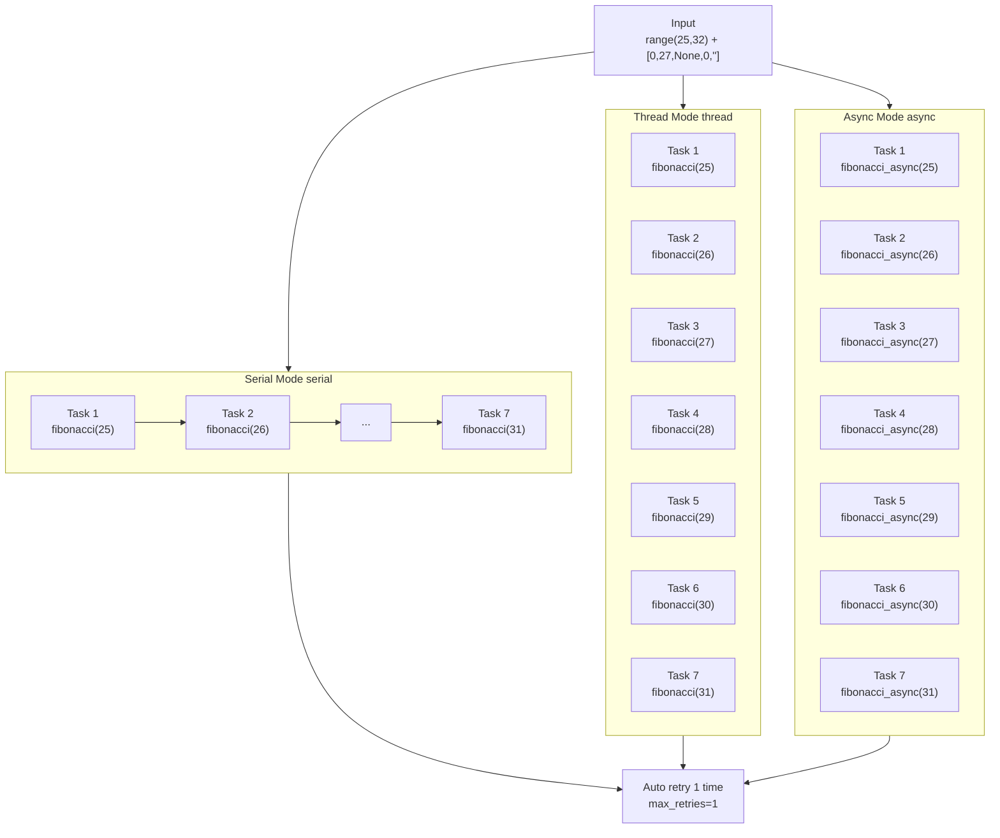

# demo_executor.py Demo Guide

> 📅 Last Updated: 2026/06/22

## Objective

Demonstrates `TaskExecutor` running independently under three execution modes (`serial`, `thread`, `async`). Showcases the full lifecycle including exception retry, progress display, and task statistics, making it an ideal first hands-on experience with the framework.

## Demo Content

Core strategy comparison across the three execution modes:



| Function | Mode | Task | Feature |
|------|------|------|------|
| `demo_fibonacci_serial` | serial | Fibonacci computation | Single-threaded sequential execution |
| `demo_fibonacci_thread` | thread | Fibonacci computation | 6-thread concurrency |
| `demo_fibonacci_async` | async | Async Fibonacci | Coroutine concurrency |

- **Input**: `range(25, 32) + [0, 27, None, 0, ""]`
- **Exception design**: Two `0`s trigger `ValueError`, and the framework auto-retries 1 time; `None` and `""` trigger type errors and fail directly because they are not in the retry list

## Key Configuration

- `max_workers = 6`
- `max_retries = 1`
- Progress bar added via `executor.add_observer(TaskProgress())`

## Potential Issues

1. **Iterative computation latency**: The iterative computation of `fibonacci(31)` takes about 1 second in serial mode, but the overall execution includes retry and scheduling overhead, so actual total time may be longer.
2. **`asyncio` environment**: `demo_fibonacci_async` uses `asyncio.run()`, which will error when run directly in Jupyter Notebook (Notebook already has an event loop).
3. **No assertions**: This file is a **demo script** with no `assert` statements. Successful execution only means no uncaught exceptions were thrown; it does not verify result correctness.

## How to Run

```bash
python demo/demo_executor.py
```

## Expected Behavior

After running, the three modes execute sequentially with output similar to:

```
========================================
[serial] Fibonacci benchmark (N=12 tasks, max_workers=6)
========================================
 80%|████████████████░░░░| ...

--- Summary ---
  mode=serial  success=08  fail=04  dup=0  pending=0  elapsed=0.90s

========================================
[thread] Fibonacci benchmark (N=12 tasks, max_workers=6)
========================================
 80%|████████████████░░░░| ...

--- Summary ---
  mode=thread  success=08  fail=04  dup=0  pending=0  elapsed=0.86s

========================================
[async] Fibonacci benchmark (N=12 tasks, max_workers=6)
========================================
 80%|████████████████░░░░| ...

--- Summary ---
  mode=async  success=08  fail=04  dup=0  pending=0  elapsed=0.01s
```

> **Note**: Of the 12 tasks, 4 invalid inputs (two `0`s, `None`, `""`) cause failures; the remaining 8 are valid Fibonacci tasks, so the final result is `success=08`/`fail=04`. The two `0`s trigger `ValueError` and still fail after 1 retry; `None`/`""` trigger type errors.
> All three modes use the iterative Fibonacci (O(n)) from `demo_utils`, with comparable performance.

## Dependencies

- `celestialflow` (`TaskExecutor`, `TaskProgress`)
- `demo_utils` (`fibonacci`, `fibonacci_async`)
