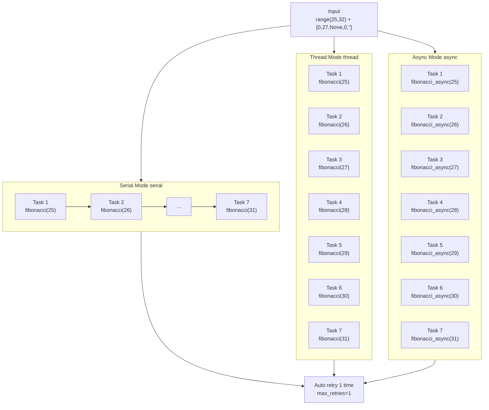

# demo_executor.py Demo Guide

> 📅 Last Updated: 2026/08/31

## Objective

Demonstrates `TaskExecutor` running independently under three execution modes (`serial`, `thread`, `async`). Showcases the full lifecycle including exception retry, progress display, and task statistics, making it an ideal first hands-on experience with the framework.

## Demo Content

Core strategy comparison across the three execution modes:


```mermaid
flowchart TB
    subgraph Serial["Serial Mode serial"]
        direction LR
        T1_1["Task 1<br/>fibonacci(25)"] --> T1_2["Task 2<br/>fibonacci(26)"]
        T1_2 --> T1_3["..."]
        T1_3 --> T1_4["Task 7<br/>fibonacci(31)"]
    end

    subgraph Thread["Thread Mode thread"]
        direction LR
        T2_1["Task 1<br/>fibonacci(25)"]
        T2_2["Task 2<br/>fibonacci(26)"]
        T2_3["Task 3<br/>fibonacci(27)"]
        T2_4["Task 4<br/>fibonacci(28)"]
        T2_5["Task 5<br/>fibonacci(29)"]
        T2_6["Task 6<br/>fibonacci(30)"]
        T2_7["Task 7<br/>fibonacci(31)"]
    end

    subgraph Async["Async Mode async"]
        direction LR
        T3_1["Task 1<br/>fibonacci_async(25)"]
        T3_2["Task 2<br/>fibonacci_async(26)"]
        T3_3["Task 3<br/>fibonacci_async(27)"]
        T3_4["Task 4<br/>fibonacci_async(28)"]
        T3_5["Task 5<br/>fibonacci_async(29)"]
        T3_6["Task 6<br/>fibonacci_async(30)"]
        T3_7["Task 7<br/>fibonacci_async(31)"]
    end

    Input["Input<br/>range(25,32) + [0,27,None,0,'']"] --> Serial
    Input --> Thread
    Input --> Async

    Serial --> Retry["Auto retry 1 time<br/>max_retries=1"]
    Thread --> Retry
    Async --> Retry
```

| Function | Mode | Task | Feature |
|------|------|------|------|
| `demo_fibonacci_serial` | serial | Fibonacci computation | Single-threaded sequential execution |
| `demo_fibonacci_thread` | thread | Fibonacci computation | 6-thread concurrency |
| `demo_fibonacci_async` | async | Async Fibonacci | Coroutine concurrency |

- **Input**: `range(25, 32) + [0, 27, None, 0, ""]`
- **Exception design**: Two `0`s and `None` trigger `ValueError` (in Python 3, `None <= 0` is `True`); due to `set_retry_exceptions(ValueError)` they still fail after 1 auto-retry; `""` triggers a type error (`<=` does not support comparing `str` and `int`), which is not in the retry list and fails directly

## Key Configuration

- `max_workers = 6`
- `max_retries = 1`
- Progress bar added via `executor.add_observer(TaskProgress())`

## Potential Issues

1. **Iterative computation latency**: The Fibonacci implementation in `demo_utils` is iterative O(n); `fibonacci(31)` itself takes an extremely short time (microsecond-level). The total time differences across the three modes primarily come from `TaskExecutor` scheduling and retry overhead, not single-task computation.
2. **`asyncio` environment**: `demo_fibonacci_async` uses `asyncio.run()`, which will error when run directly in Jupyter Notebook (Notebook already has an event loop).
3. **No assertions**: This file is a **demo script** with no `assert` statements. Successful execution only means no uncaught exceptions were thrown; it does not verify result correctness.

## How to Run

```bash
python demo/demo_executor.py
```

## Expected Behavior

After running, the three modes execute sequentially, with the main output being `tqdm` progress bars similar to:

```text
FibonacciSerial(serial): 100%|██████████| 12/12 [00:00<00:00, 15000.00it/s]
FibonacciThread(thread-6): 100%|██████████| 12/12 [00:00<00:00, 4000.00it/s]
FibonacciAsync(async-6): 100%|██████████| 12/12 [00:00<00:00, 3000.00it/s]
```

> **Note**: Of the 12 tasks, 4 invalid inputs (two `0`s, `None`, `""`) cause failures; the remaining 8 are valid Fibonacci tasks. The two `0`s and `None` trigger `ValueError` (in Python 3, `None <= 0` is `True`) and still fail after 1 retry; `""` triggers a type error (not in the retry list).
> All three modes use the iterative Fibonacci (O(n)) from `demo_utils`; single-task computation itself is very fast, and the it/s differences on the progress bars primarily reflect scheduling overhead.

## Dependencies

- `celestialflow` (`TaskExecutor`)
- `demo_utils` (`fibonacci`, `fibonacci_async`)
- `demo_observer` (`TaskProgress`, provided by `demo_observer.py` in the same directory of this repository; the current `demo_executor.py` still keeps the `from celestialflow import TaskProgress` import style, but `celestialflow` no longer exports this class. For actual use, change it to `from demo_observer import TaskProgress`)
