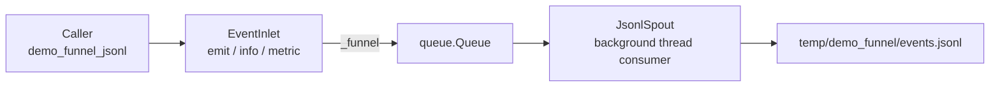

# demo_funnel.py Demo Guide

> 📅 Last Updated: 2026/06/18

## Objective

Demonstrate that the `funnel` module can be used independently of `TaskGraph`, `TaskStage`, and `TaskExecutor`. This example directly assembles a minimal "event collection -> background consumption -> JSONL landing" pipeline using `BaseInlet` and `BaseSpout`.

## Demo Content

### `demo_funnel_jsonl`



This demo consists of two custom classes and one entry point:

- `JsonlSpout`
  - Inherits `BaseSpout`
  - Creates directory and opens output file in `_before_start()`
  - Writes records as JSONL in `_handle_record()`
  - Closes file in `_after_stop()`
- `EventInlet`
  - Inherits `BaseInlet`
  - Provides a lightweight wrapper over `_funnel()`, offering three business methods: `emit()` / `info()` / `metric()`
- `demo_funnel_jsonl()`
  - Creates `JsonlSpout` and `EventInlet`
  - Starts the background consumer thread
  - Sends 3 event records
  - Stops the thread and prints the output file and its contents

## Why This Demo Is Valuable

- It demonstrates that `funnel` is not just a low-level implementation for persistence, but can also be directly used to build independent producer-consumer channels.
- It covers the full lifecycle of `BaseSpout`: `start()`, `_before_start()`, `_handle_record()`, `stop()`, `_after_stop()`.
- It also shows typical usage of `BaseInlet`: the business side does not directly operate the queue, but instead sends records into `_funnel()` through custom methods.

## Key Implementation

### Event Record Format

`EventInlet.emit()` constructs records with the following structure:

```json
{
  "timestamp": "2026-06-18 11:50:29",
  "event": "metric",
  "payload": {
    "name": "processed",
    "value": 3
  }
}
```

### Output File

- Path: `temp/demo_funnel/events.jsonl`
- Format: One JSON record per line, convenient for subsequent grep, streaming reads, or ingestion into logging systems

## Key Configuration

- Output file opened with `buffering=1`, using line buffering
- `spout.stop()` sends a termination signal and waits for the background thread to finish
- The example writes 3 records by default:
  - `info`
  - `metric`
  - `batch_finished`

## Potential Issues

1. **Not synchronous writes**: `BaseInlet` only puts records into the queue; actual consumption happens in `JsonlSpout`'s background thread.
2. **Output directory varies**: The JSONL file is written to `temp/demo_funnel/` under the current working directory. If the script is launched from a different directory, the output location will change accordingly.
3. **No assertions**: This is a demo script. Successful execution only means the pipeline works; it does not mean business semantics are automatically validated.

## How to Run

```bash
python demo/demo_funnel.py
```

## Expected Behavior

After running, it prints the output file path, number of processed records, and the written JSONL content, similar to:

```text
Output file: D:\Project\CelestialFlow\temp\demo_funnel\events.jsonl
Handled records: 3
{"timestamp": "2026-06-18 11:50:29", "event": "info", "payload": {"message": "funnel demo start"}}
{"timestamp": "2026-06-18 11:50:29", "event": "metric", "payload": {"name": "processed", "value": 3}}
{"timestamp": "2026-06-18 11:50:29", "event": "batch_finished", "payload": {"items": ["A", "B", "C"], "success": true}}
```

## Relationship with Other Modules

- If you want to see how `funnel` is reused as a framework-level capability, continue reading:
  - [__init__.md](https://github.com/Mr-xiaotian/CelestialFlow/blob/main/docs/zh-CN/src/funnel/__init__.md)
  - [core_inlet.md](https://github.com/Mr-xiaotian/CelestialFlow/blob/main/docs/zh-CN/src/funnel/core_inlet.md)
  - [core_spout.md](https://github.com/Mr-xiaotian/CelestialFlow/blob/main/docs/zh-CN/src/funnel/core_spout.md)
- If you want to see its typical use within the framework, refer to:
  - `LogSpout` / `LogInlet` in `persistence`
  - `FailSpout` / `FailInlet`
  - `SuccessSpout`

## Dependencies

- `celestialflow.funnel` (`BaseInlet`, `BaseSpout`)
- Python standard library: `json`, `pathlib`, `time`
