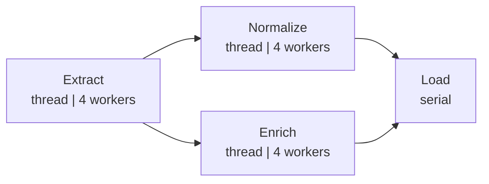
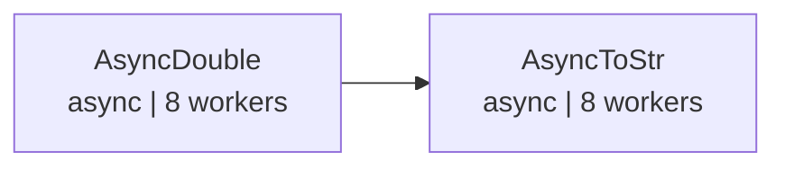

# demo_graph.py Demo Guide

> 📅 Last Updated: 2026/06/22

## Objective

Demonstrates advanced graph topology construction in CelestialFlow's `TaskGraph`: a fan-out/fan-in ETL pipeline and an asynchronous staged pipeline.

## Demo Scenarios

### `demo_etl_fan_out_fan_in`
ETL pipeline with fan-out/fan-in topology:



ASCII supplementary diagram:

```
Extract ──┬── Normalize ──┬── Load
          └── Enrich ─────┘
```

- `Extract` → Generates records by ID (thread mode, 4 workers)
- `Normalize` → Normalizes record values (thread mode, 4 workers)
- `Enrich` → Adds category labels to records (thread mode, 4 workers)
- `Load` → Saves records (serial mode)

**Graph structure**: DAG, one-to-many fan-out + many-to-one fan-in
**Schedule mode**: `eager`

### `demo_async_staged_pipeline`
Two-stage async pipeline:



ASCII supplementary diagram:

```
AsyncDouble ──> AsyncToStr
```

- `AsyncDouble` → Async doubles the input (async mode, 8 workers)
- `AsyncToStr` → Async converts result to string (async mode, 8 workers)

**Graph structure**: DAG, linear two-stage
**Schedule mode**: `staged` (layer-by-layer execution)

## Key Configuration

- All stages use `stage_mode="thread"`
- ETL pipeline uses `schedule_mode="eager"`, async pipeline uses `schedule_mode="staged"`
- `execution_mode="async"` for coroutine task functions

## Potential Issues

1. **No assertions**: Demo script; does not verify result correctness.
2. **ETL functions include sleep**: `extract_record` (0.5s), `transform_normalize`/`transform_enrich` (0.3s), `load_record` (0.2s); full execution takes some time.

## How to Run

```bash
python demo/demo_graph.py
```

## Expected Behavior

### ETL Pipeline (`demo_etl_fan_out_fan_in`)

Executes Extract → Normalize/Enrich → Load sequentially, output includes sleep logs and a final summary:

```
[Extract] Input: 1 -> Output: {'id': 1, 'value': 10, 'label': 'item_1'}
[Extract] Input: 2 -> Output: {'id': 2, 'value': 20, 'label': 'item_2'}
[Normalize] Input: {'id': 1, 'value': 10} -> Output: {'id': 1, 'value': 10, 'normalized': 0.1}
[Enrich] Input: {'id': 1, 'value': 10} -> Output: {'id': 1, 'value': 10, 'category': 'odd'}
...
--- Graph Summary ---
Extract    : success=15 fail=0
Normalize  : success=15 fail=0
Enrich     : success=15 fail=0
Load       : success=30 fail=0
```

> When the input is `range(1, 16)`, Extract processes 15 records, Normalize and Enrich each receive 15, and the Load node receives a total of 30 tasks (15 × 2 downstream).

### Async Pipeline (`demo_async_staged_pipeline`)

Layer-by-layer staged execution: AsyncDouble completes first, then AsyncToStr starts:

```
--- Staged 1: AsyncDouble ---
[AsyncDouble] Input: 1 -> Output: 2
[AsyncDouble] Input: 2 -> Output: 4
...
--- Staged 2: AsyncToStr ---
[AsyncToStr] Input: 2 -> Output: 'result=2'
[AsyncToStr] Input: 4 -> Output: 'result=4'
...
--- Status Snapshot ---
AsyncDouble : success=20 fail=0  pending=0
AsyncToStr  : success=20 fail=0  pending=0
```

> Total execution time is about 3-5 seconds, primarily affected by built-in `sleep` calls.

## Dependencies

- `celestialflow` (`TaskGraph`, `TaskStage`)
- `demo_utils` (`extract_record`, `transform_normalize`, `transform_enrich`, `load_record`, `async_double`, `async_to_str`)
- `python-dotenv`
- External services: CelestialTree (optional), Reporter (optional)
