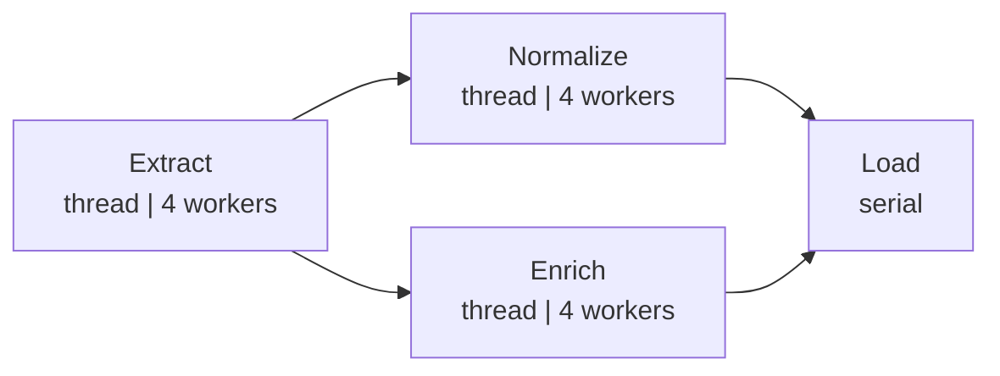
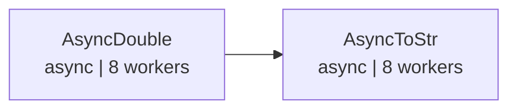

# demo_graph.py Demo Notes

> 📅 Last Updated: 2026/05/24

## Purpose

Show advanced `TaskGraph` topologies in CelestialFlow: a fan-out / fan-in ETL pipeline and an asynchronous staged pipeline.

## Demo Scenarios

### `demo_etl_fan_out_fan_in`
ETL pipeline with a fan-out / fan-in topology:



ASCII sketch:

```
Extract ──┬── Normalize ──┬── Load
          └── Enrich ─────┘
```

- `Extract`: generate records from IDs (thread mode, 4 workers).
- `Normalize`: normalize record values (thread mode, 4 workers).
- `Enrich`: add category labels to records (thread mode, 4 workers).
- `Load`: save records (serial mode).

**Graph topology**: DAG, one-to-many fan-out plus many-to-one fan-in.
**Scheduling mode**: `eager`.
**After execution**: calls `graph.get_graph_summary()` to print success and failure counts.

### `demo_async_staged_pipeline`
Two-stage asynchronous pipeline:



ASCII sketch:

```
AsyncDouble ──> AsyncToStr
```

- `AsyncDouble`: asynchronously doubles the input (`async`, 8 workers).
- `AsyncToStr`: asynchronously converts results to strings (`async`, 8 workers).

**Graph topology**: DAG, linear two-stage flow.
**Scheduling mode**: `staged`, running layer by layer.
**After execution**: calls `graph.get_status_snapshot()` to print success and failure counts per stage.

## Key Configuration

- All stages use `stage_mode="thread"`.
- The ETL pipeline uses `schedule_mode="eager"`; the async pipeline uses `schedule_mode="staged"`.
- `execution_mode="async"` is used for coroutine task functions.

## Potential Issues

1. **No assertions**: this is a demo script and does not validate result correctness.
2. **ETL functions contain sleep**: `extract_record` sleeps 0.5s, `transform_normalize` / `transform_enrich` sleep 0.3s, and `load_record` sleeps 0.2s, so a full run takes noticeable time.

## How to Run

```bash
python demo/demo_graph.py
```

## Expected Behavior

### ETL Pipeline (`demo_etl_fan_out_fan_in`)

Execution proceeds in the order Extract -> Normalize/Enrich -> Load, and prints sleep-driven logs plus a final summary:

```
[Extract] Input: 0 -> Output: {'id': 0, 'value': 101}
[Extract] Input: 1 -> Output: {'id': 1, 'value': 102}
[Normalize] Input: {'id': 0, 'value': 101} -> Output: {'id': 0, 'value': 0.01}
[Enrich] Input: {'id': 0, 'value': 101} -> Output: {'id': 0, 'label': 'odd'}
...
--- Graph Summary ---
Extract    : success=5  fail=0
Normalize  : success=5  fail=0
Enrich     : success=5  fail=0
Load       : success=10 fail=0
```

> Each `Extract` output is processed once by `Normalize` and once by `Enrich`, then both flows are merged by `Load`. With `range(5)` as input, `Load` receives 10 tasks in total.

### Async Pipeline (`demo_async_staged_pipeline`)

Stages run layer by layer: `AsyncDouble` finishes before `AsyncToStr` starts.

```
--- Staged 1: AsyncDouble ---
[AsyncDouble] Input: 1 -> Output: 2
[AsyncDouble] Input: 2 -> Output: 4
...
--- Staged 2: AsyncToStr ---
[AsyncToStr] Input: 2 -> Output: 'Result: 2'
[AsyncToStr] Input: 4 -> Output: 'Result: 4'
...
--- Status Snapshot ---
AsyncDouble : success=5  fail=0  pending=0
AsyncToStr  : success=5  fail=0  pending=0
```

> Total runtime is roughly 3-5 seconds, mainly due to the built-in `sleep` calls.

## Dependencies

- `celestialflow` (`TaskGraph`, `TaskStage`)
- `demo_utils` (`extract_record`, `transform_normalize`, `transform_enrich`, `load_record`, `async_double`, `async_to_str`)
- `python-dotenv`
- External services: CelestialTree (optional), Reporter (optional)
