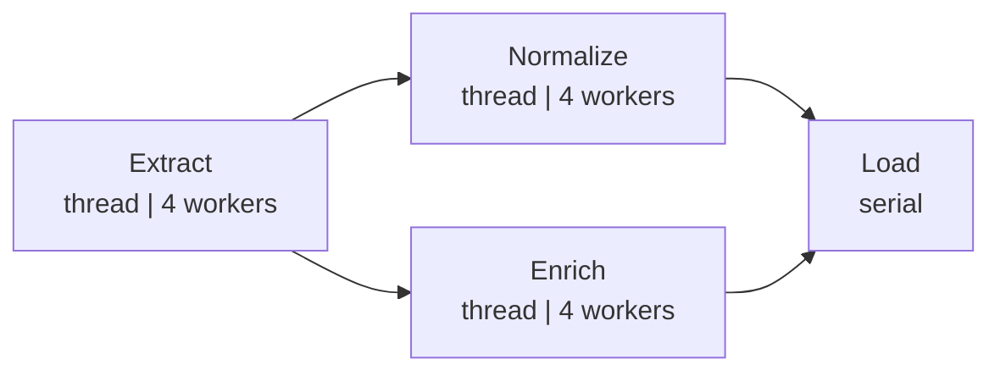
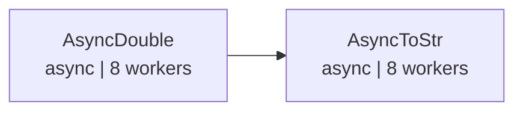

# demo_graph.py Demo Guide

> 📅 Last Updated: 2026/08/31

## Objective

Demonstrates advanced graph topology construction in CelestialFlow's `TaskGraph`: a fan-out/fan-in ETL pipeline and an asynchronous staged pipeline.

## Demo Scenarios

### `demo_etl_fan_out_fan_in`
ETL pipeline with fan-out/fan-in topology:


```mermaid
flowchart LR
    Extract["Extract<br/>thread | 4 workers"] --> Normalize["Normalize<br/>thread | 4 workers"]
    Extract --> Enrich["Enrich<br/>thread | 4 workers"]
    Normalize --> Load["Load<br/>serial"]
    Enrich --> Load
```

ASCII supplementary diagram:

```
Extract ──┬── Normalize ──┬── Load
          └── Enrich ─────┘
```

- `Extract` → Generates records by ID (thread mode, 4 workers)
- `Normalize` → Normalizes record values (thread mode, 4 workers)
- `Enrich` → Adds category labels to records (thread mode, 4 workers)
- `Load` → Saves records (serial mode)

**Graph structure**: DAG, one-to-many fan-out + many-to-one fan-in
**Graph mode**: `graph_mode="thread"`

### `demo_async_pipeline`
Two-stage async pipeline:


```mermaid
flowchart LR
    AsyncDouble["AsyncDouble<br/>async | 8 workers"] --> AsyncToStr["AsyncToStr<br/>async | 8 workers"]
```

ASCII supplementary diagram:

```
AsyncDouble ──> AsyncToStr
```

- `AsyncDouble` → Async doubles the input (async mode, 8 workers)
- `AsyncToStr` → Async converts result to string (async mode, 8 workers)

**Graph structure**: DAG, linear two-stage
**Graph mode**: `graph_mode="async"`

## Key Configuration

- Each Stage explicitly specifies its execution mode via `TaskStage(..., execution_mode="thread" | "async")`
- The ETL and async pipelines specify graph mode via `TaskGraph(..., graph_mode="thread")` and `graph_mode="async")` respectively
- `execution_mode="async"` is used for coroutine task functions (`async_double`, `async_to_str`)

## Potential Issues

1. **No assertions**: Demo script; does not verify result correctness.
2. **ETL functions include sleep**: `extract_record` (0.5s), `transform_normalize`/`transform_enrich` (0.3s), `load_record` (0.2s); full execution takes some time.

## How to Run

```bash
python demo/demo_graph.py
```

## Expected Behavior

### ETL Pipeline (`demo_etl_fan_out_fan_in`)

Executes Extract → Normalize/Enrich → Load sequentially, each Stage internally outputs execution logs through `print` or sleep. The script itself does not actively print the final Graph Summary or per-Stage counts; manual confirmation is required (the mock output is for illustration only).

```
[Extract] Input: 1 -> Output: {'id': 1, 'value': 10, 'label': 'item_1'}
[Extract] Input: 2 -> Output: {'id': 2, 'value': 20, 'label': 'item_2'}
[Normalize] Input: {'id': 1, 'value': 10} -> Output: {'id': 1, 'value': 10, 'normalized': 0.1}
[Enrich] Input: {'id': 1, 'value': 10} -> Output: {'id': 1, 'value': 10, 'category': 'odd'}
...
--- Graph Summary ---
Extract    : success=15 fail=0
Normalize  : success=15 fail=0
Enrich     : success=15 fail=0
Load       : success=30 fail=0
```

> When the input is `range(1, 16)`, Extract processes 15 records, Normalize and Enrich each receive 15, and the Load node receives a total of 30 tasks (15 × 2 downstream).

### Async Pipeline (`demo_async_pipeline`)

Two-stage sequential execution: `AsyncDouble` first completes all 20 tasks, then `AsyncToStr` receives them one by one and formats the output.

```
[AsyncDouble] Input: 1 -> Output: 2
[AsyncDouble] Input: 2 -> Output: 4
...
[AsyncToStr] Input: 2 -> Output: 'result=2'
[AsyncToStr] Input: 4 -> Output: 'result=4'
...
```

> Total execution time is about 1-3 seconds (requires manual confirmation), primarily affected by the built-in `sleep` (`async_double` 0.3s + `async_to_str` 0.2s) and 8 concurrent coroutine scheduling.

## Dependencies

- `celestialflow` (`TaskGraph`, `TaskStage`, `TaskReporter`)
- `demo_utils` (`extract_record`, `transform_normalize`, `transform_enrich`, `load_record`, `async_double`, `async_to_str`)
- `python-dotenv`
- External services: CelestialTree (optional), Reporter (optional)
