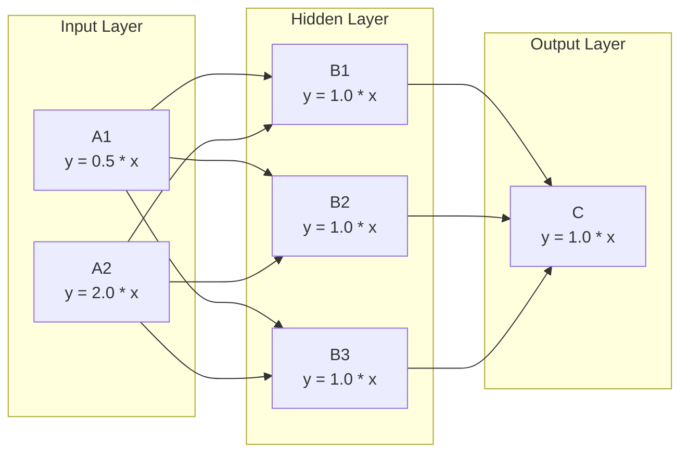

# demo_network.py Demo Guide

> 📅 Last Updated: 2026/08/26

## Objective

Demonstrate how to use `TaskCross` to construct a multi-layer neural network topology (2→3→1 fully connected), and assign different weight parameters to each node through a closure factory function, showcasing CelestialFlow's graph expression capability in neural-network-like scenarios.

This file evolves `demo_network` in `demo_structure.py` for the first time: the operation at each node is replaced from the fixed `add_one_sleep` (`x + 1`) to a configurable linear function `y = w * x + b`, so that each node has its own weight and bias.

## Demo Content

### `demo_network_step1`



#### Construction Method

- Use `TaskCross` to build the 2-3-1 three-layer topology, `graph_mode="thread"`
- **Input layer**: `A1(x) = 0.5x`, `A2(x) = 2.0x`, each receiving different input ranges
- **Hidden layer**: `B1..B3(x) = 1.0x`, three nodes process the Fan-in results from both input layers in parallel
- **Output layer**: `C(x) = 1.0x`, aggregating all results from B1~B3
- After running, call `C.get_success_pairs()` (read successful results from the lifecycle store) to collect the first 10 `(input → output)` pairs and print them

#### Core Function

**`linear(w, b)`**: A closure factory function that returns `_forward(x) -> w * x + b`. It satisfies `TaskStage`'s constraint that `func` accepts only one positional argument; by using a closure to fix the weight and bias, no separate function needs to be defined for every weight combination.

```python
def linear(w: float, b: float):
    def _forward(x):
        return w * x + b
    return _forward
```

## Key Configuration

| Node | Function | Weight w | Bias b | max_workers | Input |
|------|------|:------:|:------:|:-----------:|------|
| A1 | `linear(0.5, 0.0)` | 0.5 | 0.0 | 2 | `[1, 2, 3, 4, 5]` |
| A2 | `linear(2.0, 0.0)` | 2.0 | 0.0 | 2 | `[11, 12, 13, 14, 15]` |
| B1~B3 | `linear(1.0, 0.0)` | 1.0 | 0.0 | 2 | Fan-in from A1/A2 |
| C | `linear(1.0, 0.0)` | 1.0 | 0.0 | 2 | Fan-in from B1~B3 |

- All Stages use `execution_mode="thread"`, and `TaskCross` as a whole uses `graph_mode="thread"`
- Output layer C calls `get_success_pairs()` after running to read all successful results (no extra persistence configuration needed)

## Design Intent

This file is positioned as **Step 1**—keeping the 2-3-1 topology of `demo_network` from `demo_structure.py` unchanged, but upgrading each node's function from a fixed hard-coded operation to a parameterized linear transformation. Subsequent steps can extend on this basis:

- Activation functions (ReLU / Sigmoid)
- Sample pairing (the same input index from A1 and A2 corresponds to the same sample)
- Loss calculation and backpropagation

## Potential Issues

1. **No assertions**: This is a demo script; successful execution only means the graph construction and scheduling are correct, and does not verify the weights or computation results.
2. **No sample pairing**: A1's and A2's tasks are processed independently, and the "same original sample being processed by A1 and A2 separately and then aggregated at the same B node" pairing logic has not been implemented yet.
3. **No sleep**: The `linear` function contains no delay, so execution is very fast (microsecond-level), with no noticeable waiting like other demos.
4. **30 tasks converge to C**: A1 (5 tasks) × 3 hidden nodes + A2 (5 tasks) × 3 hidden nodes = 30 hidden layer outputs, which are then all processed by C, resulting in 30 result records.

## How to Run

```bash
python demo/demo_network.py
```

## Expected Behavior

After running, the script prints node configuration information and the input → output mappings collected by node C:

```
─── Step 1: Each node y = w*x + b ───

  A1(x) = 0.5 * x,  Input: [1, 2, 3, 4, 5]
  A2(x) = 2.0 * x,  Input: [11, 12, 13, 14, 15]
  B1..B3(x) = 1.0 * x
  C(x) = 1.0 * x
  Running...
  C received 30 tasks in total

  C's (input → output), first 10 entries:
     0.5  →  0.5
     1.0  →  1.0
     1.5  →  1.5
     2.0  →  2.0
     2.5  →  2.5
    22.0  →  22.0
    24.0  →  24.0
    26.0  →  26.0
    28.0  →  28.0
    30.0  →  30.0
```

> Since all hidden nodes currently have a weight of 1.0, C's output values are directly equal to the input values.
> A1 (5 values) and A2 (5 values) are each passed through B1/B2/B3 (3 hidden nodes) and then converge at C, generating a total of 30 result records.

## Dependencies

- `celestialflow` (`TaskCross`, `TaskStage`)
