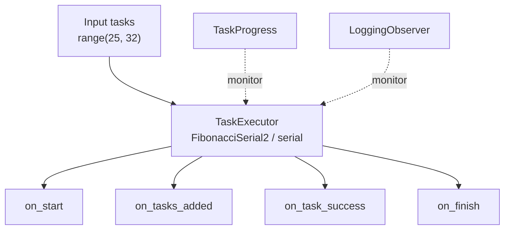

# demo_observer.py Demo Guide

> 📅 Last Updated: 2026/06/28

## Objective

Demonstrate how to register different types of observers for `TaskExecutor` in CelestialFlow.

This file showcases two approaches simultaneously:

- Using the built-in `TaskProgress` to display a `tqdm`-based progress bar
- Directly inheriting `BaseObserver` to implement a custom `LoggingObserver`

## Demo Content

The current demo contains two entry functions:

| Function | Description |
|------|------|
| `demo_progress_observer` | Create `TaskExecutor`, register `TaskProgress`, display progress bar |
| `demo_custom_observer` | Create `TaskExecutor`, register `LoggingObserver`, print observer lifecycle logs |

The roles of the two observer types:



## Key Configuration

- `execution_mode="serial"`
- `max_workers=6`
- `max_retries=1`
- Both examples register observers via `executor.add_observer(...)`

Built-in observer:

| Observer | Purpose |
|----------|------|
| `TaskProgress` | Display execution progress using `tqdm`, suitable for CLI interactive scenarios |

The current `LoggingObserver` implements the following callbacks:

| Callback | Purpose |
|------|------|
| `on_start` | Log executor name and initial total task count |
| `on_tasks_added` | Receive new task count and update total |
| `on_task_success` | Count successful tasks |
| `on_task_fail` | Count failed tasks |
| `on_task_duplicate` | Count duplicate tasks |
| `on_finish` | Output final summary |

## Potential Issues

1. **Default `main()` currently only runs `demo_custom_observer`**: To see the progress bar effect, change the call in `__main__` to `demo_progress_observer()`.
2. **Current example only shows the success path**: `test_task` is currently `range(25, 32)`, so runtime will typically only see `on_start`, `on_tasks_added`, `on_task_success`, and `on_finish`.
3. **`on_start` initial total may be 0**: The executor triggers the start event first, then informs the actual number of added tasks via `on_tasks_added`. This is normal behavior determined by the current notification order.
4. **No assertions**: This is a demo script. It does not validate result values; it only demonstrates observer invocation timing.
5. **Computation time varies with input**: The current Fibonacci is iterative O(n); single-task time grows linearly with `n`, but the difference between `fibonacci(31)` and `fibonacci(25)` is still at the microsecond level and will not significantly affect total duration.

## How to Run

```bash
python demo/demo_observer.py
```

## Expected Behavior

After running, it prints observer lifecycle logs similar to the following:

### `demo_progress_observer`

If the entry point is switched to `demo_progress_observer()`, the terminal will show a progress bar like:

```text
FibonacciSerial2(serial): 100%|████████████████████████████| 7/7 [00:00<00:00, ...it/s]
```

### `demo_custom_observer`

If running `demo_custom_observer()`, it prints observer lifecycle logs similar to:

```text
[observer] start executor=FibonacciSerial2(serial), total=0
[observer] tasks added +7, total=7
[observer] success +1, succeeded=1
[observer] success +1, succeeded=2
[observer] success +1, succeeded=3
[observer] success +1, succeeded=4
[observer] success +1, succeeded=5
[observer] success +1, succeeded=6
[observer] success +1, succeeded=7
[observer] finish executor=FibonacciSerial2(serial), total=7, succeeded=7, failed=0, duplicated=0
```

To observe failure and duplicate events, you can change the input back to a list containing invalid values or duplicates, for example:

```python
test_task = list(range(25, 32)) + [0, 27, None, 0, ""]
```

This makes it easier to trigger:

- `on_task_fail`
- `on_task_duplicate`

## Dependencies

- `celestialflow` (`BaseObserver`, `TaskExecutor`, `TaskProgress`)
- `demo_utils` (`fibonacci`)
