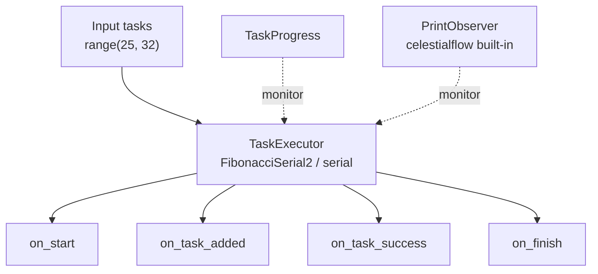

# demo/demo_observer.py

> 📅 Last Updated: 2026/09/24

## Objective

Demonstrate how to register different types of observers for `TaskExecutor` in CelestialFlow.

This file showcases two approaches simultaneously:

- Using the custom `TaskProgress` defined in this file (inherits `BaseObserver`, a `tqdm`-based progress bar observer)
- Directly using the built-in `PrintObserver` of `celestialflow` (pass `name` at construction as the output prefix; the example passes `executor.get_name()`)

## Demo Content

The current demo contains two entry functions:

| Function | Description |
|------|------|
| `demo_progress_observer` | Create `TaskExecutor`, register `TaskProgress`, display progress bar |
| `demo_print_observer` | Create `TaskExecutor`, register the built-in `PrintObserver(executor.get_name())`, print observer lifecycle logs |

The roles of the two observer types:


```mermaid
flowchart TB
    Input["Input tasks<br/>range(25, 32)"] --> Executor["TaskExecutor<br/>FibonacciSerial2 / serial"]
    Progress["TaskProgress"] -.monitor.-> Executor
    Custom["PrintObserver<br/>celestialflow built-in"] -.monitor.-> Executor
    Executor --> Start["on_start"]
    Executor --> Added["on_task_added"]
    Executor --> Success["on_task_success"]
    Executor --> Finish["on_finish"]
```

## Key Configuration

- `execution_mode="serial"`
- `max_workers=6`
- `max_retries=1`
- Both examples register observers via `executor.add_observer(...)`

Observer overview:

| Observer | Source | Purpose |
|----------|------|------|
| `TaskProgress` | Locally defined in this file | Display execution progress using `tqdm`, suitable for CLI interactive scenarios |
| `PrintObserver` | Built into `celestialflow` | Output each callback's count using `print`, with the constructor argument `name` as the output prefix |

`PrintObserver` implements the following callbacks (`name` is the prefix passed at construction):

| Callback | Output / Purpose |
|------|------|
| `on_start` | Prints `[{name}] start total={total}` |
| `on_task_added` | Adds to the total and prints `[{name}] total={total}(+{count})` |
| `on_task_success` | Counts successes and prints `[{name}] succeeded={n}(+{count}), total={total}` |
| `on_task_fail` | Counts failures and prints `[{name}] failed={n}(+{count}), total={total}` |
| `on_task_duplicate` | Counts duplicates and prints `[{name}] duplicated={n}(+{count}), total={total}` |
| `on_finish` | Prints `[{name}] finish total=..., succeeded=..., failed=..., duplicated=...` |

## Potential Issues

1. **Default `main()` runs both `demo_progress_observer` and `demo_print_observer`**: Both observers execute in sequence, first showing the tqdm progress bar, then outputting logs.
2. **Current example only shows the success path**: `test_task` is currently `range(25, 32)`, so runtime will typically only see `on_task_added`, `on_start`, `on_task_success`, and `on_finish`.
3. **`on_task_added` arrives before `on_start`**: `run()` injects all tasks before starting the executor, so by the time `on_start` fires, `total` has already accumulated to its final value (`PrintObserver` prints several `total=...(+1)` lines first, then `start total=7`). `TaskProgress` also relies on this, using the accumulated `_total` to create the progress bar in `on_start`.
4. **No assertions**: This is a demo script. It does not validate result values; it only demonstrates observer invocation timing.
5. **Computation time varies with input**: The current Fibonacci is iterative O(n); single-task time grows linearly with `n`, but the difference between `fibonacci(31)` and `fibonacci(25)` is still at the microsecond level and will not significantly affect total duration.

## How to Run

```bash
python demo/demo_observer.py
```

## Expected Behavior

After running, it prints observer lifecycle logs similar to the following:

### `demo_progress_observer`

When running `demo_progress_observer()`, the terminal will show a progress bar similar to this (`TaskProgress` does not set `desc`, so there is no prefix):

```text
 0%|          | 0/7 [00:00<?, ?it/s]100%|████████████████████████████| 7/7 [00:00<00:00, ...it/s]
```

### `demo_print_observer`

When running `demo_print_observer()`, it prints observer lifecycle logs similar to the following (the prefix is `FibonacciSerial2` returned by `executor.get_name()`):

```text
[FibonacciSerial2] total=1(+1)
[FibonacciSerial2] total=2(+1)
...
[FibonacciSerial2] total=7(+1)
[FibonacciSerial2] start total=7
[FibonacciSerial2] succeeded=1(+1), total=7
[FibonacciSerial2] succeeded=2(+1), total=7
...
[FibonacciSerial2] succeeded=7(+1), total=7
[FibonacciSerial2] finish total=7, succeeded=7, failed=0, duplicated=0
```

To observe failure and duplicate events, you can change the input back to a list containing invalid values or duplicates, for example:

```python
test_task = list(range(25, 32)) + [0, 27, None, 0, ""]
```

This makes it easier to trigger:

- `on_task_fail`
- `on_task_duplicate`

## Dependencies

- `celestialflow` (`BaseObserver`, `PrintObserver`, `TaskExecutor`; `TaskProgress` is locally defined by `demo_observer.py` in the same directory of this repository)
- `demo_utils` (`fibonacci`)
- `tqdm` (dependency for the `TaskProgress` progress bar)
