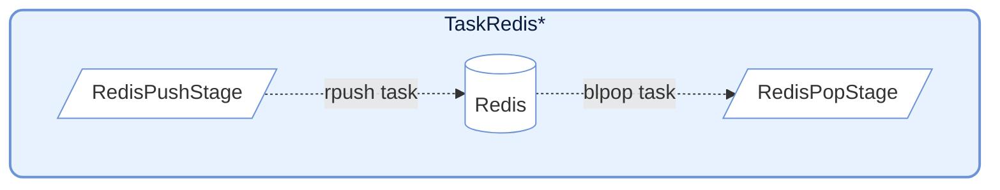
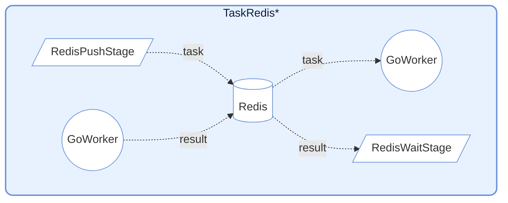
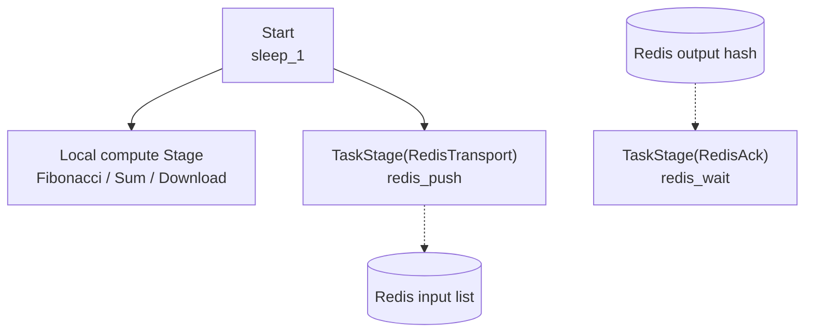

# demo_redis.py Demo Guide

> 📅 Last Updated: 2026/06/17

## Objective

Demonstrate how to implement Redis task submission, result acknowledgment, and external task injection using only ordinary `TaskStage` and custom callables, without relying on built-in Redis-specific nodes.

## Design Highlights

- `redis_push()`: Serializes a task and writes it to a Redis List, returning a `task_id`
- `redis_wait()`: Polls a Redis Hash, waiting for a remote Worker to write back the result
- `redis_pop()`: Uses `BLPOP` to block and pull a task from a Redis List
- All three capabilities are just ordinary Python methods, then attached to the graph via `TaskStage(..., func=helper.method)`

## Redis Interaction Design



Provides functions for interacting with Redis, commonly used for cross-language / cross-process collaboration (e.g., working with Go Workers).

### RedisPush

Push a task to a Redis List.

```python
def redis_push(task: Any) -> int:
    """Push a task into Redis"""
    key, task_payload = task
    redis_client: redis.Redis = get_redis()
    task_id = next(_task_ids)
    payload = json.dumps(
        {
            "id": task_id,
            "task": [task_payload],
            "emit_ts": time.time(),
        }
    )
    _ = redis_client.rpush(f"{key}:input", payload)
    return key, task_id
```

**Behavior**: Serializes the task as JSON and `rpush`es it to a Redis List. Internally uses `execution_mode="thread"` and `max_workers=4` for concurrent writes.

### RedisPop

Pull a task from a Redis List as an input source.

```python
def redis_pop(key: str) -> Any:
    """Pop a task from Redis"""
    redis_client: redis.Redis = get_redis()
    res = cast(list[Any] | None, redis_client.blpop(key, timeout=redis_timeout))
    if res is None:
        raise CelestialFlowTimeoutError(
            "Redis item not returned in time after being fetched"
        )

    _, item = res
    item_obj = cast(dict[str, Any], json.loads(cast(str, item)))
    task_payload = item_obj.get("task")
    if task_payload is None:
        raise RemoteWorkerError("Redis source payload missing 'payload'")
    if len(task_payload) == 1:
        return task_payload[0]
    return tuple(task_payload)
```

**Behavior**: Uses `blpop` to block and pull tasks. Internally uses `execution_mode="serial"`, suitable as a pipeline entry node.

### RedisWait



Wait for execution results from a remote Worker.

```python
def redis_wait(task: tuple[str, int]) -> Any:
    """Wait for task completion"""
    key, task_id = task
    redis_client: redis.Redis = get_redis()
    start_time = time.perf_counter()

    while True:
        result = cast(str | None, redis_client.hget(f"{key}:output", str(task_id)))
        if result:
            _ = redis_client.hdel(f"{key}:output", str(task_id))
            result_obj = cast(dict[str, Any], json.loads(result))
            status = result_obj.get("status")
            if status == "success":
                return _normalize_result(result_obj.get("result"))
            if status == "error":
                raise RemoteWorkerError(str(result_obj.get("error")))
            raise RemoteWorkerError(f"Unknown ack status: {result_obj}")

        if (time.perf_counter() - start_time) > redis_timeout:
            raise CelestialFlowTimeoutError(
                f"Redis ack timeout: task_id={task_id} not acknowledged"
            )
        time.sleep(0.1)
```

**Behavior**: Polls Redis Hash waiting for the corresponding `task_id` result. Supports handling success results or raising `RemoteWorkerError`.

## Redis Data Format

### TaskRedisTransport Push Format

```json
{
    "id": 12345678,
    "task": ["arg1", "arg2"],
    "emit_ts": 1703001234.567
}
```

### TaskRedisAck Expected Result Format

```json
{
    "status": "success",
    "result": "computed_value"
}
```

Or error format:
```json
{
    "status": "error",
    "error": "Error message"
}
```

---

## Notes

1. **Connection management**: The Redis client is lazily initialized on first use.
2. **Timeout handling**: `TaskRedisSource` and `TaskRedisAck` support timeout configuration, throwing `TimeoutError` on timeout.
3. **Error propagation**: Errors returned by remote Workers are propagated through `RemoteWorkerError`.
4. **Idempotency**: `TaskRedisAck` deletes the record from Redis after retrieving the result, ensuring single consumption.

## Data Protocol

This demo assumes two Redis data structures by default:

- Input queue: Redis List
- Output result: Redis Hash

### Transport Push Format

The JSON structure written to the Redis List by `redis_push()` is as follows:

```json
{
  "id": 123,
  "task": ["payload"],
  "emit_ts": 1703001234.567
}
```

Field descriptions:

- `id`: Locally generated task number
- `task`: Task payload, packaged uniformly as a list
- `emit_ts`: Send timestamp, useful for debugging and latency investigation

### Ack Expected Result Format

When the remote Worker writes back to the Redis Hash, a success result should look like:

```json
{
  "status": "success",
  "result": "computed_value"
}
```

An error result should look like:

```json
{
  "status": "error",
  "error": "Error message"
}
```

### Source Read Format

The Redis List elements read by `redis_pop()` also follow the same payload structure as Transport, meaning they must contain at least:

```json
{
  "task": ["payload"]
}
```

## Demo Scenarios

### `demo_redis_ack_0/1/2`

Compare two execution paths: "local Python direct execution" and "sending to an external Worker via Redis".



| Scenario | Local Node | Remote Input Key | Remote Output Key |
|------|----------|--------------|---------------|
| `demo_redis_ack_0` | `Fibonacci` | `testFibonacci:input` | `testFibonacci:output` |
| `demo_redis_ack_1` | `Sum` | `testSum:input` | `testSum:output` |
| `demo_redis_ack_2` | `Download` | `testDownload:input` | `testDownload:output` |

The three scenarios differ in the local direct-computation stage:

- `demo_redis_ack_0`: CPU-intensive Fibonacci
- `demo_redis_ack_1`: Lightweight summation
- `demo_redis_ack_2`: Real download I/O

They share the same pattern:

- The `Start` node produces original tasks
- One path goes directly into a local compute stage
- The other path goes into `RedisTransport`
- `RedisTransport`'s output `task_id` then goes into `RedisAck`
- Ultimately used to compare the effects of "local direct execution" vs. "remote Redis collaborative execution"

### `demo_redis_source_0`

Demonstrate how to use Redis as an external input source to the graph: one stage writes to it, another stage pulls via `BLPOP` and continues downstream processing.


This scenario emphasizes "Redis as an inter-graph bridge input source":

- `Sleep0` first writes tasks into Redis
- `RedisSource` then independently fetches tasks from Redis
- `Sleep1` receives the Redis-injected tasks and continues processing

## Prerequisites

### 1. Start Redis

Before running this demo, ensure the Redis service is available.

### 2. Configure Environment Variables

The `.env` file in the project root should contain at least:

```env
REDIS_HOST=127.0.0.1
REDIS_PASSWORD=
REPORT_HOST=127.0.0.1
REPORT_PORT=8000
```

### 3. Prepare Remote Workers (only needed for Ack scenarios)

To actually observe remote result write-back in `demo_redis_ack_*`, you need external Workers that:

- Pull tasks from the corresponding input list
- Execute them according to the agreed structure
- Write results back to the corresponding output hash

For details on the remote `go-worker` project, see [other/go_worker.md](https://github.com/Mr-xiaotian/CelestialFlow/blob/main/docs/zh-CN/other/go_worker.md)

## How to Run

```bash
# Run the default example (demo_redis_ack_0)
python demo/demo_redis.py

# For other scenarios, modify the entry function at the bottom of the file's main
```

You can also directly open [demo_redis.py](https://github.com/Mr-xiaotian/CelestialFlow/blob/main/demo/demo_redis.py) and switch the final `if __name__ == "__main__":` entry.

## Potential Issues

1. **Timeout**: If the external Worker does not write back in time, `RedisTaskAck.wait()` throws a timeout exception
2. **Protocol mismatch**: If the Worker's returned JSON lacks `status` or `result/error` fields, `RemoteWorkerError` is thrown
3. **Network and path dependencies**: `demo_redis_ack_2` involves real download URLs and local paths and may fail depending on the environment
4. **No assertions**: This is an integration demo; it does not validate business result correctness
5. **Local `task_id` scope**: `RedisTaskTransport`'s `task_id` is an incrementing value within the current process, suitable for demos and single-end collaboration, but not equivalent to a globally distributed unique ID
6. **Single consumption**: `RedisTaskAck` immediately calls `HDEL` after retrieving a result, so the same result is not read twice by default

## Notes

1. **Connection management**: The Redis client is lazily initialized on first use and reused throughout the helper's lifecycle
2. **Timeout handling**: Both `RedisTaskSource` and `RedisTaskAck` support `timeout`
3. **Error propagation**: Errors returned by remote Workers are directly thrown upward via `RemoteWorkerError`
4. **Replaceable protocol**: You can fully modify the JSON structure to match your own Worker protocol, as long as you synchronize the three helpers
5. **Framework positioning**: What is shown here is "how to implement Redis integration using ordinary `TaskStage`", not requiring the framework to have built-in Redis nodes

## Dependencies

- `celestialflow` (`TaskGraph`, `TaskStage`)
- `demo_utils`
- `python-dotenv`
- `redis`
- External services: Redis, remote Worker (optional), Reporter (optional)
