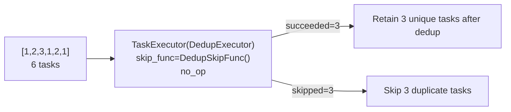
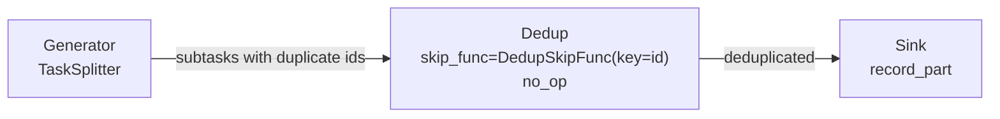

# demo/demo_skip_dedup.py

> 📅 Last Updated: 2026/10/09

## Objective

Demonstrates how to deduplicate tasks within a node using the `skip_func` mechanism of `TaskExecutor`. The framework no longer has built-in dedup logic; instead, the judgment of "whether this task has already appeared" is given to the caller via `skip_func`: when `skip_func` returns `True`, the task does not execute `func` and is directly recorded as "skipped", thereby achieving deduplication capability on a single `Executor` or an intermediate graph node.

This demo covers two dedup scenarios:

- **Single-Executor scenario**: Directly provide a dedup judgment function to `TaskExecutor`.
- **Graph scenario**: Deduplicate at an intermediate node in the graph, so duplicate tasks no longer propagate further downstream.

## Demo Content

### Deduplication Judger `DedupSkipFunc`

```python
class DedupSkipFunc:
    def __init__(self, key: Callable[[Any], Any] | None = None) -> None: ...
    def __call__(self, task: Any) -> bool: ...
```

A "seen set"-based dedup judger that can be used directly as `skip_func`:

- Keys seen for the first time pass through (returns `False`); keys seen again are skipped (returns `True`).
- Constructor argument `key`: a function that extracts the dedup key from a task; by default, the task itself is used as the key.
- Internally, the class uses a `Lock` to protect "check-then-register", so it can be safely reused in thread / async execution modes.

> Note: The judgment function must be made thread-safe by the user (this example wraps it with a lock), and the task itself or its derived key must be hashable.

### Scenario 1: Single-Executor Dedup (`demo_skip_dedup_executor`)

Input `[1, 2, 3, 1, 2, 1]` (6 tasks, of which 3 are retained after dedup and 3 are duplicates):



- Skipped tasks neither execute `no_op` nor consume retry count.
- Therefore `succeeded` equals the number after dedup, and `skipped` equals the number of duplicate tasks.
- After running, node logs are printed via `PrintObserver`, and a summary is printed by reading `input_total` / `succeeded` / `skipped` from `MetricsObserver`.

### Scenario 2: Graph Intermediate-Node Dedup (`demo_skip_dedup_graph`)



- `Generator` (`TaskSplitter`): Splits each seed task into 3 subtasks, where the `id` of adjacent subtasks repeats (`split_with_duplicates`).
- `Dedup` (`TaskExecutor`): Uses `task["id"]` as the dedup key, with `skip_func=DedupSkipFunc(key=lambda task: task["id"])`, intercepting duplicate subtasks by `id`.
- `Sink` (`TaskExecutor`): Receives only deduplicated subtasks and calls `record_part` to produce readable records.

`TaskExecutor` forwards the return value of `func` downstream, so `Dedup` transparently passes tasks through with `no_op`, and `Sink` still receives the subtask dictionaries. The 3 seed tasks are split into 9 subtasks with duplicate `id`s; only 4 flow into `Sink` after dedup.

After running, it prints the per-node counts:

```text
[demo] per-node counts:
  Generator  input=3    ok=3    fail=0  skip=0    pending=0
  Dedup      input=9    ok=4    fail=0  skip=5    pending=0
  Sink       input=4    ok=4    fail=0  skip=0    pending=0
```

> `Dedup`'s `input_total` is the total number of subtasks it actually received, `succeeded` is the number of unique `id`s among them, and `skipped` is the number of intercepted duplicates.

## Key Implementation

- **`_metrics_of(target)`**: Looks up the `MetricsObserver` from the run object's `ObserverHub` (`target.observers._snapshot()`) and returns it; the graph / node itself no longer holds a `metrics` field. If not found, it raises `RuntimeError`.
- **`split_with_duplicates(n)`**: Splits a task into `[{"id": n, "part": "x"}, {"id": n, "part": "y"}, {"id": n + 1, "part": "x"}]`, deliberately producing duplicate `id`s.
- **`record_part(task)`**: Formats a subtask as `f"#{task['id']}:{task['part']}"`.

## Potential Issues

1. **Thread safety is the user's responsibility**: `skip_func` is a framework callback; if your custom judger has shared mutable state (such as a set or counter), you must add a lock yourself, otherwise it may go wrong in thread / async modes; this demo shows the standard practice using a `Lock`.
2. **The key must be hashable**: By default, the task itself is used as the key, so the task or its derived key must be hashable; otherwise the `set` lookup will raise a type error.
3. **Output is local statistics**: Both scenarios read `MetricsObserver` via `_metrics_of` to print counts and do not depend on any external service.

## How to Run

```bash
python demo/demo_skip_dedup.py
```

`__main__` calls `demo_skip_dedup_executor()` and `demo_skip_dedup_graph()` in sequence.

## Dependencies

- `celestialflow` (`PrintObserver`, `TaskExecutor`, `TaskGraph`, `TaskSplitter`)
- `celestialflow.observer` (`MetricsObserver`)
- `demo_utils` (`no_op`)