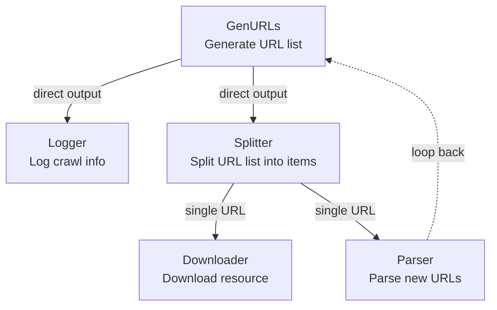
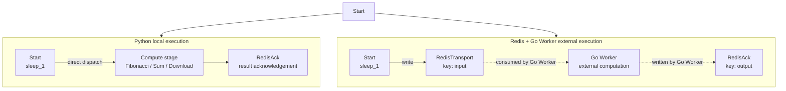
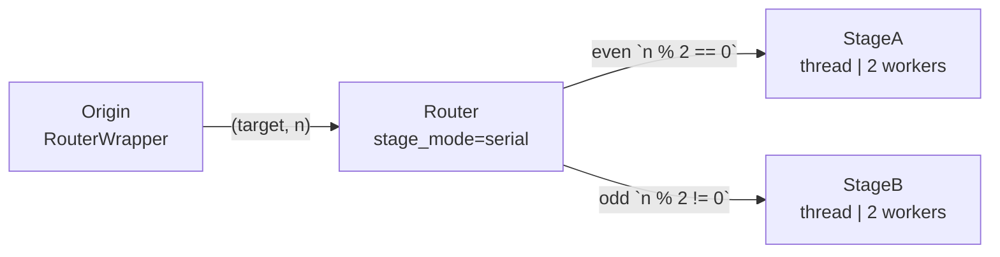

# demo_stages.py Demo Notes

> 📅 Last Updated: 2026/05/24

## Purpose

Demonstrate special stage types in CelestialFlow: `TaskSplitter` for task splitting, `TaskRouter` for routing, and `TaskRedisTransport` / `TaskRedisAck` / `TaskRedisSource` for Redis-based distributed transport. These demos build more complex task graphs with cycles and cross-device collaboration.

## Custom Subclasses

- `DownloadRedisTransport`: inherits from `TaskRedisTransport` and overrides `get_args()` to rewrite `/tmp/` into `X:/Download/download_go/` for a Go worker.
- `DownloadStage`: inherits from `TaskStage` and overrides `get_args()` to rewrite `/tmp/` into `X:/Download/download_py/` for local Python downloads.

## Demo Scenarios

### `demo_splitter_0`
Simulated crawler workflow:



- `GenURLs`: generate URL lists.
- `Logger`: record crawl logs.
- `Splitter`: split a URL list into individual URLs.
- `Downloader`: download resources.
- `Parser`: parse new URLs and feed them back to `GenURLs`.

**Graph topology**: cyclic graph with `parse_stage -> generate_stage`.

### `demo_splitter_1`
Demonstrates large-batch splitting: `range(int(1e5))` is wrapped in a list and sent into `TaskSplitter`, and downstream stages consume items one by one to avoid loading too many tasks into memory at once.

### `demo_redis_ack_0/1/2`
Compare Python-local execution with Redis + Go Worker external execution:



| Scenario | Workload Type | Python Local Node | Go Worker Node |
|----------|---------------|-------------------|----------------|
| `demo_redis_ack_0` | CPU-bound | `Fibonacci` | Fibonacci computation |
| `demo_redis_ack_1` | Communication-dominated | `Sum` (`sum_int`) | Sum calculation |
| `demo_redis_ack_2` | I/O-bound | `Download` (`download_to_file`, path `download_py/`) | Image download (`download_go/`) |

> Dashed arrows indicate cross-process or cross-device data flow. All `demo_redis_ack_*` cases share the same `Start` stage on the Python side.

### `demo_redis_source_0`
Demonstrates `TaskRedisSource` reading tasks independently from Redis to support cross-device or cross-TaskGraph data transfer.

### `demo_router_0`
Demonstrates `TaskRouter` dispatching tasks to different downstream nodes based on odd/even parity.



Routing logic: `RouterWrapper` generates `(target, n)` from the input value `n`, and `Router` forwards the task to `StageA` for even numbers or `StageB` for odd numbers.

## Key Configuration

- All stages default to `stage_mode="thread"`.
- `set_reporter(True)` enables monitoring reports.
- `set_ctree(True)` enables event tracing.

## Potential Issues

1. **Redis dependency**: the `demo_redis_*` cases require a working Redis service configured in `.env`.
2. **Go Worker setup**: before using the external worker, complete the setup described in `other/go_worker.md`.
3. **Hard-coded Windows paths**: `DownloadStage` and `DownloadRedisTransport` contain hard-coded `X:/Download/...` paths, which fail outside Windows or when those paths do not exist.
4. **Long runtime**: stages in `demo_splitter_0` include random 4-6 second sleeps, so a full run can exceed one minute.
5. **No assertions**: these are demonstrations, not correctness tests.

## How to Run

```bash
# Run the default demo (demo_splitter_0)
python demo/demo_stages.py

# Edit main() to run other scenarios
# for example, replace demo_splitter_0() with demo_router_0()
```

## Expected Behavior

### `demo_splitter_0` (Crawler Workflow)

After URL generation, `Splitter` fans out the list, while `Downloader` and `Parser` work in parallel and `Parser` loops results back to `Generator`:

```
[GenURLs] Generated 3 URLs
[Splitter] Splitting 3 URLs...
[Downloader] Downloading url_0...
[Parser] Parsing url_0...
[Logger] Logging: url_0
[Downloader] Downloading url_1...
...
```

> Because of the random sleeps, total runtime can exceed one minute.

### `demo_router_0` (Odd/Even Routing)

`Origin` emits `(target, n)` according to parity, and `Router` dispatches to `StageA` or `StageB`:

```
[Origin] Input: 0 -> RouterWrapper(0) -> ('stage_a', 0)
[Origin] Input: 1 -> RouterWrapper(1) -> ('stage_b', 1)
[Router] Routing 0 to stage_a
[Router] Routing 1 to stage_b
[StageA] Received: 0
[StageB] Received: 1
...
```

### `demo_redis_ack_0/1/2` (Redis Distributed Execution)

Python-local execution and Go Worker execution run side by side, and both eventually acknowledge through Redis:

```
[Fibonacci] Computing fibonacci for n=10...
[RedisTransport] Writing 10 to Redis key 'input:0'
[RedisAck] Acknowledging fibonacci result: 55
...
```

> Redis and Go Worker must be started in advance. These demos do not stop automatically and need to be terminated with `Ctrl+C`.

### `demo_splitter_1` (Large Data Splitting)

`range(100000)` is wrapped into a list, then emitted item by item by `TaskSplitter` without extra logging.

## Dependencies

- `celestialflow` (`TaskGraph`, `TaskStage`, `TaskChain`, `TaskSplitter`, `TaskRouter`, `TaskRedisTransport`, `TaskRedisAck`, `TaskRedisSource`)
- `demo_utils`
- `python-dotenv`
- External services: Redis, CelestialTree (optional), Reporter (optional), Go Worker (optional)
