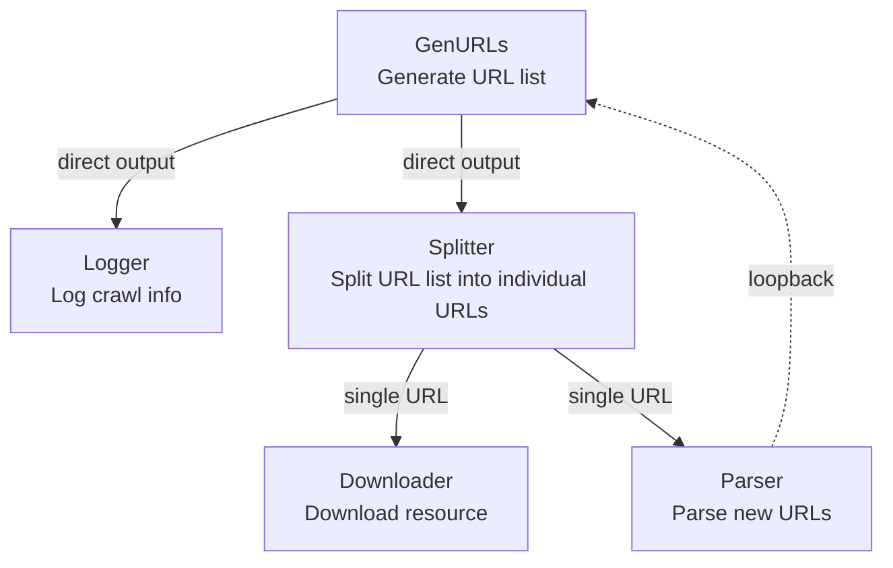
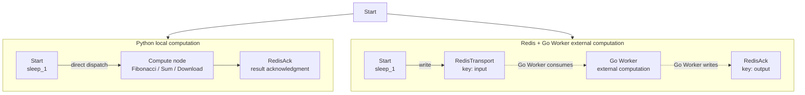
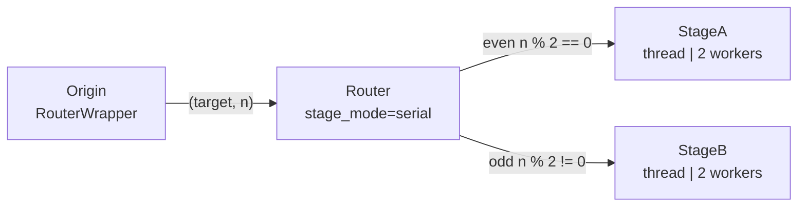

# demo_stages.py Demo Guide

> 📅 Last Updated: 2026/06/11

## Objective

Demonstrates special Stage nodes in CelestialFlow: `TaskSplitter` (task splitting), `TaskRouter` (task routing), `TaskRedisTransport` / `TaskRedisAck` / `TaskRedisSource` (Redis distributed transport). Builds complex task graphs containing cyclic dependencies and cross-device collaboration.

## Demo Scenarios

### `demo_splitter_0`
Simulates a crawler workflow:



- `GenURLs` → Generates URL list
- `Logger` → Logs crawl information
- `Splitter` → Splits URL list into individual URLs
- `Downloader` → Downloads resources
- `Parser` → Parses new URLs and loops back to `GenURLs`

**Graph structure**: Cyclic graph (`parse_stage → generate_stage`)

### `demo_splitter_1`
Demonstrates large batch splitting: input `range(int(1e5))` is wrapped in a list and passed to `TaskSplitter`, with downstream receiving items one by one, avoiding loading too many tasks into memory at once.

### `demo_redis_ack_0/1/2`
Compares latency between Python local computation and external computation via Redis + Go Worker:



| Scenario | Compute type | Python local node | Go Worker node |
|------|---------|----------------|----------------|
| `demo_redis_ack_0` | CPU-intensive | `Fibonacci` | Fibonacci computation |
| `demo_redis_ack_1` | Communication-overhead dominant | `Sum` (`sum_int`) | Sum computation |
| `demo_redis_ack_2` | I/O-intensive | `Download` (`download_to_file`) | Image download (external Worker) |

> Dashed arrows in the diagram indicate cross-process/cross-device data flow. All `demo_redis_ack_*` Python paths and Go Worker paths share the same `Start` node: `graph.connect([start_stage], [redis_tranport, compute_stage])`.

### `demo_redis_source_0`
Demonstrates `TaskRedisSource` independently reading tasks from Redis, enabling cross-device/cross-TaskGraph data transfer.

### `demo_router_0`
Demonstrates `TaskRouter` dispatching tasks to different downstream nodes based on parity.



Routing logic: The `Origin` stage's `RouterWrapper` generates `(target, n)` tuples based on the parity of input `n`; `Router` dispatches tasks to `StageA` (even) or `StageB` (odd) based on the `target` field.

## Key Configuration

- All stages default to `stage_mode="thread"` (multi-threaded)
- `set_reporter(True)` enables monitoring reporting
- `set_ctree(True)` enables event tracing

## Potential Issues

1. **Redis dependency**: The `demo_redis_*` series requires an available Redis service (configure `REDIS_HOST`, `REDIS_PASSWORD` in `.env`).
2. **Go Worker setup**: Before using external Workers, complete the [setup](https://github.com/Mr-xiaotian/CelestialFlow/blob/main/docs/reference/other/go_worker.md#前期设置).
3. **Hardcoded paths**: The download URL in `demo_redis_ack_2` is a sample URL that may fail in actual network environments and paths.
4. **Long runtime**: Stages in `demo_splitter_0` contain 4-6 seconds of random sleep; full execution may exceed 1 minute.
5. **No assertions**: Demo script; does not verify result correctness.

## How to Run

```bash
# Run default demo (demo_splitter_0)
python demo/demo_stages.py

# Modify main() to run other scenarios
# e.g., replace demo_splitter_0() with demo_router_0()
```

## Expected Behavior

### `demo_splitter_0` (Crawler workflow)

Generates URLs, splits via Splitter, Downloader and Parser process in parallel, Parser results loop back to Generator:

```
[GenURLs] Generated 3 URLs
[Splitter] Splitting 3 URLs...
[Downloader] Downloading url_0...
[Parser] Parsing url_0...
[Logger] Logging: url_0
[Downloader] Downloading url_1...
...
```

> Contains random sleep (4-6 seconds); total execution time may exceed 1 minute.

### `demo_router_0` (Parity routing)

Origin generates `(target, n)` based on input parity; Router dispatches to StageA (even) or StageB (odd):

```
[Origin] Input: 0 -> RouterWrapper(0) -> ('stage_a', 0)
[Origin] Input: 1 -> RouterWrapper(1) -> ('stage_b', 1)
[Router] Routing 0 to stage_a
[Router] Routing 1 to stage_b
[StageA] Received: 0
[StageB] Received: 1
...
```

### `demo_redis_ack_0/1/2` (Redis distributed computation)

Python local computation and Go Worker external computation execute in parallel, results written to Redis Ack respectively:

```
[Fibonacci] Computing fibonacci for n=10...
[RedisTransport] Writing 10 to Redis key 'input:0'
[RedisAck] Acknowledging fibonacci result: 55
...
```

> Requires Redis and Go Worker to be started beforehand (see [setup](#)). Will not stop automatically; manual Ctrl+C required to terminate.

### `demo_splitter_1` (Large batch splitting)

Wraps `range(100000)` as a list fed into Splitter, outputting individually to downstream for processing, with no additional output logs.

## Dependencies

- `celestialflow` (`TaskGraph`, `TaskStage`, `TaskChain`, `TaskSplitter`, `TaskRouter`, `TaskRedisTransport`, `TaskRedisAck`, `TaskRedisSource`)
- `demo_utils`
- `python-dotenv`
- External services: Redis, CelestialTree (optional), Reporter (optional), Go Worker (optional)
