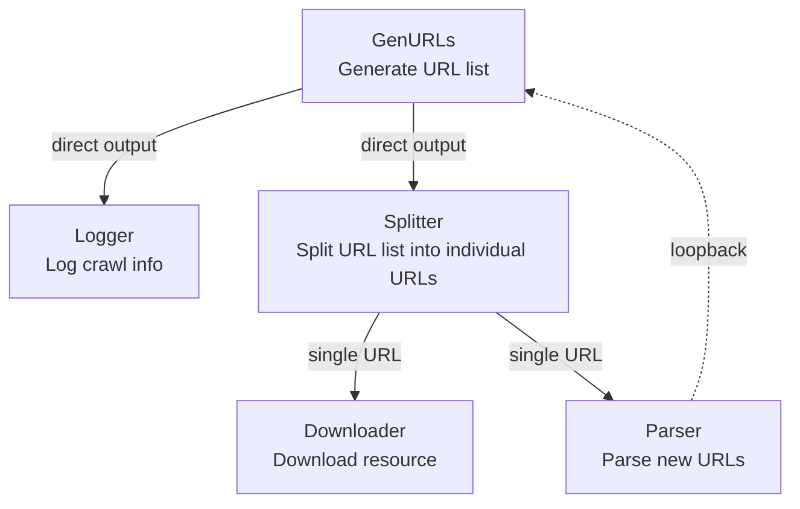
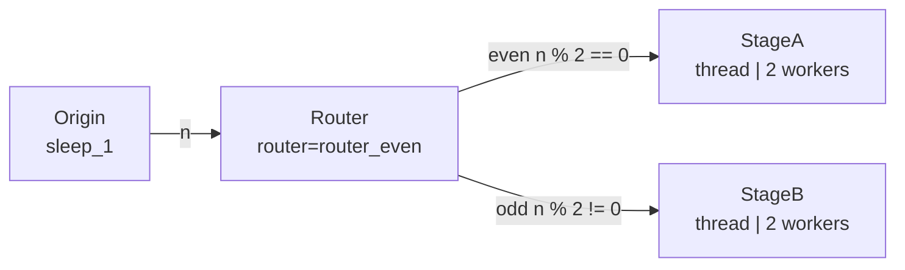

# demo_stages.py Demo Guide

> 📅 Last Updated: 2026/07/16

## Objective

Demonstrates special structural Stage nodes in CelestialFlow: `TaskSplitter` (task splitting) and `TaskRouter` (task routing). Showcases graph structure capabilities including cyclic dependencies, batch splitting, and conditional dispatching.

## Demo Scenarios

### `demo_splitter_0`
Simulates a crawler workflow:



- `GenURLs` → Generates URL list
- `Logger` → Logs crawl information
- `Splitter` → Splits URL list into individual URLs
- `Downloader` → Downloads resources
- `Parser` → Parses new URLs and loops back to `GenURLs`

**Graph structure**: Cyclic graph (`parse_stage → generate_stage`)

### `demo_splitter_1`
Demonstrates large batch splitting: input `range(100_000)` is wrapped in a list and passed to `TaskSplitter`, with downstream receiving items one by one, avoiding loading too many tasks into memory at once.

### `demo_router_0`
Demonstrates `TaskRouter` dispatching tasks to different downstream nodes based on parity.



Routing logic: The `Origin` stage simply outputs the original input integer; `TaskRouter` holds `router_even(n) -> str` and, in `_route()`, selects `StageA` (even) or `StageB` (odd) based on parity, then dispatches the raw task downstream.

## Key Configuration

- Each stage's `stage_mode` varies by scenario: `demo_splitter_0` sets all to `"thread"` via `graph.set_graph_mode("thread", "thread")`; in `demo_router_0`, `Origin` and `Router` use `stage_mode="serial"`, while downstream `StageA`/`StageB` use `"thread"`; `demo_splitter_1` specifies `stage_mode="thread"` through `TaskChain`
- `set_reporter(True)` enables monitoring reporting
- Uses `LocalEventClient()` by default for local event ID generation
- `set_ctree(ctree_client)` is commented out in `demo_splitter_0` and `demo_router_0`, so CelestialTree is not enabled by default; to use it, first install `celestialtree` separately and uncomment the corresponding call
- Redis remote collaboration examples have been migrated to `demo_redis.py`

## Potential Issues

1. **Long runtime**: Stages in `demo_splitter_0` contain 4-6 seconds of random sleep; full execution may exceed 1 minute.
2. **No assertions**: Demo script; does not verify result correctness.
3. **Redis examples migrated**: The former `demo_redis_ack_*` and `demo_redis_source_0` have been migrated to [demo_redis.md](https://github.com/Mr-xiaotian/CelestialFlow/blob/main/docs/zh-CN/demo/demo_redis.md).

## How to Run

```bash
# Run default demo (demo_splitter_0)
python demo/demo_stages.py

# Modify main() to run other scenarios
# e.g., replace demo_splitter_0() with demo_router_0()
```

## Expected Behavior

### `demo_splitter_0` (Crawler workflow)

Generates URLs, splits via Splitter, Downloader and Parser process in parallel, Parser results loop back to Generator:

```
[GenURLs] Generated 3 URLs
[Splitter] Splitting 3 URLs...
[Downloader] Downloading url_0...
[Parser] Parsing url_0...
[Logger] Logging: url_0
[Downloader] Downloading url_1...
...
```

> Contains random sleep (4-6 seconds); total execution time may exceed 1 minute.

### `demo_router_0` (Parity routing)

Origin produces raw integers; Router internally dispatches tasks to StageA (even) or StageB (odd) based on parity:

```
[Origin] Input: 0 -> sleep_1(0) -> 0
[Origin] Input: 1 -> sleep_1(1) -> 1
[Router] router_even(0) -> StageA
[Router] router_even(1) -> StageB
[StageA] Received: 0
[StageB] Received: 1
...
```

### `demo_splitter_1` (Large batch splitting)

Wraps `range(100000)` as a list fed into Splitter, outputting individually to downstream for processing, with no additional output logs.

## Dependencies

- `celestialflow` (`TaskGraph`, `TaskStage`, `TaskChain`, `TaskSplitter`, `TaskRouter`)
- `demo_utils`
- `python-dotenv`
- External services: CelestialTree (optional), Reporter (optional)
