# demo_structure.py Demo Guide

> 📅 Last Updated: 2026/05/24

## Objective

Demonstrates the various predefined graph structures (DAG and cyclic graphs) in `core_structure.py`, showcasing how CelestialFlow builds and runs chain, cross, grid, loop, wheel, complete graph, and other topologies.

## Demo Structures

### DAG (Directed Acyclic Graph)

| Function | Structure | Description |
|------|------|------|
| `demo_chain` | TaskChain | 5-node linear chain, thread mode |
| `demo_forest` | TaskGraph | Two independent tree-shaped DAGs coexisting |
| `demo_cross` | TaskCross | 3-layer cross structure (3→1→3) |
| `demo_network` | TaskCross | Multi-layer multi-branch network (2→3→1) |
| `demo_star` | TaskCross | Center node pointing to multiple edge nodes |
| `demo_fanin` | TaskCross | Multiple source nodes merging into one sink node |
| `demo_grid` | TaskGrid | 4×4 thread grid, staged scheduling |

#### Chain — `demo_chain`

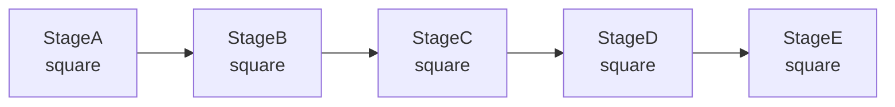

Linear 5-node chain; data passes sequentially through `StageA → StageB → StageC → StageD → StageE`, each node performing a square operation. Built with `TaskChain`, started via `start_chain()`.

#### Cross — `demo_cross`

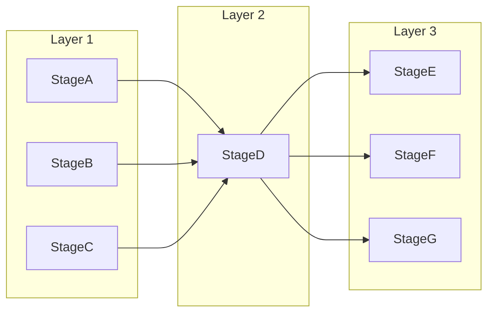

3-layer cross structure (3→1→3). Built with `TaskCross`, started via `start_cross()`.

#### Network — `demo_network`

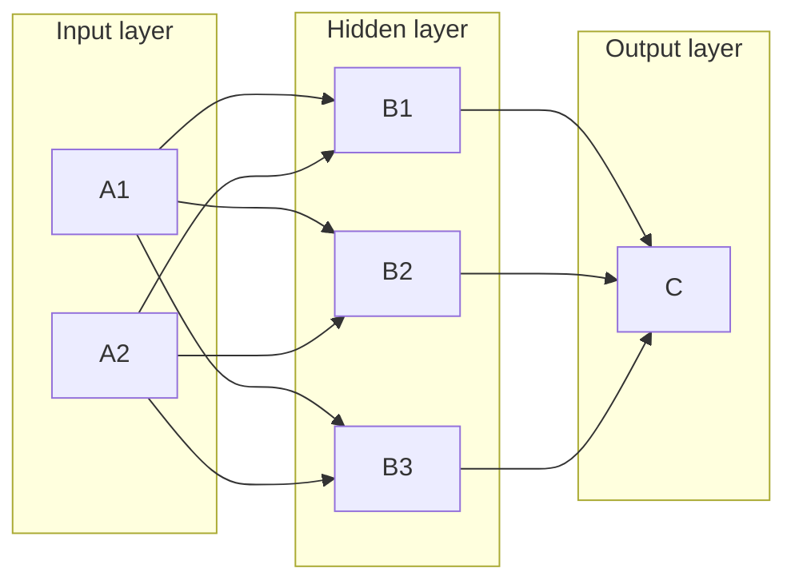

Multi-layer multi-branch network topology (2→3→1), simulating a neural network's forward propagation structure.

#### Star — `demo_star`

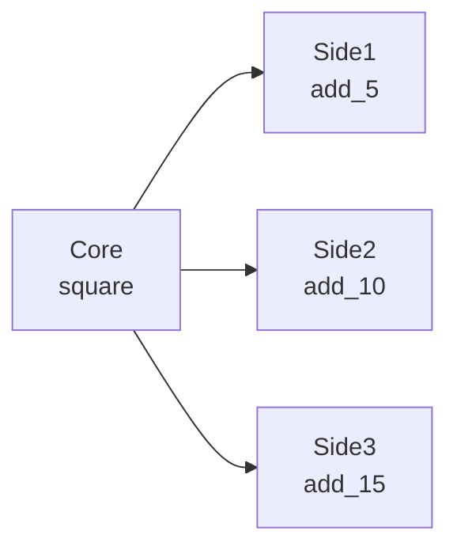

Center node `Core` distributes computation results to multiple edge nodes; each edge node processes independently.

#### Fan-In — `demo_fanin`

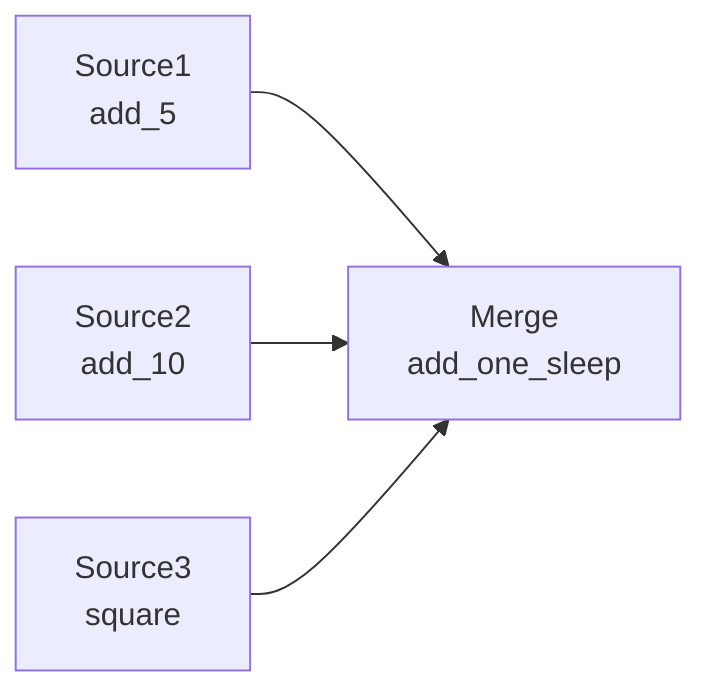

Multiple source nodes `Source1`, `Source2`, `Source3` feed computation results into a single merge node `Merge`.

#### Grid — `demo_grid`

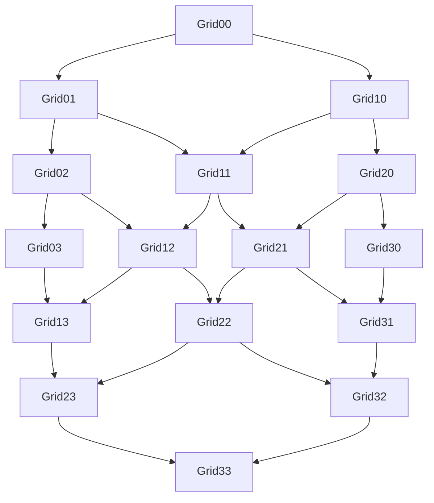

4×4 grid topology; data injected from top-left `Grid00` and propagates layer by layer toward the bottom-right `Grid33`.

### Cyclic Graphs

| Function | Structure | Description |
|------|------|------|
| `demo_loop` | TaskLoop | 3-node closed loop, self-locking structure |
| `demo_wheel` | TaskWheel | Center node + 4 ring nodes |
| `demo_complete` | TaskComplete | 3-node complete graph, all pairwise connected |
| `demo_multi_cycle` | TaskGraph | Multi-cycle interconnected graph: 3 groups of 2-node cycles (A/B/C), A2 fans out to B1 and C1 |

#### Loop — `demo_loop`

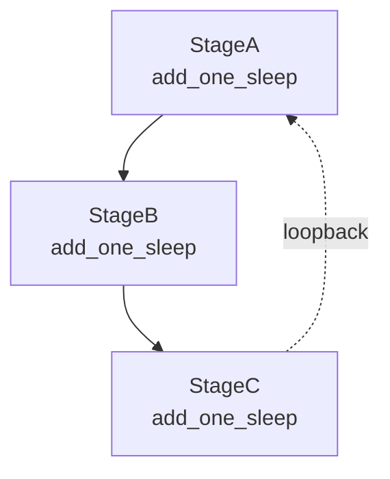

3-node closed-loop self-locking structure, built with `TaskLoop`. Tasks continuously cycle through A → B → C → A until externally terminated.

#### Wheel — `demo_wheel`

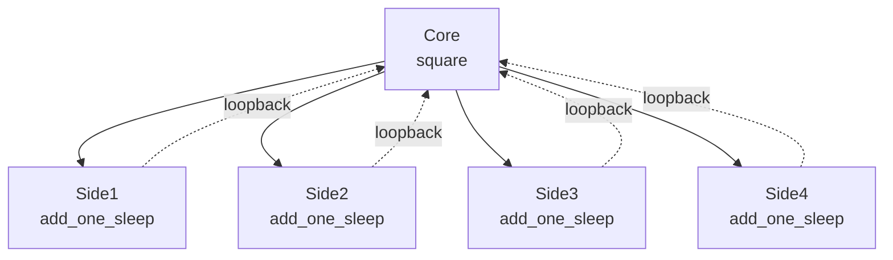

Wheel topology: center `Core` distributes tasks to 4 ring nodes; after processing, ring nodes loop back to `Core`, rotating continuously. Built with `TaskWheel`.

#### Complete — `demo_complete`

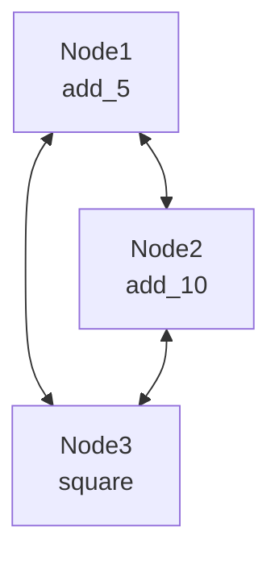

3-node complete graph, all nodes connected pairwise. Built with `TaskComplete`; data flows through the fully connected topology.

#### Multi-Cycle — `demo_multi_cycle`

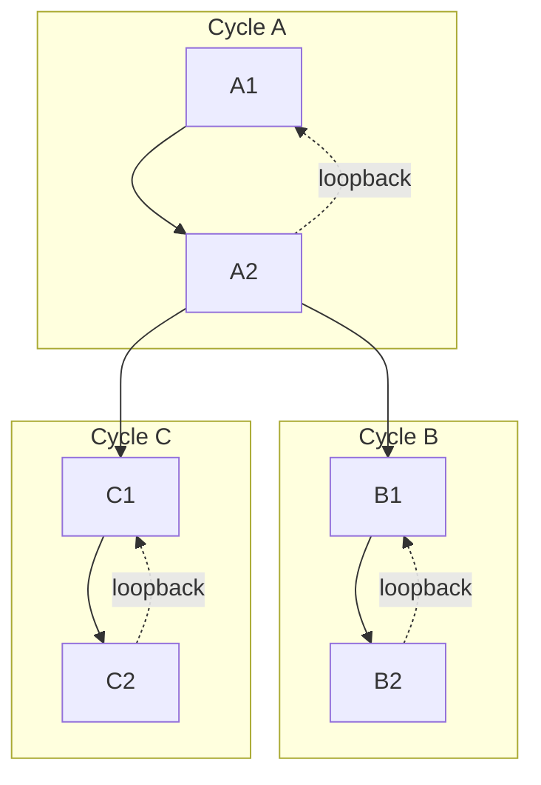

3 groups of 2-node cycles (A/B/C); `A2` fans out to `B1` and `C1`, achieving multi-cycle interconnection.

### Forest — `demo_forest`

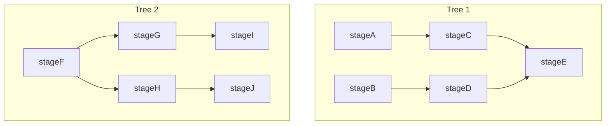

Two independent tree-shaped DAGs coexisting in the same `TaskGraph` without interfering. Tree 1 (A→C→E, B→D→E) and Tree 2 (F→G→I, F→H→J) run independently.

## Key Configuration

- DAG structures: `stage_mode="thread"`, `execution_mode="thread"`
- `demo_grid`: uses `staged` schedule mode (layer-by-layer execution)
- Cyclic graphs: `put_termination_signal=False` (recommended for external stop control)
- All demos enable `Reporter` and `CelestialTree`

## Potential Issues

1. **Cyclic graphs do not stop automatically**: `demo_loop`, `demo_complete`, etc. use `put_termination_signal=False` and will loop continuously until the process is manually terminated.
2. **Sleep latency accumulation**: `add_one_sleep` includes 1-second sleep; 20 tasks × multiple nodes = long total duration.
3. **No assertions**: Only verifies that the framework can start and run; does not check result values.

## How to Run

```bash
python demo/demo_structure.py
```

## Expected Behavior

After running, each structure demo executes sequentially, outputting input/output logs for each Stage and a final summary.

### DAG Structures

```
=== demo_chain (5-node linear chain) ===
[StageA] Input: 2 -> Output: 4
[StageB] Input: 4 -> Output: 16
[StageC] Input: 16 -> Output: 256
[StageD] Input: 256 -> Output: 65536
[StageE] Input: 65536 -> Output: 4294967296
```

```
=== demo_grid (4x4 grid, staged scheduling) ===
[Grid00] -> [Grid01] [Grid10]
[Grid01] -> [Grid02] [Grid11]
...
--- Summary ---
Grid00: success=5  fail=0
Grid33: success=5  fail=0
```

### Cyclic Graphs

```
=== demo_loop (3-node closed loop) ===
[StageA] Input: 1 -> Output: 2
[StageB] Input: 2 -> Output: 3
[StageC] Input: 3 -> Output: 4
[StageA] Input: 4 -> Output: 5
... (loops continuously, will not stop automatically)
```

```
=== demo_complete (3-node complete graph) ===
[Node1] Input: 5 -> Output: 10
[Node2] Input: 10 -> Output: 20
[Node3] Input: 20 -> Output: 400
... (loops continuously)
```

> **Important**: Cyclic graphs like `demo_loop`, `demo_wheel`, `demo_complete` use `put_termination_signal=False` and will not stop automatically after running. Press **Ctrl+C** to manually terminate the process.

### Forest

Two independent DAGs run separately without interference:

```
=== demo_forest (disjoint DAGs) ===
[stageA] Input: 1 -> Result: 2
[stageB] Input: 2 -> Result: 3
[stageF] Input: 3 -> Result: 4
[stageC] Input: ...
```

> Each structure prints a `=== demo_xxx ===` separator before running; the `Summary` section shows success/failure counts for each node.

## Dependencies

- `celestialflow` (`TaskGraph`, `TaskChain`, `TaskCross`, `TaskGrid`, `TaskLoop`, `TaskWheel`, `TaskComplete`, `TaskStage`)
- `demo_utils`
- `python-dotenv`
- External services: CelestialTree (optional), Reporter (optional)
