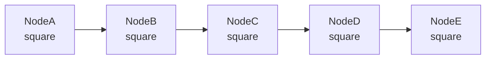
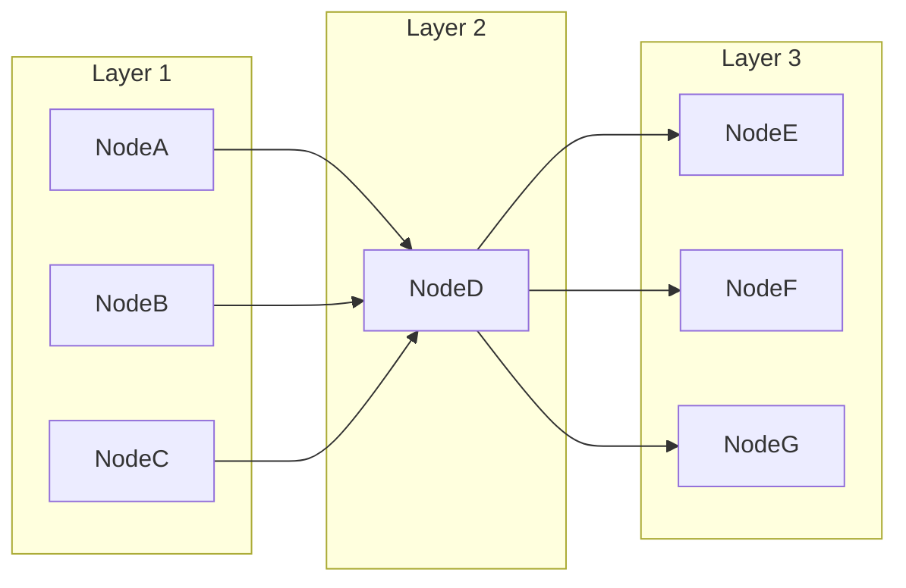
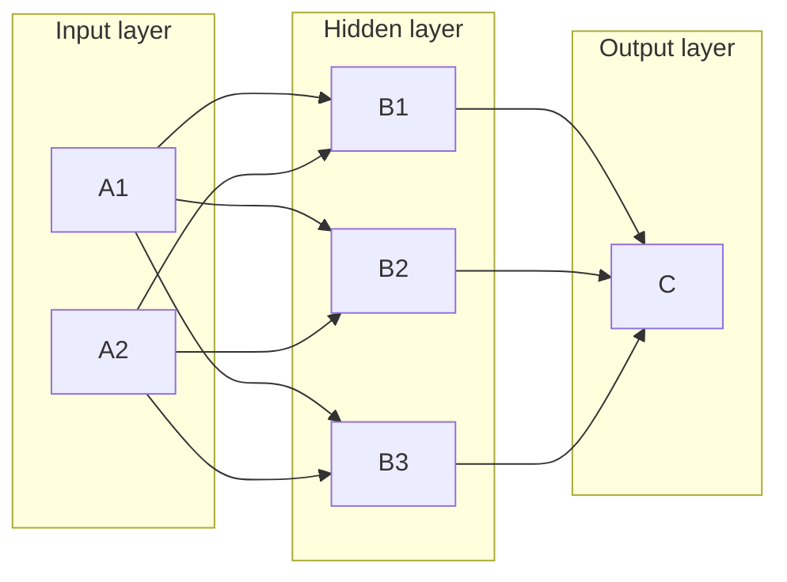
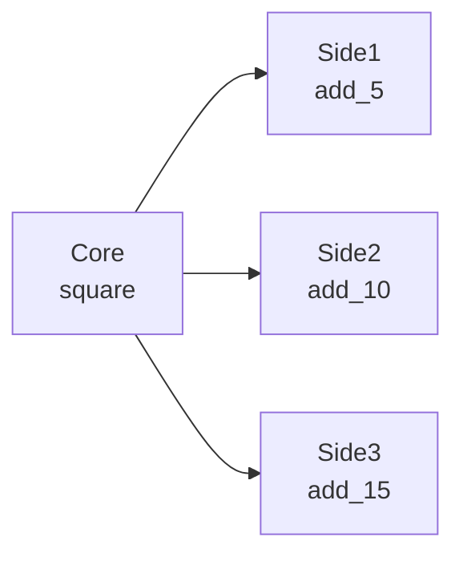
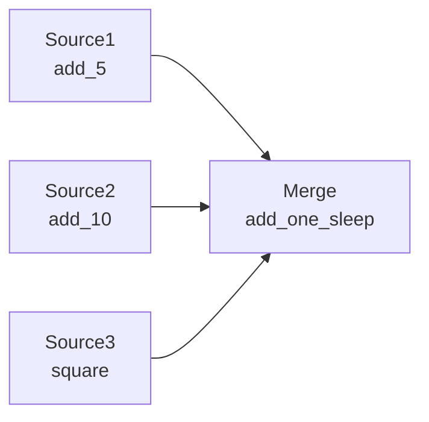
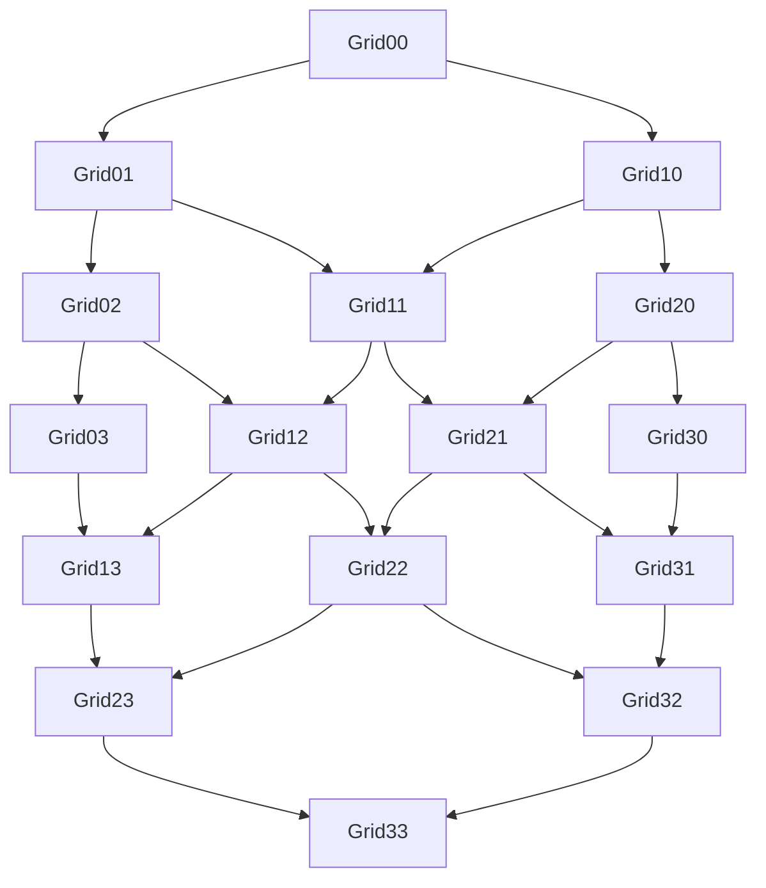
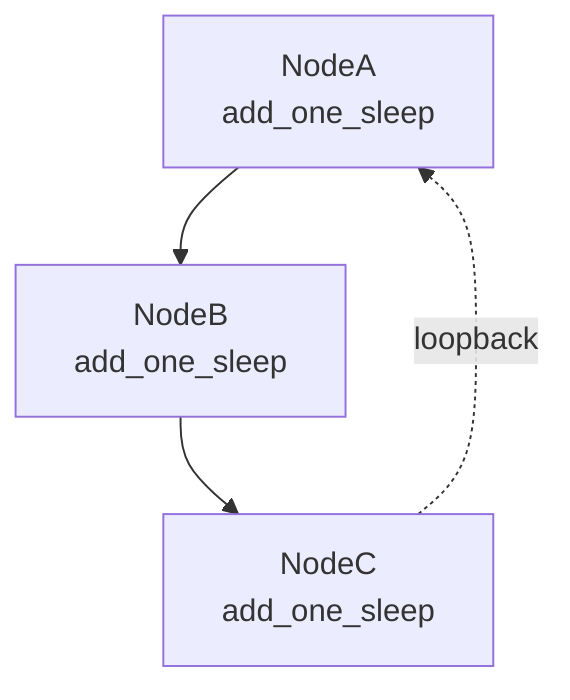
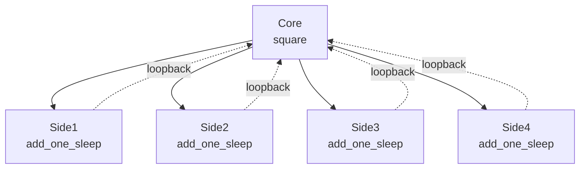
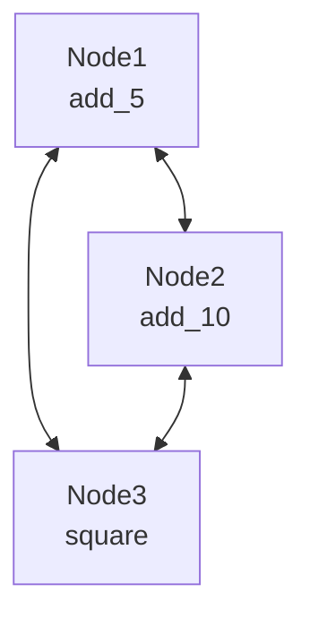
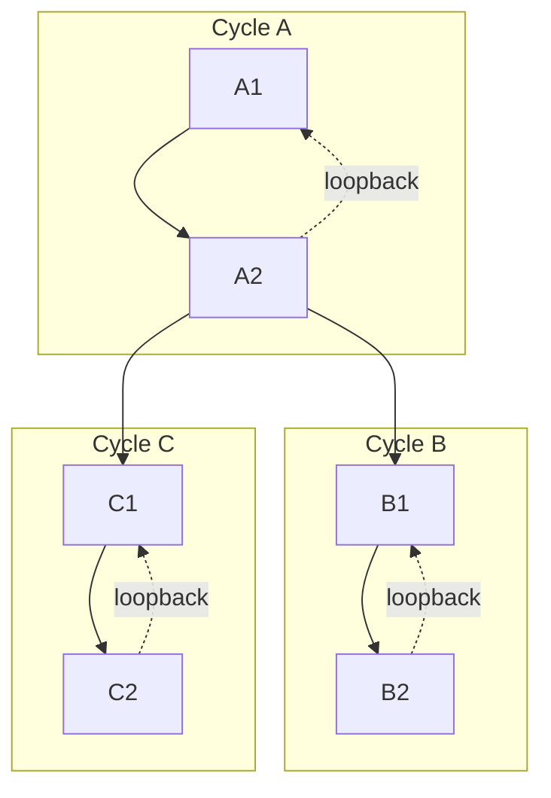

# demo/demo_structure.py

> 📅 Last Updated: 2026/09/24

## Objective

Demonstrates the various predefined graph structures (DAG and cyclic graphs) in `core_structure.py`, showcasing how CelestialFlow builds and runs chain, cross, grid, loop, wheel, complete graph, and other topologies.

> The original `demo_forest` (two independent tree-shaped DAGs) in `demo_structure.py` has been removed; the forest example now resides in `demo_forest()` of [demo_web.py](https://github.com/Mr-xiaotian/CelestialFlow/blob/main/docs/en/demo/demo_web.md).

## Demo Structures

### DAG (Directed Acyclic Graph)

| Function | Structure | Description |
|------|------|------|
| `demo_chain` | TaskChain | 5-node linear chain (`NodeA`~`NodeE`), each node `execution_mode="serial"` |
| `demo_cross` | TaskCross | 3-layer cross structure (3→1→3) |
| `demo_network` | TaskCross | Multi-layer multi-branch network (2→3→1) |
| `demo_star` | TaskCross | Center node pointing to multiple edge nodes |
| `demo_fanin` | TaskCross | Multiple source nodes merging into one sink node |
| `demo_grid` | TaskGrid | 4×4 thread grid |

#### Chain — `demo_chain`


```mermaid
flowchart LR
    A["NodeA<br/>square"] --> B["NodeB<br/>square"]
    B --> C["NodeC<br/>square"]
    C --> D["NodeD<br/>square"]
    D --> E["NodeE<br/>square"]
```

Linear 5-node chain; data passes sequentially through `NodeA → NodeB → NodeC → NodeD → NodeE`, each node performing a square operation (`square`, with a 1-second sleep). Built with `TaskChain`, started via `chain.run({"NodeA": list(range(20))}, if_put_signal=False)`.

#### Cross — `demo_cross`


```mermaid
flowchart LR
    subgraph Layer1["Layer 1"]
        A["NodeA"]
        B["NodeB"]
        C["NodeC"]
    end
    subgraph Layer2["Layer 2"]
        D["NodeD"]
    end
    subgraph Layer3["Layer 3"]
        E["NodeE"]
        F["NodeF"]
        G["NodeG"]
    end

    A --> D
    B --> D
    C --> D
    D --> E
    D --> F
    D --> G
```

3-layer cross structure (3→1→3), built with `TaskCross`, started via `cross.run(...)`. Each node uses `add_one_sleep`, where `NodeD` has `max_workers=5` and the rest have 2.

#### Network — `demo_network`


```mermaid
flowchart LR
    subgraph Input["Input layer"]
        A1["A1"]
        A2["A2"]
    end
    subgraph Hidden["Hidden layer"]
        B1["B1"]
        B2["B2"]
        B3["B3"]
    end
    subgraph Output["Output layer"]
        C["C"]
    end

    A1 --> B1
    A1 --> B2
    A1 --> B3
    A2 --> B1
    A2 --> B2
    A2 --> B3
    B1 --> C
    B2 --> C
    B3 --> C
```

Multi-layer multi-branch network topology (2→3→1), simulating a neural network's forward propagation structure. All nodes use `add_one_sleep`.

#### Star — `demo_star`


```mermaid
flowchart LR
    Core["Core<br/>square"] --> Side1["Side1<br/>add_5"]
    Core --> Side2["Side2<br/>add_10"]
    Core --> Side3["Side3<br/>add_15"]
```

Center node `Core` (`square`) distributes computation results to multiple edge nodes (`add_5` / `add_10` / `add_15`); each edge node processes independently.

#### Fan-In — `demo_fanin`


```mermaid
flowchart LR
    Source1["Source1<br/>add_5"] --> Merge["Merge<br/>add_one_sleep"]
    Source2["Source2<br/>add_10"] --> Merge
    Source3["Source3<br/>square"] --> Merge
```

Multiple source nodes `Source1`, `Source2`, `Source3` feed computation results into a single merge node `Merge`.

#### Grid — `demo_grid`


```mermaid
flowchart TD
    Grid00["Grid00"] --> Grid01["Grid01"]
    Grid00 --> Grid10["Grid10"]
    Grid01 --> Grid02["Grid02"]
    Grid01 --> Grid11["Grid11"]
    Grid10 --> Grid11["Grid11"]
    Grid10 --> Grid20["Grid20"]
    Grid02 --> Grid03["Grid03"]
    Grid02 --> Grid12["Grid12"]
    Grid11 --> Grid12["Grid12"]
    Grid11 --> Grid21["Grid21"]
    Grid20 --> Grid21["Grid21"]
    Grid20 --> Grid30["Grid30"]
    Grid03 --> Grid13["Grid13"]
    Grid12 --> Grid13["Grid13"]
    Grid12 --> Grid22["Grid22"]
    Grid21 --> Grid22["Grid22"]
    Grid21 --> Grid31["Grid31"]
    Grid30 --> Grid31["Grid31"]
    Grid13 --> Grid23["Grid23"]
    Grid22 --> Grid23["Grid23"]
    Grid22 --> Grid32["Grid32"]
    Grid31 --> Grid32["Grid32"]
    Grid23 --> Grid33["Grid33"]
    Grid32 --> Grid33["Grid33"]
```

4×4 grid topology; data injected from top-left `Grid00` and propagates layer by layer toward the bottom-right `Grid33`.

### Cyclic Graphs

| Function | Structure | Description |
|------|------|------|
| `demo_loop` | TaskLoop | 3-node closed loop, self-locking structure |
| `demo_wheel` | TaskWheel | Center node + 4 ring nodes |
| `demo_complete` | TaskComplete | 3-node complete graph, all pairwise connected |
| `demo_multi_cycle` | TaskGraph | Multi-cycle interconnected graph: 3 groups of 2-node cycles (A/B/C), A2 fans out to B1 and C1 |

#### Loop — `demo_loop`


```mermaid
flowchart TD
    A["NodeA<br/>add_one_sleep"] --> B["NodeB<br/>add_one_sleep"]
    B --> C["NodeC<br/>add_one_sleep"]
    C -.->|loopback| A
```

3-node closed-loop self-locking structure, built with `TaskLoop`. Tasks continuously cycle through A → B → C → A until externally terminated.

#### Wheel — `demo_wheel`


```mermaid
flowchart TD
    Core["Core<br/>square"] --> Side1["Side1<br/>add_one_sleep"]
    Core --> Side2["Side2<br/>add_one_sleep"]
    Core --> Side3["Side3<br/>add_one_sleep"]
    Core --> Side4["Side4<br/>add_one_sleep"]
    Side1 -.->|loopback| Core
    Side2 -.->|loopback| Core
    Side3 -.->|loopback| Core
    Side4 -.->|loopback| Core
```

Wheel topology: center `Core` distributes tasks to 4 ring nodes; after processing, ring nodes loop back to `Core`, rotating continuously. Built with `TaskWheel`.

#### Complete — `demo_complete`


```mermaid
flowchart TD
    N1["Node1<br/>add_5"] <--> N2["Node2<br/>add_10"]
    N1 <--> N3["Node3<br/>square"]
    N2 <--> N3
```

3-node complete graph, all nodes connected pairwise. Built with `TaskComplete`; data flows through the fully connected topology.

#### Multi-Cycle — `demo_multi_cycle`


```mermaid
flowchart TD
    subgraph CycleA["Cycle A"]
        A1["A1"] --> A2["A2"]
        A2 -.->|loopback| A1
    end

    subgraph CycleB["Cycle B"]
        B1["B1"] --> B2["B2"]
        B2 -.->|loopback| B1
    end

    subgraph CycleC["Cycle C"]
        C1["C1"] --> C2["C2"]
        C2 -.->|loopback| C1
    end

    A2 --> B1
    A2 --> C1
```

3 groups of 2-node cycles (A/B/C); `A2` fans out to `B1` and `C1`, achieving multi-cycle interconnection. Manually assembled with the generic `TaskGraph` + `set_nodes` / `connect`.

## Key Configuration

- DAG structures: `TaskChain` of `demo_chain` does not explicitly pass `graph_mode`, and its 5 nodes all use `execution_mode="serial"`; the nodes of `demo_cross` / `demo_network` / `demo_star` / `demo_fanin` / `demo_grid` mostly use `execution_mode="thread"`
- `demo_grid`: `TaskGrid` uses the default `graph_mode="thread"` (the source does not explicitly pass `graph_mode`)
- Cyclic graphs: `demo_loop` / `demo_wheel` / `demo_complete` / `demo_multi_cycle` all explicitly pass `if_put_signal=False` (i.e., no automatic termination signal is injected); `demo_chain` also passes `if_put_signal=False`. It is recommended to prepare manual termination when running cyclic graphs
- Each demo wires in the Reporter via `<graph>.set_reporter(TaskReporter(report_host, report_port, <graph>))`; `<graph>.set_ctree(ctree_client)` is commented out in every example, so CelestialTree is not enabled by default. Whether they actually take effect depends on whether environment variables such as `REPORT_HOST`/`REPORT_PORT`/`CTREE_HOST` and the server are ready
- `demo_network`, `demo_star`, `demo_fanin`, and `demo_wheel` are defined but not called by `__main__`

## Potential Issues

1. **`__main__` calls the undefined `demo_forest`**: `__main__` calls `demo_forest()` immediately after `demo_chain()`, but this file no longer defines that function (the forest example has been migrated to `demo_web.py`), so execution will raise `NameError` at that point, and the subsequent `demo_cross()`, `demo_grid()`, `demo_loop()`, `demo_complete()`, and `demo_multi_cycle()` will not be executed.
2. **Cyclic graphs may not stop automatically**: All four cyclic graph examples explicitly pass `if_put_signal=False` (no automatic termination signal injected). Among them, `demo_wheel`'s `Core` uses `square` (does not throw), so tasks keep looping and rotating; the other examples' tasks grow to `add_one_sleep`'s exception threshold (n>30) before stopping producing new tasks, and likewise will not auto-exit. Prepare **Ctrl+C** for manual termination before running.
3. **Sleep latency accumulation**: Both `square` and `add_one_sleep` include a 1-second sleep; when there are many tasks, the total duration grows noticeably.
4. **No assertions**: Only verifies that the framework can start and run; does not check result values.

## How to Run

```bash
python demo/demo_structure.py
```

> **Note**: `__main__` calls `demo_chain()`, `demo_forest()`, `demo_cross()`, `demo_grid()`, `demo_loop()`, `demo_complete()`, and `demo_multi_cycle()` in sequence. Because `demo_forest()` is undefined, the script will be interrupted by a `NameError` after `demo_chain()` finishes; to run other structures, call the corresponding function directly inside `__main__`.

## Expected Behavior

The following outputs are all expected outputs (mock); the specific log format depends on the framework output.

### DAG Structures

```
=== demo_chain (5-node linear chain) ===
[NodeA] Input: 2 -> Output: 4
[NodeB] Input: 4 -> Output: 16
[NodeC] Input: 16 -> Output: 256
[NodeD] Input: 256 -> Output: 65536
[NodeE] Input: 65536 -> Output: 4294967296
```

```
=== demo_grid (4x4 grid) ===
[Grid00] -> [Grid01] [Grid10]
[Grid01] -> [Grid02] [Grid11]
...
--- Summary ---
Grid00: success=9  fail=1
Grid33: success=180  fail=0
```

### Cyclic Graphs

```
=== demo_loop (3-node closed loop) ===
[NodeA] Input: 1 -> Output: 2
[NodeB] Input: 2 -> Output: 3
[NodeC] Input: 3 -> Output: 4
[NodeA] Input: 4 -> Output: 5
... (loops continuously, will not stop automatically)
```

```
=== demo_complete (3-node complete graph) ===
[Node1] Input: 5 -> Output: 10
[Node2] Input: 10 -> Output: 20
[Node3] Input: 20 -> Output: 400
... (loops continuously)
```

> **Important**: The cyclic graph examples (`demo_loop`, `demo_wheel`, `demo_complete`, `demo_multi_cycle`) all explicitly pass `if_put_signal=False`, so no automatic termination signal is injected. When run with the defaults, they may continue looping, so press **Ctrl+C** to manually terminate the process.

> When running multiple structures in sequence, the `Summary` section shows success/failure counts for each node.
> The counts in `demo_grid` are mock estimates: `Grid00` inputs `range(10)`, where `0` triggers `add_one_sleep`'s `ValueError` and fails, the remaining tasks propagate down the 4×4 grid, and `Grid33` aggregates 180 tasks.

## Dependencies

- `celestialflow` (`TaskGraph`, `TaskChain`, `TaskCross`, `TaskGrid`, `TaskLoop`, `TaskWheel`, `TaskComplete`, `TaskExecutor`, `TaskReporter`)
- `demo_utils`
- `python-dotenv`
- External services: CelestialTree (optional), Reporter (optional)
