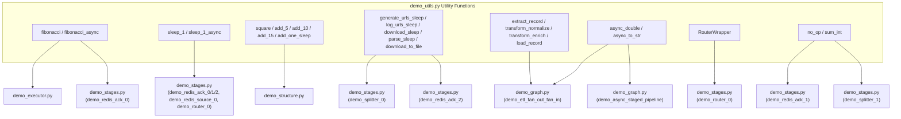

# demo_utils.py Demo Utilities Documentation

> 📅 Last Updated: 2026/05/24

## Purpose

Provides shared test functions and helper classes for demo scripts under the `demo/` directory. The contents are largely identical to `tests/test_utils.py` and serve as a dedicated utility library for demo code.

## Relationship Between Functions and Demo Files

The following Mermaid diagram shows which demo files use which functions/classes from `demo_utils.py`:



> The diagram only shows the primary function-to-demo-script relationships; helper functions and non-core dependencies are omitted.

## Content Categories

### General Computation Functions
- `fibonacci` / `fibonacci_async`: Iterative Fibonacci O(n) (same algorithm as `bench/bench_execution_mode.py`), async version yields the event loop every 8 iterations via `await asyncio.sleep(0)`
- `no_op` / `sum_int` / `add_one` / `sqrt`: Basic operations
- `square` / `add_offset` / `add_5` / `add_10` / `add_15` / `add_20` / `add_25`, etc.: Simulated time-consuming tasks with 1-second sleep
- `neuron_activation`: Sigmoid activation function (simulating ML inference)

### Sleep Variants
- `sleep_1` / `sleep_1_async`: Pure 1-second delay

### Operations with Sleep (for demo_structure)
- `operate_sleep` / `operate_sleep_A~E`: Binary operations with 1-second delay
- `add_one_sleep`: With multi-condition exception boundaries (`n>30`, `n==0`, `n is None`)

### URL Processing Functions (for demo_stages)
- `generate_urls_sleep` / `log_urls_sleep` / `download_sleep` / `parse_sleep`
- `download_to_file`: Real HTTP download to local file

### ETL Simulation Functions (for demo_graph)
- `extract_record`: Generates a record dictionary by ID (with 0.5s sleep)
- `transform_normalize`: Normalizes record values (with 0.3s sleep)
- `transform_enrich`: Adds odd/even classification to records (with 0.3s sleep)
- `load_record`: Simulates saving a record and returns a result string (with 0.2s sleep)

### Async Helper Functions (for demo_graph)
- `async_double`: Asynchronously doubles the input (with 0.3s sleep)
- `async_to_str`: Asynchronously converts input to a formatted string (with 0.2s sleep)

### Special Classes
- `RouterWrapper`: Routing wrapper for `TaskRouter` demos

## Relationship with tests/test_utils.py

The two files have nearly identical contents, with `fibonacci`/`fibonacci_async` already unified to the iterative O(n) version (consistent with `bench/bench_execution_mode.py`). This is likely a historical artifact from when demo code was separated from test code, retaining a copy. When maintaining, it is recommended to keep both in sync, or consider extracting common utilities into a standalone module under `celestialflow/utils/`.

## Potential Issues

1. **Duplication with tests/test_utils.py**: Modifying one file while forgetting the other may cause behavioral divergence between demos and unit tests.
2. **Hardcoded Windows paths**: Path replacement logic resides in the `DownloadStage` and `DownloadRedisTransport` custom subclasses in `demo_stages.py`, not in this file.
3. **`requests` network dependency**: `download_to_file` requires external network access and is unavailable in isolated network environments.

## How to Run

This file is a shared module and is not run directly:
```python
from demo_utils import fibonacci, sleep_1, RouterWrapper
```

## Dependencies

- `requests`
