# demo_utils.py Demo Utilities Guide

> 📅 Last Updated: 2026/06/18

## Objective

Provides shared test functions and helper classes for demo scripts in the `demo/` directory. Content is largely identical to `tests/test_utils.py`; it is a dedicated utility library for demo code.

## Relationship Between Functions and Demo Files

The following Mermaid diagram shows which functions/classes from `demo_utils.py` are used by which demo files:

```mermaid
flowchart TD
    subgraph Utils["demo_utils.py utility functions"]
        direction TB
        Fib["fibonacci / fibonacci_async"]
        Sleep1["sleep_1 / sleep_1_async"]
        Compute["square / add_5 / add_10 / add_15 / add_one_sleep"]
        Url["generate_urls_sleep / log_urls_sleep / download_sleep / parse_sleep / download_to_file"]
        ETL["extract_record / transform_normalize / transform_enrich / load_record"]
        Async["async_double / async_to_str"]
        Router["router_even"]
        Misc["no_op / sum_int"]
    end

    ETL --> Graph["demo_graph.py<br/>(demo_etl_fan_out_fan_in)"]
    Async --> Graph
    Async --> GraphAsync["demo_graph.py<br/>(demo_async_staged_pipeline)"]
    Fib --> Executor["demo_executor.py"]
    Fib --> Redis0["demo_redis.py<br/>(demo_redis_ack_0)"]
    Sleep1 --> RedisDemo["demo_redis.py<br/>(demo_redis_ack_0/1/2, demo_redis_source_0)"]
    Url --> StagesSplitter0["demo_stages.py<br/>(demo_splitter_0)"]
    Url --> Redis2["demo_redis.py<br/>(demo_redis_ack_2)"]
    Router --> StagesRouter0["demo_stages.py<br/>(demo_router_0)"]
    Misc --> Redis1["demo_redis.py<br/>(demo_redis_ack_1)"]
    Misc --> StagesSplitter1["demo_stages.py<br/>(demo_splitter_1)"]
    Compute --> Structure["demo_structure.py"]
```



> The diagram only shows the main function-to-demo-script mappings, omitting helper functions and non-core dependencies.

## Content Classification

### General Computation Functions
- `fibonacci` / `fibonacci_async`: Iterative Fibonacci O(n) (consistent with `bench/bench_execution_mode.py` algorithm); the async version yields the event loop every 8 iterations with `await asyncio.sleep(0)`
- `no_op` / `sum_int` / `add_one` / `sqrt`: Basic operations
- `square` / `add_offset` / `add_5` / `add_10` / `add_15` / `add_20` / `add_25`, etc.: Simulated time-consuming tasks with 1-second sleep
- `neuron_activation`: Sigmoid activation function (simulating ML inference)

### Sleep Variants
- `sleep_1` / `sleep_1_async`: Pure 1-second delay

### Sleep-Bearing Operations (for demo_structure)
- `operate_sleep` / `operate_sleep_A~E`: Binary operations with 1-second delay
- `add_one_sleep`: Includes multi-condition exception boundaries (`n>30`, `n==0`, `n is None`)

### URL Processing Functions (for demo_stages)
- `generate_urls_sleep` / `log_urls_sleep` / `download_sleep` / `parse_sleep`
- `download_to_file`: Real HTTP download to local file

### ETL Simulation Functions (for demo_graph)
- `extract_record`: Generate record dict by ID (with 0.5s sleep)
- `transform_normalize`: Normalize record values (with 0.3s sleep)
- `transform_enrich`: Add parity classification to records (with 0.3s sleep)
- `load_record`: Simulate saving records and return result string (with 0.2s sleep)

### Async Helper Functions (for demo_graph)
- `async_double`: Async doubles input (with 0.3s sleep)
- `async_to_str`: Async converts input to formatted string (with 0.2s sleep)

### Routing Helper Functions
- `router_even`: Routing function for `TaskRouter` demos, returns `StageA` or `StageB` based on parity

## Relationship with tests/test_utils.py

The two files have nearly identical content. `fibonacci`/`fibonacci_async` have been unified to the iterative O(n) version (consistent with `bench/bench_execution_mode.py`). The historical reason may be that demo code retained a copy when it was separated from test code. During maintenance, it's recommended to keep both in sync, or consider extracting common utilities into a standalone module under `celestialflow/utils/`.

## Potential Issues

1. **Duplication with tests/test_utils.py**: Easy to miss changes in one place when modifying the other, causing behavioral divergence between demos and unit tests.
2. **Windows path hardcoding**: The target path for `download_to_file` typically needs to be adjusted per the local environment; related examples are in `demo_redis.py`.
3. **`requests` network dependency**: `download_to_file` requires external network access, unavailable in isolated network environments.

## How to Run

This file is a shared module and is not run directly:
```python
from demo_utils import fibonacci, sleep_1, router_even
```

## Dependencies

- `requests`
