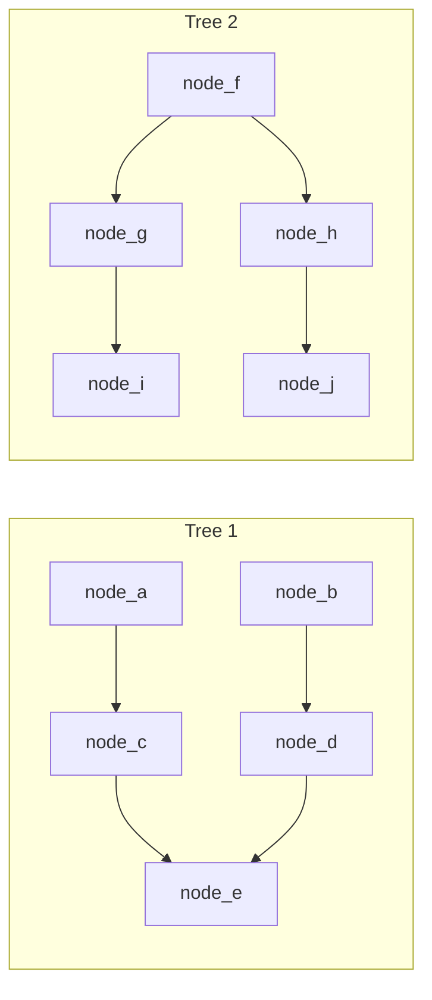
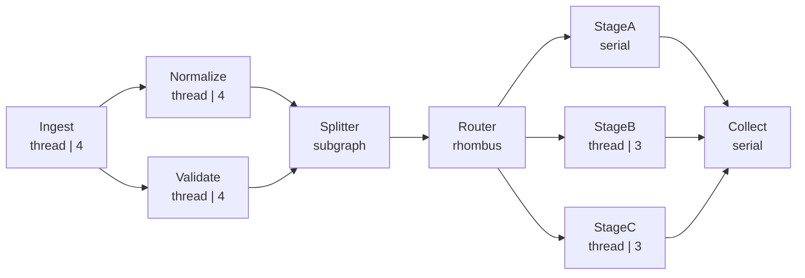

# demo/demo_web.py

> 📅 Last Updated: 2026/09/24

## Objective

This file contains two demos: `demo_forest()` (two independent tree-shaped DAGs) and `demo_topology_topology()` (a 6-layer complex task graph with fan-out/fan-in, `TaskSplitter`, and `TaskRouter`). The latter pushes status, structure, error, and lifecycle data to celestialflow-web via `TaskReporter`, used to observe how the web dashboard displays under a **complex topology** (structure graph, node status cards, error logs, progress bars, historical curves, etc.).

## Demo Scenarios

### Forest (`demo_forest`)

Two mutually non-interfering tree-shaped DAGs coexist in the same `TaskGraph`:



- Tree 1: `node_a → node_c → node_e`, `node_b → node_d → node_e`
- Tree 2: `node_f → node_g → node_i`, `node_f → node_h → node_j`
- All nodes use `add_one_sleep` (`execution_mode="thread"`, `max_workers=2`), with graph mode `graph_mode="thread"`
- Initial tasks are injected into `node_a` (`1..10`), `node_b` (`11..20`), and `node_f` (`21..30`)

### Complex Topology (`demo_topology_topology`)

> The graph name of this demo is `demo_web_topology`, and the function name is `demo_topology_topology`.



ASCII supplementary diagram:

```
Ingest ──┬── Normalize ──┐
         └── Validate ───┴── Splitter ── Router ──┬── StageA ──┐
                                                  ├── StageB ──┴── Collect
                                                  └── StageC ──┘
```

- `Ingest` → Injects 24 seed tasks (4 of which are duplicates, demonstrating duplicate counting; thread mode, 4 workers)
- `Normalize` → Normalizes and scales task values; `7` fails 3 times in a row and then **fails after retries are exhausted**, while `11` fails once and then succeeds on retry (thread mode, 4 workers, `max_retries=2`)
- `Validate` → Validates tasks; `11` directly throws a **non-retryable** `RuntimeError` (thread mode, 4 workers)
- `Splitter` → Splits the iterable results passed in from upstream into individual items (each task is split into 2~3 items)
- `Router` → Dispatches items to `StageA` / `StageB` / `StageC` by `item % 3`; the three downstream edges have different transfer volumes
- `StageA` (serial) / `StageB`, `StageC` (thread, 3 workers) → three parallel processing branches
- `Collect` → Aggregates the outputs of the three stages (serial)

**Graph structure**: DAG, multi-layer fan-out/fan-in + split + route
**Graph mode**: `graph_mode="thread"`, with serial / thread execution modes mixed inside nodes

## Observable Points on the Web Dashboard

| Panel | Observation Content |
|------|---------|
| Structure graph | Nine-node multi-layer topology; Splitter shown as a subgraph and Router as a diamond; after enabling "edge labels" (incremental/cumulative), the three edges `Router → StageA/B/C` show different transfer volumes |
| Node status card | Different execution modes and parallelism (serial shows `-`, thread shows the worker count); four-segment progress bars for success/failure/duplicate/waiting |
| Error logs | Two errors: `ValueError` (fails after 2 retries, retry column = 2) and `RuntimeError` (non-retryable, retry column = 0) |
| Error type distribution | Statistics for the two error types `ValueError` / `RuntimeError` |
| Node metric trends | Real-time increments of the success/failure/waiting curves for each node |

## Key Configuration

- Each Stage explicitly specifies its execution mode via `TaskExecutor(..., execution_mode="thread" | "serial")`
- `normalize.set_retry_exceptions(ValueError)` specifies retryable exceptions; `max_retries=2` provides two retry opportunities
- `Ingest` injects 24 seed tasks, of which `3`, `5`, `8`, and `12` duplicate earlier seeds (counted into `dup` by the default duplicate-detection logic), demonstrating duplicate counting
- The reporting refresh interval is set to `reporter.interval = 2` (default 5s), for faster dashboard refresh
- The graph mode is `graph_mode="thread"`, allowing mixed execution modes inside nodes

## Potential Issues

1. **No assertions**: Demo script; does not verify result correctness.
2. **Task functions include sleep**: Sleep across stages ranges from 0.02s (`route_task`) to 1s (`ingest_task`); full execution is expected to take tens of seconds, during which multiple rounds of status refresh can be observed on the dashboard.
3. **Reporting address not configured**: When `REPORT_HOST` / `REPORT_PORT` are empty, reporting is skipped; the demo can still run independently, but the dashboard has no data.

## How to Run

1. Start the celestialflow-web service (`uvicorn` or `make run`; see the web project docs for details).
2. Set the environment variables and run the demo:

```bash
python demo/demo_web.py
```

Windows PowerShell:

```powershell
$env:REPORT_HOST = "127.0.0.1"
$env:REPORT_PORT = "8000"
python demo/demo_web.py
```

3. Open a browser and visit the web dashboard to observe the structure graph, status cards, and error logs.

## Expected Behavior

After the demo finishes, it prints a per-node count summary, roughly as follows:

```
[demo] injected 24 tasks (including 4 duplicates)
[demo] per-node counts:
  Ingest    input=24   ok=20    fail=0   dup=4
  Normalize input=20   ok=19    fail=1   dup=0
  Validate  input=20   ok=19    fail=1   dup=0
  Splitter  input=38   ok=38    fail=0   dup=0
  Router    input=95   ok=95    fail=0   dup=0
  StageA    input=32   ok=32    fail=0   dup=0
  StageB    input=33   ok=33    fail=0   dup=0
  StageC    input=30   ok=30    fail=0   dup=0
  Collect   input=95   ok=95    fail=0   dup=0
```

> The exact numbers fluctuate slightly with the routing distribution; `Normalize`'s `7` fails after retries are exhausted (retry=2), and `Validate`'s `11` fails directly (RuntimeError).

## Dependencies

- `celestialflow` (`TaskGraph`, `TaskExecutor`, `TaskSplitter`, `TaskRouter`, `TaskReporter`)
- `demo_utils` (`add_one_sleep`)
- `python-dotenv`
- External services: celestialflow-web (optional; reporting is skipped when not ready)
