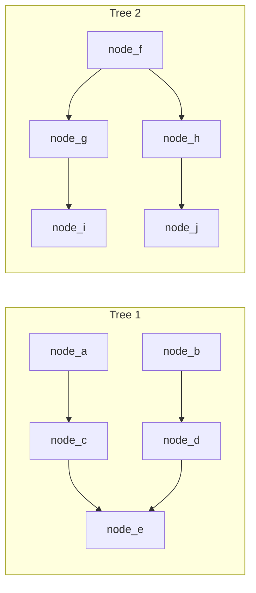
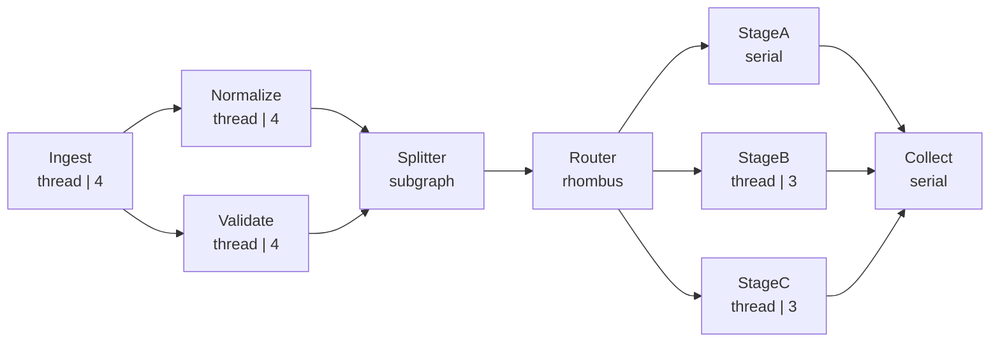

# demo/demo_web.py

> 📅 Last Updated: 2026/10/09

## Objective

This file contains two demos: `demo_forest()` (two independent tree-shaped DAGs) and `demo_topology_topology()` (a 6-layer complex task graph with fan-out/fan-in, `TaskSplitter`, and `TaskRouter`). The latter reads each node's input/success/failure/skip metrics via the observer event system (by registering `MetricsObserver`) and prints a summary after running, used to observe the statistics of each execution mode and the retry/drop paths under a complex topology execution.

## Demo Scenarios

### Forest (`demo_forest`)

Two mutually non-interfering tree-shaped DAGs coexist in the same `TaskGraph`:


```mermaid
flowchart LR
    subgraph Tree1["Tree 1"]
        node_a["node_a"] --> node_c["node_c"]
        node_b["node_b"] --> node_d["node_d"]
        node_c --> node_e["node_e"]
        node_d --> node_e
    end
    subgraph Tree2["Tree 2"]
        node_f["node_f"] --> node_g["node_g"]
        node_f --> node_h["node_h"]
        node_g --> node_i["node_i"]
        node_h --> node_j["node_j"]
    end
```

- Tree 1: `node_a → node_c → node_e`, `node_b → node_d → node_e`
- Tree 2: `node_f → node_g → node_i`, `node_f → node_h → node_j`
- All nodes use `add_one_sleep` (`execution_mode="thread"`, `max_workers=2`), with graph mode `graph_mode="thread"`
- Initial tasks are injected into `node_a` (`1..10`), `node_b` (`11..20`), and `node_f` (`21..30`)

### Complex Topology (`demo_topology_topology`)

> The graph name of this demo is `demo_web_topology`, and the function name is `demo_topology_topology`.


```mermaid
flowchart LR
    Ingest["Ingest<br/>thread | 4"] --> Normalize["Normalize<br/>thread | 4"]
    Ingest --> Validate["Validate<br/>thread | 4"]
    Normalize --> Splitter["Splitter<br/>subgraph"]
    Validate --> Splitter
    Splitter --> Router["Router<br/>rhombus"]
    Router --> StageA["StageA<br/>serial"]
    Router --> StageB["StageB<br/>thread | 3"]
    Router --> StageC["StageC<br/>thread | 3"]
    StageA --> Collect["Collect<br/>serial"]
    StageB --> Collect
    StageC --> Collect
```

ASCII supplementary diagram:

```
Ingest ──┬── Normalize ──┐
         └── Validate ───┴── Splitter ── Router ──┬── StageA ──┐
                                                  ├── StageB ──┴── Collect
                                                  └── StageC ──┘
```

- `Ingest` → Injects 24 seed tasks (thread mode, 4 workers)
- `Normalize` → Normalizes and scales task values; `7` fails 3 times in a row and then **fails after retries are exhausted**, while `11` fails once and then succeeds on retry (thread mode, 4 workers, `max_retries=2`)
- `Validate` → Validates tasks; `11` directly throws a **non-retryable** `RuntimeError` (thread mode, 4 workers)
- `Splitter` → Splits the iterable results passed in from upstream into individual items (each task is split into 2~3 items)
- `Router` → Dispatches items to `StageA` / `StageB` / `StageC` by `item % 3`; the three downstream edges have different transfer volumes
- `StageA` (serial) / `StageB`, `StageC` (thread, 3 workers) → three parallel processing branches
- `Collect` → Aggregates the outputs of the three stages (serial)

**Graph structure**: DAG, multi-layer fan-out/fan-in + split + route
**Graph mode**: `graph_mode="thread"`, with serial / thread execution modes mixed inside nodes

## Observable Output

After running, the demo reads each node's metrics snapshot via `MetricsObserver` and prints a summary. You can observe:

| Dimension | Observation Content |
|------|---------|
| Total input | Total number of tasks that entered each node (`input_total`, including external injection and upstream delivery) |
| Success / failure / skip | Each node's `succeeded` / `failed` / `skipped` counts, reflecting retry success, retry-exhausted failures, and the scale of each branch after fan-out |
| Execution mode | The intuitive impact of different execution modes (serial / thread) and parallelism on throughput and counts |

> This demo no longer depends on the Reporter / reporting channel, and does not push data to the web; the `demo_web` name and `demo_forest` are historical legacies, and the current script only prints local statistics.

## Key Configuration

- Each Stage explicitly specifies its execution mode via `TaskExecutor(..., execution_mode="thread" | "serial")`
- `normalize.set_retry_exceptions(ValueError)` specifies retryable exceptions; `max_retries=2` provides two retry opportunities
- `Ingest` injects 24 seed tasks, of which `3`, `5`, `8`, and `12` duplicate earlier seed values; since the demo does not configure `skip_func`, these duplicate values are not deduplicated and still enter each node as ordinary tasks (the duplicate values are only used to let nodes such as `Normalize` / `Validate` see more input, producing no dedup count)
- The graph mode is `graph_mode="thread"`, allowing mixed execution modes inside nodes

## Potential Issues

1. **No assertions**: Demo script; does not verify result correctness.
2. **Task functions include sleep**: Sleep across stages ranges from 0.02s (`route_task`) to 1s (`ingest_task`); full execution is expected to take tens of seconds, during which you can observe each node's counts being updated progressively.
3. **Failures in the normalize/validate nodes**: `Normalize`'s `7` and `Validate`'s `11` create failure paths; the script does not depend on external services at startup and can run independently.

## How to Run

```bash
python demo/demo_web.py
```

`__main__` runs `demo_forest()` and `demo_topology_topology()` in sequence; the two execute independently.

## Expected Behavior

After the demo finishes, it prints a per-node count summary, roughly as follows:

```
[demo] injected 24 tasks (including 4 duplicates)
[demo] per-node counts:
  Ingest    input=24  ok=20  fail=0  skip=0
  Normalize input=20  ok=19  fail=1  skip=0
  Validate  input=20  ok=19  fail=1  skip=0
  Splitter  input=38  ok=38  fail=0  skip=0
  Router    input=38  ok=38  fail=0  skip=0
  StageA    input=13  ok=13  fail=0  skip=0
  StageB    input=13  ok=13  fail=0  skip=0
  StageC    input=12  ok=12  fail=0  skip=0
  Collect   input=38  ok=38  fail=0  skip=0
```

> The exact numbers fluctuate slightly with the task flow and routing distribution after each stage's sleep; `Normalize`'s `7` fails after retries are exhausted (counted into `failed`), and `Validate`'s `11` fails directly with a `RuntimeError` and does not appear in the `ok` column above. Each count corresponds to the `input_total` / `succeeded` / `failed` / `skipped` fields of `NodeMetrics`.

## Dependencies

- `celestialflow` (`TaskGraph`, `TaskExecutor`, `TaskSplitter`, `TaskRouter`)
- `celestialflow.observer` (`MetricsObserver`)
- `demo_utils` (`add_one_sleep`)
- `python-dotenv`
