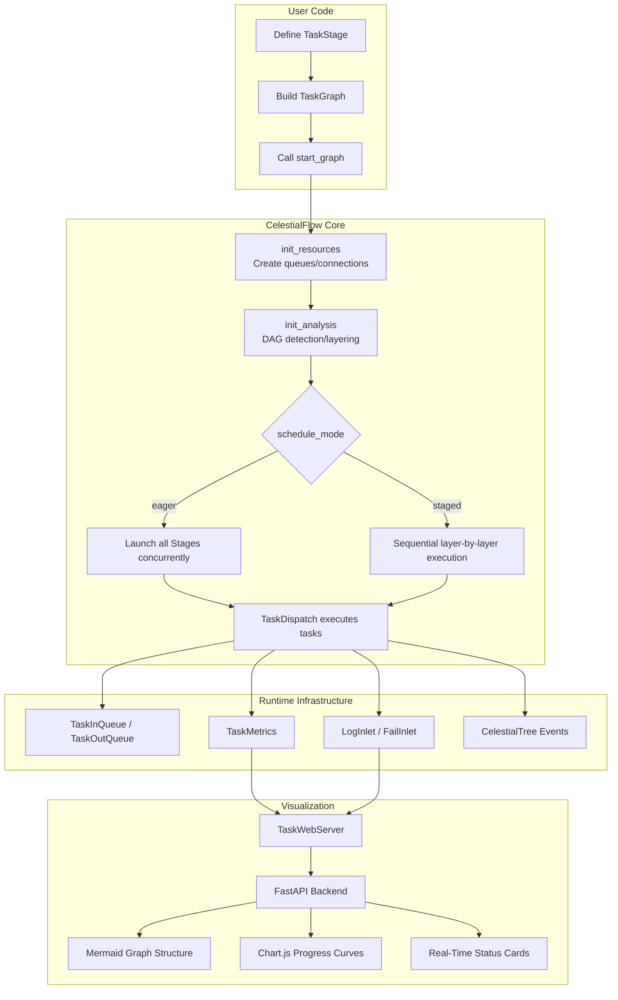
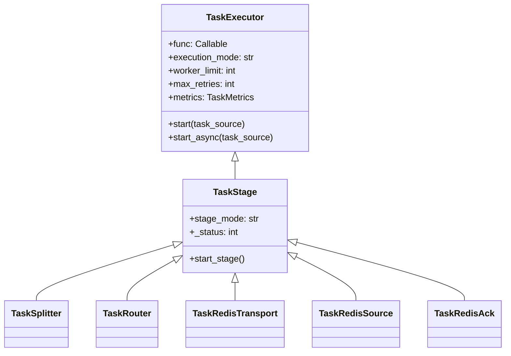
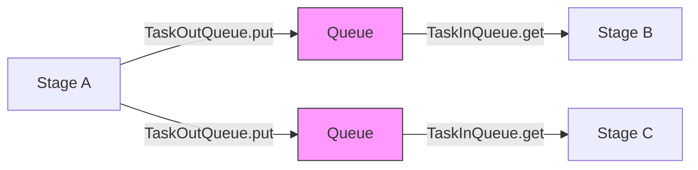
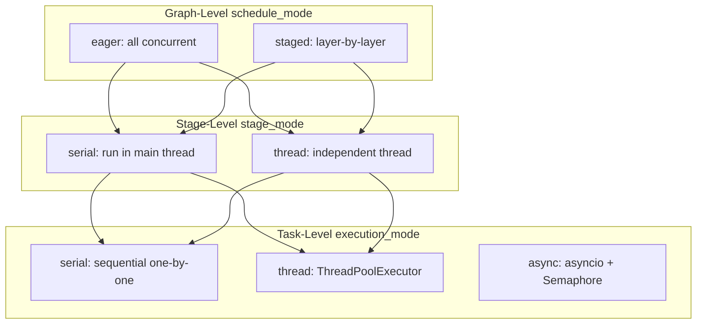
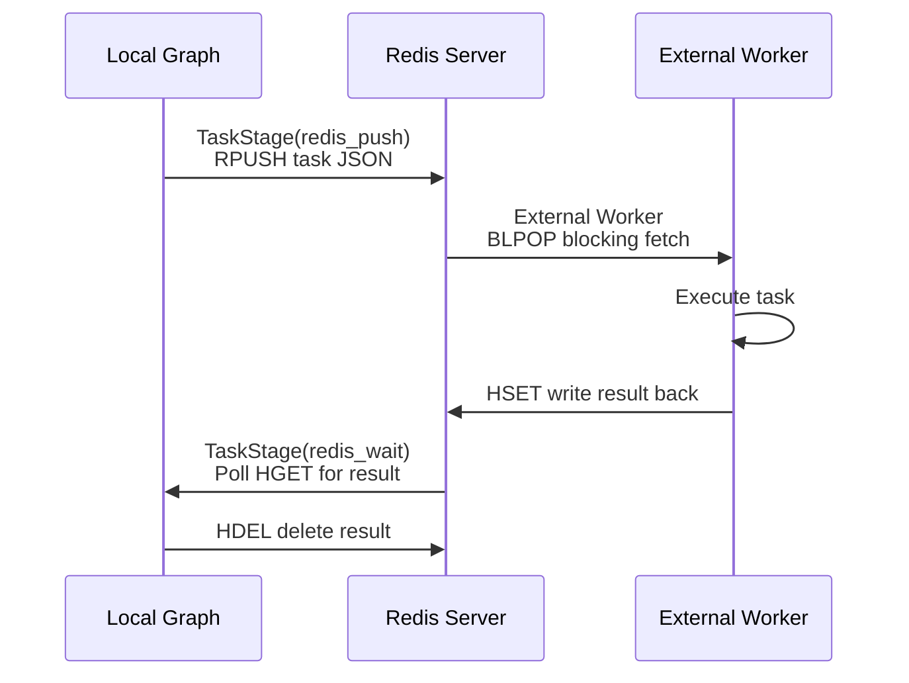
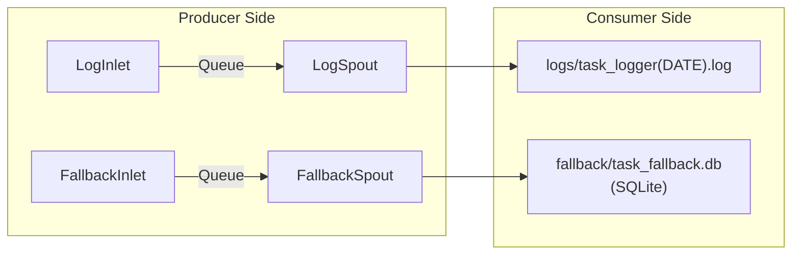
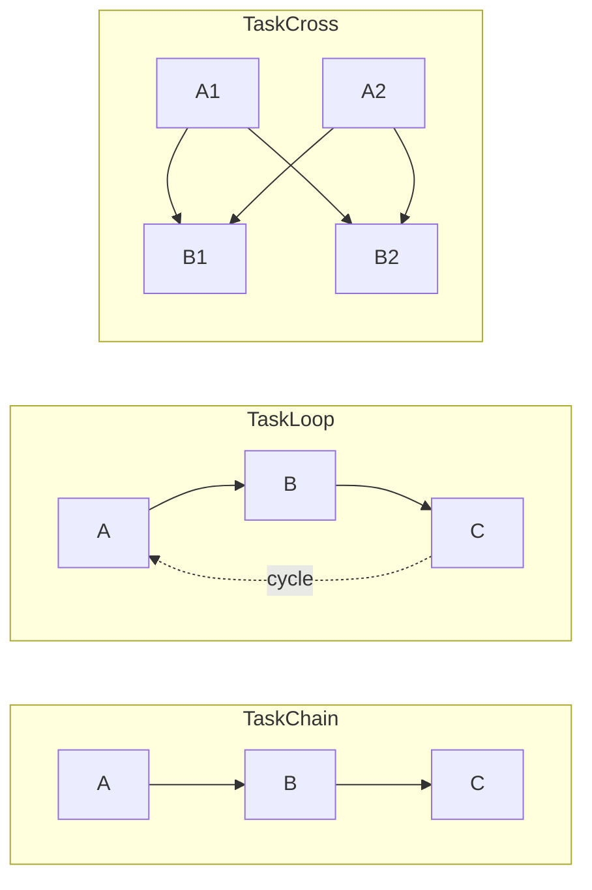
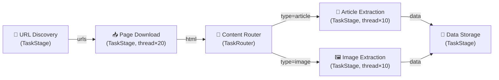
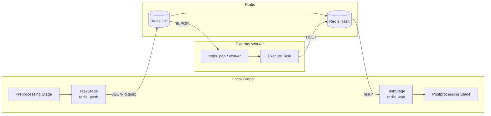

# CelestialFlow Technical Presentation

> 📅 Last Updated: 2026/06/18

---

## Slide 1: Cover

# CelestialFlow

**Next-Generation Python Task Orchestration Engine**

- Lightweight · Graph-Driven · High-Performance · Observable
- Version 3.1.4 | Python 3.10+
- Supports DAG / Cyclic Graphs / Distributed Execution / Real-Time Visualization

---

## Slide 2: Project Background & Motivation

### Why CelestialFlow?

- **Pain Points of Existing Frameworks**: Airflow relies on database scheduling and is heavy to deploy; Prefect leans toward cloud SaaS mode; Ray targets computation-intensive tasks rather than task orchestration
- **Real Demand-Driven**: Need a task graph engine that can be embedded into Python programs with zero external dependencies to run
- **Flexibility Requirements**: Not only DAG support, but also cyclic graphs (looping task flows)
- **High-Performance Scenarios**: Concurrent orchestration of data collection, ETL pipelines, and batch processing tasks
- **Built-in Observability**: Not post-hoc monitoring, but framework-level native metrics, logging, and event provenance

Notes:
Starting from real engineering scenarios — need a task orchestration tool that feels "as natural as writing code", not a platform requiring separate deployment and operations.

---

## Slide 3: What is CelestialFlow

### One-Sentence Definition

> A lightweight, graph-driven Python task orchestration framework supporting DAG/cyclic graph topologies, multiple execution modes, Redis distributed execution, event provenance, and real-time visualization.

### Core Features

- **Rich Graph Topologies**: Chain / Cross / Grid / Loop / Wheel / Complete — six preset structures
- **Multi-Dimensional Execution Model**: Stage-level (serial/thread) × Task-level (serial/thread/async) combinations
- **Redis Distributed**: Transport → Source → Ack three-stage distributed task transport
- **Event Provenance**: CelestialTree integration, full task lifecycle traceability
- **Web Dashboard**: FastAPI + ECharts + Mermaid real-time monitoring
- **Zero Platform Dependency**: `pip install celestialflow`, run in a single line of code

---

## Slide 4: Core Design Philosophy

### Design Philosophy

- **Graph as Program**
  - `TaskGraph` as the execution unit, nodes (`TaskStage`) as processing logic, edges as data flow
  - Orchestration logic completely separated from business logic

- **Envelope Pattern**
  - `TaskEnvelope` encapsulates task + hash + event ID + source information
  - Transparently provides deduplication, provenance, and routing capabilities

- **Termination Protocol**
  - `TerminationSignal` → `TerminationIdPool` incremental merging
  - Ensures correct termination for both DAG and cyclic graphs

- **Metrics as First-Class Citizens**
  - Each Stage has built-in `TaskMetrics`, thread-safe real-time counting

---

## Slide 5: Architecture Overview

### System Architecture Diagram



Notes:
Top to bottom: User defines graph structure → Framework initializes resources and analysis → Executes per schedule mode → Runtime infrastructure provides queues, metrics, logging → Web layer consumes data for visualization.

---

## Slide 6: Core Component — TaskGraph

### TaskGraph: Graph Execution Engine

```python
TaskGraph(
    schedule_mode: str = "eager",   # "eager" | "staged"
    log_level: str = "SUCCESS"
)
```

- **Initialization**: After construction, set nodes via `graph.set_stages(stages=[...])` and establish connections via `graph.connect(...)`. Source nodes are automatically computed via SCC condensation
- **Schedule Modes**:
  - `eager`: All Stages launch concurrently, dependencies naturally guaranteed by queues
  - `staged`: DAG only, layer-by-layer execution with synchronous blocking between layers
- **State Management**: `stage_runtime_dict`, `status_dict`, `stage_history` (last 20 snapshots)
- **Graph Analysis**: Builds directed graph based on NetworkX, detects DAG properties, computes topological layers

---

## Slide 7: Core Component — TaskStage / TaskExecutor

### Inheritance Hierarchy



- **TaskExecutor**: Task execution core, manages retry, deduplication, caching, concurrency strategy
- **TaskStage**: Graph node; topological relationships managed by `TaskGraph` (`graph.out_edges` / `graph.in_edges`)
- **`graph.connect()`**: Establishes connection relationships between nodes (upstream/downstream dependencies)
- **`stage_mode`/`name`**: Passed via `TaskStage.__init__()` constructor parameters

---

## Slide 8: Core Component — Flow Control Nodes

### TaskSplitter & TaskRouter

| Feature | TaskSplitter | TaskRouter |
|------|-------------|------------|
| Semantics | 1 → N (one-to-many split) | 1 → 1 (conditional routing) |
| Input | Single task | Single task |
| Output | Each element in the tuple becomes an independent task | `(target_tag, task)` routed to specified downstream |
| Counters | `split_counter` propagates to downstream `task_counter` | `route_counters[tag]` propagated separately |
| Execution Mode | serial only | serial only |
| Retry | None (`max_retries=0`) | None (`max_retries=0`) |

- **Counter propagation** is the key design ensuring `is_tasks_finished()` correctly judges termination
- Splitter/Router both do not support concurrency, guaranteeing deterministic splitting/routing

---

## Slide 9: Core Component — Queues & Envelopes

### Data Flow Infrastructure



- **TaskEnvelope**: `task` + `hash` (SHA1) + `id` (CelestialTree event) + `source` (origin)
- **TaskInQueue**:
  - Multi-upstream convergence, tracks termination signals by `source_tag`
  - After all upstreams send `TerminationSignal`, merges into `TerminationIdPool` and returns
- **TaskOutQueue**:
  - Broadcast mode `put()` → all downstreams
  - Targeted mode `put_target(item, tag)` → specified downstream (used by Router)
- **Termination Protocol**: Ensures graceful exit for all Stages, whether DAG or cyclic graph

---

## Slide 10: Execution Model

### Three-Layer Execution Dimensions



| Level | Options | Description |
|------|------|------|
| Graph-level `schedule_mode` | `eager` / `staged` | Controls Stage concurrency vs. sequential |
| Stage-level `stage_mode` | `serial` / `thread` | Whether Stage runs in an independent thread |
| Task-level `execution_mode` | `serial` / `thread` | Concurrency strategy for tasks within a Stage |

Notes:
Note that in TaskGraph mode, task-level `async` is not available (only supported by standalone `TaskExecutor.start()`).

---

## Slide 11: Metrics & Deduplication System

### TaskMetrics — Thread-Safe Real-Time Counting

- **Four Core Counters**:
  - `task_counter`: Total input tasks (including Splitter/Router additions)
  - `success_counter`: Successfully processed count
  - `error_counter`: Final failure count (exceeded retry limit)
  - `duplicate_counter`: Deduplication interception count

- **Termination Judgment**: `is_tasks_finished()` = `total == success + error + duplicate`

- **Deduplication Mechanism**:
  - `TaskEnvelope.hash` = `SHA1(pickle.dumps(task))`
  - `processed_set` records processed hashes
  - Zero-cost deduplication — hash computed once during encapsulation

- **SumCounter Aggregation**: Supports accurate merging of multi-source counters in Splitter/Router scenarios

---

## Slide 12: External Collaboration Example — Redis Demo

### Connecting Redis / Go Worker with Plain TaskStage



| Component | Role | Redis Operation | Positioning |
|------|------|-----------|------|
| `redis_push()` | Serialize and push tasks | `RPUSH` | demo helper |
| External Worker / `redis_pop()` | Blocking task fetch | `BLPOP` | Bridges Redis input |
| `redis_wait()` | Wait for remote results | `HGET` → `HDEL` | demo helper |

- **Protocol Position**: This is a set of demo/helper protocols, not built-in framework Stages
- **Installation**: Running this setup requires additionally installing `redis` and starting a Redis service
- **Design Intent**: Demonstrates how to connect external messaging systems to a plain `TaskStage`

---

## Slide 13: CelestialTree Integration

### Event Provenance & Task Lineage

- **CelestialTree**: Hierarchical event tracing system (standalone project `celestialtree`, requires separate installation)
- **Integration Points**:
  - `TaskExecutor.set_ctree(ctree_client)` injects an external event client
  - Default uses `LocalEventClient()`, no dependency on CelestialTree service
  - `TaskEnvelope.id` stores CelestialTree event ID
  - `TerminationSignal.id` / `TerminationIdPool.ids` propagates termination events

- **Tracing Granularity**:
  - Each task receives a unique event ID upon encapsulation
  - Splitter split → child events associated with parent event
  - Termination signal merge → event ID pool aggregation
  - Full chain traceable from input to completion

- **Design Trade-off**: Event tracing is an optional dependency; the default local mode only generates event IDs; install `celestialtree` separately when remote tracing is needed

---

## Slide 14: Persistence & Error Handling

### Persistence Module



- **Spout-Inlet Pattern**:
  - Inlet side (thread-safe): Formats records, writes to shared queue
  - Spout side (daemon thread): Consumes from queue, writes to storage
  - Graceful stop via `TerminationSignal`

- **Log Levels**: `TRACE(0) → DEBUG(10) → SUCCESS(20) → INFO(30) → WARNING(40) → ERROR(50) → CRITICAL(60)`

- **Error Persistence**: SQLite format, includes `stage_name`, `error_type`, `error_message`, `task_json`, `result_json` and other fields

- **Error Analysis Tools**: `load_records()`, `load_records_grouped_by_stage()` aggregates failed tasks by dimension

---

## Slide 15: Exception System

### Structured Exception Hierarchy

```
CelestialFlowError (base class)
├── ConfigurationError
│   └── InvalidOptionError
│       ├── ExecutionModeError    (serial/thread/async)
│       ├── StageModeError        (serial/thread)
│       └── LogLevelError         (TRACE~CRITICAL)
├── RemoteWorkerError             (Redis remote execution failure)
└── UnconsumedError               (Unconsumed queue tasks)
```

- **InvalidOptionError**: Auto-generates "field=value, allowed=[...]" hint messages
- **Fast Feedback**: Configuration-level errors thrown before graph startup, not at runtime

---

## Slide 16: Web Visualization System — Architecture

### Tech Stack

| Layer | Technology | Purpose |
|----|------|------|
| Backend | FastAPI + Uvicorn | REST API, default port 5000 |
| Template | Jinja2 | HTML template rendering |
| Graph Structure | Mermaid.js v10 | Task graph directed graph visualization |
| Time Series Charts | Chart.js | Node completion progress line charts |
| Interaction Enhancement | Sortable.js | Dashboard card drag-and-drop reordering |
| Theme | CSS Variables | Dark/light theme dynamic switching |

- **CLI Entry**: `celestialflow-web --port 5000`
- **Frontend Modularization**: 9 independent JS modules, each with its own responsibility
- **Efficient Updates**: `JSON.stringify` comparison detects changes, only renders differences

---

## Slide 17: Web Visualization System — Features

### Three Core Pages

**1. Dashboard**
- Three-column layout: Left (Mermaid diagram + topology info) | Center (status cards) | Right (progress curves + overall summary)
- Status cards: Running/Stopped/Not Started badges, success/pending/failure/duplicate counts, progress bar, time estimates
- Cards support drag-and-drop reordering, layout persisted to `config.json`

**2. Error Logs**
- Paginated table: error_id / error message / node / task / timestamp
- Keyword search + node filtering
- Clicking failure counts on the dashboard directly navigates and filters

**3. Task Injection**
- Searchable node list (annotated with running status; stopped nodes are unselectable)
- JSON text input or file upload
- One-click `TerminationSignal` injection

---

## Slide 18: Web API Overview

### REST API Design

| Direction | Endpoint | Data |
|------|------|------|
| Pull | `/api/pull_config` | Frontend configuration |
| Pull | `/api/pull_structure` | Graph structure JSON |
| Pull | `/api/pull_status` | Node real-time status |
| Pull | `/api/pull_errors` | Error logs (with caching) |
| Pull | `/api/pull_topology` | DAG/schedule mode/layer info |
| Pull | `/api/pull_summary` | Global summary statistics |
| Pull | `/api/pull_history` | Historical snapshots (progress curve data source) |
| Push | `/api/push_status` | Update status |
| Push | `/api/push_structure` | Update graph structure |
| Push | `/api/push_injection_tasks` | Runtime task injection |
| Push | `/api/push_config` | Save frontend configuration |

- **Pydantic Validation**: All Push endpoints use strong-typed models
- **Error Transmission**: `push_errors` writes directly to SQLite, no extra caching layer needed

---

## Slide 19: Performance Design & Optimization

### Key Performance Decisions

- **Zero-Copy Termination Detection**
  - `is_tasks_finished()` = atomic counter comparison, no need to traverse queues or scan state

- **Hash Once, Deduplicate Forever**
  - `TaskEnvelope.hash` computed once during encapsulation via SHA1; subsequent deduplication is just set lookup (O(1))

- **Factory-Backed Queue Backend**
  - `make_queue_backend()` auto-selects `ThreadQueue` / `AsyncQueue` based on stage_mode
  - Zero synchronization overhead in serial mode

- **Tiered Metric Counters**
  - serial/async: `ValueWrapper` plain int
  - thread: `ValueWrapper` + `threading.Lock`
  - Selects the lightest synchronization mechanism as needed

- **Frontend Incremental Rendering**
  - `JSON.stringify` comparison-based change detection, only re-renders changed DOM regions

---

## Slide 20: Preset Graph Structures

### Six Out-of-the-Box Topology Templates



| Structure | Topology Type | Description |
|------|---------|------|
| `TaskChain` | DAG (linear) | Sequential chain A→B→C |
| `TaskCross` | DAG (fully connected) | Full inter-layer connections |
| `TaskGrid` | DAG (grid) | Right + down connections |
| `TaskLoop` | Cyclic | Tail node loops back to head |
| `TaskWheel` | Cyclic + Hub | Center node connects all ring nodes |
| `TaskComplete` | Fully connected | All nodes interconnected |

- **Forced DAG**: Chain and Grid constructions can use `schedule_mode="staged"`
- **Cyclic Graphs**: Loop / Wheel / Complete must use `schedule_mode="eager"`

---

## Slide 21: Comparison with Other Frameworks

### CelestialFlow vs Major Frameworks

| Feature | CelestialFlow | Airflow | Prefect | Ray |
|------|--------------|---------|---------|-----|
| **Core Positioning** | Embedded task graph engine | Platform-level scheduling system | Cloud-native workflow | Distributed computing framework |
| **Installation Complexity** | `pip install` ready | Requires database + scheduler | Requires Server/Cloud | Requires Ray Cluster |
| **Graph Types** | DAG + cyclic graphs | DAG only | DAG only | Unrestricted (Actor model) |
| **Cyclic Task Support** | Native support (Loop/Wheel) | Not supported | Not supported | Manual implementation |
| **Execution Modes** | serial/thread/async | Celery/K8s/Local | Dask/K8s | Ray Worker |
| **Process-Level Isolation** | None (thread-level) | Executor-level | Dispatch-level | Default isolation |
| **Real-Time Visualization** | Built-in Web UI | Built-in Web UI | Built-in Cloud UI | Ray Dashboard |
| **Event Provenance** | CelestialTree integration | No native support | No native support | No native support |
| **Task Deduplication** | Built-in SHA1 hash dedup | No native support | No native support | No native support |
| **Learning Curve** | Low (pure Python API) | Medium-High | Medium | Medium-High |
| **Deployment Form** | Library / CLI | Standalone platform | Standalone platform/SaaS | Standalone cluster |

---

## Slide 22: Use Cases

### Scenarios Suitable for CelestialFlow

- **Data Collection Pipeline**
  - Multi-stage crawler: URL discovery → Page download → Content extraction → Data storage
  - Natural deduplication avoids duplicate requests

- **ETL / Data Processing**
  - Splitter splits large batches → Multi-Worker concurrent processing → Router distributes results
  - JSONL failure logs → precise retry

- **Batch API Calls**
  - `thread` mode high-concurrency external API calls
  - Built-in retry + error caching

- **Lightweight Stream Processing**
  - Loop structure for continuous fetch → process → write-back
  - External message queue / Worker demos for horizontal scaling

- **Machine Learning Pipeline**
  - Data preprocessing → Feature engineering → Model training → Evaluation
  - thread mode concurrent data pipeline processing

---

## Slide 23: Demo Data Flow

### Typical Pipeline Example



**Execution Configuration Example**:
```python
from celestialflow import TaskStage, TaskRouter, TaskGraph

discover = TaskStage(discover_urls, execution_mode="serial")
download = TaskStage(download_page, execution_mode="thread", worker_limit=20)
router   = TaskRouter(classify_content)
extract_article = TaskStage(extract_article, execution_mode="thread", worker_limit=10)
extract_image   = TaskStage(extract_image, execution_mode="thread", worker_limit=10)
store    = TaskStage(save_to_db, execution_mode="serial")

graph = TaskGraph(schedule_mode="eager")
graph.set_stages(stages=[discover, download, router, extract_article, extract_image, store])
graph.connect([discover], [download])
graph.connect([download], [router])
graph.connect([router], [extract_article, extract_image])
graph.connect([extract_article, extract_image], [store])

graph.start_graph({"discover": [seed_urls]})
```

---

## Slide 24: Distributed Demo Data Flow

### Redis External Collaboration Example



- Local Graph pushes tasks to Redis List via a plain `TaskStage(redis_push)`
- External Worker or `redis_pop()` pulls tasks from Redis and executes them
- Results written back to Redis Hash; local `TaskStage(redis_wait)` polls to retrieve
- **Horizontal Scaling**: Start multiple Worker instances for parallel consumption

---

## Slide 25: Design Trade-offs

### Key Design Decisions

| Decision | Choice | Trade-off |
|------|------|------|
| Cyclic graph support | Signal merge protocol | Increased termination logic complexity in exchange for topological flexibility |
| execution_mode within Graph | serial/thread only | Keeps thread model simple and reliable |
| Logging architecture | Queue + Spout thread | Adds one daemon thread in exchange for thread-safe writes |
| Deduplication strategy | SHA1(pickle) | Pickle instability risk in exchange for universal object hashing ability |
| Redis result retrieval | Polling HGET (0.1s) | Simple and reliable, but not real-time push |
| Web change detection | JSON.stringify comparison | O(n) string comparison cost in exchange for implementation simplicity |
| CelestialTree integration | Optional dependency + NullClient | Zero overhead when not tracing, but requires extra configuration |

Notes:
Every design decision has trade-offs. CelestialFlow prioritizes "simple + reliable + zero deployment dependencies", balancing complexity and functionality.

---

## Slide 26: Extensibility Design

### Module Decoupling Philosophy

- **Stage as Plugin**
  - Implement a `func` → wrap as `TaskStage` → plug into any graph
  - Built-in Splitter / Router are Stage specializations; Redis collaboration is demonstrated via demos

- **Queue Backend Replaceable**
  - `make_queue_backend(mode)` factory method for unified interface
  - ThreadQueue / AsyncQueue switchable on demand

- **Metric Backend Extensible**
  - `ValueWrapper` adapts per execution mode
  - `SumCounter` transparently aggregates multi-source counters

- **Persistence Customizable**
  - Spout-Inlet pattern; just implement `_handle_record()` to customize output target

- **Web Frontend Configurable**
  - `config.json` controls layout, theme, refresh interval
  - Dashboard cards support drag-and-drop reordering

---

## Slide 27: Roadmap

### Evolution Directions

- **Scheduling Enhancements**
  - Priority-based task scheduling
  - Dynamic resource awareness (CPU/memory) auto-adjusting worker_limit

- **Distributed Enhancements**
  - Kafka / RabbitMQ as optional transport backends
  - Distributed consistency guarantees (exactly-once semantics)

- **Observability Enhancements**
  - OpenTelemetry integration
  - Prometheus metrics export
  - Alert rule configuration

- **Developer Experience**
  - Decorator syntax for Stage definition (`@stage(mode="thread")`)
  - Graph visualization editor (Web IDE)
  - Richer built-in Stage templates

- **Ecosystem**
  - Deep CelestialTree integration (causal inference, impact analysis)
  - Plugin marketplace mechanism

---

## Slide 28: Summary

### CelestialFlow — Core Values

- **Lightweight Embedding**: `pip install` ready, no external service dependencies, embed in any Python project
- **Topological Flexibility**: DAG + cyclic graphs, six preset structures, custom arbitrary topologies
- **Rich Execution Models**: Three-layer dimension combinations (Graph × Stage × Task), adapting to any concurrency scenario
- **External Collaboration Friendly**: Can flexibly connect external systems like Redis / Go Worker for horizontal scaling
- **Full-Chain Tracing**: CelestialTree event provenance + SQLite error persistence
- **Built-in Visualization**: Mermaid graph structure + Chart.js progress curves + real-time status panels

### One Sentence

> **Orchestrate arbitrarily complex task flows, the Python way.**

---

## Slide 29: Q&A

# Thank You

**CelestialFlow** — Graph-Driven · Lightweight · High-Performance · Observable

- Version: 3.1.4
- Python: 3.10+
- Dependency: `pip install celestialflow`
- Web: `celestialflow-web`

---
