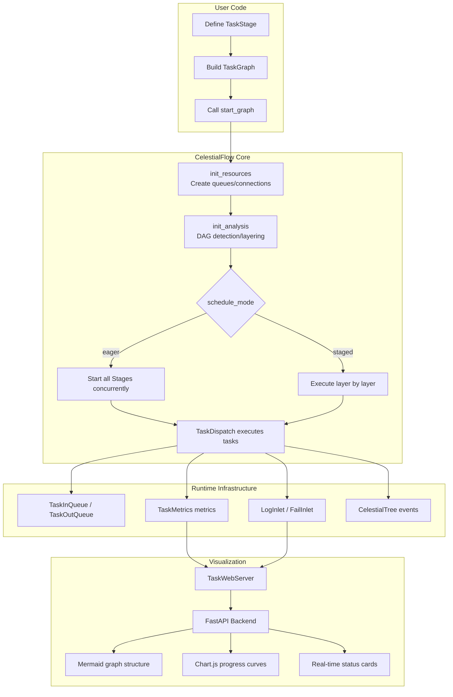
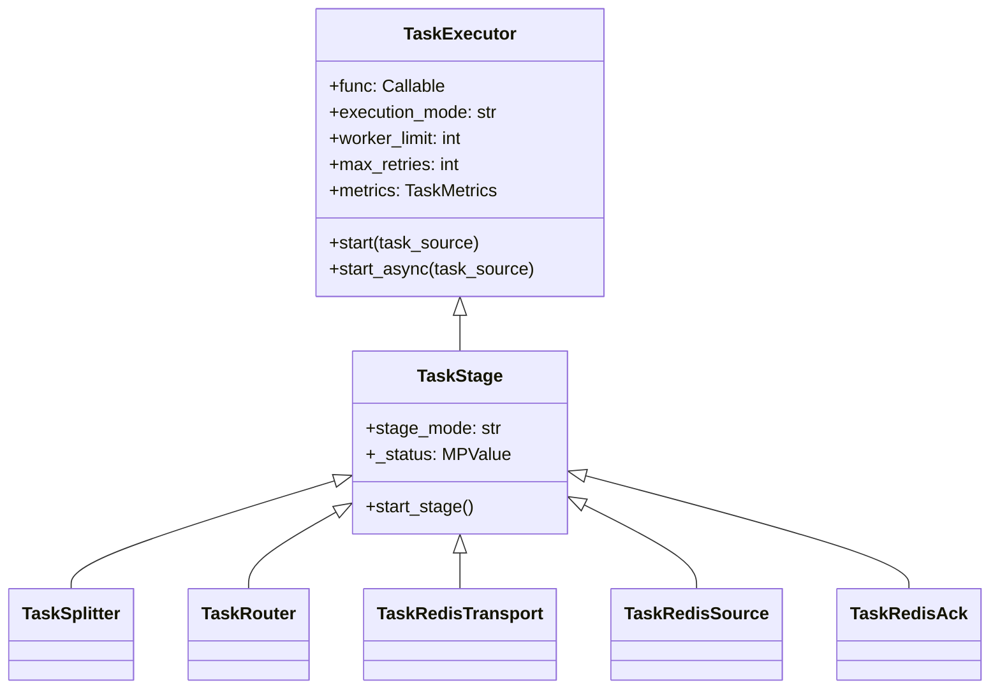
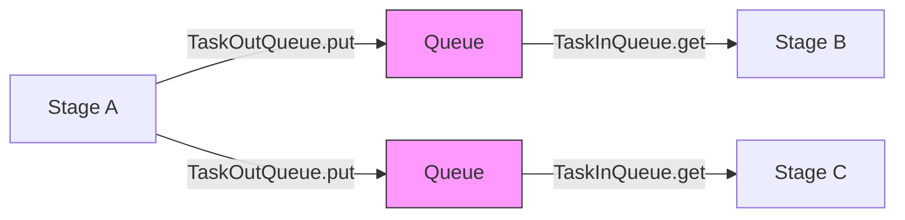
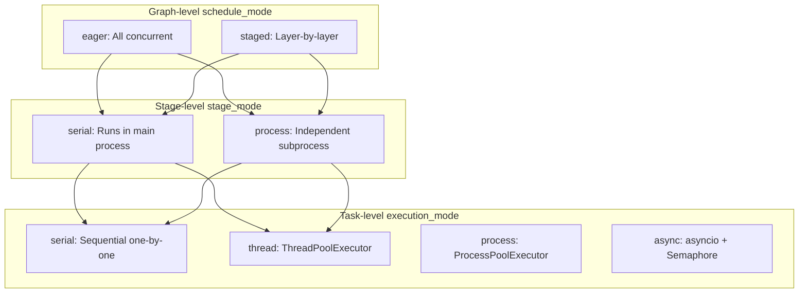
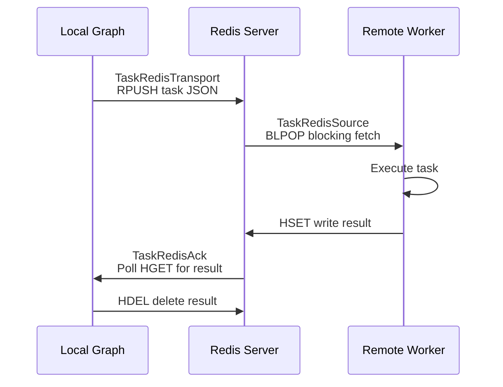
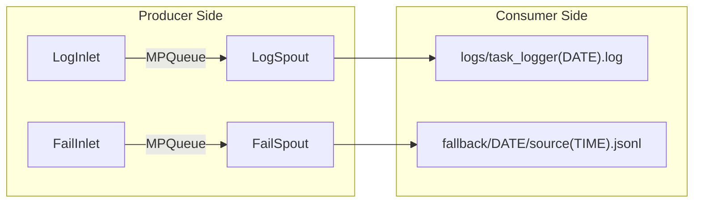
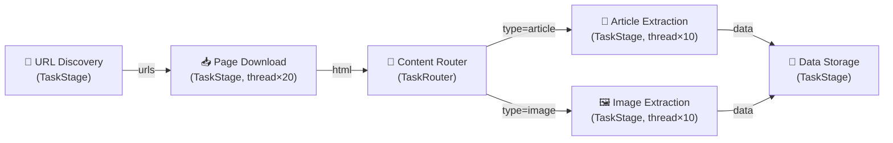
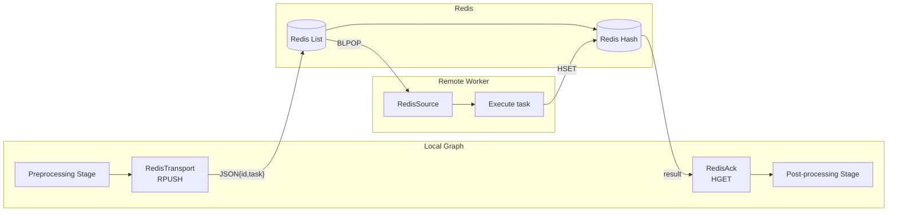

# CelestialFlow Technical Presentation

> 📅 Last updated: 2026/04/22

---

## Slide 1: Cover

# CelestialFlow

**Next-Generation Python Task Orchestration Engine**

- Lightweight · Graph-Driven · High-Performance · Observable
- Version 3.1.4 | Python 3.10+
- Supports DAG / Cyclic Graphs / Distributed Execution / Real-Time Visualization

---

## Slide 2: Project Background and Motivation

### Why CelestialFlow?

- **Pain points of existing frameworks**: Airflow relies on database scheduling and is heavy to deploy; Prefect leans toward a cloud SaaS model; Ray targets compute-intensive workloads rather than task orchestration
- **Driven by real-world needs**: Need a task graph engine that can be embedded in Python programs with zero external dependencies
- **Flexibility requirements**: Support not only DAGs but also cyclic graphs (looping task flows)
- **High-performance scenarios**: Concurrent orchestration for data collection, ETL pipelines, and batch processing tasks
- **Built-in observability**: Not an afterthought — the framework natively provides metrics, logging, and event tracing

Notes:
Starting from practical engineering scenarios — we need a task orchestration tool that feels "as natural as writing code" rather than a platform requiring separate deployment and operations.

---

## Slide 3: What Is CelestialFlow

### One-Line Definition

> A lightweight, graph-driven task orchestration framework for Python, supporting DAG/cyclic graph topologies, multiple execution modes, Redis-based distribution, event sourcing, and real-time visualization.

### Core Features

- **Rich graph topologies**: Six preset structures — Chain / Cross / Grid / Loop / Wheel / Complete
- **Multi-dimensional execution model**: Stage-level (serial/process) x Task-level (serial/thread/process/async) combinations
- **Redis distribution**: Three-phase distributed task transmission — Transport → Source → Ack
- **Event sourcing**: CelestialTree integration for full task lifecycle tracking
- **Web dashboard**: FastAPI + ECharts + Mermaid real-time monitoring
- **Zero platform dependency**: `pip install celestialflow` — one line to get started

---

## Slide 4: Core Design Philosophy

### Design Philosophy

- **Graph as Program**
  - `TaskGraph` as the execution unit, nodes (`TaskStage`) as processing logic, edges as data flow
  - Complete separation of orchestration logic from business logic

- **Envelope Pattern**
  - `TaskEnvelope` wraps task + hash + event ID + source information
  - Transparently provides deduplication, tracing, and routing capabilities

- **Termination Protocol**
  - `TerminationSignal` → `TerminationIdPool` — progressive merging
  - Ensures correct termination for both DAGs and cyclic graphs

- **Metrics as First-Class**
  - Every Stage has built-in `TaskMetrics` — cross-process safe real-time counters

---

## Slide 5: Architecture Overview

### System Architecture Diagram



Notes:
Top-down flow: User defines graph structure → Framework initializes resources and analysis → Executes according to scheduling mode → Runtime infrastructure provides queues, metrics, logging → Web layer consumes data for visualization.

---

## Slide 6: Core Component — TaskGraph

### TaskGraph: The Graph Execution Engine

```python
TaskGraph(
    schedule_mode: str = "eager",   # "eager" | "staged"
    log_level: str = "SUCCESS"
)
```

- **Initialization**: After construction, set nodes via `graph.set_stages(root_stages=[...], stages=[...])` and establish connections via `graph.connect(...)`
- **Scheduling modes**:
  - `eager`: All Stages start concurrently; dependency ordering is naturally enforced by queues
  - `staged`: DAG-only; layer-by-layer execution with synchronous blocking between layers
- **State management**: `stage_runtime_dict`, `status_dict`, `stage_history` (last 20 snapshots)
- **Graph analysis**: Builds a directed graph using NetworkX, detects DAG properties, computes topological layers

---

## Slide 7: Core Components — TaskStage / TaskExecutor

### Inheritance Hierarchy



- **TaskExecutor**: Core task execution — manages retries, deduplication, caching, and concurrency strategies
- **TaskStage**: Graph node — topological relationships managed by `TaskGraph` (`graph.out_edges` / `graph.in_edges`)
- **`graph.connect()`** establishes upstream/downstream connections between nodes
- **`stage_mode`/`stage_name`** are passed as constructor parameters to `TaskStage.__init__()`

---

## Slide 8: Core Components — Flow Control Nodes

### TaskSplitter & TaskRouter

| Feature | TaskSplitter | TaskRouter |
|---------|-------------|------------|
| Semantics | 1 → N (one-to-many split) | 1 → 1 (conditional routing) |
| Input | Single task | Single task |
| Output | Each element in the tuple becomes an independent task | `(target_tag, task)` routes to the specified downstream | 
| Counter | `split_counter` propagates to downstream `task_counter` | `route_counters[tag]` propagates separately |
| Execution mode | Serial only | Serial only |
| Retries | None (`max_retries=0`) | None (`max_retries=0`) |

- **Counter propagation** is a key design element for ensuring `is_tasks_finished()` works correctly
- Splitter/Router do not support concurrency, ensuring deterministic splitting/routing

---

## Slide 9: Core Components — Queues and Envelopes

### Data Flow Infrastructure



- **TaskEnvelope**: `task` + `hash`(SHA1) + `id`(CelestialTree event) + `source`(origin)
- **TaskInQueue**:
  - Multi-upstream aggregation, tracks termination signals by `source_tag`
  - When all upstreams have sent `TerminationSignal`, merges into `TerminationIdPool` and returns
- **TaskOutQueue**:
  - Broadcast mode `put()` → all downstreams
  - Targeted mode `put_target(item, tag)` → specific downstream (used by Router)
- **Termination protocol**: Ensures graceful shutdown of all Stages in both DAGs and cyclic graphs

---

## Slide 10: Execution Model

### Three-Layer Execution Dimensions



| Level | Options | Description |
|-------|---------|-------------|
| Graph-level `schedule_mode` | `eager` / `staged` | Controls concurrent vs sequential execution between Stages |
| Stage-level `stage_mode` | `serial` / `process` | Whether the Stage runs in an independent process |
| Task-level `execution_mode` | `serial` / `thread` | Concurrency strategy for tasks within a Stage |

Notes:
Note that in TaskGraph mode, task-level `process` and `async` are not available (only supported in standalone `TaskExecutor.start()`). This is due to technical limitations with process-in-process and async-in-subprocess patterns.

---

## Slide 11: Metrics and Deduplication System

### TaskMetrics — Cross-Process Safe Real-Time Counters

- **Four core counters**:
  - `task_counter`: Total input tasks (including those added by Splitter/Router)
  - `success_counter`: Successfully processed count
  - `error_counter`: Final failure count (exceeded retry limit)
  - `duplicate_counter`: Deduplicated count

- **Termination check**: `is_tasks_finished()` = `total == success + error + duplicate`

- **Deduplication mechanism**:
  - `TaskEnvelope.hash` = `SHA1(pickle.dumps(task))`
  - `processed_set` records processed hashes
  - Zero-cost deduplication — hash is computed once during envelope creation

- **SumCounter aggregation**: Supports accurate merging of counters from multiple sources in Splitter/Router scenarios

- **Process safety**: `MPValue("i")` provides atomic operations in process mode

---

## Slide 12: Distributed Capabilities — Redis Integration

### Three-Phase Redis Task Transmission



| Component | Role | Redis Operation | Execution Mode |
|-----------|------|----------------|----------------|
| `TaskRedisTransport` | Serialize and push tasks | `RPUSH` | thread, worker_limit=4 |
| `TaskRedisSource` | Blocking task pull | `BLPOP` | serial |
| `TaskRedisAck` | Wait for remote results | `HGET` → `HDEL` | serial |

- **JSON serialization**: Task → `{id, task, emit_ts}` JSON string
- **At-most-once semantics**: Results are deleted immediately after reading
- **Timeout mechanism**: Both Source/Ack support `timeout` parameter, raising `TimeoutError` on expiry

---

## Slide 13: CelestialTree Integration

### Event Sourcing and Task Lineage

- **CelestialTree**: Hierarchical event tracking system (standalone project `celestialtree>=0.1.2`)
- **Integration points**:
  - `TaskExecutor.set_ctree(host, http_port, grpc_port)` enables tracking
  - `TaskExecutor.set_nullctree()` disables tracking (uses NullClient)
  - `TaskEnvelope.id` stores the CelestialTree event ID
  - `TerminationSignal.id` / `TerminationIdPool.ids` propagates termination events

- **Tracking granularity**:
  - Each task receives a unique event ID during envelope creation
  - Splitter splits → child events associated with parent event
  - Termination signal merging → event ID pool aggregation
  - Full traceability from input to completion

- **Design trade-off**: Event tracking is an optional dependency — zero overhead when disabled (NullClient mode)

---

## Slide 14: Persistence and Error Handling

### Persistence Module



- **Spout-Inlet pattern**:
  - Inlet side (multi-process safe): Formats records and writes to shared queue
  - Spout side (daemon thread): Consumes from queue and writes to file
  - Graceful shutdown via `TerminationSignal`

- **Log levels**: `TRACE(0) → DEBUG(10) → SUCCESS(20) → INFO(30) → WARNING(40) → ERROR(50) → CRITICAL(60)`

- **Error persistence**: JSONL format containing `timestamp`, `stage`, `error_repr`, `task_repr`, and fully serialized `error` and `task`

- **Error analysis tools**: `load_task_by_stage()`, `load_task_by_error()` — aggregate failed tasks by dimension

---

## Slide 15: Exception Hierarchy

### Structured Exception Hierarchy

```
CelestialFlowError (base class)
├── ConfigurationError
│   └── InvalidOptionError
│       ├── ExecutionModeError    (serial/process/thread/async)
│       ├── StageModeError        (serial/process)
│       └── LogLevelError         (TRACE~CRITICAL)
├── RemoteWorkerError             (Redis remote execution failure)
├── UnconsumedError               (Unconsumed queue tasks)
└── PickleError                   (Non-serializable objects)
```

- **InvalidOptionError**: Auto-generates "field=value, allowed=[...]" hint messages
- **PickleError**: Detects issues at build time via `find_unpickleable(obj)`
- **Fast feedback**: Configuration-level errors are raised before graph startup, not at runtime

---

## Slide 16: Web Visualization System — Architecture

### Technology Stack

| Layer | Technology | Purpose |
|-------|-----------|---------|
| Backend | FastAPI + Uvicorn | REST API, default port 5000 |
| Template | Jinja2 | HTML template rendering |
| Graph structure | Mermaid.js v10 | Directed graph visualization of task graphs |
| Time series charts | Chart.js | Node completion progress line charts |
| Interaction enhancement | Sortable.js | Dashboard card drag-and-drop reordering |
| Theme | CSS Variables | Dynamic light/dark theme switching |

- **CLI entry point**: `celestialflow-web --port 5000`
- **Frontend modularity**: 9 independent JS modules, each with its own responsibility
- **Efficient updates**: `JSON.stringify` comparison for change detection — only re-renders changed sections

---

## Slide 17: Web Visualization System — Features

### Three Core Pages

**1. Dashboard**
- Three-column layout: Left (Mermaid graph + topology info) | Center (status cards) | Right (progress curves + overall summary)
- Status cards: Running/Stopped/Not Started badges, success/pending/failed/deduplicated counts, progress bar, time estimation
- Card drag-and-drop reordering with layout persistence to `config.json`

**2. Error Logs**
- Paginated table: error_id / error message / node / task / timestamp
- Keyword search + node filtering
- Click on failure count in the dashboard to jump directly with filter applied

**3. Task Injection**
- Searchable node list (shows running status; stopped nodes cannot be selected)
- JSON text input or file upload
- One-click `TerminationSignal` injection

---

## Slide 18: Web API Overview

### REST API Design

| Direction | Endpoint | Data |
|-----------|----------|------|
| Pull | `/api/pull_config` | Frontend configuration |
| Pull | `/api/pull_structure` | Graph structure JSON |
| Pull | `/api/pull_status` | Real-time node status |
| Pull | `/api/pull_errors` | Error logs (with caching) |
| Pull | `/api/pull_topology` | DAG/scheduling mode/layer info |
| Pull | `/api/pull_summary` | Global aggregated statistics |
| Pull | `/api/pull_history` | Historical snapshots (progress curve data source) |
| Push | `/api/push_status` | Update status |
| Push | `/api/push_structure` | Update graph structure |
| Push | `/api/push_injection_tasks` | Inject tasks at runtime |
| Push | `/api/push_config` | Save frontend configuration |

- **Pydantic validation**: All Push endpoints use strongly typed models
- **Error caching**: `push_errors_meta` caches file paths and version numbers to avoid re-reading JSONL files

---

## Slide 19: Performance Design and Optimization

### Key Performance Decisions

- **Zero-copy termination detection**
  - `is_tasks_finished()` = atomic counter comparison — no need to traverse queues or scan state

- **Hash once, deduplicate forever**
  - `TaskEnvelope.hash` computes SHA1 once during envelope creation; subsequent deduplication is just a set lookup (O(1))

- **Factory-based queue backends**
  - `make_queue_backend()` automatically selects `ThreadQueue` / `MPQueue` / `AsyncQueue` based on stage_mode
  - Serial mode: zero synchronization overhead; process mode: OS-level pipes

- **Tiered metrics counters**
  - serial/async: `ValueWrapper` — plain int
  - thread: `ValueWrapper` + `threading.Lock`
  - process: `MPValue("i")` — shared memory atomic operations
  - Selects the lightest synchronization mechanism as needed

- **Frontend incremental rendering**
  - `JSON.stringify` comparison for change detection — only re-renders changed DOM regions

---

## Slide 20: Preset Graph Structures

### Six Out-of-the-Box Topology Templates


| Structure | Topology Type | Description |
|-----------|--------------|-------------|
| `TaskChain` | DAG (linear) | Sequential chain A→B→C |
| `TaskCross` | DAG (fully connected) | Fully connected between layers |
| `TaskGrid` | DAG (grid) | Right + downward connections |
| `TaskLoop` | Cyclic | Tail node connects back to head node |
| `TaskWheel` | Cyclic + Hub | Hub node connected to all ring nodes |
| `TaskComplete` | Fully connected | All nodes interconnected |

- **Forced DAG**: Chain and Grid can use `schedule_mode="staged"` at construction
- **Cyclic graphs**: Loop / Wheel / Complete must use `schedule_mode="eager"`

---

## Slide 21: Comparison with Other Frameworks

### CelestialFlow vs Mainstream Frameworks

| Feature | CelestialFlow | Airflow | Prefect | Ray |
|---------|--------------|---------|---------|-----|
| **Core positioning** | Embeddable task graph engine | Platform-level scheduling system | Cloud-native workflow | Distributed computing framework |
| **Installation complexity** | `pip install` and go | Requires database + scheduler | Requires Server/Cloud | Requires Ray Cluster |
| **Graph types** | DAG + cyclic graphs | DAG only | DAG only | Unrestricted (Actor model) |
| **Cyclic task support** | Native support (Loop/Wheel) | Not supported | Not supported | Manual implementation |
| **Execution modes** | serial/thread/process/async | Celery/K8s/Local | Dask/K8s | Ray Worker |
| **Process-level isolation** | Stage-level `process` mode | Executor-level | Dispatch-level | Default isolation |
| **Real-time visualization** | Built-in Web UI | Built-in Web UI | Built-in Cloud UI | Ray Dashboard |
| **Event sourcing** | CelestialTree integration | No native support | No native support | No native support |
| **Task deduplication** | Built-in SHA1 hash deduplication | No native support | No native support | No native support |
| **Learning curve** | Low (pure Python API) | Medium-High | Medium | Medium-High |
| **Deployment model** | Library / CLI | Standalone platform | Standalone platform/SaaS | Standalone cluster |

---

## Slide 22: Use Cases

### Scenarios Well-Suited for CelestialFlow

- **Data Collection Pipeline**
  - Multi-stage crawler: URL discovery → Page download → Content extraction → Data ingestion
  - Built-in deduplication prevents duplicate requests

- **ETL / Data Processing**
  - Splitter splits large batches → Multiple workers process concurrently → Router distributes results
  - JSONL failure logs → Precise retries

- **Batch API Calls**
  - `thread` mode for high-concurrency external API calls
  - Built-in retries + error caching

- **Lightweight Real-Time Stream Processing**
  - Loop structure for continuous pull → process → write-back
  - Redis distribution for horizontal scaling

- **Machine Learning Pipeline**
  - Data preprocessing → Feature engineering → Model training → Evaluation
  - Process mode leverages multiple cores, avoiding the GIL

---

## Slide 23: Demo Data Flow

### Typical Pipeline Example



**Execution configuration example**:
```python
from celestialflow import TaskStage, TaskRouter, TaskGraph

discover = TaskStage(discover_urls, execution_mode="serial")
download = TaskStage(download_page, execution_mode="thread", worker_limit=20)
router   = TaskRouter(classify_content)
extract_article = TaskStage(extract_article, execution_mode="thread", worker_limit=10)
extract_image   = TaskStage(extract_image, execution_mode="thread", worker_limit=10)
store    = TaskStage(save_to_db, execution_mode="serial")

graph = TaskGraph(schedule_mode="eager")
graph.set_stages(root_stages=[discover], stages=[download, router, extract_article, extract_image, store])
graph.connect([discover], [download])
graph.connect([download], [router])
graph.connect([router], [extract_article, extract_image])
graph.connect([extract_article, extract_image], [store])

graph.start_graph({"discover": [seed_urls]})
```

---

## Slide 24: Distributed Demo Data Flow

### Redis Distributed Execution Example



- The local Graph pushes tasks to a Redis List via `TaskRedisTransport`
- The remote Worker pulls tasks via blocking `TaskRedisSource`
- Results are written back to a Redis Hash; the local `TaskRedisAck` polls for retrieval
- **Horizontal scaling**: Simply start multiple Worker instances for parallel consumption

---

## Slide 25: Design Trade-offs

### Key Design Decisions

| Decision | Choice | Trade-off |
|----------|--------|-----------|
| Cyclic graph support | Signal merging protocol | Increased termination logic complexity in exchange for topological flexibility |
| execution_mode within Graph | Serial/thread only | Avoids process-in-process nesting issues |
| Logging architecture | Queue + Spout thread | Extra daemon thread in exchange for multi-process safe writes |
| Deduplication strategy | SHA1(pickle) | Pickle instability risk in exchange for universal object hashing |
| Redis result retrieval | Polling HGET (0.1s) | Simple and reliable, but not real-time push |
| Web change detection | JSON.stringify comparison | O(n) string comparison cost in exchange for implementation simplicity |
| CelestialTree integration | Optional dependency + NullClient | Zero overhead when not tracking, but requires additional configuration |

Notes:
Every design decision involves trade-offs. CelestialFlow prioritizes "simplicity + reliability + zero deployment dependencies," balancing complexity and functionality.

---

## Slide 26: Extensibility Design

### Modular Decoupling Philosophy

- **Stage as Plugin**
  - Implement a `func` → wrap as `TaskStage` → plug into any graph
  - Built-in Splitter / Router / Redis series are all specializations of Stage

- **Replaceable Queue Backends**
  - `make_queue_backend(mode)` factory method with unified interface
  - ThreadQueue / MPQueue / AsyncQueue — switch as needed

- **Extensible Metrics Backends**
  - `ValueWrapper` / `MPValue` adapted by execution mode
  - `SumCounter` transparently aggregates counters from multiple sources

- **Customizable Persistence**
  - Spout-Inlet pattern — just implement `_handle_record()` to customize the output target

- **Configurable Web Frontend**
  - `config.json` controls layout, theme, and refresh interval
  - Dashboard cards support drag-and-drop reordering

---

## Slide 27: Future Roadmap

### Evolution Directions

- **Scheduling Enhancements**
  - Priority-based task scheduling
  - Dynamic resource-aware (CPU/memory) automatic worker_limit adjustment

- **Distributed Enhancements**
  - Kafka / RabbitMQ as optional transport backends
  - Distributed consistency guarantees (exactly-once semantics)

- **Observability Enhancements**
  - OpenTelemetry integration
  - Prometheus metrics export
  - Alert rule configuration

- **Developer Experience**
  - Decorator syntax for defining Stages (`@stage(mode="thread")`)
  - Graph visual editor (Web IDE)
  - Richer built-in Stage templates

- **Ecosystem**
  - Deep CelestialTree integration (causal inference, impact analysis)
  - Plugin marketplace mechanism

---

## Slide 28: Summary

### CelestialFlow — Core Value Proposition

- **Lightweight embedding**: `pip install` and go — no external service dependencies, embeds into any Python project
- **Topological flexibility**: DAG + cyclic graphs, six preset structures, custom arbitrary topologies
- **Rich execution model**: Three-layer dimensional combinations (Graph × Stage × Task), adapts to any concurrency scenario
- **Distribution ready**: Redis three-phase transmission, horizontal scaling without code changes
- **Full-chain tracing**: CelestialTree event sourcing + JSONL error persistence
- **Built-in visualization**: Mermaid graph structure + Chart.js progress curves + real-time status panels

### In One Line

> **Orchestrate arbitrarily complex task flows the way you write Python.**

---

## Slide 29: Q&A

# Thank You

**CelestialFlow** — Graph-Driven · Lightweight · High-Performance · Observable

- Version: 3.1.4
- Python: 3.10+
- Install: `pip install celestialflow`
- Web: `celestialflow-web`

---
