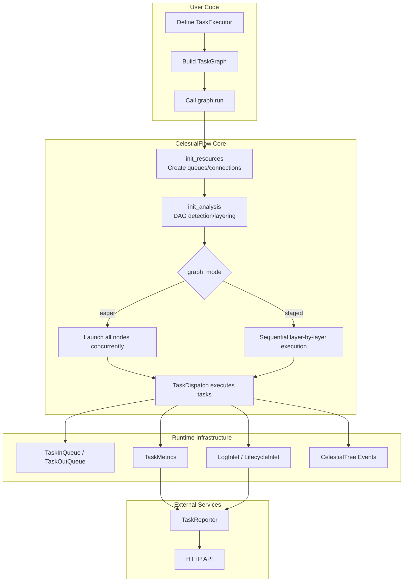
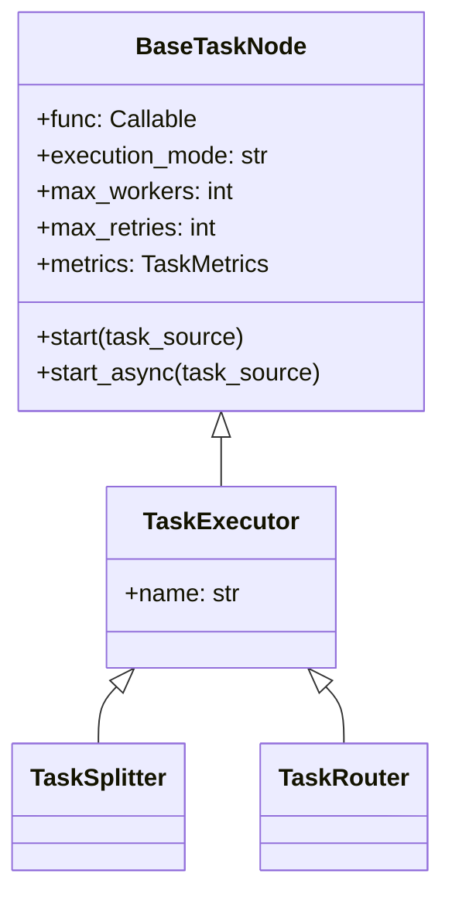
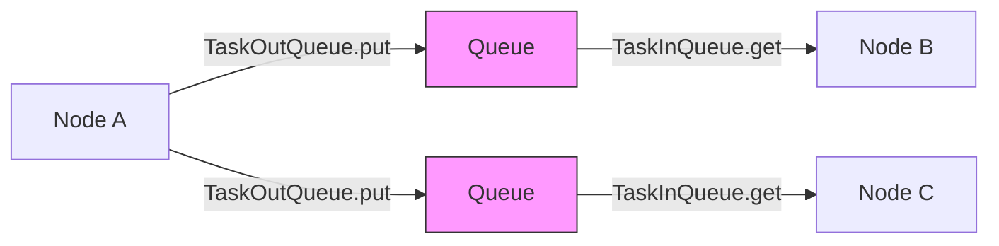
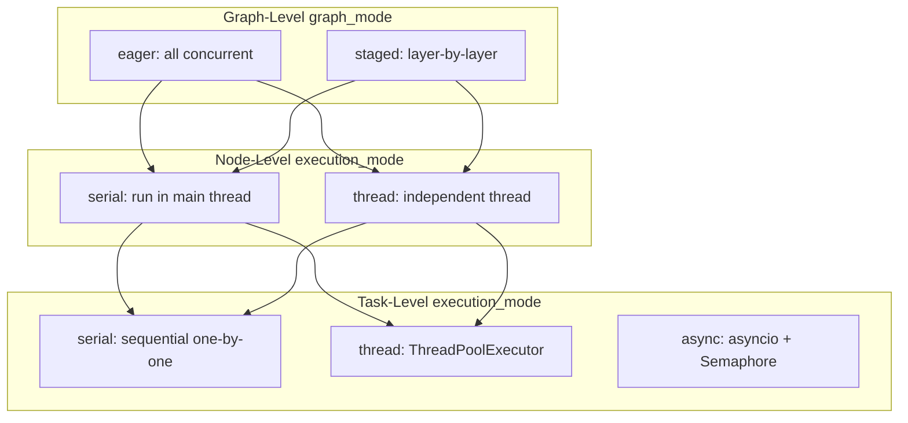
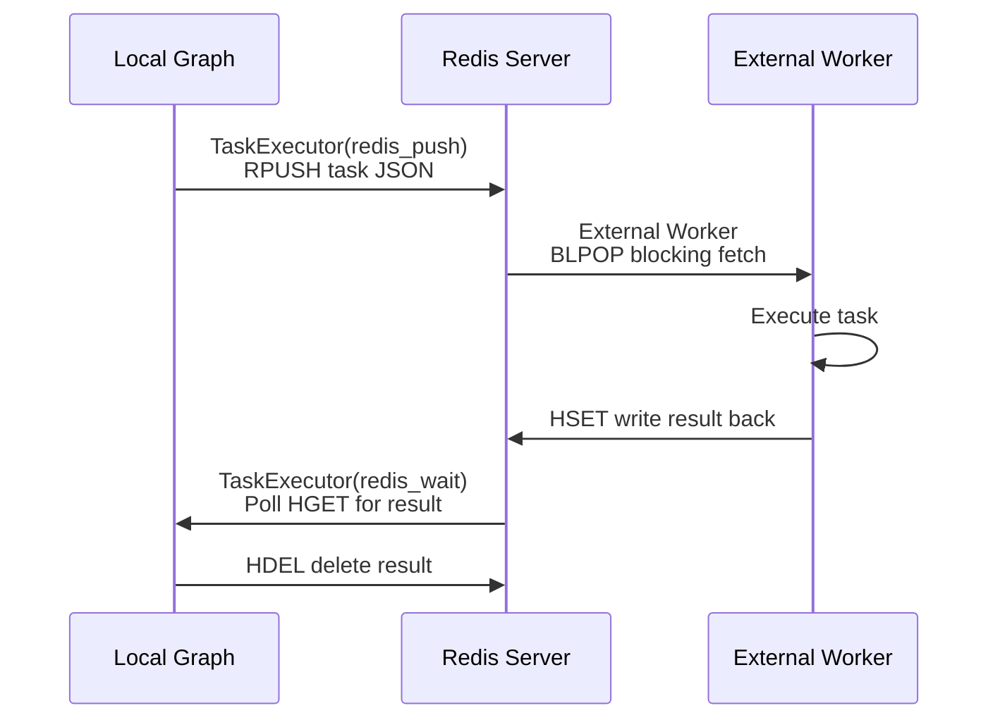
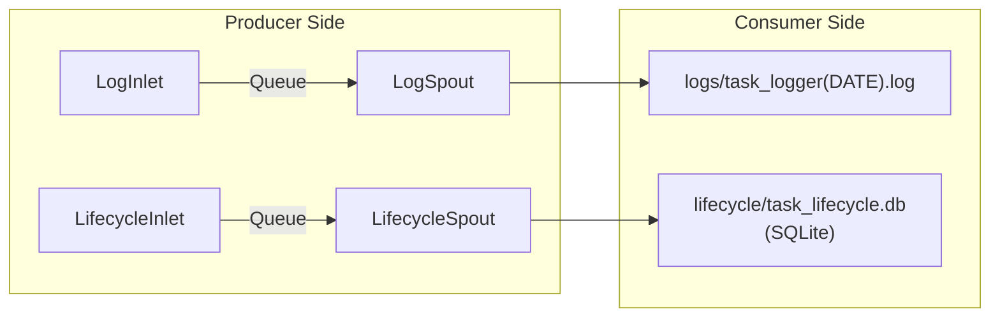
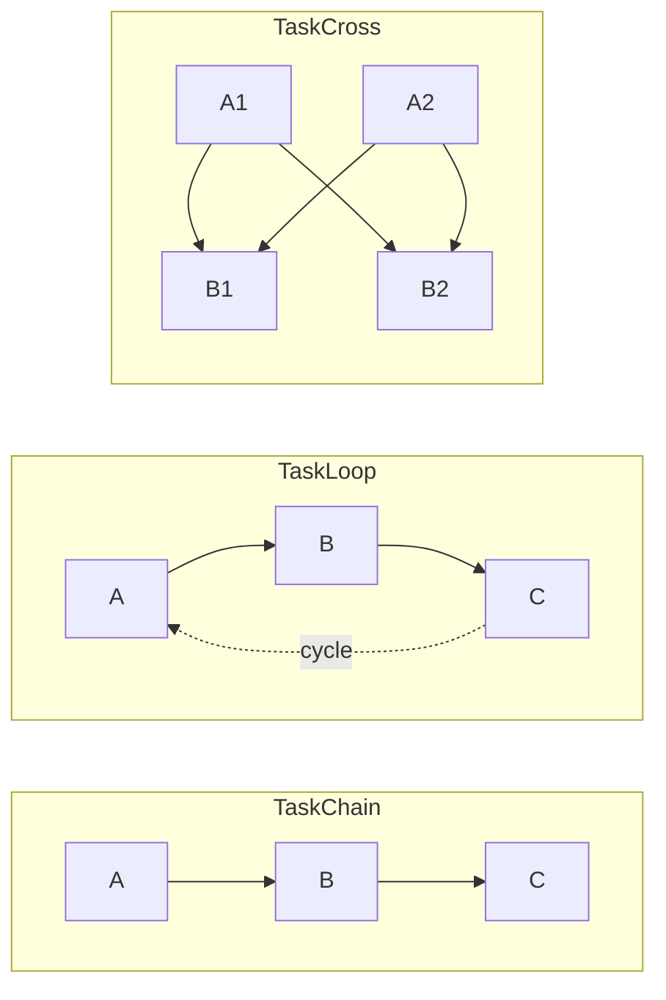
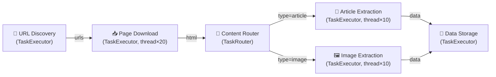
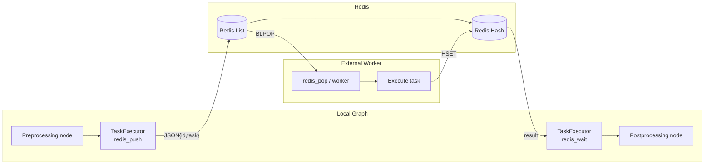

# CelestialFlow Technical Presentation

> 📅 Last Updated: 2026/09/09

---

## Slide 1: Cover

# CelestialFlow

**Next-Generation Python Task Orchestration Engine**

- Lightweight · Graph-Driven · High-Performance · Observable
- Version 3.1.4 | Python 3.12+
- Supports DAG / Cyclic Graphs / Distributed Execution / Observable Execution Chain

---

## Slide 2: Project Background & Motivation

### Why CelestialFlow?

- **Pain Points of Existing Frameworks**: Airflow relies on database scheduling and is heavy to deploy; Prefect leans toward cloud SaaS mode; Ray targets computation-intensive tasks rather than task orchestration
- **Real Demand-Driven**: Need a task graph engine that can be embedded into Python programs with zero external dependencies to run
- **Flexibility Requirements**: Not only DAG support, but also cyclic graphs (looping task flows)
- **High-Performance Scenarios**: Concurrent orchestration of data collection, ETL pipelines, and batch processing tasks
- **Built-in Observability**: Not post-hoc monitoring, but framework-level native metrics, logging, and event provenance

Notes:
Starting from real engineering scenarios — need a task orchestration tool that feels "as natural as writing code", not a platform requiring separate deployment and operations.

---

## Slide 3: What is CelestialFlow

### One-Sentence Definition

> A lightweight, graph-driven Python task orchestration framework supporting DAG/cyclic graph topologies, multiple execution modes, event provenance, and status reporting, with optional external collaboration examples.

### Core Features

- **Rich Graph Topologies**: Chain / Cross / Grid / Loop / Wheel / Complete — six preset structures
- **Multi-Dimensional Execution Model**: Stage-level (serial/thread) × Task-level (serial/thread/async) combinations
- **External Collaboration Examples**: A regular `TaskExecutor` can interface with Redis / Go Worker and other external systems
- **Event Provenance**: Integrates CelestialTree, full task lifecycle traceability
- **Status Reporting Chain**: Exchanges status and control instructions with `celestialflow-web` service via `TaskReporter`
- **Zero Platform Dependency**: `pip install celestialflow`, run in a single line of code

---

## Slide 4: Core Design Philosophy

### Design Philosophy

- **Graph as Program**
  - `TaskGraph` as the execution unit, nodes (`TaskExecutor`) as processing logic, edges as data flow
  - Orchestration logic completely separated from business logic

- **Envelope Pattern**
  - `TaskEnvelope` encapsulates task + hash + event ID + source information
  - Transparently provides deduplication, provenance, and routing capabilities

- **Termination Protocol**
  - `TerminationSignal` → `TerminationIdPool` progressive merging
  - Ensures correct termination for both DAG and cyclic graphs

- **Metrics as First-Class Citizens**
  - Each Stage has built-in `TaskMetrics`, thread-safe real-time counting

---

## Slide 5: Architecture Overview

### System Architecture Diagram


```mermaid
graph TB
    subgraph User Code
        A[Define TaskExecutor] --> B[Build TaskGraph]
        B --> C[Call graph.run]
    end

    subgraph CelestialFlow Core
        C --> D[init_resources<br/>Create queues/connections]
        D --> E[init_analysis<br/>DAG detection/layering]
        E --> F{graph_mode}
        F -->|eager| G[Launch all nodes concurrently]
        F -->|staged| H[Sequential layer-by-layer execution]
        G --> I[TaskDispatch executes tasks]
        H --> I
    end

    subgraph Runtime Infrastructure
        I --> J[TaskInQueue / TaskOutQueue]
        I --> K[TaskMetrics]
        I --> L[LogInlet / LifecycleInlet]
        I --> M[CelestialTree Events]
    end

    subgraph External Services
        N[TaskReporter]
        O[HTTP API]
    end

    K --> N
    L --> N
    N --> O
```

Notes:
Top to bottom: User defines graph structure → Framework initializes resources and analysis → Executes per schedule mode → Runtime infrastructure provides queues, metrics, logs → `TaskReporter` optionally syncs status to external services.

---

## Slide 6: Core Component — TaskGraph

### TaskGraph: Graph Execution Engine

```python
TaskGraph(
    graph_mode: str = "eager",   # "eager" | "staged"
    log_level: str = "SUCCESS"
)
```

- **Initialization**: After construction, set nodes via `graph.set_nodes(stages=[...])` and establish connections via `graph.connect(...)`. Source nodes are automatically computed via SCC condensation
- **Schedule Modes**:
  - `eager`: All nodes launch concurrently, dependencies naturally guaranteed by queues
  - `staged`: DAG only, layer-by-layer execution with synchronous blocking between layers
- **State Management**: `node_dict` (node object collection), `status_dict` (runtime state), `snapshot()` (last 20 snapshots)
- **Graph Analysis**: Builds directed graph based on NetworkX, detects DAG properties, computes topological layers

---

## Slide 7: Core Component — TaskExecutor / TaskSplitter / TaskRouter

### Inheritance Hierarchy


```mermaid
classDiagram
    BaseTaskNode <|-- TaskExecutor
    TaskExecutor <|-- TaskSplitter
    TaskExecutor <|-- TaskRouter
    class BaseTaskNode {
        +func: Callable
        +execution_mode: str
        +max_workers: int
        +max_retries: int
        +metrics: TaskMetrics
        +start(task_source)
        +start_async(task_source)
    }

    class TaskExecutor {
        +name: str
    }
```

- **BaseTaskNode**: Base class for all running nodes, defines common skeleton (queues, metrics, lifecycle)
- **TaskExecutor**: General-purpose task executor, manages retry, deduplication, caching, concurrency strategy; users construct and use directly
- **TaskSplitter / TaskRouter**: Graph-structure-specialized nodes that change downstream dispatch semantics
- **`graph.connect()`** Establishes connection relationships between nodes (upstream/downstream dependencies)
- **`name` / `execution_mode`** Passed via `__init__()` constructor parameters

---

## Slide 8: Core Component — Flow Control Nodes

### TaskSplitter & TaskRouter

| Feature | TaskSplitter | TaskRouter |
|------|-------------|------------|
| Semantics | 1 → N (one-to-many split) | 1 → 1 (conditional routing) |
| Input | Single task | Single task |
| Output | Each element in the tuple becomes an independent task | `(target_tag, task)` routed to specified downstream |
| Counters | `split_counter` propagates to downstream `task_counter` | `route_counters[tag]` propagated separately |
| Execution Mode | Default serial, can be specified at creation | Default serial, can be specified at creation |
| Retry | Default 0, can be specified at creation | Default 0, can be specified at creation |

- **Counter propagation** is the key design ensuring `is_tasks_finished()` correctly judges termination
- Splitter/Router's `serial` / `max_retries=0` are default configurations, can be overridden at construction (see `core_nodes.py` for specific parameters)

---

## Slide 9: Core Component — Queues & Envelopes

### Data Flow Infrastructure


```mermaid
graph LR
    A[Node A] -->|TaskOutQueue.put| Q1[Queue]
    Q1 -->|TaskInQueue.get| B[Node B]
    A -->|TaskOutQueue.put| Q2[Queue]
    Q2 -->|TaskInQueue.get| C[Node C]

    style Q1 fill:#f9f,stroke:#333
    style Q2 fill:#f9f,stroke:#333
```

- **TaskEnvelope**: `task` + `hash` (SHA1) + `id` (CelestialTree event) + `source_name` (source node name)
- **TaskInQueue**:
  - Multi-upstream convergence, tracks termination signals by `source_tag`
  - After all upstreams send `TerminationSignal`, merges into `TerminationIdPool` and returns
- **TaskOutQueue**:
  - Broadcast mode `put()` → all downstreams
  - Targeted mode `put_target(item, tag)` → specified downstream (used by Router)
- **Termination Protocol**: Ensures graceful exit for all nodes, whether DAG or cyclic graph

---

## Slide 10: Execution Model

### Three-Layer Execution Dimensions


```mermaid
graph TD
    subgraph Graph-Level graph_mode
        A[eager: all concurrent]
        B[staged: layer-by-layer]
    end

    subgraph Node-Level execution_mode
        C[serial: run in main thread]
        D[thread: independent thread]
    end

    subgraph Task-Level execution_mode
        E[serial: sequential one-by-one]
        F[thread: ThreadPoolExecutor]
        H[async: asyncio + Semaphore]
    end

    A --> C
    A --> D
    B --> C
    B --> D
    C --> E
    C --> F
    D --> E
    D --> F
```

| Level | Options | Description |
|------|------|------|
| Graph-level `graph_mode` | `eager` / `staged` | Controls node concurrency vs. sequential |
| Node-level `execution_mode` | `serial` / `thread` / `async` | Concurrency strategy for tasks within a node |

Notes:
Note that in TaskGraph mode, node-level `async` is also available (each node holds its own `TaskDispatch`).

---

## Slide 11: Metrics & Deduplication System

### TaskMetrics — Thread-Safe Real-Time Counting

- **Four Core Counters**:
  - `task_counter`: Total input tasks (including Splitter/Router additions)
  - `success_counter`: Successfully processed count
  - `error_counter`: Final failure count (exceeded retry limit)
  - `duplicate_counter`: Deduplication interception count

- **Termination Judgment**: `is_tasks_finished()` = `total == success + error + duplicate`

- **Deduplication Mechanism**:
  - `TaskEnvelope.hash` = `SHA1(pickle.dumps(task))`
  - `processed_set` records processed hashes
  - Zero-cost deduplication — hash computed once during encapsulation

- **SumCounter Aggregation**: Supports accurate merging of multi-source counters in Splitter/Router scenarios

---

## Slide 12: External Collaboration Example — Redis Demo

### Connecting Redis / Go Worker with Plain TaskExecutor


```mermaid
sequenceDiagram
    participant Local as Local Graph
    participant Redis as Redis Server
    participant Remote as External Worker

    Local->>Redis: TaskExecutor(redis_push)<br/>RPUSH task JSON
    Redis->>Remote: External Worker<br/>BLPOP blocking fetch
    Remote->>Remote: Execute task
    Remote->>Redis: HSET write result back
    Redis->>Local: TaskExecutor(redis_wait)<br/>Poll HGET for result
    Local->>Redis: HDEL delete result
```

| Component | Role | Redis Operation | Positioning |
|------|------|-----------|------|
| `redis_push()` | Serialize and push tasks | `RPUSH` | demo helper |
| External Worker / `redis_pop()` | Blocking task fetch | `BLPOP` | Bridges Redis input |
| `redis_wait()` | Wait for remote results | `HGET` → `HDEL` | demo helper |

- **Protocol Position**: This is a set of demo/helper protocols, not built-in framework nodes
- **Installation**: Running this setup requires additionally installing `redis` and starting a Redis service
- **Design Intent**: Demonstrates how to connect external messaging systems to a plain `TaskExecutor`

---

## Slide 13: CelestialTree Integration

### Event Provenance & Task Lineage

- **CelestialTree**: Hierarchical event tracing system (standalone project `celestialtree`, requires separate installation)
- **Integration Points**:
  - `TaskExecutor.set_ctree(ctree_client)` injects an external event client
  - Default uses `LocalEventClient()`, no dependency on CelestialTree service
  - `TaskEnvelope.id` stores CelestialTree event ID
  - `TerminationSignal.id` / `TerminationIdPool.ids` propagates termination events

- **Tracing Granularity**:
  - Each task receives a unique event ID upon encapsulation
  - Splitter split → child events associated with parent event
  - Termination signal merge → event ID pool aggregation
  - Full chain traceable from input to completion

- **Design Trade-off**: Event tracing is an optional dependency; the default local mode only generates event IDs; install `celestialtree` separately when remote tracing is needed

---

## Slide 14: Persistence & Error Handling

### Persistence Module


```mermaid
graph LR
    subgraph Producer Side
        A[LogInlet] -->|Queue| B[LogSpout]
        C[LifecycleInlet] -->|Queue| D[LifecycleSpout]
    end

    subgraph Consumer Side
        B --> E["logs/task_logger(DATE).log"]
        D --> F["lifecycle/task_lifecycle.db<br/>(SQLite)"]
    end
```

- **Spout-Inlet Pattern**:
  - Inlet side (thread-safe): Formats records, writes to shared queue
  - Spout side (daemon thread): Consumes from queue, writes to storage
  - Graceful stop via `TerminationSignal`

- **Log Levels**: `TRACE(0) → DEBUG(10) → SUCCESS(20) → INFO(30) → WARNING(40) → ERROR(50) → CRITICAL(60)`

- **Error Persistence**: SQLite format, includes `stage_name`, `error_type`, `error_message`, `task_json`, `result_json` and other fields

- **Error Analysis Tools**: `load_records()`, `load_records_grouped_by_stage()` aggregates failed tasks by dimension

---

## Slide 15: Exception System

### Structured Exception Hierarchy

```
CelestialFlowError (base class)
├── ConfigurationError
│   └── InvalidOptionError
│       ├── ExecutionModeError    (serial/thread/async)
│       ├── StageModeError        (serial/thread)
│       └── LogLevelError         (TRACE~CRITICAL)
├── RemoteWorkerError             (Redis remote execution failure)
└── UnconsumedError               (Unconsumed queue tasks)
```

- **InvalidOptionError**: Auto-generates "field=value, allowed=[...]" hint messages
- **Fast Feedback**: Configuration-level errors thrown before graph startup, not at runtime

---

## Slide 16: Status Reporting Chain — Architecture

### Core Components

| Layer | Technology | Purpose |
|----|------|------|
| Runtime side | `TaskReporter` | Periodically push graph structure, analysis, status, error info |
| Protocol | HTTP + JSON | Two-way synchronization via pull / push interfaces |
| Control side | External service | Returns reporting interval, injects tasks and termination signals |
| Storage side | SQLite + logs | Error records and structured logs still persisted by main repo |

- **Main repo responsibility**: Provide status collection, error incremental sync, task injection entry
- **External service responsibility**: Consume status data and provide monitoring interface or console as needed

---

## Slide 17: Status Reporting Chain — Features

### Three Core Capabilities

**1. Status Sync**
- Push graph structure, topology analysis, node status snapshots
- Support judging whether remote end already holds current graph via `graph_id`

**2. Error Sync**
- Incrementally push error records based on `event_id`
- Reuse local fallback sqlite as the error data source

**3. Task Injection**
- Pull pending tasks and termination signals from remote service
- Injection process does not block main execution flow

---

## Slide 18: TaskReporter API Overview

### REST Interface Design

| Direction | Endpoint | Data |
|------|------|------|
| Pull | `/api/pull_server_state` | Current graph sync state, structure state, analysis state, max `event_id` |
| Pull | `/api/pull_injection` | Pending tasks and termination signals |
| Push | `/api/push_status` | Update status |
| Push | `/api/push_structure` | Update graph structure |
| Push | `/api/push_analysis` | Update graph analysis data |
| Push | `/api/push_errors` | Update error records |

- **Main repo no longer includes built-in Web frontend**: Here only defines the sync interfaces actually used by `TaskReporter`
- **Interface design goal**: Allow external services to freely implement monitoring panels, consoles, or audit systems

---

## Slide 19: Performance Design & Optimization

### Key Performance Decisions

- **Zero-Copy Termination Detection**
  - `is_tasks_finished()` = atomic counter comparison, no need to traverse queues or scan state

- **Hash Once, Deduplicate Forever**
  - `TaskEnvelope.hash` computed once during encapsulation via SHA1; subsequent deduplication is just set lookup (O(1))

- **Factory-Backed Queue Backend**
  - Framework internally selects `ThreadQueue` / `AsyncQueue` based on `execution_mode`
  - Zero synchronization overhead in serial mode

- **Tiered Metric Counters**
  - serial/async: `ValueWrapper` plain int
  - thread: `ValueWrapper` + `threading.Lock`
  - Selects the lightest synchronization mechanism as needed

- **Frontend Incremental Rendering**
  - `JSON.stringify` comparison-based change detection, only re-renders changed DOM regions

---

## Slide 20: Preset Graph Structures

### Six Out-of-the-Box Topology Templates


```mermaid
graph LR
    subgraph TaskChain
        direction LR
        C1[A] --> C2[B] --> C3[C]
    end

    subgraph TaskLoop
        direction LR
        L1[A] --> L2[B] --> L3[C]
        L3 -.->|cycle| L1
    end

    subgraph TaskCross
        direction TB
        X1[A1] --> X3[B1]
        X1 --> X4[B2]
        X2[A2] --> X3
        X2 --> X4
    end
```

| Structure | Topology Type | Description |
|------|---------|------|
| `TaskChain` | DAG (linear) | Sequential chain A→B→C |
| `TaskCross` | DAG (fully connected) | Full inter-layer connections |
| `TaskGrid` | DAG (grid) | Right + down connections |
| `TaskLoop` | Cyclic | Tail node loops back to head |
| `TaskWheel` | Cyclic + Hub | Center node connects all ring nodes |
| `TaskComplete` | Fully connected | All nodes interconnected |

- **Forced DAG**: Chain and Grid constructions can use `graph_mode="staged"`
- **Cyclic Graphs**: Loop / Wheel / Complete must use `graph_mode="eager"`

---

## Slide 21: Comparison with Other Frameworks

### CelestialFlow vs Major Frameworks

| Feature | CelestialFlow | Airflow | Prefect | Ray |
|------|--------------|---------|---------|-----|
| **Core Positioning** | Embedded task graph engine | Platform-level scheduling system | Cloud-native workflow | Distributed computing framework |
| **Installation Complexity** | `pip install` ready | Requires database + scheduler | Requires Server/Cloud | Requires Ray Cluster |
| **Graph Types** | DAG + cyclic graphs | DAG only | DAG only | Unrestricted (Actor model) |
| **Cyclic Task Support** | Native support (Loop/Wheel) | Not supported | Not supported | Manual implementation |
| **Execution Modes** | serial/thread/async | Celery/K8s/Local | Dask/K8s | Ray Worker |
| **Process-Level Isolation** | None (thread-level) | Executor-level | Dispatch-level | Default isolation |
| **External Monitoring Integration** | HTTP reporting interface | Built-in Web UI | Built-in Cloud UI | Ray Dashboard |
| **Event Provenance** | CelestialTree integration | No native support | No native support | No native support |
| **Task Deduplication** | Built-in SHA1 hash dedup | No native support | No native support | No native support |
| **Learning Curve** | Low (pure Python API) | Medium-High | Medium | Medium-High |
| **Deployment Form** | Library / CLI | Standalone platform | Standalone platform/SaaS | Standalone cluster |

---

## Slide 22: Use Cases

### Scenarios Suitable for CelestialFlow

- **Data Collection Pipeline**
  - Multi-stage crawler: URL discovery → Page download → Content extraction → Data storage
  - Natural deduplication avoids duplicate requests

- **ETL / Data Processing**
  - Splitter splits large batches → Multi-Worker concurrent processing → Router distributes results
  - JSONL failure logs → precise retry

- **Batch API Calls**
  - `thread` mode high-concurrency external API calls
  - Built-in retry + error caching

- **Lightweight Stream Processing**
  - Loop structure for continuous fetch → process → write-back
  - External message queue / Worker demos for horizontal scaling

- **Machine Learning Pipeline**
  - Data preprocessing → Feature engineering → Model training → Evaluation
  - thread mode concurrent data pipeline processing

---

## Slide 23: Demo Data Flow

### Typical Pipeline Example


```mermaid
graph LR
    A["🔗 URL Discovery<br/>(TaskExecutor)"] -->|urls| B["📥 Page Download<br/>(TaskExecutor, thread×20)"]
    B -->|html| C["🔀 Content Router<br/>(TaskRouter)"]
    C -->|type=article| D["📝 Article Extraction<br/>(TaskExecutor, thread×10)"]
    C -->|type=image| E["🖼 Image Extraction<br/>(TaskExecutor, thread×10)"]
    D -->|data| F["💾 Data Storage<br/>(TaskExecutor)"]
    E -->|data| F
```

**Execution Configuration Example**:
```python
from celestialflow import TaskExecutor, TaskRouter, TaskGraph

discover = TaskExecutor("discover_urls", discover_urls, execution_mode="serial")
download = TaskExecutor(
    "download_page", download_page, execution_mode="thread", max_workers=20
)
router = TaskRouter("classify", classify_content)
extract_article = TaskExecutor(
    "extract_article", extract_article, execution_mode="thread", max_workers=10
)
extract_image = TaskExecutor(
    "extract_image", extract_image, execution_mode="thread", max_workers=10
)
store = TaskExecutor("save_to_db", save_to_db, execution_mode="serial")

graph = TaskGraph(graph_mode="eager")
graph.set_nodes(
    stages=[discover, download, router, extract_article, extract_image, store]
)
graph.connect([discover], [download])
graph.connect([download], [router])
graph.connect([router], [extract_article, extract_image])
graph.connect([extract_article, extract_image], [store])

graph.run({"discover_urls": [seed_urls]})
```

---

## Slide 24: Distributed Demo Data Flow

### Redis External Collaboration Example


```mermaid
graph LR
    subgraph Local Graph
        A[Preprocessing node] --> B[TaskExecutor<br/>redis_push]
        E[TaskExecutor<br/>redis_wait] --> F[Postprocessing node]
    end

    subgraph Redis
        B -->|"JSON{id,task}"| C[(Redis List)]
        C --> D[(Redis Hash)]
        D -->|"result"| E
    end

    subgraph External Worker
        C -->|BLPOP| G[redis_pop / worker]
        G --> H[Execute task]
        H -->|HSET| D
    end
```

- Local Graph pushes tasks to Redis List via a plain `TaskExecutor("redis_push", redis_push)`
- External Worker or `redis_pop()` pulls tasks from Redis and executes them
- Results written back to Redis Hash; local `TaskExecutor("redis_wait", redis_wait)` polls to retrieve
- **Horizontal Scaling**: Start multiple Worker instances for parallel consumption

---

## Slide 25: Design Trade-offs

### Key Design Decisions

| Decision | Choice | Trade-off |
|------|------|------|
| Cyclic graph support | Signal merge protocol | Increased termination logic complexity in exchange for topological flexibility |
| Node `execution_mode` | serial/thread/async | Keeps thread model simple and reliable |
| Logging architecture | Queue + Spout thread | Adds one daemon thread in exchange for thread-safe writes |
| Deduplication strategy | SHA1(pickle) | Pickle instability risk in exchange for universal object hashing ability |
| External result retrieval | Polling HGET (0.1s) | Simple and reliable, but not real-time push |
| Status reporting | Reporter pull/push protocol | Increased remote interface specification in exchange for monitoring/control decoupling |
| CelestialTree integration | Optional dependency + NullClient | Zero overhead when not tracing, but requires extra configuration |

Notes:
Every design decision has trade-offs. CelestialFlow prioritizes "simple + reliable + zero deployment dependencies", balancing complexity and functionality.

---

## Slide 26: Extensibility Design

### Module Decoupling Philosophy

- **Node as Plugin**
  - Implement a `func` → wrap as `TaskExecutor` → plug into any graph
  - Built-in Splitter / Router are Executor specializations; Redis collaboration is demonstrated via demos

- **Queue Backend Replaceable**
  - Framework internally selects `ThreadQueue` / `AsyncQueue` based on `execution_mode`

- **Metric Backend Extensible**
  - `ValueWrapper` adapts per execution mode
  - `SumCounter` transparently aggregates multi-source counters

- **Persistence Customizable**
  - Spout-Inlet pattern; just implement `_handle_record()` to customize output target

- **Status Reporting Chain Replaceable**
  - Only constrains `TaskReporter`'s pull / push protocol
  - External service can evolve independently, not tightly bound to main repo

---

## Slide 27: Roadmap

### Evolution Directions

- **Scheduling Enhancements**
  - Priority-based task scheduling
  - Dynamic resource awareness (CPU/memory) auto-adjusting max_workers

- **Distributed Enhancements**
  - Kafka / RabbitMQ as optional transport backends
  - Distributed consistency guarantees (exactly-once semantics)

- **Observability Enhancements**
  - OpenTelemetry integration
  - Prometheus metrics export
  - Alert rule configuration

- **Developer Experience**
  - Decorator syntax for node definition
  - More mature external monitoring and control tooling
  - Richer built-in node templates

- **Ecosystem**
  - Deep CelestialTree integration (causal inference, impact analysis)
  - Plugin marketplace mechanism

---

## Slide 28: Summary

### CelestialFlow — Core Values

- **Lightweight Embedding**: `pip install` ready, no external service dependencies, embed in any Python project
- **Topological Flexibility**: DAG + cyclic graphs, six preset structures, custom arbitrary topologies
- **Rich Execution Models**: Two-layer dimension combinations (Graph × Node), adapting to any concurrency scenario
- **External Collaboration Friendly**: Can connect Redis / Go Worker and other external systems as needed for horizontal scaling
- **Full-Chain Tracing**: CelestialTree event provenance + JSONL error persistence
- **Built-in Observability**: Status snapshots, logs, error persistence and optional status reporting

### One Sentence

> **Orchestrate arbitrarily complex task flows, the Python way.**

---

## Slide 29: Q&A

# Thank You

**CelestialFlow** — Graph-Driven · Lightweight · High-Performance · Observable

- Version: 3.1.4
- Python: 3.12+
- Dependency: `pip install celestialflow`

---
