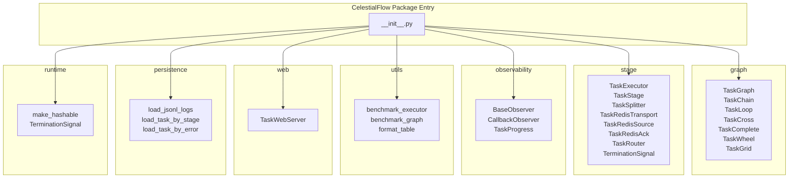

# CelestialFlow Package Entry

> 📅 Last Updated: 2026/06/11

## Introduction

The project root entry point, which centrally exports all public APIs from submodules. Users can simply `from celestialflow import ...` to access all core functionality.

## Module Grouping

Grouped by source module, with a description of each group's primary purpose.

---

### graph — Task Graph Core

Provides various topology structure definitions, supporting DAG construction, dependency connections, and execution scheduling.

| Exported Symbol | Description |
|-----------------|-------------|
| `TaskGraph` | General task graph container, supports arbitrary DAG topologies |
| `TaskChain` | Linear chain structure (preceding node → succeeding node) |
| `TaskCross` | Cross-connect structure (multiple sources × multiple targets) |
| `TaskGrid` | Grid-like connection structure |
| `TaskLoop` | Loop structure, nodes can loop back when conditions are met |
| `TaskWheel` | Wheel structure, one center node connected to multiple peripheral nodes |
| `TaskComplete` | Fully-connected structure, all nodes connected pairwise |

---

### stage — Task Execution Layer

Provides task executors, routing dispatch, splitting/merging, and Redis integration support.

| Exported Symbol | Description |
|-----------------|-------------|
| `TaskExecutor` | General task executor, supports serial / thread / async execution modes |
| `TaskStage` | A task node in the graph, wrapping execution function and configuration |
| `TaskSplitter` | Task splitter, splits a single input into multiple sub-tasks |
| `TaskRedisTransport` | Redis-based task transport layer |
| `TaskRedisSource` | Redis data source, pulls task inputs from Redis |
| `TaskRedisAck` | Redis acknowledgment mechanism, sends ACK after consumption |
| `TaskRouter` | Route dispatcher, distributes tasks to different downstream based on rules |
| `TerminationSignal` | Termination signal, used to control the end of graph execution flow |

---

### observability — Observability

Provides observer pattern support for monitoring task execution.

| Exported Symbol | Description |
|-----------------|-------------|
| `BaseObserver` | Observer base class, defines on_start / on_success / on_failure interfaces |
| `CallbackObserver` | Callback-based observer, handles events via passed callback functions |
| `TaskProgress` | Task progress tracker, real-time statistics of completed/failed/total |

---

### utils — Utilities

Provides benchmarking and formatting utilities.

| Exported Symbol | Description |
|-----------------|-------------|
| `benchmark_executor` | Multi-mode benchmark testing for sync/async `TaskExecutor` |
| `benchmark_graph` | Benchmark testing for the entire task graph |
| `format_table` | Formatted table output, for console display of comparison data |

---

### web — Web Service

Provides a built-in web server for graph state monitoring and visualization.

| Exported Symbol | Description |
|-----------------|-------------|
| `TaskWebServer` | FastAPI-based web server, providing HTTP API for graph runtime snapshots and a visualization panel |

---

### persistence — Persistence

Provides JSONL log loading and querying functionality.

| Exported Symbol | Description |
|-----------------|-------------|
| `load_jsonl_logs` | Load JSONL-format log files |
| `load_task_by_stage` | Filter and load task logs by stage name |
| `load_task_by_error` | Filter and load task logs by error type |

---

### runtime — Runtime Utilities

Provides runtime helper types and utility functions.

| Exported Symbol | Description |
|-----------------|-------------|
| `make_hashable` | Converts non-hashable objects (e.g. dict, list) to hashable form |
| `TerminationSignal` | Termination signal (shared with the stage group) |

---

## `__all__` List

Complete public API list (26 symbols total):

```python
__all__ = [
    "TaskGraph",
    "TaskChain",
    "TaskLoop",
    "TaskCross",
    "TaskComplete",
    "TaskWheel",
    "TaskGrid",
    "BaseObserver",
    "CallbackObserver",
    "TaskProgress",
    "TaskExecutor",
    "TaskStage",
    "TaskSplitter",
    "TaskRedisTransport",
    "TaskRedisSource",
    "TaskRedisAck",
    "TaskRouter",
    "TerminationSignal",
    "TaskWebServer",
    "load_jsonl_logs",
    "load_task_by_stage",
    "load_task_by_error",
    "make_hashable",
    "format_table",
    "benchmark_graph",
    "benchmark_executor",
]
```

## Usage Examples

The following examples demonstrate how to import from the package entry and use CelestialFlow's core functionality to build and execute task graphs.

```python
from celestialflow import TaskGraph, TaskStage, TaskExecutor

# 1. Define task processing functions
def double(x: int) -> int:
    return x * 2

def add_one(x: int) -> int:
    return x + 1

# 2. Create TaskStage nodes
stage_a = TaskStage("StageA", func=double, execution_mode="serial", stage_mode="serial")
stage_b = TaskStage("StageB", func=add_one, execution_mode="serial", stage_mode="serial")

# 3. Build the DAG graph
graph = TaskGraph()
graph.set_stages([stage_a, stage_b])
graph.connect([stage_a], [stage_b])

# 4. Execute the graph
init_tasks = {stage_a.get_name(): [1, 2, 3, 4, 5]}
graph.start_graph(init_tasks)

# 5. View execution result summary
summary = graph.get_graph_summary()
print("Graph summary:", summary)
```

### Using TaskExecutor Independently

`TaskExecutor` can run independently of the graph structure, suitable for single-step task execution:

```python
from celestialflow import TaskExecutor

# Create an executor and pass a data iterator
executor = TaskExecutor("Adder", func=lambda x: x + 10, execution_mode="serial")
executor.start([1, 2, 3])

# Get execution results
success_pairs = executor.get_success_pairs()
for task, result in success_pairs:
    print(f"Task: {task} -> Result: {result}")

# View statistics
counts = executor.get_counts()
print("Counts:", counts)
```

### Using Predefined Graph Structures

```python
from celestialflow import TaskChain, TaskStage

stages = [
    TaskStage("S1", func=lambda x: x * 2),
    TaskStage("S2", func=lambda x: x + 1),
    TaskStage("S3", func=lambda x: x ** 2),
]

chain = TaskChain(stages, chain_mode="serial")
chain.start_chain({stages[0].get_name(): [1, 2, 3]})
summary = chain.get_graph_summary()
print("Chain summary:", summary)
```

## Module Dependency Graph


