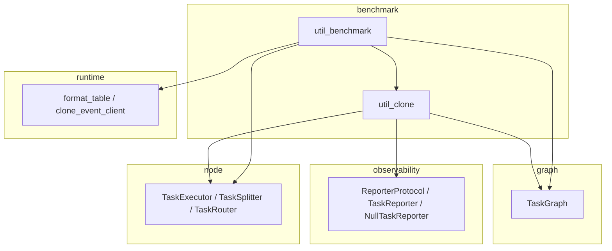

# Benchmark Module

> 📅 Last Updated: 2026/09/09

Provides executor/task graph cloning and benchmarking capabilities. This module sits at the top of the dependency chain — it may depend on other modules, but should not be depended on by them.

## Submodules

| File | Description |
|------|-------------|
| `util_benchmark.py` | Performance benchmarking for executors and task graphs |
| `util_clone.py` | Cloning utilities for executors and task graphs |

## Exported Symbols

`benchmark/__init__.py` contains only the module docstring: it neither defines `__all__` nor includes any import, so the subpackage itself exports no symbols (`from celestialflow.benchmark import ...` will raise `ImportError`). The relevant functions are exposed in two ways:

- `benchmark_executor` and `benchmark_graph` are collectively exported by the top-level package entry `celestialflow/__init__.py` and can be imported directly via `from celestialflow import ...`.
- Cloning functions like `clone_executor` and `clone_graph` are **internal tools** and not part of the public API; they should **not** be obtained via `from celestialflow import ...`; they must be imported on demand via their submodule path.

| Symbol | Definition Location | Recommended Import | Description |
|------|---------|-------------|------|
| `benchmark_executor` | `util_benchmark.py` | `from celestialflow import benchmark_executor` | Multi-mode benchmarking for sync/async `TaskExecutor` |
| `benchmark_graph` | `util_benchmark.py` | `from celestialflow import benchmark_graph` | Multi-mode benchmarking for the entire `TaskGraph` |
| `clone_executor` | `util_clone.py` | `from celestialflow.benchmark.util_clone import clone_executor` | Clone a `TaskExecutor` instance (internal tool) |
| `clone_graph` | `util_clone.py` | `from celestialflow.benchmark.util_clone import clone_graph` | Clone a complete `TaskGraph` (with connection relationships); supports only `TaskExecutor` nodes (internal tool) |

> Note: `clone_executor` / `clone_graph` are not in the top-level package entry's `__all__` and are internal benchmark tools; they are recommended only for use when writing benchmark tests or scenarios that need to quickly reuse executor/task graph configurations.

## Usage Example

```python
from celestialflow import TaskGraph, TaskExecutor
from celestialflow.benchmark.util_clone import clone_graph


def double(x: int) -> int:
    return x * 2


# Clone the task graph for state-isolated testing
graph = TaskGraph(name="Demo")
stage_a = TaskExecutor("A", double)
stage_b = TaskExecutor("B", double)
graph.set_nodes([stage_a, stage_b])
graph.connect([stage_a], [stage_b])

cloned = clone_graph(graph)
print(f"Original graph node count: {len(graph.node_dict)}")
print(f"Cloned graph node count: {len(cloned.node_dict)}")
```

> ⚠️ `clone_graph` only applies to task graphs composed of `TaskExecutor` nodes; if the graph contains specialized nodes such as `TaskSplitter` or `TaskRouter`, it will throw a `ConfigurationError` and will not preserve those nodes' subclass types and behaviors. `clone_graph` does not guarantee "complete preservation of all node types".

## Module Dependency Relationships



## Notes

- **Cloning mechanism**: All cloning operations are implemented by constructing new instances and copying key parameters, so the original and cloned objects are completely independent.
- **State isolation**: Each run in benchmarking uses a cloned object to avoid state contamination that could affect test results.
- **Function references**: Cloning only copies function references, not the functions themselves.
- **Async requirement**: `benchmark_executor` and `benchmark_graph` are both async functions and must be called with `await` or via `asyncio.run`.
- **Internal tool positioning**: Cloning functions like `clone_executor` / `clone_graph` are not part of the public API and may change signature or semantics with adjustments to benchmark internal implementations.
- **`clone_graph` node type limitations**: Supports only `TaskExecutor` nodes; not applicable to specialized nodes such as `TaskSplitter` or `TaskRouter` (will throw a `ConfigurationError`).
