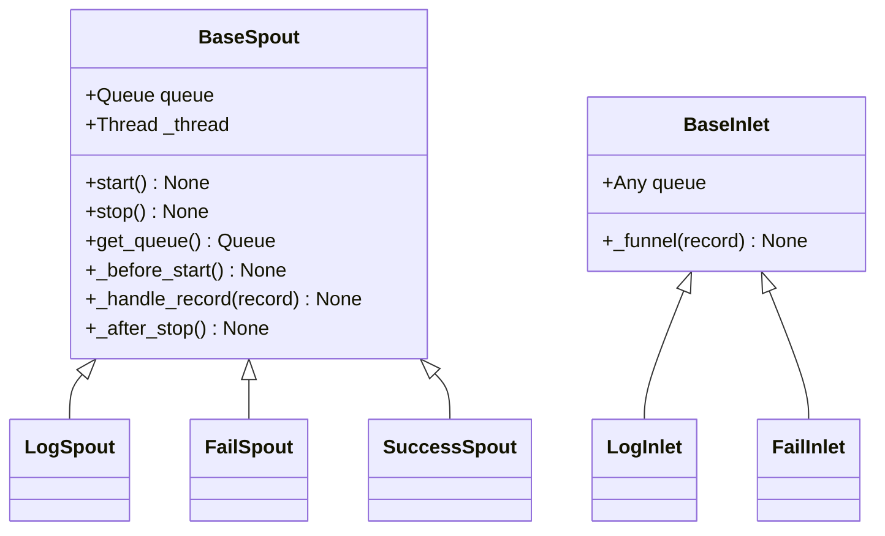

# Funnel Module

> 📅 Last Updated: 2026/06/11

The Funnel module provides CelestialFlow's queue communication infrastructure, serving as the underlying base class for `LogSpout`/`LogInlet`, `FailSpout`/`FailInlet`, and `SuccessSpout` in the Persistence module.

## Exported Symbols

| Exported Symbol | Source Module | Description |
|---------|---------|------|
| `BaseInlet` | `core_inlet` | Base class for all inlet classes, providing queue write functionality |
| `BaseSpout` | `core_spout` | Base class for all spout classes, providing background thread listening and queue consumption |

## File Descriptions

### Core Components

1. **core_inlet.py** (`BaseInlet`)
   - **Purpose**: Base class for all inlet classes, providing queue write functionality
   - **Key Features**: Queue write encapsulation (`_funnel`)

2. **core_spout.py** (`BaseSpout`)
   - **Purpose**: Base class for all spout classes, providing background thread listening and queue consumption
   - **Key Features**: Background thread listening, lifecycle hooks, graceful start/stop

## Inheritance Relationships



## Module Relationships

### External Relationships
- **With Persistence Module**: `LogSpout`/`LogInlet`, `FailSpout`/`FailInlet`, and `SuccessSpout` all inherit from the base classes in this module
- **With Runtime Module**: Uses `TerminationSignal` as the stop signal, `CelestialFlowError` as the exception type that subclasses must override

## Usage Examples

The following examples demonstrate the basic usage patterns of `BaseInlet` and `BaseSpout`.

### BaseSpout + BaseInlet Collaboration

```python
from celestialflow.funnel import BaseSpout, BaseInlet

# 1. Custom Spout: print received records to console
class PrintSpout(BaseSpout):
    def _handle_record(self, record):
        print(f"Spout received: {record}")

# 2. Create Spout and Inlet
spout = PrintSpout()
inlet = BaseInlet(spout.get_queue())

# 3. Start background listening thread
spout.start()

# 4. Send records through Inlet
inlet._funnel("Hello, World!")
inlet._funnel({"key": "value"})
inlet._funnel(42)

# 5. Stop Spout
spout.stop()
print("Spout stopped")
```

### Using BaseSpout Custom Hooks

```python
from celestialflow.funnel import BaseSpout

class FileSpout(BaseSpout):
    def __init__(self, filename: str):
        super().__init__()
        self.filename = filename

    def _before_start(self):
        print(f"Opening file: {self.filename}")

    def _handle_record(self, record):
        print(f"Processing record: {record}")

    def _after_stop(self):
        print(f"Closing file: {self.filename}")

spout = FileSpout("records.log")
spout.start()
spout.get_queue().put("record1")
spout.get_queue().put("record2")
spout.stop()
```
