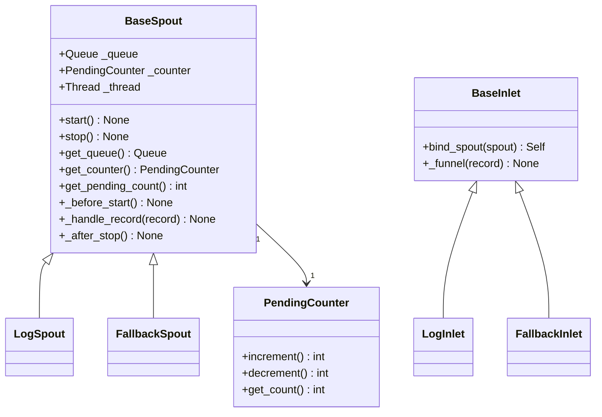

# Funnel Module

> 📅 Last Updated: 2026/06/22

The Funnel module provides CelestialFlow's queue communication infrastructure, serving as the underlying base class for `LogSpout`/`LogInlet` and `FallbackSpout`/`FallbackInlet` in the Persistence module.

It is not only usable as low-level infrastructure, but can also be used independently of `TaskGraph` / `TaskStage` to build lightweight producer-consumer pipelines. For a minimal runnable example, see [demo_funnel.md](https://github.com/Mr-xiaotian/CelestialFlow/blob/main/docs/zh-CN/demo/demo_funnel.md).

## Exported Symbols

| Exported Symbol | Source Module | Description |
|-----------------|---------------|-------------|
| `BaseInlet` | `core_inlet` | Base class for all inlet classes, providing queue write functionality |
| `BaseSpout` | `core_spout` | Base class for all spout classes, providing background thread listening and queue consumption |

## File Descriptions

### Core Components

1. **core_inlet.py** (`BaseInlet`)
   - **Purpose**: Base class for all inlet classes, providing queue write functionality
   - **Key Features**: Associates with a spout via `bind_spout()`, writes to the queue using `_funnel()`

2. **core_spout.py** (`BaseSpout`)
   - **Purpose**: Base class for all spout classes, providing background thread listening and queue consumption
   - **Key Features**: Background thread listening, lifecycle hooks, graceful start/stop, pending counter

3. **util_count.py** (`PendingCounter`)
   - **Purpose**: Thread-safe pending counter
   - **Key Features**: Cooperates with `BaseSpout` / `BaseInlet` to count records that have not finished processing

## Inheritance Relationships



## Module Relationships

### External Relationships
- **With Persistence Module**: `LogSpout`/`LogInlet`, `FallbackSpout`/`FallbackInlet` all inherit from the base classes in this module
- **With Runtime Module**: Uses `TerminationSignal` as the stop signal, `CelestialFlowError` as the exception type that subclasses must override

## Usage Examples

The following examples demonstrate the basic usage patterns of `BaseInlet` and `BaseSpout`.

### BaseSpout + BaseInlet Collaboration

```python
from celestialflow.funnel import BaseSpout, BaseInlet

# 1. Custom Spout: print received records to console
class PrintSpout(BaseSpout):
    def _handle_record(self, record):
        print(f"Spout received: {record}")

# 2. Custom Inlet: wrap the write interface
class PrintInlet(BaseInlet):
    def send(self, data):
        self._funnel(data)

# 3. Create Spout and Inlet, and bind
spout = PrintSpout()
inlet = PrintInlet().bind_spout(spout)

# 4. Start background listening thread
spout.start()

# 5. Send records through Inlet
inlet.send("Hello, World!")
inlet.send({"key": "value"})
inlet.send(42)

# 6. Stop Spout
spout.stop()
print("Spout stopped")
```

### Using BaseSpout Custom Hooks

```python
from celestialflow.funnel import BaseSpout

class FileSpout(BaseSpout):
    def __init__(self, filename: str):
        super().__init__()
        self.filename = filename

    def _before_start(self):
        print(f"Opening file: {self.filename}")

    def _handle_record(self, record):
        print(f"Processing record: {record}")

    def _after_stop(self):
        print(f"Closing file: {self.filename}")

spout = FileSpout("records.log")
spout.start()
spout.get_queue().put("record1")
spout.get_queue().put("record2")
spout.stop()
```

## Notes

1. **Binding Style**: `BaseInlet` associates with `BaseSpout` via `bind_spout()`, rather than holding the queue directly.
2. **Pending Counter**: `BaseSpout` internally maintains a `PendingCounter`; `get_pending_count()` can query the number of records that have not yet finished processing.
3. **Exception Isolation**: A single record processing failure prints the traceback and continues, without terminating the background thread.
