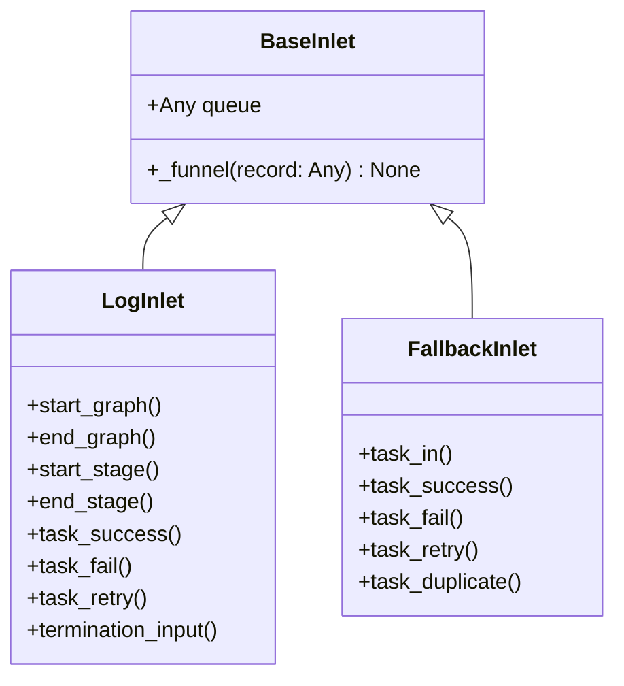

# BaseInlet

> 📅 Last Updated: 2026/06/18

`BaseInlet` is the base class for all inlet classes, providing the common functionality of writing records to a queue.

## Class Definition

```python
class BaseInlet:
    def __init__(self, queue: Any) -> None:
        """
        :param queue: Record queue (obtained via the corresponding Spout's get_queue())
        """
        self.queue: Any = queue

    def _funnel(self, record: Any) -> None:
        """Put a record into the queue for consumption by the corresponding Spout."""
        self.queue.put(record)
```

### Attributes

| Attribute | Type | Description |
|------|------|------|
| `queue` | `Any` | Record queue instance, records are written via `queue.put()` |

## Core Methods

### _funnel (protected)

```python
def _funnel(self, record: Any) -> None:
```

- Puts `record` into `self.queue` for consumption by the corresponding `Spout`
- Called by subclasses in their concrete business methods
- Uses `queue.Queue` to ensure thread-safe communication

## Inheritance Relationships



### Inheritance Description

| Subclass | Source File | Responsibility |
|------|---------|------|
| `LogInlet` | `persistence/core_log.py` | Log recording, tracking the entire lifecycle of task enqueue/dequeue/termination |
| `FallbackInlet` | `persistence/core_fallback.py` | Fallback recording, persisting task lifecycle to SQLite |

> ⚠️ **Changed**: The legacy `FailInlet` (`core_fail.py`) has been renamed to `FallbackInlet` (`core_fallback.py`), and `SuccessSpout` has been removed.

## Usage Example

```python
from celestialflow.funnel import BaseSpout, BaseInlet

class MySpout(BaseSpout):
    def _handle_record(self, record):
        print(record)

class MyInlet(BaseInlet):
    def send(self, data):
        self._funnel(data)

# Usage
spout = MySpout()
spout.start()
inlet = MyInlet(spout.get_queue())
inlet.send("hello")
spout.stop()
```

## Notes

1. **One-Way Communication**: Inlet only writes to the queue, Spout is responsible for consumption, both are decoupled via the queue
2. **Queue Source**: The queue is created and provided by the corresponding `BaseSpout` (via `get_queue()`), Inlet does not manage the queue lifecycle
3. **Thread Safety**: Uses `queue.Queue` for thread-safe communication
4. **No Exception Thrown**: `_funnel` does not handle queue write exceptions internally; subclasses should catch them at the call site
5. **Usage Pattern**: Typically one `BaseSpout` corresponds to one `BaseInlet`, forming a producer-consumer pair
