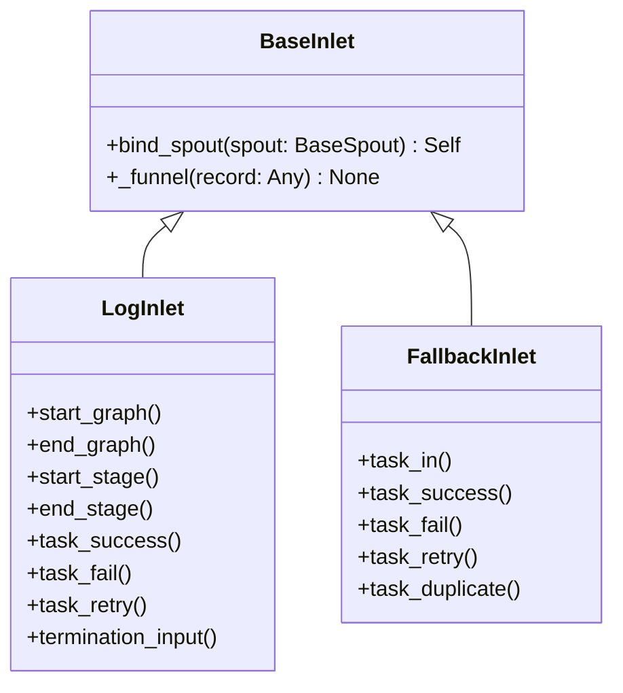

# BaseInlet

> 📅 Last Updated: 2026/06/22

`BaseInlet` is the base class for all inlet classes, responsible for sending records to the corresponding `BaseSpout` through a queue.

## Class Definition

```python
class BaseInlet:
    _queue: Queue[Any]
    _counter: PendingCounter

    def bind_spout(self, spout: BaseSpout) -> Self:
        """
        Bind the current inlet to the given spout.

        :param spout: Target listener
        :return: The current inlet instance, now bound
        """
        self._queue = spout.get_queue()
        self._counter = spout.get_counter()
        return self

    def _funnel(self, record: Any) -> None:
        """
        Put a record into the queue.

        :param record: Record to send
        """
        if not hasattr(self, '_queue') or not hasattr(self, '_counter'):
            raise InitializationError("inlet is not bound to spout")

        self._counter.increment()
        try:
            self._queue.put(record)
        except Exception:
            self._counter.decrement()
            raise
```

## Core Methods

### bind_spout

```python
def bind_spout(self, spout: BaseSpout) -> Self:
```

- Binds the current inlet to the specified `BaseSpout` instance.
- Internally reuses the spout's input queue (`_queue`) and pending counter (`_counter`).
- Returns itself to support chaining: `LogInlet(log_level).bind_spout(spout)`.
- Calling `_funnel()` before binding raises `InitializationError`.

### _funnel (protected)

```python
def _funnel(self, record: Any) -> None:
```

- Puts `record` into the queue shared with the spout.
- Calls `increment()` before enqueueing; if enqueueing fails, immediately calls `decrement()` to roll back.
- Subclasses usually call this method inside concrete business methods.

## Inheritance Relationships



### Inheritance Description

| Subclass | Source File | Responsibility |
|----------|-------------|----------------|
| `LogInlet` | `persistence/core_log.py` | Log recording, tracking the entire lifecycle of task enqueue/dequeue/termination |
| `FallbackInlet` | `persistence/core_fallback.py` | Fallback recording, persisting task lifecycle to SQLite |

## Usage Example

```python
from celestialflow.funnel import BaseSpout, BaseInlet

class MySpout(BaseSpout):
    def __init__(self):
        super().__init__()
        self.received = []

    def _handle_record(self, record):
        self.received.append(record)

class MyInlet(BaseInlet):
    def send(self, data):
        self._funnel(data)

# Usage
spout = MySpout()
inlet = MyInlet().bind_spout(spout)

spout.start()
inlet.send("hello")
inlet.send({"key": "value"})
spout.stop()

print(spout.received)
```

## Notes

1. **One-Way Communication**: Inlet only writes to the queue, Spout is responsible for consumption; both are decoupled via the queue.
2. **Binding Style**: The queue and counter are created by `BaseSpout` and shared with the Inlet via `bind_spout()`; the Inlet does not manage the queue lifecycle directly.
3. **Thread Safety**: Uses `queue.Queue` and `PendingCounter` (internally locked) for safe inter-thread communication.
4. **Unbound Exception**: If `_funnel()` is called without first calling `bind_spout()`, `InitializationError` is raised.
5. **Usage Pattern**: Typically one `BaseSpout` corresponds to one `BaseInlet`, forming a producer-consumer pair.
