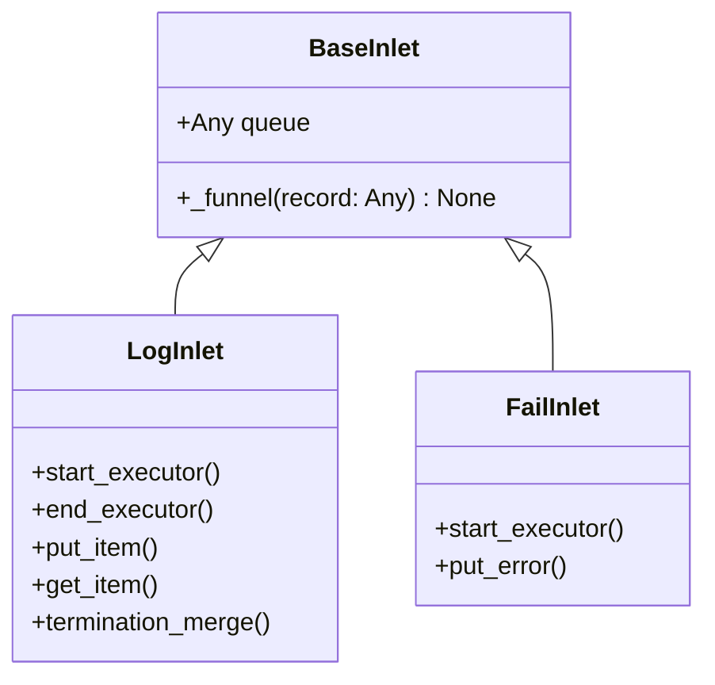

# BaseInlet

> 📅 Last Updated: 2026/05/28

`BaseInlet` is the base class for all inlet classes, providing common functionality for writing records to a queue.

## Class Definition

```python
class BaseInlet:
    def __init__(self, queue: Any) -> None:
        """
        :param queue: Record queue (obtained from the corresponding Spout's get_queue())
        """
        self.queue: Any = queue

    def _funnel(self, record: Any) -> None:
        """Place the record into the queue for consumption by the corresponding Spout."""
        self.queue.put(record)
```

### Attribute Types

| Attribute | Type | Description |
|-----------|------|-------------|
| `queue` | `Any` | Record queue instance, writes records via `queue.put()` |

## Core Methods

### _funnel (protected)

```python
def _funnel(self, record: Any) -> None:
```

- Places `record` into `self.queue` for consumption by the corresponding `Spout`
- Called by subclasses in their specific business methods
- Uses `queue.Queue` to ensure thread-safe communication

## Inheritance Hierarchy



### Inheritance Details

| Subclass | Source File | Responsibility |
|----------|-------------|----------------|
| `LogInlet` | `persistence/core_log.py` | Log recording, tracks the entire task enqueue/dequeue/termination process |
| `FailInlet` | `persistence/core_fail.py` | Error recording, persists task error information to JSONL |

## Usage Example

```python
from celestialflow.funnel import BaseSpout, BaseInlet

class MySpout(BaseSpout):
    def _handle_record(self, record):
        print(record)

class MyInlet(BaseInlet):
    def send(self, data):
        self._funnel(data)

# Usage
spout = MySpout()
spout.start()
inlet = MyInlet(spout.get_queue())
inlet.send("hello")
spout.stop()
```

## Notes

1. **One-way Communication**: Inlet only writes to the queue; Spout is responsible for consumption. The two are decoupled through the queue.
2. **Queue Source**: The queue is created and provided by the corresponding `BaseSpout` (via `get_queue()`). Inlet is not responsible for the queue lifecycle.
3. **Thread Safety**: Uses `queue.Queue` for thread-safe communication.
4. **No Exception Thrown**: `_funnel` does not handle queue write exceptions internally; subclasses should catch them at the call site.
5. **Usage Pattern**: Typically one `BaseInlet` per `BaseSpout`, forming a producer-consumer pair.
