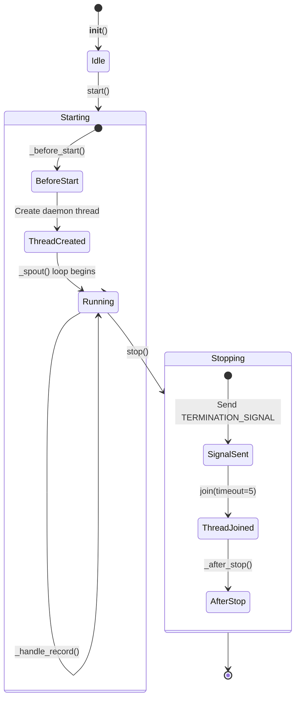

# BaseSpout

> 📅 Last Updated: 2026/06/11

`BaseSpout` is the base class for all spout classes, providing the common functionality of listening to a queue in a background thread and processing records.

## Initialization

```python
class BaseSpout:
    def __init__(self):
        self.queue = Queue()              # Thread-safe queue
        self._thread: Thread | None = None
```

## Core Methods

### start

Starts the background listening thread.

```python
def start(self):
    """Start the background listening thread (if not already running)."""
```

Flow:
1. Calls the `_before_start()` hook
2. If the thread is not running, creates and starts a daemon thread executing the `_spout()` method

### stop

Stops the listening thread and cleans up resources.

```python
def stop(self):
    """Send termination signal and wait for the background thread to finish."""
```

Flow:
1. If `_thread` is `None`, returns immediately
2. Sends `TERMINATION_SIGNAL` to the queue
3. Waits for the thread to finish (`join(timeout=5)`) and sets `_thread` to `None`
4. Calls the `_after_stop()` hook

### get_queue

```python
def get_queue(self) -> Queue[Any]:
    """Return the queue object for use by the Inlet side."""
```

## Overridable Methods

```python
def _before_start(self) -> None:
    """Initialization operations before starting. Default empty implementation."""
    return None

def _handle_record(self, _record: Any) -> None:
    """Process a single record (must be overridden by subclasses, otherwise raises CelestialFlowError)."""
    raise CelestialFlowError("_handle_record must be implemented by subclasses")

def _after_stop(self) -> None:
    """Cleanup operations after stopping. Default empty implementation."""
    return None
```

## Internal Implementation

```python
def _spout(self):
    """Background thread main loop, continuously pulls records from the queue,
    calls _handle_record, and exits on receiving the termination signal."""
    while True:
        try:
            record = self.queue.get(timeout=0.5)
            if isinstance(record, TerminationSignal):
                break
            self._handle_record(record)
        except Empty:
            continue
        except Exception:
            # Single record processing failure does not kill the thread,
            # prints traceback and continues
            traceback.print_exc()
```

## Lifecycle State Diagram



## Usage Examples

The following examples demonstrate how to create custom subclasses of `BaseSpout`, including the full flow of starting, processing, and stopping.

### Basic Subclass Implementation

```python
from celestialflow.funnel import BaseSpout

# Custom Spout: write string records to a list
class CollectSpout(BaseSpout):
    def __init__(self):
        super().__init__()
        self.collected: list[str] = []

    def _handle_record(self, record):
        """Process a single record, must be overridden by subclasses"""
        self.collected.append(str(record))

# Usage
spout = CollectSpout()
spout.start()

# Send records via the queue
q = spout.get_queue()
q.put("task_1")
q.put("task_2")
q.put("task_3")

# Stop
spout.stop()
print(f"Collected {len(spout.collected)} records")
```

### Subclass with Lifecycle Hooks

```python
from celestialflow.funnel import BaseSpout

class FileWriterSpout(BaseSpout):
    def __init__(self, filepath: str):
        super().__init__()
        self.filepath = filepath
        self.fh = None

    def _before_start(self):
        """Open file before starting"""
        self.fh = open(self.filepath, "w", encoding="utf-8")
        print(f"File opened: {self.filepath}")

    def _handle_record(self, record):
        """Write to file"""
        line = f"{record}\n"
        self.fh.write(line)

    def _after_stop(self):
        """Close file after stopping"""
        if self.fh:
            self.fh.close()
            print(f"File closed: {self.filepath}")

# Usage
spout = FileWriterSpout("/tmp/test_spout.log")
spout.start()
spout.get_queue().put("record_alpha")
spout.get_queue().put("record_beta")
spout.stop()
```

### Counting Spout

```python
from celestialflow.funnel import BaseSpout

class CounterSpout(BaseSpout):
    def __init__(self):
        super().__init__()
        self.count = 0

    def _handle_record(self, record):
        self.count += 1

spout = CounterSpout()
spout.start()

for i in range(100):
    spout.get_queue().put(i)

spout.stop()
print(f"Processed {spout.count} records")  # 100
```

## Notes

1. **Thread Safety**: Uses `queue.Queue` for safe inter-thread communication
2. **Daemon Thread**: The listening thread is set as a daemon thread (`daemon=True`), exiting automatically when the main process exits
3. **Graceful Stop**: Notifies the thread to stop via `TerminationSignal`, `join(timeout=5)` waits up to 5 seconds
4. **Exception Isolation**: Single record processing failure prints traceback and continues, does not terminate the thread
5. **Queue Cleanup**: Remaining records in the queue are not cleaned up when stopping
