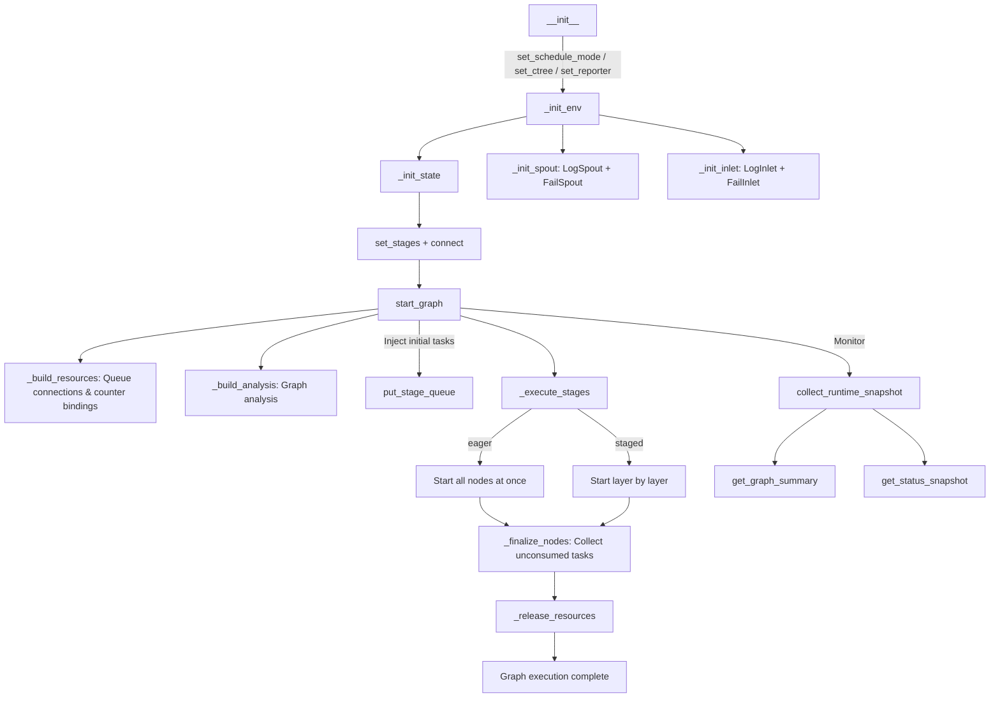

# TaskGraph

> 📅 Last Updated: 2026/06/05

`TaskGraph` is the core scheduler of CelestialFlow, responsible for managing dependency relationships, execution flow, resource allocation, and lifecycle of a set of `TaskStage` nodes.

> Note: `TaskGraph` is a one-shot object. After one `start_graph()` run, the current instance is not guaranteed to be safely reset or started again. Recreate the graph and its stages for another run.

## Key Data Structures

`TaskGraph` internally uses `stage_dict: dict[str, TaskStage]` to maintain the Stage mapping of all nodes. Each Stage automatically creates its corresponding `TaskInQueue` and `TaskOutQueue` during initialization, and queues are connected during the `_build_resources()` phase.

## Initialization

```python
class TaskGraph:
    def __init__(self, schedule_mode: str = "eager", log_level: str = "INFO"):
        ...
```

### Parameters

- **schedule_mode**: Scheduling mode
  - `eager` (default): All nodes start concurrently at once; dependencies are controlled automatically through queue flow
  - `staged`: Layer-by-layer execution (DAG only). Starts layers in level order; the next layer starts only after the previous layer has fully completed
- **log_level**: Log level

## Graph Construction

### set_stages

```python
def set_stages(self, stages: list[TaskStage]) -> None:
    """
    Add nodes to the task graph. Creates TaskInQueue and TaskOutQueue for each node.

    :param stages: List of nodes
    :raises DuplicateNodeError: If node names are duplicated
    """
```

### connect

```python
def connect(self, from_stages: list[TaskStage], to_stages: list[TaskStage]) -> None:
    """
    Establish hyperedge connections: each node in from_stages connects to each node in to_stages.
    Operates on out_edges / in_edges dictionaries; actual queue connections are completed in _build_resources().
    """
```

## Configuration Methods

### set_reporter

```python
def set_reporter(self, is_report: bool = False, host: str = "127.0.0.1", port: int = 5000) -> None:
    """Configure the reporter to push status to the Web UI."""
```

### set_ctree

```python
def set_ctree(self, use_ctree: bool = False, host: str = "127.0.0.1",
              http_port: int = 7777, grpc_port: int = 7778,
              transport: str = "grpc") -> None:
    """
    Configure the CelestialTree client. Validates connection health when enabled.
    :raises CelestialTreeConnectionError: If connection fails
    """
```

### set_graph_mode

```python
def set_graph_mode(self, stage_mode: str, execution_mode: str) -> None:
    """
    Batch-set the stage_mode and execution_mode for all nodes.
    Triggers _build_analysis() to rebuild analysis data.
    """
```

## Starting Execution

### start_graph

```python
def start_graph(self, init_tasks_dict: Mapping[str, Iterable[Any]],
                put_termination_signal: bool = True) -> None:
    """
    Start the task graph. Flow:
    1. _build_resources() — Build queue connections and counter bindings
    2. _build_analysis() — Analyze graph structure (source nodes, levels, DAG detection)
    3. Start spout, inlet, reporter
    4. put_stage_queue() — Inject initial tasks and termination signals
    5. _execute_stages() — Execute all nodes
    6. _finalize_nodes() — Cleanup (ensure threads finish, collect unconsumed tasks)
    7. Release resources
    """
```

Lifecycle note:
- Runtime queue bindings, predecessor links, and thread references are built for a single run.
- Reusing the same `TaskGraph` instance after completion is not part of the supported lifecycle.

```python
graph = TaskGraph(schedule_mode="eager")
graph.set_stages(stages=[stage_a, stage_b])
graph.connect([stage_a], [stage_b])
graph.start_graph({stage_a.get_name(): [1, 2, 3, 4, 5]})
```

### _execute_stages

```python
def _execute_stages(self) -> None:
    """eager mode: Start all nodes at once; staged mode: Start layer by layer."""
```

### _execute_stage

```python
def _execute_stage(self, stage: TaskStage) -> None:
    """
    Execute a single node:
    - thread mode: Call stage.start_stage() in a new thread
    - serial mode: Call stage.start_stage() synchronously in the current thread
    """
```

## Dynamic Task Injection

### put_stage_queue

```python
def put_stage_queue(self, tasks_dict: Mapping[str, Iterable[Any]],
                    put_termination_signal: bool = True) -> None:
    """
    Dynamically inject tasks into nodes. Supports:
    - Regular tasks → Automatically wrapped as TaskEnvelope
    - TerminationSignal objects → Direct termination signal injection
    - put_termination_signal=True → Automatically inject termination signals to all source nodes
    """
```

## Runtime Monitoring

### collect_runtime_snapshot

```python
def collect_runtime_snapshot(self) -> None:
    """
    Collect runtime snapshots of all nodes and update status_dict.
    Computes processed / pending / elapsed / remaining for each node and global remaining time.
    """
```

### _snapshot_one_stage

Collects a snapshot of a single node, returning a dict with the following fields:

| Field | Type | Description |
|-------|------|-------------|
| `name` | `str` | Node name |
| `func_name` | `str` | Function name |
| `execution_mode` | `str` | Execution mode |
| `stage_mode` | `str` | Stage mode |
| `status` | `StageStatus` | Running status |
| `tasks_input` | `int` | Input task count |
| `tasks_succeeded` | `int` | Success count |
| `tasks_failed` | `int` | Failure count |
| `tasks_duplicated` | `int` | Duplicate count |
| `tasks_processed` | `int` | Processed count |
| `tasks_pending` | `int` | Pending count |
| `elapsed_time` | `float` | Elapsed time |
| `remaining_time` | `float` | Estimated remaining time |
| `task_avg_time` | `str` | Average time (formatted) |
| `start_time` | `float` | Start timestamp |

## Query Interface

| Method | Return Type | Description |
|--------|-------------|-------------|
| `get_status_snapshot()` | `dict` | Status snapshot with unified timestamp |
| `get_graph_summary()` | `dict` | Global remaining time summary |
| `get_graph_analysis()` | `dict` | Graph analysis info (isDAG, scheduleMode, layersDict, className) |
| `get_structure_json()` | `list[dict]` | JSON-formatted graph structure |
| `get_structure_list()` | `list[str]` | Bordered formatted tree text |
| `get_networkx_graph()` | `DiGraph` | networkx directed graph instance |
| `get_fail_by_stage_dict()` | `dict[str, list]` | Failed tasks grouped by stage |
| `get_fail_by_error_dict()` | `dict[tuple, list]` | Failed tasks grouped by error type (key is `(error_type, error_message)` tuple) |
| `get_total_error_num()` | `int` | Total error count |
| `get_fallback_path()` | `str` | Absolute path to failed tasks JSONL file |
| `get_source_stages()` | `list[TaskStage]` | List of source nodes |
| `get_stage_input_trace(stage_name)` | `str` | Node input dependency tree (requires ctree enabled) |

### get_fail_by_error_dict Details

```python
def get_fail_by_error_dict(self) -> dict[tuple[str, ...], list[Any]]:
    """Returns grouped by (error_type, error_message)."""
```

## Lifecycle Diagram



## Scheduling Modes Explained

### Eager Mode

```
All nodes start stage simultaneously → data flows through queues → stop when termination signal arrives
```

- Maximizes parallelism
- Suitable for most scenarios
- Recommended for cyclic graphs

### Staged Mode

```
Layer 0: [Node A, Node B] → all join → Layer 1: [Node C, Node D] → ...
```

- Layer-by-layer execution, next layer starts only after current layer fully completes
- Only applicable to DAGs
- Suitable for debugging, performance analysis, and resource control

## Notes for Non-DAG Graphs

For cyclic graphs, if `put_termination_signal=True`, `start_graph` will emit a `RuntimeWarning`. Termination signals may cause some nodes to exit prematurely before receiving upstream data. Recommended approach:

```python
graph.start_graph({"source": tasks}, put_termination_signal=False)
# Later manually inject TerminationSignal via Web UI or put_stage_queue
```

## Unconsumed Task Handling

In `_finalize_nodes()`, all remaining tasks are collected via `in_queue.drain()`, marked as `UnconsumedError`, and persisted to a JSONL file through `fail_inlet`.
