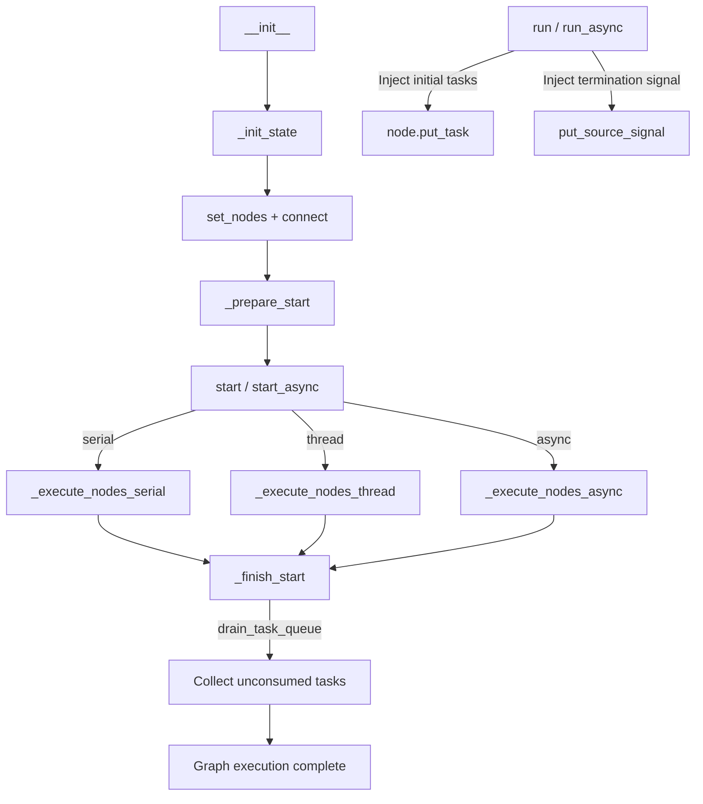

# src/celestialflow/graph/core_graph.py

> 📅 Last Updated: 2026/09/24

`TaskGraph` is CelestialFlow's core scheduler, responsible for managing a set of task nodes (`BaseTaskNode` derivative objects; the public API includes `TaskExecutor`, `TaskSplitter`, `TaskRouter`), their dependencies, execution flow, resource allocation, and lifecycle.

> Note: `TaskGraph` is a single-use object. After a single `start()` / `start_async()` / `run()` completes, the current instance is not guaranteed to be safely reset and restarted. If you need to re-execute the same workflow, create a new `TaskGraph` and the associated task nodes.

## Key Data Structures

`TaskGraph` internally uses `node_dict: dict[str, AnyTaskNode]` to maintain the mapping for all nodes. Queue connections are established during the `connect()` phase via each node's `connect_to()`. Graph analysis is based on an internally maintained `OrderGraph` instance (`self.order_graph`), whose `out_edges` / `in_edges` are reference views of the in/out adjacency lists.

Graph analysis result fields on the instance:

| Field | Type | Description |
|-------|------|-------------|
| `source_names` | `list[str]` | Source node list (computed by `_build_analysis`) |
| `is_dag` | `bool` | Whether it is a directed acyclic graph |
| `layers_dict` | `dict[int, list[str]]` | Layer → node name list |
| `_analysis_dirty` | `bool` | Whether the analysis cache needs to be rebuilt |

## Initialization

```python
class TaskGraph:
    def __init__(self, name: str, graph_mode: str = "serial"): ...
```

### Parameters

- **name**: Task graph name (required)
- **graph_mode**: Graph execution mode
  - `serial` (default): Serial execution, runs layer by layer in topological order (`layers_dict`)
  - `thread`: Thread-based concurrent execution, each node launched in its own thread
  - `async`: Async concurrent execution, must be called in a running event loop (see [`start_async`](#start_async))

`__init__` calls `_set_name`, `set_graph_mode`, `set_reporter(NullTaskReporter())`, `set_ctree(LocalEventClient())`, and `_init_state()` in sequence.

## Graph Construction

### set_nodes

```python
def set_nodes(self, nodes: list[AnyTaskNode]) -> None:
    """
    Add nodes to the task graph. Registers nodes, writes them into the OrderGraph, and injects graph-level event clients.

    :param nodes: List of nodes to add
    :raises DuplicateNodeError: If node names are duplicated
    """
```

After registration, `_analysis_dirty` is set to `True`.

### connect

```python
def connect[R](
    self,
    from_nodes: list[AnyTaskNode],
    to_nodes: list[AnyTaskNode],
) -> None:
    """
    Establish a hyperedge: every node in from_nodes connects to every node in to_nodes.
    Internally calls from_node.connect_to(to_node) to complete queue connections, and adds edges to order_graph.

    :param from_nodes: Upstream node list
    :param to_nodes: Downstream node list
    :raises NodeNotFoundError: If any endpoint node is not registered
    """
```

## Configuration Methods

### _set_name

```python
def _set_name(self, name: str) -> None:
    """Set the task graph name and generate graph_id = f"{name}@{int(time.time() * 1000)}"."""
```

### set_reporter

```python
def set_reporter(self, reporter: ReporterProtocol) -> None:
    """
    Set the reporter bound to the task graph.

    :param reporter: reporter instance
    """
```

### set_ctree

```python
def set_ctree(self, ctree_client: EventClient) -> None:
    """
    Set the shared event client for the task graph.
    Once set, it is synchronized down to all current nodes in the graph.
    """
```

> By default, `TaskGraph` internally uses `LocalEventClient()` to generate local incrementing event IDs, so the core execution pipeline works correctly even without installing `celestialtree`.
>
> If you wish to report events to CelestialTree, you need to first install `celestialtree` separately, then construct the corresponding client instance and pass it to `set_ctree()`.

### set_graph_mode

```python
def set_graph_mode(self, graph_mode: str) -> None:
    """
    Set the graph execution mode, allowed values are 'serial', 'thread', or 'async'.

    :raises InvalidOptionError: graph_mode is not in the valid set
    """
```

### set_node_execution_mode

```python
def set_node_execution_mode(self, execution_mode: str) -> None:
    """
    Batch-set execution_mode ('serial', 'thread', or 'async') for all nodes.
    Triggers _build_analysis() to rebuild analysis data.
    """
```

## Graph Analysis

### _ensure_analysis

```python
def _ensure_analysis(self) -> None:
    """Rebuild the graph analysis cache on demand: call _build_analysis() only when _analysis_dirty is True."""
```

### _build_analysis

```python
def _build_analysis(self) -> None:
    """
    Analyze the task graph, computing source nodes, DAG status, and layer information.

    :raises ConfigurationError: Triggered in serial mode when the graph contains a cycle (non-DAG)
    """
```

Analysis process: `source_nodes()` → `is_dag()` → `compute_node_levels()` → `cluster_by_value_sorted()` to obtain `layers_dict`; then, if the graph contains a cycle and `graph_mode == "serial"`, a `ConfigurationError` is raised, suggesting switching to `thread` or `async`.

### put_source_signal

```python
def put_source_signal(self) -> None:
    """Put the termination signal into the queue of all source nodes."""
```

## Starting Execution

### run

```python
def run(
    self,
    init_tasks_dict: dict[str, Iterable[Any]],
    *,
    if_put_signal: bool = True,
) -> None:
    """
    Run the task graph. Flow:
    1. Call _build_analysis() to build the graph analysis
    2. Under funnel_scope(), inject each task in init_tasks_dict into its node (node.put_task)
    3. When if_put_signal=True, automatically inject termination signal into source nodes
    4. Call start() to launch execution
    """
```

### run_async

```python
async def run_async(
    self,
    init_tasks_dict: dict[str, Iterable[Any]],
    *,
    if_put_signal: bool = True,
) -> None:
    """Async version of run(); calls start_async() after injection."""
```

### restore_db

```python
def restore_db(
    self,
    db_path: str | Path,
    statuses: Iterable[str] | None = None,
    *,
    filter_by_error_type: bool = False,
    if_put_signal: bool = True,
) -> None:
    """
    Read tasks from a sqlite persistence database, group by node, and start the task graph.

    :param db_path: Path to the sqlite database file
    :param statuses: Record status filter list, defaults to ``["failed", "pending"]``
    :param filter_by_error_type: Whether to filter ``error_type`` by each node's
        ``retry_exceptions``, default ``False``
    :param if_put_signal: Whether to re-send the termination signal to all source nodes after restoring task injection, default True
    """
```

This method internally calls `load_tasks_grouped_by_stage()` to load persisted task records,
filters recoverable error types via `node.metrics.get_retry_error_type_names()` (`pending` records are always kept),
and ultimately reuses `run()` for execution.

### Lifecycle Constraints

- `TaskGraph` internally establishes runtime queue connections, predecessor bindings, thread references, and state snapshots during the startup process.
- These runtime resources are designed to serve a single complete execution and are not guaranteed to be safely cleared and reused after the run ends.
- If you need to rerun the same topology, it is recommended to re-instantiate the graph object and node objects, rather than calling `run()` again on the same instance.

```python
graph = TaskGraph(name="MyGraph", graph_mode="thread")
graph.set_nodes(nodes=[node_a, node_b])
graph.connect([node_a], [node_b])
graph.run({node_a.get_name(): [1, 2, 3, 4, 5]})
```

### start

```python
def start(self) -> None:
    """
    Start the task graph (sync entry).
    Selects _execute_nodes_serial() or _execute_nodes_thread() according to graph_mode.
    Exceptions during startup and finalization are aggregated and raised as an ExceptionGroup.
    """
```

### start_async

```python
async def start_async(self) -> None:
    """
    Async start of the task graph. Requires graph_mode='async', otherwise raises InvalidOptionError.
    Differences from the synchronous start():
    - Nodes in async execution mode go through coroutines (node.start_async()) and will not call asyncio.run again inside the node;
    - Nodes in serial / thread execution mode run in separate threads via asyncio.to_thread.
    """
```

### _prepare_start / _finish_start

```python
def _prepare_start(self) -> None:
    """
    Pre-start preparation: records the graph start log (get_log_inlet().graph_start), and calls reporter.start().
    This method creates runtime resources such as threads and file handles.
    """


def _finish_start(self, start_perf: float) -> list[Exception]:
    """
    Post-start finalization: iterates over all nodes calling drain_task_queue() to collect unconsumed tasks,
    stops the reporter, records the graph end log, cleans up thread references, and returns the collected exception list.
    """
```

The start/stop of the `lifecycle` / `log` spouts is managed uniformly by the outer `funnel_scope()`.

### _execute_nodes_serial / _execute_nodes_thread / _execute_nodes_async

```python
def _execute_nodes_serial(self) -> None:
    """Execute serially layer by layer, node by node, in topological order (layers_dict) (within a layer, in registration order)."""


def _execute_nodes_thread(self) -> None:
    """Each node is launched in its own daemon thread; all threads are joined at the end."""


async def _execute_nodes_async(self) -> None:
    """Concurrent execution across the entire graph (asyncio.gather)."""
```

### _execute_node / _execute_node_async

```python
def _execute_node(self, node: AnyTaskNode) -> None:
    """
    Execute a single node on the sync graph start path.
    - async nodes go through asyncio.run(node.start_async())
    - other nodes go through node.start()
    """


async def _execute_node_async(self, node: AnyTaskNode) -> None:
    """
    Async execution of a single node: async goes through coroutine; others go through asyncio.to_thread(node.start).
    """
```

## Query Interface

| Method | Return Type | Description |
|--------|-------------|-------------|
| `get_graph_id()` | `str` | Get the unique identifier of the current task graph instance |
| `get_nodes()` | `list[str]` | All node names in registration order |
| `get_edges()` | `dict[str, list[str]]` | Outgoing edge adjacency list (shares reference with the internal `OrderGraph`, caller should treat as read-only) |
| `get_node_meta()` | `dict[str, dict[str, Any]]` | Build-time metadata for each node |
| `get_source_nodes()` | `list[str]` | List of source node names (triggers graph analysis on demand) |
| `get_graph_analysis()` | `dict` | Graph analysis info (graphId, graphMode, name, startTime, className, isDAG, layersDict) |
| `get_structure_list()` | `list[str]` | Formatted tree text with borders |
| `get_order_graph()` | `OrderGraph` | Internal ordered directed graph instance |
| `get_lifecycle_path()` | `Path` | Absolute path to the task lifecycle persistence sqlite file; empty Path if not set |

### get_node_meta Description

Returns build-time metadata for each node. These fields are frozen before the reporter starts, so they are reported once along with the graph structure and do not participate in each round of state push:

```python
{
    node_name: {
        "class_name": ...,  # Node class name
        "execution_mode": ...,  # Execution mode
        "max_workers": ...,  # Maximum concurrent worker count
    }
}
```

### get_graph_analysis Description

`get_graph_analysis()` returns a dict with the following fields:

```python
{
    "graphId": self.graph_id,
    "graphMode": self.graph_mode,
    "name": self.name,
    "startTime": self.start_time,
    "className": self.__class__.__name__,
    "isDAG": self.is_dag,
    "layersDict": self.layers_dict,
}
```

### Runtime State Collection

`TaskGraph` itself does not aggregate runtime snapshots. Each node collects its own state via `BaseTaskNode.get_snapshot()`,
and `TaskReporter` iterates over the nodes and calls it during the state push cycle; derived metrics such as the global
`total_*` are aggregated and computed by the frontend (`celestialflow-web`).

## Lifecycle Diagram


```mermaid
flowchart TD
    INIT[__init__] --> INIT_STATE[_init_state]
    INIT_STATE --> BUILD[set_nodes + connect]
    BUILD --> PREPARE[_prepare_start]
    PREPARE --> START[start / start_async]
    START -->|serial| SER[_execute_nodes_serial]
    START -->|thread| THR[_execute_nodes_thread]
    START -->|async| ASY[_execute_nodes_async]
    SER --> FINISH[_finish_start]
    THR --> FINISH
    ASY --> FINISH
    FINISH -->|drain_task_queue| DRAIN[Collect unconsumed tasks]
    DRAIN --> END[Graph execution complete]

    RUN[run / run_async] -->|Inject initial tasks| PUT[node.put_task]
    RUN -->|Inject termination signal| SIGNAL[put_source_signal]
```

## Graph Execution Modes in Detail

### serial mode

```
Run layer by layer in topological order of layers_dict → node.start() synchronously → data flows through queues → stop when termination signal arrives
```

- Run synchronously layer by layer (topological order), within layer by registration order
- Default mode
- Suitable for: debugging, serial pipelines

### thread mode

```
Launch a separate thread for each node → node.start() → join all threads
```

- Maximize parallelism
- Suitable for: CPU/IO mixed concurrent pipelines

### async mode

```
Execute all nodes asynchronously (asyncio.gather) → must be called in an existing event loop via start_async()
```

- Concurrent coroutine execution across the graph
- Nodes under `serial` / `thread` modes run in independent threads via `asyncio.to_thread` to avoid blocking the event loop
- Suitable for: integration with other async systems

## Notes for Non-DAG Graphs

For cyclic graphs (e.g. `TaskLoop` / `TaskWheel`), if `graph_mode='serial'` and the graph contains a cycle (non-DAG),
`_build_analysis` raises `ConfigurationError`, prompting to switch to `thread` or `async` mode.

When using cyclic graphs in `thread` / `async` modes, it is recommended to set `if_put_signal=False` in `run`,
and let an external component explicitly inject `TerminationSignal` to control stop timing; otherwise the termination signal may cause some nodes to exit prematurely before receiving upstream data.

```python
graph.run({"source": tasks}, if_put_signal=False)
# Later inject TerminationSignal manually via node.put_task or external injection
```

## Unconsumed Task Handling

In `_finish_start()`, all remaining tasks are collected by iterating over `node_dict` and calling each node's `drain_task_queue()`,
marking them as `UnconsumedError` and recording failure information to the lifecycle sqlite persistence file
organized by date via `get_lifecycle_spout` (`LifecycleSpout`).
