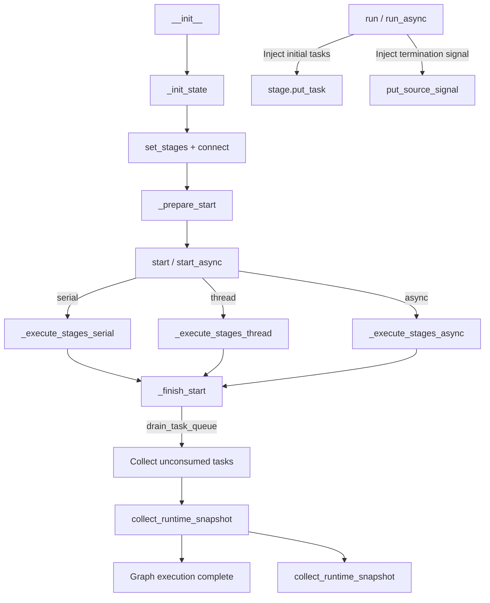

# TaskGraph

> 📅 Last Updated: 2026/08/31

`TaskGraph` is CelestialFlow's core scheduler, responsible for managing a set of `TaskStage` nodes' dependencies, execution flow, resource allocation, and lifecycle.

> Note: `TaskGraph` is a single-use object. After a single `run()` completes, the current instance is not guaranteed to be safely reset and restarted. If you need to re-execute the same workflow, create a new `TaskGraph` and associated `TaskStage` instances.

## Key Data Structures

`TaskGraph` internally uses `stage_dict: dict[str, TaskStage]` to maintain a Stage mapping for all nodes. Queue connections are directly established during the `connect()` phase. Graph analysis is based on an internally maintained `OrderGraph` instance (`self.order_graph`), whose `out_edges` / `in_edges` are reference views of the in/out adjacency lists.

## Initialization

```python
class TaskGraph:
    def __init__(self, name: str, graph_mode: str = "serial"): ...
```

### Parameters

- **name**: Task graph name (required)
- **graph_mode**: Graph execution mode
  - `serial` (default): Serial execution, runs layer by layer in topological order (`layers_dict`)
  - `thread`: Thread-based concurrent execution, each node launched in its own thread
  - `async`: Async concurrent execution, must be called in a running event loop (see [`start_async`](#start_async))

## Graph Construction

### set_stages

```python
def set_stages(self, stages: list[TaskStage]) -> None:
    """
    Add nodes to the task graph. Registers nodes and injects graph-level event clients.

    :param stages: List of nodes
    :raises DuplicateNodeError: If node names are duplicated
    """
```

### connect

```python
def connect(self, from_stages: list[TaskStage], to_stages: list[TaskStage]) -> None:
    """
    Establish a hyperedge: every node in from_stages connects to every node in to_stages.
    Operates on self.order_graph's out_edges / in_edges dictionaries; queue connections are completed directly within connect().
    """
```

## Configuration Methods

### set_reporter

```python
def set_reporter(self, reporter: ReporterProtocol) -> None:
    """
    Set the reporter bound to the task graph.

    :param reporter: reporter instance
    """
```

### set_ctree

```python
def set_ctree(self, ctree_client: EventClient) -> None:
    """
    Set the shared event client for the task graph.
    Once set, it is synchronized down to all current stages in the graph.
    """
```

> By default, `TaskGraph` internally uses `LocalEventClient()` to generate local incrementing event IDs, so the core execution pipeline works correctly even without installing `celestialtree`.
>
> If you wish to report events to CelestialTree, you need to first install `celestialtree` separately, then construct the corresponding client instance and pass it to `set_ctree()`.

### set_graph_mode

```python
def set_graph_mode(self, graph_mode: str) -> None:
    """
    Set the graph execution mode, allowed values are 'serial', 'thread', or 'async'.
    """
```

### set_stage_execution_mode

```python
def set_stage_execution_mode(self, execution_mode: str) -> None:
    """
    Batch-set execution_mode ('serial', 'thread', or 'async') for all nodes.
    Triggers _build_analysis() to rebuild analysis data.
    """
```

## Starting Execution

### run

```python
def run(
    self,
    init_tasks_dict: dict[str, Iterable[Any]],
    *,
    if_put_signal: bool = True,
) -> None:
    """
    Run the task graph. Flow:
    1. Inject initial tasks into each node
    2. When if_put_signal=True, automatically inject termination signal into source nodes
    3. Call start() to launch execution
    """
```

### run_async

```python
async def run_async(
    self,
    init_tasks_dict: dict[str, Iterable[Any]],
    *,
    if_put_signal: bool = True,
) -> None:
    """Async version of run()."""
```

### restore_db

```python
def restore_db(
    self,
    db_path: str | Path,
    statuses: Iterable[str] | None = None,
    *,
    filter_by_error_type: bool = False,
    if_put_signal: bool = True,
) -> None:
    """
    Read tasks from a sqlite persistence database, group by stage, and start the task graph.

    :param db_path: Path to the sqlite database file
    :param statuses: Record status filter list, defaults to ``["failed", "pending"]``
    :param filter_by_error_type: Whether to filter ``error_type`` by each stage's
        ``retry_exceptions``, default ``False``
    :param if_put_signal: Whether to inject termination signal, default True
    """
```

This method internally calls `load_tasks_grouped_by_stage()` to load persisted task records,
filters recoverable error types via `stage.metrics.get_retry_error_type_names()`,
and ultimately reuses `start()` for execution.

### Lifecycle Constraints

- `TaskGraph` internally establishes runtime queue connections, predecessor bindings, thread references, and state snapshots during the startup process.
- These runtime resources are designed to serve a single complete execution and are not guaranteed to be safely cleared and reused after the run ends.
- If you need to rerun the same topology, it is recommended to re-instantiate the graph object and node objects, rather than calling `run()` again on the same instance.

```python
graph = TaskGraph(name="MyGraph", graph_mode="thread")
graph.set_stages(stages=[stage_a, stage_b])
graph.connect([stage_a], [stage_b])
graph.run({stage_a.get_name(): [1, 2, 3, 4, 5]})
```

### start

```python
def start(self) -> None:
    """
    Start the task graph (sync entry).
    Selects _execute_stages_serial() or _execute_stages_thread() according to graph_mode.
    """
```

### start_async

```python
async def start_async(self) -> None:
    """
    Async start of the task graph. Requires graph_mode='async', otherwise raises InvalidOptionError.
    """
```

### _execute_stages_serial / _execute_stages_thread / _execute_stages_async

```python
def _execute_stages_serial(self) -> None:
    """Execute serially layer by layer in topological order (layers_dict), one node at a time."""


def _execute_stages_thread(self) -> None:
    """Each node is launched in its own daemon thread; all threads are joined at the end."""


async def _execute_stages_async(self) -> None:
    """Concurrent execution across the entire graph."""
```

### _execute_stage / _execute_stage_async

```python
def _execute_stage(self, stage: AnyTaskStage) -> None:
    """
    Execute a single node on the sync graph start path.
    - async nodes go through asyncio.run(stage.start_async())
    - other nodes go through stage.start()
    """


async def _execute_stage_async(self, stage: AnyTaskStage) -> None:
    """
    Async execution of a single node: async goes through coroutine; others go through asyncio.to_thread(stage.start).
    """
```

## Runtime Monitoring

### collect_runtime_snapshot

```python
def collect_runtime_snapshot(self) -> tuple[dict[str, Any], float]:
    """
    Collect runtime snapshots of all nodes, compute a DAG-aware global pending estimate,
    and append it to each node's snapshot (total_tasks_pending / total_remaining_time).

    :return: (status_dict, status_timestamp) — per-node snapshot dict and unified collection timestamp
    """
```

This method iterates over all stages, calling `stage.snapshot(interval)` to collect each node's snapshot, then computes a DAG-aware global pending estimate and appends it to each node's snapshot.

The table below lists all fields contained in the complete snapshot:

| Field | Type | Description |
|-------|------|-------------|
| `name` | `str` | Node name |
| `func_name` | `str` | Function name |
| `execution_mode` | `str` | Execution mode |
| `max_workers` | `int` | Maximum concurrent worker count |
| `status` | `StageStatus` | Running state |
| `tasks_input` | `int` | Input task count |
| `tasks_succeeded` | `int` | Success count |
| `tasks_failed` | `int` | Failure count |
| `tasks_duplicated` | `int` | Duplicate count |
| `tasks_processed` | `int` | Processed count |
| `tasks_pending` | `int` | Pending count |
| `total_tasks_pending` | `int` | Global estimated pending count |
| `elapsed_time` | `float` | Elapsed time |
| `remaining_time` | `float` | Estimated remaining time |
| `total_remaining_time` | `float` | Global estimated remaining time |
| `task_avg_time` | `str` | Average time (formatted) |
| `start_time` | `float` | Start timestamp |

## Query Interface

| Method | Return Type | Description |
|--------|-------------|-------------|
| `get_graph_id()` | `str` | Get the unique identifier of the current task graph instance |
| `get_stages_summary()` | `dict[str, dict[str, Any]]` | Summary information of all task stages |
| `get_edges()` | `dict[str, list[str]]` | Outgoing edge adjacency list (shares reference with the internal `OrderGraph`, caller should treat as read-only) |
| `get_source_names()` | `list[str]` | List of source node names |
| `get_graph_analysis()` | `dict` | Graph analysis info (graphId, graphMode, name, startTime, className, isDAG, layersDict) |
| `get_structure_list()` | `list[str]` | Formatted tree text with borders |
| `get_order_graph()` | `OrderGraph` | Internal ordered directed graph instance |
| `get_lifecycle_path()` | `Path` | Absolute path to the task lifecycle persistence sqlite file; empty Path if not set |

### get_graph_analysis Description

`get_graph_analysis()` returns a dict with the following fields:

```python
{
    "graphId": self.graph_id,
    "graphMode": self.graph_mode,
    "name": self.name,
    "startTime": self.start_time,
    "className": self.__class__.__name__,
    "isDAG": self.is_dag,
    "layersDict": self.layers_dict,
}
```

## Lifecycle Diagram


```mermaid
flowchart TD
    INIT[__init__] --> INIT_STATE[_init_state]
    INIT_STATE --> BUILD[set_stages + connect]
    BUILD --> PREPARE[_prepare_start]
    PREPARE --> START[start / start_async]
    START -->|serial| SER[_execute_stages_serial]
    START -->|thread| THR[_execute_stages_thread]
    START -->|async| ASY[_execute_stages_async]
    SER --> FINISH[_finish_start]
    THR --> FINISH
    ASY --> FINISH
    FINISH -->|drain_task_queue| DRAIN[Collect unconsumed tasks]
    DRAIN --> SNAP[collect_runtime_snapshot]
    SNAP --> END[Graph execution complete]

    SNAP --> STATUS[collect_runtime_snapshot]

    RUN[run / run_async] -->|Inject initial tasks| PUT[stage.put_task]
    RUN -->|Inject termination signal| SIGNAL[put_source_signal]
```

## Graph Execution Modes in Detail

### serial mode

```
Run layer by layer in topological order of layers_dict → stage.start() synchronously → data flows through queues → stop when termination signal arrives
```

- Run synchronously layer by layer (topological order), within layer by registration order
- Default mode
- Suitable for: debugging, serial pipelines

### thread mode

```
Launch a separate thread for each node → stage.start() → join all threads
```

- Maximize parallelism
- Suitable for: CPU/IO mixed concurrent pipelines

### async mode

```
Execute all nodes asynchronously (asyncio.gather) → must be called in an existing event loop via start_async()
```

- Concurrent coroutine execution across the graph
- Nodes under `serial` / `thread` modes run in independent threads via `asyncio.to_thread` to avoid blocking the event loop
- Suitable for: integration with other async systems

## Notes for Non-DAG Graphs

For cyclic graphs (e.g. `TaskLoop` / `TaskWheel`), if `graph_mode='serial'` and the graph contains a cycle (non-DAG),
`_build_analysis` raises `ConfigurationError`, prompting to switch to `thread` or `async` mode.

When using cyclic graphs in `thread` / `async` modes, it is recommended to set `if_put_signal=False` in `run`,
and let an external component explicitly inject `TerminationSignal` to control stop timing; otherwise the termination signal may cause some nodes to exit prematurely before receiving upstream data.

```python
graph.run({"source": tasks}, if_put_signal=False)
# Later inject TerminationSignal manually via stage.put_task or external injection
```

## Unconsumed Task Handling

In `_finish_start()`, all remaining tasks are collected by iterating over `stage_dict` and calling each stage's `drain_task_queue()`,
marking them as `UnconsumedError` and recording failure information to the lifecycle sqlite persistence file
organized by date via `get_lifecycle_spout` (`LifecycleSpout`).
