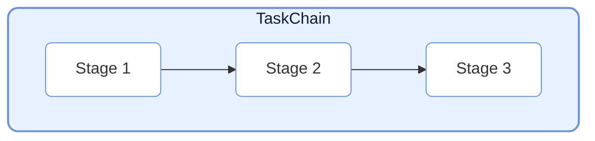
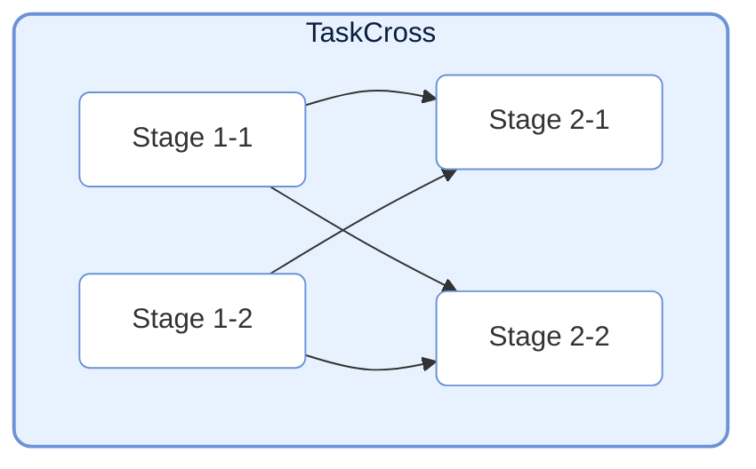
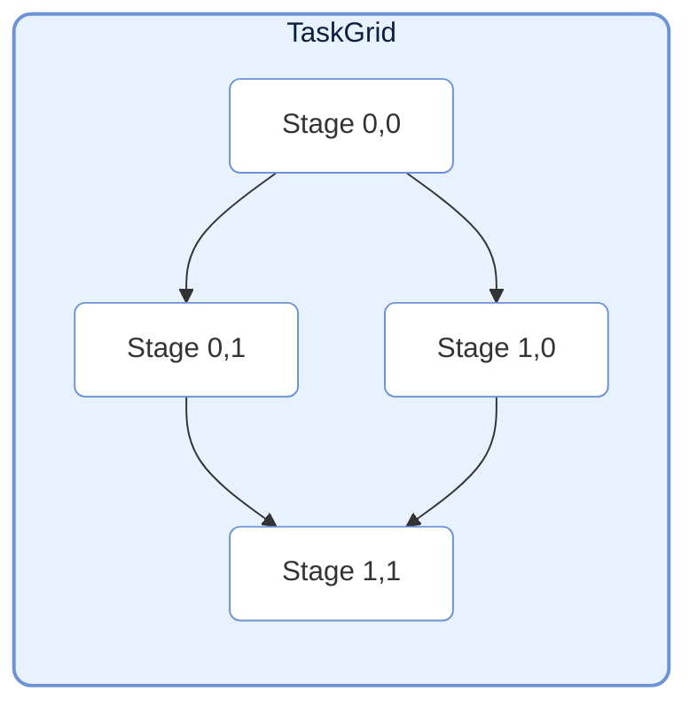
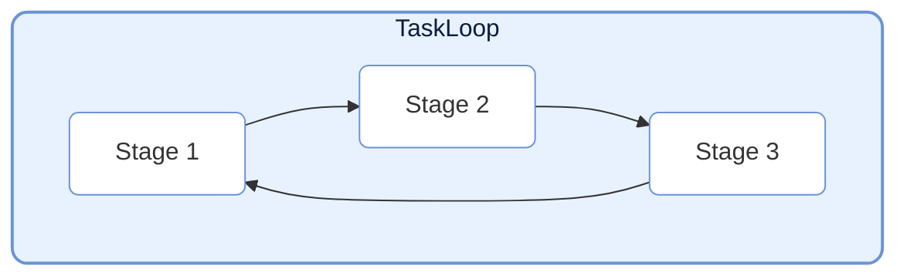
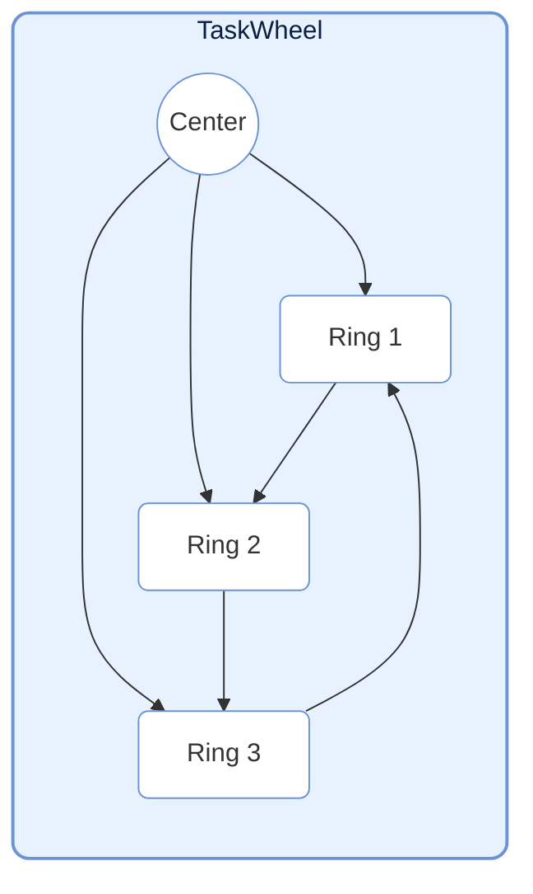
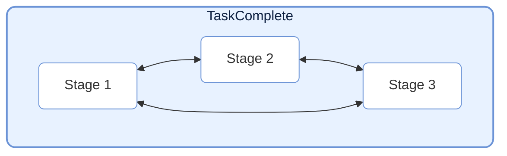

# TaskStructure

> 📅 Last Updated: 2026/07/16

The TaskStructure module provides multiple predefined task graph structures to help users quickly build complex task flows. All structures inherit from `TaskGraph`.

## Chain



`TaskChain` is the simplest task structure, connecting multiple `TaskStage` instances in sequence to form a linear data flow.

```python
from celestialflow import TaskChain, TaskStage

# Define stages
stage1 = TaskStage("S1", func=func1)
stage2 = TaskStage("S2", func=func2)
stage3 = TaskStage("S3", func=func3)

# Create chain
chain = TaskChain(
    name="DataPipeline",
    stages=[stage1, stage2, stage3],
    stage_mode="thread",  # thread: nodes run in parallel; serial: nodes run sequentially
    log_level="SUCCESS"
)

# Start
chain.start_graph(init_tasks_dict={stage1.get_name(): [data]})
```

## Cross



`TaskCross` organizes tasks into "layers". Each layer contains multiple nodes executing in parallel. Adjacent layers establish fully-connected dependencies (every node in the upper layer connects to all nodes in the lower layer).

```python
from celestialflow import TaskCross

# Define layers
layer1 = [stage_1_1, stage_1_2]
layer2 = [stage_2_1, stage_2_2]

# Create cross structure
cross = TaskCross(
    name="CrossPipeline",
    layers=[layer1, layer2],
    schedule_mode="eager"
)
```

## Grid



`TaskGrid` organizes task nodes into a 2D grid. Each node connects to its **right** and **below** neighbors.

```python
from celestialflow import TaskGrid

# Define grid
grid_layout = [
    [stage_00, stage_01],
    [stage_10, stage_11]
]

# Create grid structure
grid = TaskGrid(
    name="GridPipeline",
    grid=grid_layout,
    schedule_mode="eager"
)
```

## Loop



`TaskLoop` connects nodes head-to-tail to form a closed loop. Defaults to the `eager` scheduling mode.
Note: Loop structures typically require external intervention to stop, or specific exit conditions must be set.

```python
from celestialflow import TaskLoop

# Create loop
loop = TaskLoop(
    name="FeedbackLoop",
    stages=[stage1, stage2, stage3]  # stage3 -> stage1
)
```

## Wheel



`TaskWheel` contains a center node and a ring structure. The center node connects to every node on the ring, and ring nodes are connected head-to-tail.

```python
from celestialflow import TaskWheel

# Create wheel structure
wheel = TaskWheel(
    name="HubAndSpoke",
    center=center_stage,
    ring=[ring_stage1, ring_stage2, ring_stage3]
)
```

## Complete



`TaskComplete` is a special structure where each node connects to every other node except itself.

```python
from celestialflow import TaskComplete

# Create complete graph
complete = TaskComplete(
    name="FullMesh",
    stages=[stage1, stage2, stage3, stage4]
)
```

## Usage Examples

The following examples demonstrate concrete construction and execution of each predefined graph structure.

### TaskChain Full Example

```python
from celestialflow import TaskChain, TaskStage

# Define three stages: data cleaning → transform → aggregate
def clean(data: str) -> str:
    return data.strip()

def transform(data: str) -> int:
    return int(data) * 2

def aggregate(data: int) -> dict:
    return {"original": data // 2, "doubled": data}

# Build chain
s1 = TaskStage("Clean", func=clean)
s2 = TaskStage("Transform", func=transform)
s3 = TaskStage("Aggregate", func=aggregate)
chain = TaskChain(name="ETL", stages=[s1, s2, s3], stage_mode="thread")

# Start
chain.start_graph({s1.get_name(): [" 10 ", " 20 ", " 30 "]})

# Get results
print(f"Chain status: {chain.get_status_snapshot()}")
```

### TaskCross Full Example

```python
from celestialflow import TaskCross, TaskStage

# Layer 1: data preparation
def load_a(x: int) -> int:
    return x + 1

def load_b(x: int) -> int:
    return x * 10

# Layer 2: computation & analysis
def analyze_a(x: int) -> float:
    return x * 1.5

def analyze_b(x: int) -> float:
    return x * 2.0

layer1 = [TaskStage("LoadA", func=load_a), TaskStage("LoadB", func=load_b)]
layer2 = [TaskStage("AnaA", func=analyze_a), TaskStage("AnaB", func=analyze_b)]

cross = TaskCross(name="DataAnalysis", layers=[layer1, layer2])
cross.start_graph({layer1[0].get_name(): [1, 2], layer1[1].get_name(): [3, 4]})
print(cross.get_status_snapshot())
```

### TaskGrid Full Example

```python
from celestialflow import TaskGrid, TaskStage

# 2x2 grid
n00 = TaskStage("Init", func=lambda x: x)
n01 = TaskStage("Add", func=lambda x: x + 1)
n10 = TaskStage("Mul", func=lambda x: x * 2)
n11 = TaskStage("Square", func=lambda x: x * x)

grid = TaskGrid(name="CalcGrid", grid=[[n00, n01], [n10, n11]])
grid.start_graph({n00.get_name(): [1, 2, 3]})
print(grid.get_status_snapshot())
```

### TaskLoop Full Example

```python
from celestialflow import TaskLoop, TaskStage

# Three-node ring: each node processes and passes to the next
loop_stages = [
    TaskStage("Ring1", func=lambda x: x + 1),
    TaskStage("Ring2", func=lambda x: x * 2),
    TaskStage("Ring3", func=lambda x: x - 3),  # Ring3 -> Ring1 forms closed loop
]

loop = TaskLoop(name="RingLoop", stages=loop_stages)
loop.start_graph(
    {loop_stages[0].get_name(): [5]},
    put_termination_signal=False,  # Loop structures require manual termination injection
)
```

### TaskWheel Full Example

```python
from celestialflow import TaskWheel, TaskStage

center = TaskStage("Hub", func=lambda x: {"input": x, "processed": x * 10})
ring_nodes = [
    TaskStage("Channel1", func=lambda x: x["processed"] + 1),
    TaskStage("Channel2", func=lambda x: x["processed"] + 2),
    TaskStage("Channel3", func=lambda x: x["processed"] + 3),
]

wheel = TaskWheel(name="HubWheel", center=center, ring=ring_nodes)
wheel.start_graph({center.get_name(): [42]})
print(wheel.get_status_snapshot())
```

### TaskComplete Full Example

```python
from celestialflow import TaskComplete, TaskStage

nodes = [
    TaskStage("N1", func=lambda x: x ** 2),
    TaskStage("N2", func=lambda x: x + 1),
    TaskStage("N3", func=lambda x: x // 2),
]

complete = TaskComplete(name="FullConnected", stages=nodes)
complete.start_graph(
    {nodes[0].get_name(): [10]},
    put_termination_signal=False,
)
print(complete.get_status_snapshot())
```
