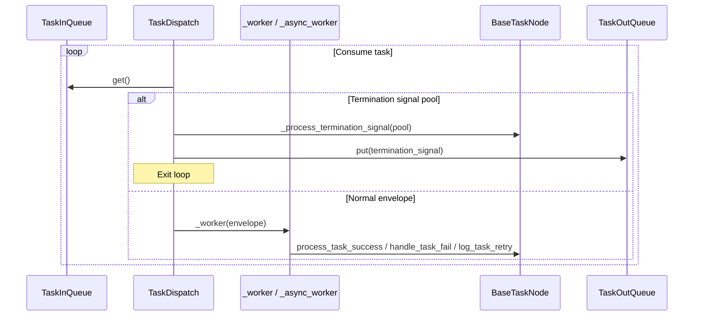
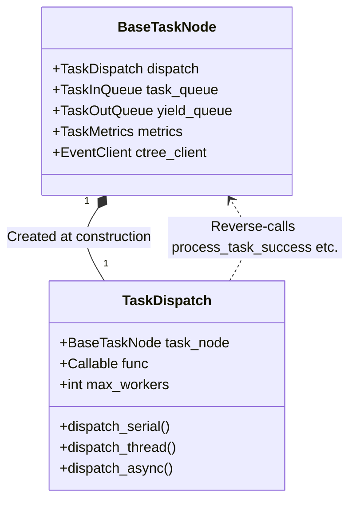

# src/celestialflow/node/core_dispatch.py

> 📅 Last Updated: 2026/09/24

`core_dispatch.py` defines `TaskDispatch[T, R, Y]`, the "task scheduler" component held by `BaseTaskNode`. It pulls `TaskEnvelope` / termination signals from the node's input queue, invokes the node callback serially / in threads / asynchronously according to `execution_mode`, and is responsible for merging termination signals, initializing / releasing thread pools, and recording worker exceptions.

> `TaskDispatch` is an **internal component** of `BaseTaskNode`, automatically created by `BaseTaskNode.__init__` at construction; it is not a public API and does not appear in `__all__` of `node/__init__.py`.

## Core Object

### `TaskDispatch[T, R, Y]`

```python
class TaskDispatch[T, R, Y]:
    def __init__(
        self,
        task_node: BaseTaskNode[T, R, Y],
        func: Callable[[T], R] | Callable[[T], Awaitable[R]],
        max_workers: int,
    ): ...
```

| Field | Type | Description |
|------|------|------|
| `task_node` | `BaseTaskNode[T, R, Y]` | Host node (**not** `TaskExecutor`, but the base class) |
| `func` | `Callable[[T], R] | Callable[[T], Awaitable[R]]` | Node callback reference |
| `max_workers` | `int` | Concurrency upper limit |
| `_pool` | `ThreadPoolExecutor | None` | Thread pool (used only in thread mode) |

> The scheduler will reverse-call through the host object: `task_node.metrics` / `process_task_success` / `handle_task_fail` / `log_task_retry` / `get_name` / `ctree_client.emit` / `task_queue` / `yield_queue`, etc.

## Public Dispatch Methods

| Method | Purpose |
|------|------|
| `dispatch_serial()` | Consume the task queue synchronously in the current thread; merge and exit when encountering `TerminationIdPool` |
| `dispatch_thread()` | Concurrent consumption using `ThreadPoolExecutor`; block and wait when the number of tasks ≥ `max_workers` |
| `async dispatch_async()` | Async consumption throttled via `asyncio.Semaphore`; stream-arriving, run-as-it-comes |

### `dispatch_serial`

Main loop pseudocode:

```text
while True:
    envelope = task_queue.get()
    if isinstance(envelope, TerminationIdPool):
        termination_signal = _process_termination_signal(envelope)
        break
    _worker(envelope)
yield_queue.put(termination_signal)
```

### `dispatch_thread`

```text
_init_pool("thread")
try:
    pending = set[Future[None]]()
    while True:
        envelope = task_queue.get()
        if isinstance(envelope, TerminationIdPool):
            termination_signal = _process_termination_signal(envelope)
            break
        # Throttle: block when pending count ≥ max_workers
        while len(pending) >= max_workers:
            _, pending = wait(pending, return_when=FIRST_COMPLETED)
        pending.add(_pool.submit(_worker, envelope))
    wait(pending)
    yield_queue.put(termination_signal)
finally:
    _release_pool()
```

### `dispatch_async`

```text
semaphore = asyncio.Semaphore(max_workers)
pending = set[asyncio.Task[None]]()

async def sem_worker(envelope):
    async with semaphore:
        await _async_worker(envelope)

while True:
    envelope = await asyncio.to_thread(task_queue.get)  # Do not block the event loop
    if isinstance(envelope, TerminationIdPool):
        termination_signal = _process_termination_signal(envelope)
        break
    task = asyncio.create_task(sem_worker(envelope))
    pending.add(task)
    task.add_done_callback(pending.discard)

await asyncio.gather(*pending, return_exceptions=True)
yield_queue.put(termination_signal)
```

## Internal Helper Methods

| Method | Behavior |
|------|------|
| `_call_sync(task) -> R` | Call sync callback; raise `ConfigurationError` if returns awaitable |
| `_call_async(task) -> R` | Call async callback; raise `ConfigurationError` if return value is not awaitable |
| `_worker(envelope) -> None` | Execute a single task synchronously: loop over `for fail_times in range(1, max_retries + 2)`, call `task_node.log_task_retry` when hitting `retry_exceptions`, otherwise call `handle_task_fail`; the outermost `try` catches exceptions and reports them via `get_log_inlet().worker_crash`; the `finally` block calls `task_node.metrics.end_task()` |
| `_async_worker(envelope) -> None` | Async version of `_worker`, using `await self._call_async(task)` |
| `_process_termination_signal(pool) -> TerminationSignal` | Merge all ids in `TerminationIdPool.ids` into a single `TerminationSignal(source=task_node.get_name())` via `ctree_client.emit(CTreeEvent.TERMINATION_MERGE, parents=...)`, and write `get_log_inlet().termination_merge(...)` |
| `_init_pool(execution_mode)` | Only when `execution_mode == "thread"` and `_pool is None`, construct `ThreadPoolExecutor(max_workers=self.max_workers)` |
| `_release_pool()` | Close and clear `_pool` (called when thread mode ends) |

## Key Data Flow



## Exception Summary

| Exception | Trigger scenario |
|------|---------|
| `ConfigurationError` | Sync call returns awaitable / async call returns non-awaitable |
| `InitializationError` | `_pool is None` in `dispatch_thread` (theoretically guaranteed by `_init_pool`, but code retains a fallback) |
| `get_log_inlet().worker_crash(e)` | `_worker` / `_async_worker` catches an exception outside `process_task_success` / `handle_task_fail` / `log_task_retry` in the outermost `try` |

## Relationship with Host `BaseTaskNode`



> In `BaseTaskNode.__init__`, host binding is completed via `self.dispatch = TaskDispatch(cast(BaseTaskNode[T, R, Y], self), self.func, self.max_workers)`.

## Notes

1. **Host type is `BaseTaskNode` rather than `TaskExecutor`**: Even if the actual instance passed in is `TaskSplitter` / `TaskRouter`, the scheduler only accesses the host through the `BaseTaskNode` interface.
2. **Termination signal path**: A single `TerminationSignal` in `TaskInQueue` will be merged with other sources into `TerminationIdPool`; the scheduler emits `TERMINATION_MERGE` uniformly when receiving the pool.
3. **Thread pool lifecycle**: `_pool` only temporarily exists in `dispatch_thread`, with `_init_pool` at entry and `_release_pool` at exit, so the same scheduler does not support cross-`start` reuse.
4. **Async path does not block the event loop**: `dispatch_async` uses `asyncio.to_thread(task_queue.get)` to pull input, combined with `asyncio.Semaphore` to achieve "stream-while-running" without blocking the event loop.
5. **No longer contains deduplication logic**: The scheduler is only responsible for execution; the task deduplication capability has been entirely removed from the node layer, and `TaskMetrics.duplicate_counter` / `BaseObserver.on_task_duplicate` are retained only as historical counting interfaces.
