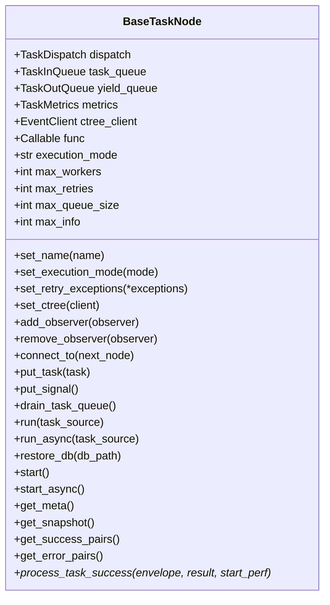
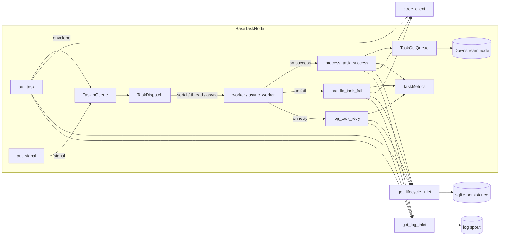

# src/celestialflow/node/core_node.py

> 📅 Last Updated: 2026/09/24

`core_node.py` defines the core base class `BaseTaskNode[T, R, Y]` of the CelestialFlow node layer. It is responsible for centralizing runtime concerns such as "queue communication / task scheduling / metrics statistics / event tracing / persistence logging / observer callbacks" into a single object, and exposes entry methods like `run` / `start` for reuse by upper-layer `TaskExecutor` / `TaskSplitter` / `TaskRouter`.

> ⚠️ `BaseTaskNode` is an **internal base class** and **not exported as a public API**. Only `TaskExecutor` / `TaskSplitter` / `TaskRouter` are visible to users.

## Core Object

### `BaseTaskNode[T, R, Y]`

The three generic parameters respectively represent: the input task type `T`, the direct return type `R` of `func`, and the result type `Y` sent downstream.

| Field | Type | Description |
|------|------|------|
| `dispatch` | `TaskDispatch[T, R, Y]` | Task scheduler (internal component), created by `__init__` |
| `task_queue` | `TaskInQueue[T]` | Input task queue |
| `yield_queue` | `TaskOutQueue[Y]` | Output result queue (to downstream nodes) |
| `metrics` | `TaskMetrics` | Task metrics statistics object (success / fail / duplicate / elapsed / upstream-downstream counts) |
| `ctree_client` | `EventClient` | Event client (ctree), default `LocalEventClient()` |
| `func` | `Callable[[T], R]` or `Callable[[T], Awaitable[R]]` | Callback that actually executes the task |
| `execution_mode` | `str` | `'serial'` / `'thread'` / `'async'` |
| `max_workers` | `int` | Maximum concurrent workers (default `min(32, cpu_count+4)`) |
| `max_retries` | `int` | Maximum retries per task (`1` means "original + 1 retry") |
| `max_queue_size` | `int` | Input queue capacity upper limit (`0` means unbounded) |
| `max_info` | `int` | Maximum string length of each task in logs (default `50`) |
| `_name` | `str` | Node / manager name |
| `start_time` | `float` | `time.time()` record of the most recent `start`; `0.0` at construction |



## Initialization

```python
def __init__(
    self,
    name: str,
    func: Callable[[T], R] | Callable[[T], Awaitable[R]],
    *,
    execution_mode: str = "serial",
    max_workers: int | None = None,
    max_retries: int = 1,
    max_queue_size: int = 0,
    max_info: int = 50,
): ...
```

Key behaviors of `__init__`:

1. Write the name via `set_name`; `_set_func` validates the callback signature (must accept only 1 positional argument), otherwise throw `ConfigurationError`;
2. `set_execution_mode` validates the legality of the mode; if `execution_mode == "async"` but `func` is not `iscoroutinefunction`, throw `ConfigurationError`;
3. Initialize `max_workers / max_retries / max_queue_size / max_info`;
4. Install `LocalEventClient()` by default, replaceable via `set_ctree(...)` later;
5. Instantiate `TaskDispatch(cast(BaseTaskNode[T, R, Y], self), self.func, self.max_workers)`, and create new `TaskInQueue` / `TaskOutQueue` / `TaskMetrics`;
6. Initialize `start_time` to `0.0`, so that the reporter can collect a snapshot once before the node actually starts.

## Configuration Setters

| Method | Purpose | Throws |
|------|------|------|
| `set_name(name)` | Write node / manager name | — |
| `set_execution_mode(execution_mode)` | Switch between `'serial'` / `'thread'` / `'async'` | `InvalidOptionError` (invalid mode), `ConfigurationError` (`async` but `func` is not a coroutine) |
| `set_ctree(ctree_client)` | Replace event client | — |
| `set_retry_exceptions(*exceptions)` | Register retryable exception types to `metrics` | — |
| `add_observer(observer)` / `remove_observer(observer)` | Register / unbind `BaseObserver` | — |
| `_set_func(func)` | Write and validate `func` signature | `ConfigurationError` (parameter count ≠ 1), `CallableParameterKindError` (contains VAR/KEYWORD parameters) |

> All setters must be called before `start()` / `start_async()`. They are **not guaranteed** to remain valid if modified again after `start`.

## Template Methods and Queries

`BaseTaskNode` exposes only one **abstract hook** for `TaskExecutor` / `TaskSplitter` / `TaskRouter` to override:

| Method | Purpose |
|------|------|
| `process_task_success(task_envelope, result, start_perf) -> None` | When the worker successfully gets a result, the node needs to do "metrics + persistence + downstream dispatch" etc.; a newly-created `BaseTaskNode` directly throws `NotImplementedError` |

Helper query methods:

- `get_name() -> str`: Returns the node name.
- `_get_class_name() -> str`: Returns the current node class name.
- `_get_execution_mode_desc() -> str`: Returns `"serial"` for serial, otherwise returns `"{mode}-{max_workers}"`.
- `get_lifecycle_path() -> Path`: Returns the absolute path of `LifecycleSpout.db_path` (returns an empty `Path` when unset).
- `get_meta() -> dict[str, Any]`: Returns the build-time metadata `{"class_name", "execution_mode", "max_workers"}`; these fields are frozen before the reporter starts and are reported once along with the graph structure.
- `get_snapshot() -> dict[str, Any]`: Collects the current runtime snapshot; the fields include `start_time`, `status`, `elapsed_time`, all count keys of `metrics.get_counts()`, and `upstream_counts` / `downstream_counts`.
- `get_success_pairs() -> list[tuple[T, R]]` / `get_error_pairs() -> list[tuple[T, PersistedError]]`: Pulls success / failure records from `LifecycleSpout`.

> The snapshot no longer contains `remaining_time` / `task_avg_time`; busy elapsed time is accumulated by `TaskMetrics` itself during actual task execution (`elapsed_time`), without needing the caller to pass in an interval.

## Binding Downstream

`connect_to(next_node)` establishes the transport connection from the current node to a downstream:

1. Create a shared `ValueWrapper(value=0)`;
2. Make the upstream and downstream share the same counter via `self.metrics.set_downstream_counter(next_node.get_name(), counter)` and `next_node.metrics.set_upstream_counter(self.get_name(), counter)`;
3. `self.yield_queue.add_queue(next_node.get_name(), next_node.task_queue)` and `next_node.task_queue.add_source_name(self.get_name())`.

Therefore, each time the current node sends a task downstream, both sides' counts increment synchronously, which is the source of `downstream_counts` / `upstream_counts` in the snapshot.

## Task Injection

| Method | Behavior |
|------|------|
| `put_task(task)` | Wrap a single task into `TaskEnvelope`, emit the `TASK_INPUT` event and enqueue; call `metrics.add_external_input_count()`, and write `get_lifecycle_inlet().task_input` / `get_log_inlet().task_input` |
| `put_signal()` | Put `TerminationSignal(source="input")` into the queue, emit the `TERMINATION_INPUT` event, and write `get_log_inlet().termination_input` |
| `drain_task_queue()` | Clear remaining tasks, process each leftover task as `UnconsumedError()` via `handle_task_fail` |

## Entry Methods

### `run(task_source, *, if_put_signal=True)`

```python
def run(self, task_source: Iterable[T], *, if_put_signal: bool = True) -> None:
    with funnel_scope():
        for task in task_source:
            self.put_task(task)
        if if_put_signal:
            self.put_signal()
        self.start()
```

`funnel_scope()` is responsible for starting/stopping the global `LifecycleSpout` / `LogSpout`.

### `async run_async(task_source, *, if_put_signal=True)`

Async version, calls `await self.start_async()`, also executed within the `funnel_scope()` context.

### `restore_db(db_path, statuses=None, *, filter_by_error_type=False)`

Load and replay unfinished tasks from the sqlite database:

1. `statuses` defaults to `["failed", "pending"]`;
2. When `filter_by_error_type=True`, the current node's `metrics.get_retry_error_type_names()` is used to filter `error_type` (`pending` records are always retained);
3. Take the `record["task_json"]` field and call `self.run(tasks)`.

### `start()`

- The preparation phase calls `self.metrics.on_start()` and writes the `node_start` log;
- Selects `dispatch.dispatch_serial()` / `dispatch.dispatch_thread()` based on `execution_mode`; `async` goes through `start_async`, otherwise throws `InvalidOptionError`;
- The cleanup phase `_finish_start` writes the `node_end` log and calls `metrics.on_finish()`;
- Any exceptions in any phase are finally aggregated as `ExceptionGroup("Errors occurred during execution", ...)` thrown.

### `async start_async()`

- Only valid when `execution_mode == "async"`, otherwise throws `InvalidOptionError`;
- Internally `await self.dispatch.dispatch_async()`; exceptions additionally trigger `get_log_inlet().node_crash(...)`.

## Results / Snapshots / Error Handling

| Method | Purpose |
|------|------|
| `process_task_success(envelope, result, start_perf)` | Abstract hook; subclasses implement successful handling |
| `handle_task_fail(envelope, exception)` | Record failure count + `TASK_ERROR` event + persist failure info |
| `log_task_retry(envelope, exception, fail_times)` | Write the retry log and lifecycle retry record |
| `_get_repr(task) -> str` | Generate a readable string via `format_repr(task, self.max_info)` |
| `get_meta() -> dict` | Build-time metadata |
| `get_snapshot() -> dict` | Runtime snapshot |
| `get_lifecycle_path() -> Path` | Lifecycle persistence file path |
| `get_success_pairs() -> list[tuple[T, R]]` | Successful tasks and results |
| `get_error_pairs() -> list[tuple[T, PersistedError]]` | Failed tasks and `PersistedError` (with type and message) |

## Key Data Flow



## Usage Example

> `BaseTaskNode` is not used directly externally. The following example shows how to inherit it to write a custom node; in actual production, inheriting from `TaskExecutor` is more recommended.

```python
from celestialflow.node.core_node import BaseTaskNode
from celestialflow.runtime import TaskEnvelope
from celestialflow.runtime.util_types import CTreeEvent


class SquareNode(BaseTaskNode[int, int, int]):
    """Minimal node example that squares an integer."""

    def process_task_success(self, task_envelope, result, start_perf):
        task = task_envelope.get_task()
        task_id = task_envelope.get_id()

        result_id = self.ctree_client.emit(CTreeEvent.TASK_SUCCESS, parents=[task_id])
        self.metrics.add_success_count()

        for target in self.yield_queue.get_target_names():
            self.metrics.add_downstream_count(target)
            downstream_id = self.ctree_client.emit(
                CTreeEvent.TASK_INPUT, parents=[result_id]
            )
            self.yield_queue.put_target(
                target, TaskEnvelope(task=result, id=downstream_id)
            )


node = SquareNode("Square", lambda x: x * x, execution_mode="serial")
node.run([1, 2, 3, 4])
print(node.get_snapshot())
```

## Exception Summary

| Exception | Trigger scenario |
|------|---------|
| `ConfigurationError` | Parameter count ≠ 1 in `_set_func`; `set_execution_mode("async")` but `func` is not a coroutine |
| `InvalidOptionError` | `execution_mode` not in `("serial", "thread", "async")` |
| `CallableParameterKindError` | Callback has non-`POSITIONAL_ONLY` / `POSITIONAL_OR_KEYWORD` parameters |
| `NotImplementedError` | Subclass does not override `process_task_success` |
| `ExceptionGroup` | Any exception during `start` / `start_async` is finally aggregated and thrown |

## Notes

1. **One-time `start`**: `start()` / `start_async()` are one-time calls and **not guaranteed** to be safely reset and reused after execution; if repeat execution is needed, create a new node.
2. **Setter timing**: All setters must be completed before `start`; do not replace `func` during runtime.
3. **Lifecycle management**: The global `LifecycleSpout` / `LogSpout` is managed by `funnel_scope()`; `BaseTaskNode` does not directly hold the spout / inlet.
4. **ctree client**: The default `LocalEventClient()` auto-increments event IDs internally; it can be replaced at any time via `set_ctree(...)` with a client that connects to `celestialtree`.
5. **Removed capabilities**: Task deduplication (`enable_duplicate_check` / `get_binding_counter` / `prev_binding` / `deal_duplicate` / `get_counts` / `snapshot(interval)`) has all been removed from the node layer; please refer to `get_snapshot()` / `connect_to()`.
