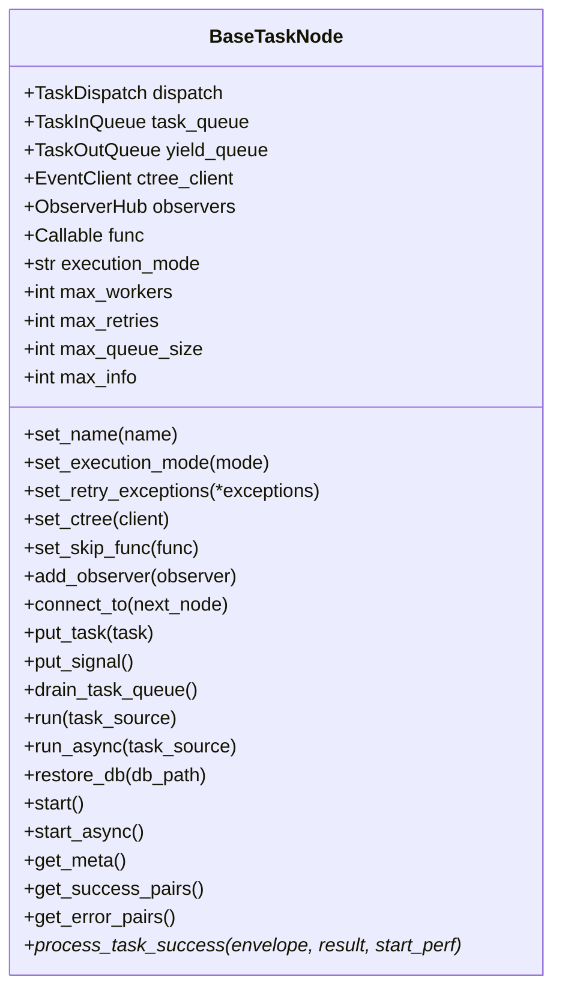
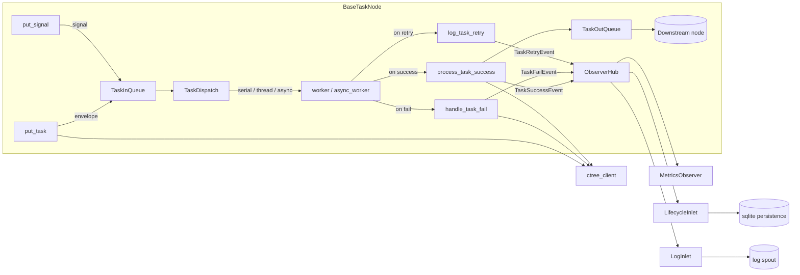

# src/celestialflow/node/core_node.py

> 📅 Last Updated: 2026/10/09

`core_node.py` defines the core base class `BaseTaskNode[T, R, Y]` of the CelestialFlow node layer. It centralizes runtime concerns such as "queue communication / task scheduling / event tracing / observer callbacks" into a single object, and exposes entry methods like `run` / `start` for reuse by upper-layer `TaskExecutor` / `TaskSplitter` / `TaskRouter`.

> ⚠️ `BaseTaskNode` is an **internal base class** and **not exported as a public API**. Only `TaskExecutor` / `TaskSplitter` / `TaskRouter` are visible to users.

## Core Object

### `BaseTaskNode[T, R, Y]`

The three generic parameters respectively represent: the input task type `T`, the direct return type `R` of `func`, and the result type `Y` sent downstream.

| Field | Type | Description |
|------|------|------|
| `dispatch` | `TaskDispatch[T, R, Y]` | Task scheduler (internal component), created by `__init__` |
| `task_queue` | `TaskInQueue[T]` | Input task queue |
| `yield_queue` | `TaskOutQueue[Y]` | Output result queue (to downstream nodes) |
| `ctree_client` | `EventClient` | Event client (ctree), default `LocalEventClient()` |
| `observers` | `ObserverHub` | Observer dispatch hub; observers are registered via `add_observer()` |
| `func` | `Callable[[T], R]` or `Callable[[T], Awaitable[R]]` | Callback that actually executes the task |
| `execution_mode` | `str` | `'serial'` / `'thread'` / `'async'`, default `'serial'` |
| `max_workers` | `int` | Maximum concurrent workers (default `min(32, cpu_count+4)`) |
| `max_retries` | `int` | Maximum retries per task (`1` means "original + 1 retry") |
| `retry_exceptions` | `tuple[type[Exception], ...]` | Retryable exception types, registered via `set_retry_exceptions` |
| `max_queue_size` | `int` | Input queue capacity upper limit (`0` means unbounded) |
| `max_info` | `int` | Maximum string length of each task in logs (default `50`) |
| `skip_func` | `Callable[[T], bool] | None` | Task-skip decision function, default `None` means never skip |
| `_name` | `str` | Node / manager name |
| `_lifecycle_db_path` | `Path | None` | Lifecycle database path produced when running independently; `None` when participating in graph scheduling |


```mermaid
classDiagram
    class BaseTaskNode {
        +TaskDispatch dispatch
        +TaskInQueue task_queue
        +TaskOutQueue yield_queue
        +EventClient ctree_client
        +ObserverHub observers
        +Callable func
        +str execution_mode
        +int max_workers
        +int max_retries
        +int max_queue_size
        +int max_info
        +set_name(name)
        +set_execution_mode(mode)
        +set_retry_exceptions(*exceptions)
        +set_ctree(client)
        +set_skip_func(func)
        +add_observer(observer)
        +connect_to(next_node)
        +put_task(task)
        +put_signal()
        +drain_task_queue()
        +run(task_source)
        +run_async(task_source)
        +restore_db(db_path)
        +start()
        +start_async()
        +get_meta()
        +get_success_pairs()
        +get_error_pairs()
        +process_task_success(envelope, result, start_perf)*
    }
```

> Note: the node **no longer holds `TaskMetrics`**. Counting and statistics are maintained by `MetricsObserver` based on events (registered by the graph/node assembly entry when running independently; see below), and `BaseTaskNode` itself only broadcasts events through `observers`.

## Initialization

```python
def __init__(
    self,
    name: str,
    func: Callable[[T], R] | Callable[[T], Awaitable[R]],
    *,
    execution_mode: str = "serial",
    max_workers: int | None = None,
    max_retries: int = 1,
    max_queue_size: int = 0,
    max_info: int = 50,
    skip_func: Callable[[T], bool] | None = None,
): ...
```

Key behaviors of `__init__`:

1. Write the name via `set_name`; `_set_func` validates the callback signature (must accept only 1 positional argument), otherwise throw `ConfigurationError`;
2. `set_skip_func` registers the task-skip decision function (also requiring a single positional argument); `None` means never skip;
3. `set_execution_mode` validates the legality of the mode; if `execution_mode == "async"` but `func` is not `iscoroutinefunction`, throw `ConfigurationError`;
4. Initialize `max_workers / max_retries / max_queue_size / max_info`, and preset `retry_exceptions` to an empty tuple;
5. Install `LocalEventClient()` by default, replaceable via `set_ctree(...)` later;
6. Instantiate `TaskDispatch(cast(BaseTaskNode[T, R, Y], self), self.func, self.max_workers)`, and create new `TaskInQueue` (with `out_name` as the node name) / `TaskOutQueue` (with `in_name` as the node name) / `ObserverHub`;
7. `_lifecycle_db_path` is initialized to `None`, to be written by the assembly entry when running independently.

## Configuration Setters

| Method | Purpose | Throws |
|------|------|------|
| `set_name(name)` | Write node / manager name | — |
| `set_execution_mode(execution_mode)` | Switch between `'serial'` / `'thread'` / `'async'` | `InvalidOptionError` (invalid mode), `ConfigurationError` (`async` but `func` is not a coroutine) |
| `set_ctree(ctree_client)` | Replace event client | — |
| `set_retry_exceptions(*exceptions)` | Append retryable exception types to `retry_exceptions` | — |
| `set_skip_func(skip_func)` | Set the task-skip decision function | `ConfigurationError` (parameter count ≠ 1), `CallableParameterKindError` (contains VAR/KEYWORD parameters) |
| `add_observer(observer)` | Register an `Observer` into `ObserverHub` | — |
| `_set_func(func)` | Write and validate `func` signature | `ConfigurationError` (parameter count ≠ 1), `CallableParameterKindError` (contains VAR/KEYWORD parameters) |

> All setters must be called before `start()` / `start_async()`. They are **not guaranteed** to remain valid if modified again after `start`.

## Template Methods and Queries

`BaseTaskNode` exposes only one **abstract hook** for `TaskExecutor` / `TaskSplitter` / `TaskRouter` to override:

| Method | Purpose |
|------|------|
| `process_task_success(task_envelope, result, start_perf) -> None` | When the worker successfully gets a result, the node needs to do "event broadcasting + downstream dispatch" etc.; a newly-created `BaseTaskNode` directly throws `NotImplementedError` |

Helper query methods:

- `get_name() -> str`: Returns the node name.
- `_get_class_name() -> str`: Returns the current node class name.
- `get_meta() -> dict[str, Any]`: Returns the build-time metadata `{"class_name", "execution_mode", "max_workers"}`, reported once along with the graph structure.
- `get_retry_error_type_names() -> set[str]`: Returns the set of `__name__` of each class in `retry_exceptions`, used by `restore_db` to filter by error type.
- `get_success_pairs() -> list[tuple[T, R]]`: Reads successful `(task, result)` records from the lifecycle database produced when running independently; returns an empty list when not running independently (or when scheduled by a graph).
- `get_error_pairs() -> list[tuple[T, PersistedError]]`: Reads failed `(task, PersistedError)` records from the lifecycle database produced when running independently; returns an empty list when not running independently (or when scheduled by a graph).

> The node **no longer provides** legacy interfaces such as `get_snapshot()` / `get_lifecycle_path()` / `start_time`. Runtime state is provided by the snapshot view of `MetricsObserver` (`MetricsView.get_node_metrics()`), and the lifecycle path is produced by the assembly entry through the `run` / `run_async` context.

## Binding Downstream

`connect_to(next_node)` establishes the transport connection from the current node to a downstream:

```python
def connect_to(self, next_node: BaseTaskNode[Any, Any, Any]) -> None:
    self.yield_queue.add_queue(next_node.get_name(), next_node.task_queue)
    next_node.task_queue.add_source_name(self.get_name())
```

Binding only establishes the data path between nodes and queues. Upstream/downstream transport counts **no longer share counter objects**; instead, `MetricsObserver` derives them when the `on_task_input` event is delivered (an upstream delivery is counted into both the receiver's upstream count and the source's downstream count). Therefore `connect_to` only does binding and does not participate in counting.

## Task Injection

| Method | Behavior |
|------|------|
| `put_task(task)` | Wrap a single task into `TaskEnvelope(task, input_id)`, where `input_id` is generated by `ctree_client.emit(CTreeEvent.TASK_INPUT)`; then enqueue it and broadcast `TaskInputEvent` (`from_node=None` indicates external injection) |
| `put_signal()` | Use `ctree_client.emit(CTreeEvent.TERMINATION_INPUT)` to generate `termination_id`, construct `TerminationSignal(termination_id, source="input")` into the queue, and broadcast `TerminationInputEvent` |
| `drain_task_queue()` | Clear the task queue, processing each leftover task as `UnconsumedError()` via `handle_task_fail` |

## Entry Methods

### `run(task_source, *, if_put_signal=True)`

```python
def run(self, task_source: Iterable[T], *, if_put_signal: bool = True) -> None:
    error_list: list[Exception] = []
    try:
        with run_node_resources(self.observers) as lifecycle_db_path:
            self._lifecycle_db_path = lifecycle_db_path
            for task in task_source:
                self.put_task(task)
            if if_put_signal:
                self.put_signal()
            self.start()
    except Exception as exception:
        error_list.append(exception)
    if error_list:
        raise ExceptionGroup("Errors occurred during run", error_list)
```

`run_node_resources` (in `celestialflow.assembly`) is responsible for assembling the runtime resources of a single node: creating `MetricsObserver`, injecting the `LifecycleInlet` / `LogInlet` observers and corresponding spouts, and coordinating their start/stop. It produces the lifecycle database path.

### `async run_async(task_source, *, if_put_signal=True)`

Async version, calls `await self.start_async()`, also executed within the `run_node_resources` context.

### `restore_db(db_path, statuses=None, *, filter_by_error_type=False)`

Load and replay unfinished tasks from the sqlite database:

1. `statuses` defaults to `["failed", "pending"]`;
2. Load records by node name via `load_tasks_grouped_by_node(db_path, statuses)`;
3. When `filter_by_error_type=True`, use `get_retry_error_type_names()` to filter `error_type` (`pending` records are always retained);
4. Take the `record["task_json"]` field and call `self.run(tasks)`.

### `start()`

- The preparation phase `_prepare_start` broadcasts `NodeStartEvent` (including `execution_mode` / `max_workers`);
- Selects `dispatch.dispatch_serial()` / `dispatch.dispatch_thread()` based on `execution_mode`; `async` goes through `start_async`, otherwise throws `InvalidOptionError`;
- The cleanup phase `_finish_start` broadcasts `NodeEndEvent` (including `elapsed`);
- Any exceptions in any phase are finally aggregated as `ExceptionGroup("Errors occurred during execution", ...)` thrown.

### `async start_async()`

- Only valid when `execution_mode == "async"`, otherwise throws `InvalidOptionError`;
- Internally `await self.dispatch.dispatch_async()`; the cleanup phase broadcasts `NodeEndEvent`.

## Results / Events / Error Handling

| Method | Purpose |
|------|------|
| `process_task_success(envelope, result, start_perf)` | Abstract hook; subclasses implement successful handling |
| `handle_task_fail(envelope, exception)` | Use `ctree_client.emit(CTreeEvent.TASK_ERROR, parents=[task_id])` to generate `error_id`, broadcast `TaskFailEvent` |
| `handle_task_skip(envelope)` | Use `ctree_client.emit(CTreeEvent.TASK_SKIP, parents=[task_id])` to generate `skip_id`, broadcast `TaskSkipEvent` |
| `log_task_retry(envelope, exception, fail_times)` | Broadcast `TaskRetryEvent` (including `retry_times`); the lifecycle status update is completed by `LifecycleInlet` responding to the event |
| `_get_repr(task) -> str` | Generate a readable string via `format_repr(task, self.max_info)` |

## Key Data Flow


```mermaid
flowchart LR
    subgraph "BaseTaskNode"
        PutTask[put_task] -->|envelope| TaskQueue[TaskInQueue]
        PutSignal[put_signal] -->|signal| TaskQueue
        TaskQueue --> Dispatch[TaskDispatch]
        Dispatch -->|serial / thread / async| Worker[worker / async_worker]
        Worker -->|on success| PTS[process_task_success]
        Worker -->|on fail| HTF[handle_task_fail]
        Worker -->|on retry| LTR[log_task_retry]
        PTS --> YieldQueue[TaskOutQueue]
        YieldQueue --> Downstream[(Downstream node)]
        PTS -->|TaskSuccessEvent| Hub[ObserverHub]
        HTF -->|TaskFailEvent| Hub
        LTR -->|TaskRetryEvent| Hub
    end

    PutTask --> CT[ctree_client]
    HTF --> CT
    PTS --> CT

    Hub --> Metrics[MetricsObserver]
    Hub --> Lifecycle[LifecycleInlet]
    Hub --> Log[LogInlet]
    Lifecycle --> SQLite[(sqlite persistence)]
    Log --> LogStore[(log spout)]
```

`ObserverHub` is the export end of node event broadcasting: when an event occurs, the node invokes the corresponding `on_*` callback, and the registered `MetricsObserver` / `LifecycleInlet` / `LogInlet` etc. respectively update counts, write to the database, and write logs. These observers are injected and assembled by `run_node_resources` (for independent running) or the graph-level client.

## Usage Example

> `BaseTaskNode` is not used directly externally. The following example shows how to inherit it to write a custom node; in actual production, inheriting from `TaskExecutor` is more recommended.

```python
from celestialflow.node.core_node import BaseTaskNode
from celestialflow.runtime import TaskEnvelope
from celestialflow.runtime.util_types import CTreeEvent
from celestialflow.observer import TaskSuccessEvent, TaskInputEvent


class SquareNode(BaseTaskNode[int, int, int]):
    """Minimal node example that squares an integer."""

    def process_task_success(self, task_envelope, result, start_perf):
        task = task_envelope.get_task()
        task_id = task_envelope.get_id()

        result_id = self.ctree_client.emit(CTreeEvent.TASK_SUCCESS, parents=[task_id])
        self.observers.on_task_success(
            TaskSuccessEvent(
                node=self.get_name(),
                task=task,
                task_repr=str(task),
                result=result,
                result_repr=str(result),
                elapsed=0.0,
                task_id=task_id,
                success_id=result_id,
            )
        )

        for target in self.yield_queue.get_target_names():
            downstream_id = self.ctree_client.emit(
                CTreeEvent.TASK_INPUT, parents=[result_id]
            )
            self.observers.on_task_input(
                TaskInputEvent(
                    node=target,
                    task=result,
                    task_repr=str(result),
                    input_id=downstream_id,
                    from_node=self.get_name(),
                )
            )
            self.yield_queue.put_target(
                target, TaskEnvelope(task=result, id=downstream_id)
            )


node = SquareNode("Square", lambda x: x * x, execution_mode="serial")
node.run([1, 2, 3, 4])
```

## Exception Summary

| Exception | Trigger scenario |
|------|---------|
| `ConfigurationError` | Parameter count ≠ 1 in `_set_func` / `set_skip_func`; `set_execution_mode("async")` but `func` is not a coroutine |
| `InvalidOptionError` | `execution_mode` not in `("serial", "thread", "async")`; `start()` when the mode is neither serial nor thread |
| `CallableParameterKindError` | Callback has non-`POSITIONAL_ONLY` / `POSITIONAL_OR_KEYWORD` parameters |
| `NotImplementedError` | Subclass does not override `process_task_success` |
| `ExceptionGroup` | Any exception during `run` / `run_async` / `start` / `start_async` is finally aggregated and thrown |

## Notes

1. **One-time `start`**: `start()` / `start_async()` are one-time calls and **not guaranteed** to be safely reset and reused after execution; if repeat execution is needed, create a new node.
2. **Setter timing**: All setters must be completed before `start`; do not replace `func` during runtime.
3. **Runtime resources are managed by the assembly entry**: `MetricsObserver` / `LifecycleInlet` / `LogInlet` are assembled by `run_node_resources` (for independent running) or the graph-level client; `BaseTaskNode` itself does not directly hold spouts / inlets.
4. **ctree client**: The default `LocalEventClient()` auto-increments event IDs internally; it can be replaced at any time via `set_ctree(...)` with a client that connects to `celestialtree`.
5. **Removed capabilities**: The node layer no longer carries `TaskMetrics`, nor does it provide legacy interfaces such as `get_snapshot()` / `get_lifecycle_path()` / `remove_observer()`; count statistics are uniformly maintained by `MetricsObserver` based on events.